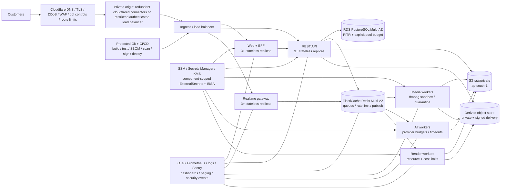

# Production launch readiness and 48-hour plan

**Product/repository:** Montaj engineering codename; public brand decision currently unresolved between Aksharo and Kalakar  
**Audit date:** 14 September 2026 (IST)  
**Target decision time:** 16 September 2026, no later than T+38 hours  
**Audience:** founders, engineering, security, operations, product, support, and legal counsel  
**Repository state audited:** `main` at `0be69d36`, with 107 pre-existing local changes; no Git remote configured  
**Decision owner:** launch incident commander (must be named before work starts)

> This is a technical production-readiness assessment, not a penetration-test certificate or legal opinion. It deliberately distinguishes facts observed in this checkout from recommendations and from claims in older project documents.

## Executive decision

### Decision

| Launch mode | Decision on 14 Sep 2026 | Why |
| --- | --- | --- |
| Broad public/general-availability launch | **NO-GO** | There is no deployed cloud environment, no app image publication/deployment workflow, the checked-in Kubernetes deployment has several deterministic failures, the latest checked-in load test fails its own latency budget, customer authentication delivery is not configured, and the legal/brand surface is still draft. |
| Public launch from the current laptop through Cloudflare Tunnel | **NO-GO** | A healthy laptop process is a useful demo/smoke environment, not a redundant or recoverable customer service. Loss of power, ISP, disk, Windows session, or the one tunnel host becomes a full outage. |
| Invite-only, web-only beta | **CONDITIONAL GO** | This can launch only if every P0 gate in this document is green by T+38 hours, billing and unfinished surfaces remain disabled, capacity is capped by measured results, and there is a staffed rollback/on-call window. |
| Desktop, plugins, local mode, paid subscriptions, affiliate payouts, partner catalogue | **NO-GO for this launch** | Their release workflows refer to directories absent from the current Git HEAD, download links are placeholders, and several provider/payment contracts are explicitly incomplete. |

The honest 48-hour objective is therefore: **move the web product off the laptop, prove a small production-shaped environment, and admit a controlled cohort**. Do not use the launch date to waive a failed gate. If cloud, auth, restore, security, and load gates are not all evidenced by T+38, postpone customer access.

### Five facts that drive the decision

1. The local API and web processes were healthy during the audit: `/health` returned `200`, and `/health/ready` reported PostgreSQL, Redis, and storage “up.” This proves the current local stack boots; it does not prove external reachability, redundancy, credentialed object access, recovery, or capacity.
2. `infra/README.md:6` states that **nothing in the infrastructure directory has been applied to a real cloud account**. The local operating note says the current “production” process is this laptop via Cloudflare Tunnel (`CLAUDE.md:11-31`).
3. The latest checked-in X02 load report accepted all 100 job-admission requests but recorded **p95 3,672.8 ms against a <300 ms budget**, so its overall result is FAIL (`docs/verification/load-2026-09-02.md`). It exercises admission, not actual media processing.
4. Email/password, magic-link, password-reset, Google PKCE OAuth, rotating refresh families, session listing/revocation, tenant binding, and admin TOTP already exist. The work is production configuration and correction, not a greenfield auth build. However, Google, Razorpay, Sentry, and PostHog are disabled in the live-local runtime, mail is `dev`, and automatic email verification is enabled.
5. The code and infrastructure documents disagree in launch-critical places. Examples include Kalakar vs Aksharo, missing desktop/release workspaces that CI still invokes, Kubernetes “role” commands that the API never parses, and a queue scaler that watches the wrong Redis state for prioritized BullMQ jobs.

## Scope, method, and limits

### What was inspected

- The application topology under `apps/`: Next.js web, NestJS API, media worker, AI worker, render worker, and model server.
- Shared packages, Prisma schema and all 41 migration directories, authentication/session implementation, billing, entitlements, media ingest, jobs, realtime, admin, privacy, share, provider and callback boundaries.
- Dockerfiles and Compose material, Helm templates and production/staging values, Terraform modules/environments, Cloudflare DNS/CDN module, observability/alert rules, and operational runbooks.
- GitHub Actions workflows, package scripts, current lockfile versions, historical verification reports, launch plan, contracts, threat model, and legal-page source.
- Environment **shape and feature state only**. Secret values were not copied into this report. Only `.env.example` is tracked; a high-confidence pattern scan found no obvious AWS, Google, GitHub, or OpenAI keys in tracked source. That limited regex check is not a substitute for gitleaks/TruffleHog and history scanning.
- Read-only local health requests on ports 3913 and 3914. The public tunnel was not verified from an independent network.

### What could not be established

- No cloud resources, DNS account, OAuth console, SES account, payment account, or production telemetry backend were available for inspection.
- No Git remote is configured, so remote CI status, branch protections, environment approvals, and deployed commit provenance cannot be verified.
- A current full build/test run could not start because the repository requires pnpm `>=9 <10` / declares `pnpm@9.15.9`, while this host exposes pnpm `11.19.0` and Node `24.19.0`. The failure is a toolchain mismatch, not evidence that the source itself fails. The most recent checked-in fresh-clone verification is still an overall FAIL (`docs/verification/verify-wave-2026-09-03.md:10-23`).
- No destructive, write-heavy, or customer-facing test was run against the laptop-labelled production data. In particular, the 100-request load test was not repeated there.
- This was broad static review plus targeted runtime observation, not a complete line-by-line formal verification, external penetration test, cloud configuration review, legal review, or real backup restore.

## As-built system

### Runtime components present in this Git HEAD

| Component | Technology | Primary responsibility | Important state |
| --- | --- | --- | --- |
| `apps/web` | Next.js 15.5.25, React 19.2.8 | Marketing, signup/login, app/editor, admin UI, public shares, legal/docs | Runs locally; auth feature flags exposed through runtime config; CSP permits inline script/style. |
| `apps/api` | NestJS 11, Prisma 6 | REST, auth, tenants, billing, jobs, realtime, admin, privacy | Runs locally; full `AppModule` always boots regardless of Helm role arguments. |
| `apps/worker-media` | Node + ffmpeg/ffprobe | Probe, proxy, waveform, thumbnails and media preparation | Queue consumer with scratch-disk and parser attack surface. |
| `apps/worker-ai` | Python | VAD, transcription routing, alignment, diarisation, translation, prompted passes | Control server defaults to port 8091; Helm expects 8000. |
| `apps/render` | Node + ffmpeg/render libraries | Cloud video/subtitle exports | Queue-driven; handles large untrusted media workloads. |
| `apps/model-server` | Python | External/self-hosted model service | CPU image is built in CI; the other product images are not. |
| PostgreSQL 16 | Prisma data store | Users, workspaces, editor state, jobs, credits, billing, audit/privacy | Local now; Terraform describes RDS Multi-AZ + replica for prod. |
| Redis 7 / BullMQ | Queue, rate limit, OAuth state, realtime bus | Work dispatch and ephemeral coordination | Local now; Terraform describes Multi-AZ ElastiCache. |
| S3-compatible raw store + R2 derived store | Object storage | Private uploads/raw media and derived/download artifacts | Local raw store is MinIO; cloud credentials and end-to-end access are unproven. |

The repository also advertises `apps/desktop`, `apps/bridge`, `apps/engine`, `plugins`, and `tools/release`, but none exists in this Git HEAD. They are not uncommitted deletions; `git ls-tree HEAD` confirms they are absent. Workflows and documentation still refer to them (`.github/workflows/ci.yml:397-401`, `release-desktop.yml`, `release-plugins.yml`, `README.md:34-36`). Treat those product surfaces as unavailable.

### Existing strengths worth preserving

- Auth uses Argon2id at 64 MiB, three iterations, one lane; constant-cost verification and generic errors reduce enumeration/timing leakage (`apps/api/src/auth/auth.constants.ts:62-67`, `password.service.ts:56-70`) in line with OWASP's generic-response guidance [S10].
- Refresh tokens are hashed, rotated in families, have a concurrency grace window, detect reuse, and support session listing/revocation (`apps/api/src/auth/README.md:52-70,136`). The web keeps the access token in memory and the refresh token in an HttpOnly, SameSite=Lax cookie (`apps/web/lib/session/cookie.ts:4-19,45-64`).
- Google OAuth requests only `openid email profile`, uses PKCE, one-time Redis state via `GETDEL`, and links an existing account only when Google asserts a verified email (`google-oauth.provider.ts:79-94`; `google-oauth.service.ts:112-171,245-263`).
- Tenant and object boundaries are designed explicitly: workspace is bound into the JWT, membership guards protect routes, private downloads are short-lived, worker callbacks use HMAC and replay controls, and signed render manifests protect entitlement decisions (`docs/THREAT-MODEL.md:T4-T10`).
- Media uses direct presigned object upload rather than proxying large files through API pods; workers use ffprobe/ffmpeg with validation, timeouts, scratch limits, and structured failure paths.
- Kubernetes pod templates already use strong container primitives: non-root UID, read-only root filesystem, seccomp RuntimeDefault, no privilege escalation, all capabilities dropped, resource limits, PDBs, and service-account-token automount disabled.
- The intended production data tier has sound primitives: private encrypted raw buckets, PostgreSQL Multi-AZ, Redis Multi-AZ, KMS, deletion protection, snapshots, and a 35-day database recovery window. These are valuable designs even though they are not deployed or drilled.
- The internal threat model identifies 25 relevant threats, and the repo contains broad unit/e2e/property-test scaffolding. The problem is current, production-shaped evidence—not lack of engineering thought.
- The locked Next.js version is 15.5.25, newer than the 15.5.24 maintenance patch floor in the August 2026 security release [S23]. This is a point-in-time positive signal, not a substitute for a fresh dependency and image audit.

## P0 launch blockers

P0 means “must be corrected and evidenced before any customer is admitted.” A document change, a historical test, or an operator saying “configured” is not evidence; each row names the artifact required to close it.

### P0-01 — The only running environment is a laptop

**Evidence.** `CLAUDE.md:11-31` maps the public hostnames to localhost ports on this laptop. `infra/README.md:6-8` says the cloud assets have only static validation. There is no Git remote and no cluster context in this audit environment.

**Failure mode.** One machine, ISP, tunnel process, disk, user session, or power event causes complete outage. Customer data, credentials, queue state, and incident evidence also depend on a developer workstation.

**Required correction.** Provision an isolated staging and production account/environment in `ap-south-1`; use managed PostgreSQL, Redis, and raw object storage; put immutable application images behind a controlled Cloudflare origin; keep all customer secrets out of the workstation.

**Closure evidence.** Infrastructure plan and apply logs; resource inventory; independent DNS/TLS request; three-AZ scheduling evidence; clean external signup-to-export smoke; laptop powered off while service remains healthy.

### P0-02 — There is no trustworthy application delivery path

**Evidence.** The workflow inventory contains no build/push/deploy path for web, API, media, AI, or render images. `.github/workflows/ci.yml:246-275` builds only the CPU model-server image. Existing CI invokes absent `@montaj/bridge`, `@montaj/desktop`, and `@montaj/release` workspaces. No remote means CI itself cannot currently run from this checkout.

**Failure mode.** Operators cannot prove what source produced a running container, reproduce a deploy, scan all runtime images, or roll back by digest. The stale workflow is likely to fail before useful gates run.

**Required correction.** Establish a protected Git remote; remove/disable stale jobs for this web-only release; build all five runtime images once on Node 22/pnpm 9; push by commit SHA and immutable digest; generate SBOMs; scan dependencies and images; sign/attest; deploy staging then production through an approval-protected workflow; record prior digests for rollback.

**Closure evidence.** One green pipeline from clean checkout through staging smoke; registry digests; scan reports with no unaccepted critical/high runtime findings; signed provenance/SBOM; successful one-command rollback rehearsal.

### P0-03 — The Helm deployment is deterministically inconsistent with the applications

The following are independent release-stoppers:

1. **Roles do not exist at runtime.** Helm starts API images with `--role=realtime` and `--role=scheduler` (`values.yaml:363-376,525-532`), but `apps/api/src/main.ts:20-74` never parses a role and always boots the complete `AppModule` on `API_PORT` or the `API_ORIGIN` port. Realtime expects port 3002 while the app defaults to 3001. Scheduler and realtime pods also run the full API and scheduled modules.
2. **Realtime routing disagrees.** The protocol is `/realtime` (`apps/api/src/realtime/realtime.protocol.ts:17`); Helm routes `/ws` to the realtime service (`values.yaml:373-376`). It only works accidentally if the full API catches `/realtime` through `/`.
3. **Readiness is liveness.** The API readiness probe calls `/health`, although the code says dependency readiness is `/health/ready` (`values.yaml:303-319`; `health.controller.ts:53,69-76`). Pods with failed DB/Redis/storage can receive traffic.
4. **AI worker port is wrong.** The image/default control port is 8091 (`apps/worker-ai/Dockerfile:82-94`); Helm service/probes declare 8000 (`values.yaml:433-455`).
5. **Migration command cannot exist.** The deploy runbook calls `node dist/scripts/migrate.js` (`docs/runbooks/deploy.md:47-52`), while the build includes only `src/**/*.ts` and excludes `scripts` (`apps/api/tsconfig.build.json:7-8`). The Docker migrate target runs Prisma migrations and seed but omits the hand-maintained `prisma/sql` constraints that the canonical `db:migrate` applies.
6. **Architecture mismatch.** Production general nodes are ARM `m7g.xlarge` (`infra/terraform/envs/prod/main.tf:64-69`), while there is no multi-architecture build/push workflow to prove native Node/Python/ffmpeg dependencies run on ARM.

**Required correction.** For this launch, use verified x86 nodes; implement real role-specific entry points or deploy one coherent API process only; align `/realtime` and ports; point readiness to `/health/ready`; make a pre-deploy migration image/job invoke the canonical schema + hand-SQL path; render Helm, boot every image, and smoke every Service endpoint before production.

**Closure evidence.** Rendered manifest diff; successful migration against an empty staging DB and idempotent second run; every Deployment Available; every probe green; realtime connection through the public hostname; only one scheduler execution per task window; rollback tested across a backward-compatible migration.

### P0-04 — Autoscaling is mostly an illusion

**Evidence.** The chart watches `bull:<queue>:wait` via the KEDA Redis-list scaler (`templates/_helpers.tpl:94-98`, `scaledobject.yaml:59-63`). Normal jobs are assigned priority 1-5 (`apps/api/src/jobs/jobs.config.ts:20-29`), and the queue registry passes that priority to BullMQ (`queue.registry.ts:52-62`). BullMQ 4+ stores prioritized jobs in the `prioritized` sorted set rather than the `wait` list. KEDA’s Redis Lists scaler measures the specified key [S13]; BullMQ documents prioritized as a distinct state [S14]. Production minimums leave one media/AI worker running, but the queue signal will not add workers for the common prioritized state. Separately, EKS ignores managed-node desired size because “Cluster Autoscaler/Karpenter owns” it (`modules/eks/main.tf:242-243`), yet no Cluster Autoscaler or Karpenter deployment exists; AWS treats the node autoscaler as a component that must be configured and operated [S4].

**Failure mode.** A launch burst queues work while workers and nodes do not scale. API responses may stay up while jobs wait indefinitely, triggering retries, refunds, and cost/credit inconsistencies.

**Required correction.** Export BullMQ queue metrics and scale on total runnable backlog (`waiting + prioritized`, with delayed/active metrics observed separately) through Prometheus/KEDA, or use a tested external scaler; install and permission Karpenter/Cluster Autoscaler; set maximum pod/node/cost caps; keep a non-zero warm floor for slow-starting media workers.

**Closure evidence.** Put prioritized jobs into each queue and show replicas and nodes scale up, jobs drain within the ETA objective, scale-down is safe, and the configured maximum prevents runaway spend.

### P0-05 — Capacity evidence currently fails

**Evidence.** `docs/verification/load-2026-09-02.md` reports 100/100 successful job admissions and WebSocket delivery, but p95 3.67 s vs <300 ms, overall FAIL. The harness explicitly excludes worker execution (`load/run.mjs:16-34`), so there is no checked-in evidence for upload throughput, ffmpeg/AI/render service time, provider quotas, queue drain, or DB/Redis failover. Topology spread is `ScheduleAnyway` (`templates/deployment.yaml:75-78`), which permits replicas to co-locate when capacity is constrained.

**Required correction.** Establish the launch forecast, fix the measured latency, and run the production-shaped workload plan in “Capacity and resilience validation” below. Use hard zone and hostname spreading for critical stateless services, explicit DB connection budgets, and provider concurrency/timeout/circuit-breaker budgets. AWS's EKS availability guidance treats topology spread and workload scaling as explicit application controls [S3].

**Closure evidence.** A dated report from staging at the exact release digest, meeting every threshold for 30 minutes plus burst and failure scenarios. The beta cohort cap must be derived from this result, not guessed.

### P0-06 — Authentication exists but is not production-operational

**Evidence.** In the current live-local configuration, Google credentials are empty, `MAIL_PROVIDER=dev`, and `AUTH_DEV_AUTO_VERIFY=1`. Google and email deliverability have not been externally proven. A normal logout calls the API with `refreshToken: ""`, swallows the validation error, and then clears only the local cookie (`apps/web/components/shell/profile-menu.tsx:48-55`); the API requires at least 16 characters and revokes only the presented token family (`apps/api/src/auth/dto/auth.dto.ts:71-73`; `auth.controller.ts:185-191`). OWASP requires logout to invalidate the server-side session [S11].

**Failure mode.** Verification/password-reset messages never reach users; Google sign-in is unavailable; and a refresh token stolen before “logout” remains valid server-side.

**Required correction.** Configure a dedicated production Google OAuth project and exact callback; configure SES domain, production sending, DKIM/SPF/DMARC, bounce/complaint handling and IRSA; set automatic verification to zero; add a same-origin BFF logout route that reads the HttpOnly refresh cookie, revokes upstream, then clears it; test refresh-race/reuse and “logout then reuse.” Enable breached-password screening or a local blocklist and raise single-factor password minimum from 10 to 15 to align with current NIST guidance [S9]. Add edge anti-automation to signup/login/magic/reset without leaking account existence.

**Closure evidence.** External tests using at least two mailbox providers; verified/unverified and expired/reused links; personal and Workspace Google accounts; exact callback from the final domain; password reset; logout/replay test; session revoke-all; abuse limits under two distinct real client IPs.

### P0-07 — New users receive no usable Free entitlement

**Evidence.** The Free plan is defined with 20 monthly credits (`apps/api/prisma/seed-data.ts:111-123`), and the seed creates a subscription, credit account, grant lot, and ledger row only for the demo workspace (`seed.ts:181-279`). Normal email and Google signup call `UsersService.createWithPersonalWorkspace`, whose transaction creates user, workspace, membership, and consent only (`users.service.ts:119-179`). No auth/user path creates the subscription or grant. The local operating note independently records a new Free workspace with zero credits (`CLAUDE.md:162-163`).

**Failure mode.** Signup appears successful, upload can work, and transcription silently cannot start—the first customer journey fails at the core value moment.

**Required correction.** In the signup transaction, create the Free subscription, credit account, expiring monthly grant lot and ledger record idempotently for both email and Google users. Make “could not enqueue because entitlement/credit is absent” visible rather than best-effort silent.

**Closure evidence.** Fresh email and Google accounts each show the promised grant and complete a representative upload → transcript → edit → clean export; concurrent duplicate signup/retry does not double-grant.

### P0-08 — Edge protection and client identity are not coherent

**Evidence.** The Terraform DNS module enables Cloudflare proxying but defines no WAF managed-rule, bot, Turnstile, or endpoint rate-limit resources. A public ingress/load-balancer origin can be reached directly unless restricted or tunneled, bypassing Cloudflare. The chart does not set `TRUST_PROXY`; without it, the API uses the socket address (`principal.ts:79-96`). Behind an ingress, many users can therefore share one perceived IP and one auth bucket. Simply enabling it is also unsafe because current code accepts the leftmost `X-Forwarded-For` value.

**Failure mode.** An attacker bypasses the edge, spoofs forwarded addresses, burns provider credits, or causes global login/signup throttling for legitimate users. The in-app rate limiter also deliberately fails open when Redis is unavailable (`rate-limit.service.ts:88-116`).

**Required correction.** Choose one origin model: preferably two or more `cloudflared` replicas with all inbound origin firewall traffic blocked [S1], or a load balancer restricted to Cloudflare with authenticated origin pulls. Deploy Cloudflare managed WAF rules, DDoS/bot controls, and route-specific limits [S2]. Normalize the trusted proxy chain at ingress; strip inbound forwarding headers; pass one authoritative address; teach the app the exact trusted-hop count. Apply Turnstile/challenge after risk thresholds on auth, upload-init, job-create, public shares, and report endpoints. Retain per-account/workspace/global budgets so Redis failure does not become unlimited wallet burn.

**Closure evidence.** Direct-origin request fails; forged `X-Forwarded-For` cannot obtain fresh buckets; two external clients receive different audit/rate identities; Cloudflare rules are versioned and sampled; Redis-loss test preserves a conservative global/provider admission cap.

### P0-09 — Secret scope and AWS workload identity are broken by design

**Evidence.** One ExternalSecret materializes the whole runtime contract, and every component mounts it with `envFrom` (`values.yaml:57-75`; `templates/deployment.yaml:101-105`). A compromised web or worker pod therefore receives DB, JWT, payment, provider, callback, and both object-store credentials. Component service accounts support annotations, but no component workload-role bindings are present. Terraform outputs an S3 policy with instructions to attach it; it does not attach roles. The SES implementation intentionally uses the pod credential chain (`ses.provider.ts:27-49`), so email will fail without an API role. Raw S3 clients currently require explicit access/secret key fields (`common/storage/storage.module.ts:41-60`).

**Failure mode.** One low-privilege runtime compromise becomes a full-platform secret compromise; SES and intended IRSA access fail; static long-lived cloud keys spread across every process.

**Required correction.** Create per-component ExternalSecrets and IAM roles: web gets only public runtime values; API gets DB/Redis/JWT/auth/payment/SES plus only necessary buckets; media/AI/render get only queue, scoped object prefixes and provider keys required by that worker; scheduler gets only its task dependencies. Use IRSA/Pod Identity for S3 and SES, update S3 clients to use the default credential chain when static keys are absent, retain static R2 keys only where unavoidable, and add egress/secret-access audit alerts. Apply Kubernetes' least-privilege Secret access and lifecycle practices [S17].

**Closure evidence.** Enumerated IAM simulation and live canary for each workload; `env` inventory proves least privilege; web cannot read payment/JWT/provider secrets; API can send SES and access only allowed prefixes; denied actions produce alerts.

### P0-10 — Network policy and readiness claims overstate reality

**Evidence.** Helm emits Kubernetes NetworkPolicy resources, but the EKS VPC CNI add-on configuration never enables network-policy enforcement. AWS requires the feature to be explicitly enabled [S5]. FQDN enforcement is off by default; the documentation mentions an egress proxy, but no such proxy is provisioned. The storage readiness probe performs an unauthenticated `HEAD` and counts 403/404 as up (`health.service.ts:58-71`); it does not prove valid raw-store credentials or any R2 operation.

**Failure mode.** Operators believe lateral/egress isolation and storage readiness exist when policies may be inert and credentials may be invalid.

**Required correction.** Enable and verify the policy engine, use default-deny with explicit DNS/internal/provider paths, and test denied flows. Replace or supplement storage readiness with a signed, least-privilege canary object read/write/delete for raw and derived stores, kept out of the hot probe path if necessary. Add namespace Pod Security Admission labels at `restricted` [S15] and apply the Kubernetes security checklist as the cluster acceptance baseline [S16].

**Closure evidence.** Policy enforcement test from each pod; forbidden provider/metadata/private-network requests fail; signed S3/R2 canary succeeds; invalid credentials make pre-deploy smoke fail.

### P0-11 — Database and recovery capacity are promises, not proven controls

**Evidence.** Production allows many API/realtime/worker replicas, but the production `DATABASE_URL` design has no explicit Prisma `connection_limit`; test harnesses deliberately cap pools because PostgreSQL defaults are finite (`apps/api/README.md:597`). Terraform creates a read replica and comments that read traffic goes through PgBouncer (`envs/prod/main.tf:112`), but there is no PgBouncer/proxy deployment or read-routing connection. The automated restore workflow explicitly uses a new local CI database, never a real backup or cloud account (`ops-restore-drill.yml:3-9`).

**Failure mode.** Horizontal scaling exhausts RDS connections. A nominal backup may be unrestorable within the business recovery objective; queues, credit ledger, erasure tombstones and payments can diverge after point-in-time recovery.

**Required correction.** Set an explicit per-process pool budget from `max_connections`, reserve admin/migration headroom, cap replicas to that budget, and alert at 60/75/85% utilization. Treat the read replica as unused until a tested read URL/pooler exists. Perform a real staging RDS PITR drill, including migration, canary login/project, queue drain policy, payment reconciliation, and erasure-tombstone replay. AWS documents the backup/PITR mechanics, but a configured retention period is not a restore test [S19].

**Closure evidence.** Connection-budget worksheet and saturation test; real snapshot/PITR restore into staging; measured RPO/RTO; signed drill record; successful application and privacy reconciliation.

### P0-12 — Product identity, claims, legal terms, and incomplete commerce are not launchable

**Evidence.** The canonical code says Kalakar/kalakar.io (`packages/config/src/brand.ts:11-15`) but plugin identifiers, legal contact, contracts, current hostnames, Terraform/runbooks, and cookies remain Aksharo. `docs/CONTRACTS.md:5` still declares Aksharo canonical. Legal source repeatedly says “Draft — pending counsel,” the grievance officer name is a placeholder, and a signable DPA is pending (`apps/web/content/site/legal.ts:2-4,32,39-40,191-209`). `docs/PLAN.md:21-28` marks provider DPAs, brand/domain work, and legal documents TODO. Marketing’s no-training/zero-retention promise cannot be substantiated until provider terms are signed and runtime routing matches them. Download/plugin pages openly contain placeholder links. Razorpay manual renewal retry throws “not implemented” (`billing/providers/razorpay.provider.ts:195-205`); RazorpayX fund-account creation is intentionally absent (`affiliates/payouts/razorpayx.provider.ts:36-42`); partner licence snapshots remain `TODO(H-28)`.

**Failure mode.** OAuth, cookies, email authentication, legal entity/contact, DNS, support, and customer expectations disagree. Customers can encounter advertised but nonexistent/incomplete paid and desktop features. Privacy/provider promises may be false.

**Required correction.** Freeze one brand, legal entity, primary domain, support/security/privacy/grievance contacts and jurisdiction. Counsel approves the effective privacy notice, terms, AUP, refund terms and subprocessor list. Disable or hide desktop/plugins/local mode, checkout, affiliates, payouts, partner catalogue, and provider routes without signed terms. Run a copy/feature-flag truth audit across marketing, pricing, docs, app, API metadata, email and OAuth consent screen.

**Closure evidence.** Signed product/legal decision record; counsel approval; final URLs and contacts; feature matrix tested logged-out and fresh-free-user; no placeholder/draft copy or dead download/checkout link; provider DPA and routing inventory.

### P0-13 — Security and operational telemetry are not active

**Evidence.** Sentry and PostHog are empty in the current live-local environment. Observability manifests and alert rules exist, but no deployed backend or paging test was available. Dependency audit is explicitly non-blocking (`.github/workflows/ci.yml:439-470`), and there is no complete runtime-image scanning/signing path. API Swagger is always exposed by `main.ts:71-78`. The web CSP includes `'unsafe-inline'` for scripts and styles (`apps/web/next.config.ts:88-92`); the admin bearer token is stored in `sessionStorage`, which OWASP advises against for credentials [S11]. Admin TOTP secrets are stored directly in the database (`admin-step-up.service.ts:69-93`).

**Failure mode.** The team can be compromised or failing without knowing, and cannot page/respond within incident deadlines. XSS has a larger admin consequence. Public API docs improve attacker reconnaissance.

**Required correction.** Enable error, trace, metric, security-event and business-funnel telemetry with PII redaction; page a real phone; protect admin and API docs at the edge; restrict admin by identity-aware access/IP and require TOTP; make critical/high reachable runtime findings blocking; scan secrets/history and every image. Make build provenance, vulnerability handling, and remediation repeatable under an SSDF-aligned release process [S18]. For the beta, keep the current regular-session cookie design, but move the admin credential to a server/BFF HttpOnly session and encrypt TOTP secrets with an application KMS key as the immediate follow-up.

**Closure evidence.** Synthetic failure reaches dashboards and page; runbook responder acknowledges; auth abuse and callback-signature alerts fire; PII/secret redaction samples pass; admin unavailable outside its edge policy; scan exceptions are named, owned and expiring.

## Recommended production architecture

The codebase already points toward a sensible target: Cloudflare at the edge, AWS in Mumbai for the primary application/data plane, stateless web/API processes, Redis-backed queues/realtime, object storage for media, and isolated heavy workers. Keep that direction. The immediate job is to make the stated boundaries real.

### Architecture decisions to freeze in the first two hours

| Decision | Launch choice | Rationale |
| --- | --- | --- |
| Product scope | Web-only, invite-only beta | It is the only complete surface present in the audited Git HEAD. |
| Brand and domain | Choose exactly one before OAuth/email/DNS work | These settings must agree across callback URLs, cookies, CSP/CORS, legal text, SES, support and infrastructure. |
| Primary region | AWS `ap-south-1` | Matches existing Terraform and the stated India raw-data posture. |
| Compute | Existing EKS architecture only if a staging cluster is usable by T+12; verified x86 nodes for the launch | Reuses substantial IaC while avoiding an unproven multi-arch path. A new platform migration is too risky in 48 hours. |
| Edge/origin | Cloudflare proxy plus private Tunnel connectors, or strictly Cloudflare-restricted authenticated origin | Prevents direct-origin WAF bypass. Cloudflare documents multiple connectors/replicas, outbound-only origin connectivity, and ingress blocking [S1]. |
| Customer data | RDS Multi-AZ, ElastiCache Multi-AZ, S3 raw private; R2-derived only after contract/residency approval | Removes customer state from compute and keeps the most sensitive media in the selected region. |
| Work roles | Real separate API, realtime, scheduler and worker processes | Allows resource, secret and scaling isolation. Until entry points exist, deploy one coherent API service and do not pretend the roles are isolated. |
| Queue scaling | Prometheus/external metric for total runnable BullMQ backlog + node autoscaler | Direct `wait`-list length is incomplete for this priority-based queue model. |
| Secrets | Per-component secret and IAM policy; no static AWS access keys | Limits blast radius and makes the documented SES/S3 credential chain work. |
| Release unit | Image digest generated once and promoted unchanged staging → production | Makes test evidence and rollback refer to the exact bytes customers receive. |

### 48-hour launch bridge if EKS cannot be proven by T+12

The bridge is **not** “keep the laptop online.” The only acceptable fallback for a very small beta is a hardened x86 cloud host running the already-understood container stack, with all durable state moved to managed RDS, ElastiCache and object stores, exposed only through redundant Cloudflare Tunnel connectors. Billing and heavy optional features remain off, there is a strict global job/cost cap, and the host is rebuilt from an image rather than repaired manually.

This bridge still has a compute failure domain and therefore cannot be called GA or highly available. Use it only if it passes the same auth, backup, security, load, observability and rollback gates below. Replace it with the target architecture immediately after the beta. If those gates cannot be met, there is no safe infrastructure shortcut: postpone.

## Production authentication design

### Keep the existing core

The rotating refresh-family model, hashed refresh tokens, one-time OAuth state, PKCE, verified-email linking, generic auth errors, Argon2id, and HttpOnly refresh cookie are good foundations. Do not replace them with a rushed third-party migration during the launch window.

### Email/password launch checklist

1. Set `AUTH_DEV_AUTO_VERIFY=0` in every non-local environment and add a startup assertion that rejects `1` in production.
2. Decide the brand/domain and verify the sending domain in SES. Configure DKIM, SPF and DMARC; use a separate transactional subdomain if appropriate.
3. Request SES production access immediately. AWS says an initial response is normally provided within 24 hours and may take longer if more information is required [S6]. If approval is not obtained and tested, email signup is NO-GO; use a reputable already-approved transactional provider only through a reviewed adapter, not a dev mailbox.
4. Create the API’s SES IAM role, attach only send permissions for the chosen identity, and verify bounce/complaint SNS handling and suppression behavior.
5. Make verification, magic and reset tokens single-use, short-lived, rate-limited, redacted from logs, and never included in analytics/referrers. The code largely has these mechanics; prove them externally.
6. Raise the minimum password to 15 characters for password-only accounts, retain at least 64-character maximum support, allow password managers/paste/Unicode, and do not add composition or periodic-rotation rules. NIST’s current normative guidance requires a 15-character minimum for single-factor passwords and a compromised/common-password blocklist [S9].
7. Enable `auth.breachedPasswordCheck` with a bounded timeout and local/common-password fallback. Its current default is false and external lookup fails open (`auth/README.md:152`; `breached-password.service.ts:24-32`).
8. Put Turnstile or equivalent risk challenge in front of signup, repeated login failure, resend, magic-link request and password reset. Keep per-account limits so IP rotation is not enough; retain generic responses so challenge behavior does not enumerate users.
9. Correct logout through a same-origin BFF route: read cookie, call API revoke, clear cookie in a `finally`, return `Cache-Control: no-store`, and cover valid/invalid/reused/concurrent cases.
10. Provision the Free subscription and 20-credit grant in the same idempotent signup transaction. A successful signup with zero usable entitlement must fail the launch smoke.

### Google login launch checklist

1. Use a dedicated production Google Cloud project, External user type, final brand name, verified domains, privacy/terms URLs, support email, and exact HTTPS redirect URI: `{API_ORIGIN}/auth/oauth/google/callback`.
2. Keep scopes at `openid email profile`; the code does not need Google API access or Google refresh tokens. Google’s publishing matrix notes that basic identity scopes have less onerous testing behavior, but a published and brand-verified consent screen is still the correct customer experience [S7].
3. Store the client secret only in the API secret, never web runtime config or source. Google’s server-app guidance requires exact authorized redirects and protected client secrets [S8].
4. Test new-account age/jurisdiction completion, existing verified-email linking, existing unverified-email non-linking, denied consent, invalid/expired/replayed state, callback interruption, Workspace-admin blocking, and multiple tabs.
5. Record identity-link events and alert on high-rate linking/callback failures. Do not log authorization code, state, verifier, ID token, or session handoff.
6. Show Google only when the server-side production configuration and a synthetic callback health check are both valid; feature visibility must not be inferred only from non-empty environment strings.

### Sessions and administrator access

- Keep normal access tokens at 15 minutes in memory and refresh tokens in a host-only `Secure; HttpOnly; SameSite=Lax` cookie. Consider renaming it to a `__Host-` cookie once the final domain is fixed [S11].
- Revoke all session families on password reset, credential compromise, account suspension and user deletion; surface the existing device/session list to customers.
- Require step-up for password/email changes, billing changes, API keys, exports of personal data, account deletion, and new device/plugin approval.
- Keep admin TOTP mandatory, put `/admin/**` behind Cloudflare Access or an allowlisted corporate identity/IP policy, and use separate administrator accounts. Do not allow support staff to self-elevate.
- P0 containment: protect admin at the edge and shorten/monitor the session. P1 correction: put the admin bearer in a server-side BFF/HttpOnly session because OWASP explicitly warns against auth credentials in both localStorage and sessionStorage [S11]; KMS-encrypt TOTP seeds and add recovery-code/two-person reset procedure.

## Security and safety guardrails

“Safety” here includes cybersecurity, wallet/cost abuse, malicious media, privacy, user-generated content, and operational response. No single WAF or scanner covers all of them.

| Threat | Existing useful control | P0 addition for beta | P1 hardening |
| --- | --- | --- | --- |
| Credential stuffing and enumeration | Argon2id; generic errors; account/IP buckets; constant-cost absent-user path | 15-char password policy; breached-password blocklist; Turnstile/risk challenge; correct trusted IP; alerts | Passkeys/WebAuthn and optional user MFA; risk-based reauth |
| DDoS and denial-of-wallet | Cloudflare proxy design; per-workspace credit/admission caps | Private origin; WAF managed rules; endpoint limits; global provider/job/daily-spend circuit breaker | Bot scoring, adaptive rules, anomaly model |
| Tenant/IDOR | Workspace-bound JWT and membership/object checks; ULIDs | Run cross-tenant authorization suite on every high-risk route and storage key; audit failures | Continuous authorization regression/fuzz testing |
| Malicious uploads/parser exploits | Presigned upload; MIME/size/probe/timeouts; isolated scratch | Allowlist extensions and codecs; verify magic bytes/ffprobe; quarantine until probe; ClamAV/sandbox where useful; decompression/pixel/duration/frame limits; patched ffmpeg | Dedicated worker nodes/runtime sandbox, fuzz corpus and CDR where applicable |
| SSRF and metadata access | Safe-fetch design denies private/loopback/link-local and pins resolved IP | Egress default-deny; explicit provider allowlist; block instance metadata; DNS-rebinding tests | Egress proxy with policy/telemetry |
| Worker/provider callback forgery | Timestamped HMAC, replay/idempotency and settlement CAS | Rotate callback secrets; deny external network path; alert on invalid signatures/skew/replay | Asymmetric workload identity/mTLS |
| Prompt injection/provider leakage | Transcript treated as delimited data; schema-validated output; no LLM tool execution | Disable providers without signed no-training/retention terms; redact/minimize payloads; enforce region/timeout/token budgets | Continuous adversarial evals and per-provider DLP |
| Admin takeover | Separate guard/roles, TOTP step-up, audit trail | Edge identity restriction; separate admin account; no shared credentials; page on privilege/flag/refund/key actions | Phishing-resistant MFA, approval workflow, HttpOnly admin BFF |
| Supply chain | Frozen lock, tests, some security lint and release SBOM concepts | Pin actions by SHA; restore Node22/pnpm9; gitleaks/CodeQL/dependency/image scan; signed digests; block critical/high reachable issues | SLSA provenance, admission signature policy, scheduled rebuilds |
| Secret theft | SSM/ExternalSecret/KMS design and log redaction | Per-component secrets/IRSA; rotate launch secrets; scan Git history and images; no prod secret on laptop | Automated rotation, canary tokens, just-in-time access |
| Public-share abuse / illegal content | Share tokens, optional password, visible report path, admin reports | Prefer disabling public shares for first cohort; otherwise require expiry/password, revoke/report, route limits, staffed takedown | Abuse classifier with appeal/human review and transparency metrics |
| Availability/data loss | Managed-data Terraform, PDBs, retries/DLQ, PITR runbooks | Real restore/rollback/failover drills; queue/provider circuit breakers; support status path | Multi-region recovery only after real RTO/RPO need is established |

OWASP recommends defense-in-depth for uploads: extension allowlists, real type/signature validation, generated names, size limits, authorization, off-webroot storage, antivirus/sandboxing where applicable, and CSRF protection [S12]. For this media product also enforce maximum decoded duration, resolution, frame count, channel count, archive expansion and processing time—small encoded inputs can consume very large compute.

### Content and abuse operations

- Counsel must approve an AUP covering unlawful, infringing, abusive and privacy-violating uploads, public sharing, synthetic/deceptive media, and account sanctions.
- Publish `security@`, privacy/grievance and abuse/report contacts that reach a monitored queue. Define who can suspend shares/accounts, preserve evidence, notify affected users, and contact authorities.
- Never automatically inspect private customer media for broad content categories without a documented lawful basis, notice, retention rule and provider contract. Malware/security scanning and public-share abuse handling should be purpose-limited and auditable.
- Establish a high-severity procedure for apparent child sexual abuse material or imminent harm with counsel and appropriate authorities before moderators face such content. Do not improvise evidence handling during an incident.
- Every provider receives only the minimum data for the operation; record provider, region, purpose, object identifiers, timestamps and deletion/retention status without putting transcript/media content into ordinary logs.

## Capacity and resilience validation

### First define the demand

The team must write down expected launch visitors, signup rate, simultaneously active editors, upload starts/minute, average and p95 media duration/size, transcription starts/minute, renders/minute, language/provider mix, and support staffing. “100 concurrent users” is not a capacity model.

For each background stage, use Little’s Law as a planning check:

`required concurrency ≈ arrival rate × p95 service time / target utilization`

Then cap it by provider quota, node capacity, DB/Redis/object-store limits, and maximum acceptable spend. The calculation proposes a test point; staging measurement approves it.

### Required staging tests at the exact candidate digest

1. **Control-plane steady state:** 30 minutes at 3× forecast arrival rate for landing, signup/login, project list, upload-ticket creation, job admission, polling/realtime and export-ticket creation. Use distinct workspaces, not one superuser.
2. **Burst:** five minutes at 2× the steady-state test; observe Cloudflare, ingress, API, DB pools, Redis latency, queue growth and autoscaling.
3. **Real media mix:** representative 1-, 10- and 20-minute files across common formats/languages; direct multipart upload; probe/proxy/transcription/alignment/diarisation; editing/realtime; one subtitle and video export. Include invalid/truncated/oversized media.
4. **Queue scaling:** submit only prioritized jobs to every queue from zero/warm floor; demonstrate pod and node scale-up, bounded queue wait, completion, retry/DLQ, then safe scale-down.
5. **Dependency degradation:** one API pod killed; one node drained; Redis failover; DB connection pressure; S3/R2 denied; provider 429/500/timeout; callback replay; disk scratch exhaustion. The system must reject or queue honestly, not silently lose/duplicate work.
6. **Security abuse:** auth spraying, signup/resend abuse, forged forwarding headers, direct-origin attempts, repeated upload-init/job requests, share token guessing/report spam, cross-tenant IDs, malicious media corpus, SSRF destinations and oversized bodies.
7. **Recovery:** rollback application digests; restore RDS PITR into staging; reconcile queues/credits/payments/tombstones; rotate one key without downtime.

### Provisional launch thresholds

These are a defensible floor and should be tightened with product SLOs; they do not replace the existing route-specific budgets.

| Signal | Gate |
| --- | --- |
| API job-admission p95 | `<300 ms`, matching the repo’s X02 contract; no individual request >2 s under steady state |
| Ordinary API p95 / p99 | `<300 ms / <1 s` excluding external-provider wait |
| HTTP 5xx | `<0.5%` steady state; zero systematic error class |
| Signup/login | `>=99%` server success for valid inputs, excluding deliberate provider/user denial; no cross-user rate-bucket collision |
| Realtime | `>=99.9%` sampled event delivery within 1 second after publish |
| Job durability | 100% accepted jobs reach a terminal state or visible retry/DLQ; zero orphaned credit holds |
| Job success | `>=98%` for valid representative fixtures; failures show actionable customer status and release holds |
| Scaling | Prioritized backlog triggers workers and nodes before queue-wait SLO; maximum replicas/cost ceiling enforced |
| DB | Pool utilization <70% steady / <85% burst; at least 20% connections reserved for failover/admin/migrations |
| Resource saturation | CPU <70% steady; no OOM, restart loop, scratch exhaustion, or node pressure |
| Failover | Loss of one pod/node creates no customer-visible outage beyond retry budget; no duplicate settlement |
| Restore/rollback | Measured RTO/RPO accepted in writing; restored smoke and privacy/payment reconciliation pass |
| Security | Direct origin blocked; high/critical scans resolved or time-bounded and explicitly accepted by incident commander + security owner |

Do not set the invite count until this report exists. The initial cohort must be the lower of (a) one tenth of the demonstrated steady-state concurrent capacity and (b) the number of users the staffed support team can personally recover within the response window. Increase only after 24 hours of clean telemetry.

## The 48-hour execution plan

This schedule assumes at least five parallel competencies: release/incident command, platform/cloud, backend/auth, security/quality, and product/legal/support. One person may hold more than one role, but a single exhausted operator cannot safely build, approve, deploy, observe and respond. Work stops at a missed exit gate.

### T+0 to T+2 — Freeze the decision surface

**Owners:** incident commander, product owner, tech lead, legal/contact owner.

- Name the launch incident commander, release manager, on-call primary/secondary, security responder, support lead, and rollback approver.
- Freeze web-only invite beta; explicitly remove desktop, plugins, local mode, billing/checkout, affiliate/payout and partner-catalogue claims from this release.
- Decide brand, legal entity, domain and support/security/privacy/grievance addresses. Record the decision in one canonical config/ADR.
- Confirm access to: protected Git hosting, AWS account and billing, Cloudflare zone, domain registrar, Google Cloud project, SES, object-store/R2 account, paging and observability tools.
- Write launch forecast and a provisional spend ceiling. Freeze feature/schema changes unrelated to P0.
- Preserve the current local environment as a reference only; export no secrets or customer data from it into Git/chat/tickets.

**Exit gate:** all owners and accounts are available; scope/brand/domain are signed; a cloud staging path is feasible. If any is absent, announce launch postponement now instead of consuming the remaining window.

### T+0 to T+8 — Correct source and critical customer paths

**Owners:** backend/auth, web, release engineer. Runs in parallel with cloud work.

- Implement server-side logout through the web BFF and test token-family invalidation/reuse.
- Provision Free subscription/account/20-credit grant/ledger in the idempotent signup transaction for both email and Google flows; remove silent enqueue failure.
- Set production assertions against dev auto-verify/dev mail/fake billing/mock partner providers.
- Raise password minimum and enable a real compromised/common-password blocklist with bounded fallback.
- Resolve brand/config drift in auth cookie, public URLs, CORS/CSP, email templates and legal/contact copy.
- Either implement actual process roles and ports or simplify launch manifests to one full API service plus separately executable workers. Align realtime path and AI port.
- Build a real migration job from the canonical `db:migrate` logic, excluding seed in production. Assert hand-SQL application and migration idempotence.
- Make `/health/ready` the traffic probe and add signed raw/derived storage canary to the deployment smoke.

**Exit gate:** focused unit/integration tests green under Node 22/pnpm 9; signup, entitlement, logout and deployment contracts covered; no unresolved P0 code review comments.

### T+0 to T+12 — Build staging and security boundaries

**Owners:** platform/cloud, security. Runs in parallel.

- Create staging state backend/KMS and apply Terraform in an isolated account/VPC. Use x86 general nodes for this release.
- Install pinned versions of ingress, cert management, External Secrets, KEDA, metrics/Prometheus, OpenTelemetry and a real node autoscaler.
- Enable VPC CNI network policy, namespace Pod Security Admission, default-deny policies and tested DNS/provider egress.
- Create per-workload IRSA roles and per-component secrets; remove static AWS keys from workloads. Rotate any key that ever lived on the laptop if it will protect customer data.
- Configure RDS Multi-AZ/PITR, explicit pool budgets, Redis Multi-AZ/TLS, private raw bucket, derived bucket, encryption, lifecycle, audit access logs and cost alarms.
- Configure Cloudflare DNS/TLS, private origin, managed WAF, bot/rate rules and Turnstile. Strip/sanitize forwarding headers at the trusted edge.
- Stand up telemetry, dashboards, retained/redacted logs, error tracking, security events, status page and paging.

**Exit gate at T+12:** staging can accept a candidate image and has no public origin/DB/Redis/object endpoint. If not, broad and invite beta are NO-GO; decide whether to build the explicitly limited cloud-host bridge or postpone.

### T+2 to T+12 — Make identity, email and customer truth real

**Owners:** auth owner, product/legal, support.

- Configure the final Google consent screen, exact redirect, dedicated production secret and test/publish state.
- Verify SES domain and request production access immediately; configure bounce/complaint SNS, suppression, DKIM/SPF/DMARC and API IRSA.
- Have counsel approve privacy notice, terms, AUP, refunds (even if billing is off), subprocessor list, provider/data-region claims and incident/user-notification templates.
- Complete provider inventory: purpose, data sent, region, retention, training use, DPA, deletion mechanism, owner. Disable every unapproved route.
- Make marketing/pricing/docs/email/app agree with the enabled feature matrix. Remove all draft/placeholder/dead-download copy from public navigation.
- Prepare support macros for verification failure, stuck processing, deletion request, abuse report, incident and refund/credit correction.

**Exit gate:** two external mailbox providers receive verification/reset, Google works from the final hostname, and the exact public pages have named approval. If SES is pending, email-password launch is blocked; do not re-enable dev auto-verification.

### T+8 to T+16 — Establish reproducible delivery

**Owners:** release engineer, security reviewer.

- Create/protect the Git remote and release branch/tag. Require review and green checks; separate staging/prod environments and approvals.
- Remove stale jobs that invoke missing workspaces from the web-only release path.
- Pin Node 22, pnpm 9.15.9 and GitHub actions; use a clean, frozen install.
- Run lint, typecheck, unit, integration/e2e and schema drift checks. High/critical runtime dependency findings fail the build unless explicitly accepted with owner/expiry.
- Build web/API/media/AI/render images for x86, generate SBOMs, secret-scan source/history, SAST, scan images, sign/attest, and push SHA + digest.
- Deploy that immutable digest to staging using the new migration job. Do not seed production-like environments with demo accounts/credits.

**Exit gate:** clean pipeline is green; every runtime digest and report is recorded; staging deployment and backward rollback both succeed.

### T+16 to T+26 — Prove the customer journey and security controls

**Owners:** QA, auth/backend, security, support.

- From external networks and clean browsers, run email and Google signup, verification, login, refresh, logout/reuse, reset, session revoke, consent/age/jurisdiction and account deletion/export cases.
- Run the new-Free-user upload → media preparation → transcript → edit/realtime → subtitle/video export journey. Verify visible states for provider failure and insufficient credit.
- Test tenant isolation and presigned-key scope with two workspaces. Test share disabled or protected/revocable/reportable as selected.
- Test direct-origin blocking, WAF/Turnstile/rate behavior, forwarding-header spoofing, SSRF, callback replay, malicious/oversized media and production secret absence from web/worker processes.
- Trigger alerts and have the on-call responder acknowledge them from the runbook.

**Exit gate:** zero unresolved severity-1/2 path failures; all P0 security controls produce captured evidence at the exact digest.

### T+20 to T+32 — Load, scale, fail and restore

**Owners:** performance/QA, platform, database owner. Runs in parallel after staging is stable.

- Execute every scenario in “Capacity and resilience validation”; fix the existing 3.67-second job-admission p95 and repeat until the candidate passes.
- Prove prioritized-queue worker scaling and node scaling from warm floor to cap.
- Measure provider quotas, service time, queue ETA, object throughput, database connections, Redis latency and cost per representative minute/export.
- Kill a pod, drain a node, exercise Redis failover/provider outage and prove honest customer behavior.
- Restore a real RDS point-in-time copy into staging and complete application, credit/payment, queue and privacy-tombstone reconciliation.

**Exit gate:** signed load and restore reports meet all thresholds; cohort and spend caps are calculated from evidence.

### T+30 to T+38 — Final remediation and release review

**Owners:** all leads; incident commander decides.

- Fix only release blockers; rebuild once and repeat all affected tests. Do not hot-edit staging/prod containers.
- Freeze the final digest, migrations, config hashes, Cloudflare rules, feature matrix, runbooks and owner list.
- Rehearse rollback and secret rotation; confirm a pre-release DB snapshot and backward-compatible schema.
- Review the go/no-go board below. Every P0 must have an evidence link, owner signature and timestamp.
- Publish the customer/support launch message only after the incident commander records GO.

**Exit gate at T+38:** unanimous evidence-backed GO. A dissent on security, data loss, auth, capacity, legal truth or rollback is NO-GO and escalates to the incident commander; commercial pressure is not a technical exception.

### T+38 to T+42 — Production deployment

**Owners:** release manager executes; platform observes; rollback approver does not type deploy commands.

- Apply production infrastructure/config, confirm policy/IAM/secret canaries, snapshot database, run migration job, and deploy the already-tested digest.
- Verify DNS/TLS/origin blocking and probes before admitting traffic.
- Run synthetic auth/project/upload/job/realtime/export checks with production canary accounts. Delete test media according to policy.
- Keep invite admission closed until 30 minutes of clean golden/business/security signals.

### T+42 to T+48 — Controlled admission

**Owners:** incident commander, on-call, support/product.

- Admit the calculated small cohort in waves, not all at once. Keep a kill switch for signup and heavy jobs.
- Observe availability, p95/p99, 4xx/5xx, auth conversion/delivery, DB/Redis/object health, queue age/depth, job success, credit holds, provider quota/cost, WAF events and support volume.
- Pause admission on any threshold breach. Roll back on the triggers below rather than debugging indefinitely in production.
- Hold a launch review at +2 hours and +6 hours; expand only after 24 hours of clean telemetry, which is outside this 48-hour window.

## Go/no-go board

The following is the minimum evidence pack. “Green” means a link to a result from the final candidate, not a verbal check.

| Gate | Required evidence | Current audit state |
| --- | --- | --- |
| Scope/brand/legal | Signed web-only feature matrix, final brand/domain/entity, approved privacy/terms/AUP/subprocessors/contacts | **RED** — conflicting brand and draft legal source |
| Source control | Protected remote, reviewed release commit, clean reproducible checkout | **RED** — no remote; dirty local working tree |
| CI/build | Node22/pnpm9 clean build, tests, SBOM, scans, signed five runtime digests | **RED** — local toolchain mismatch; no app publication path; stale jobs |
| Infrastructure | Applied isolated staging/prod, managed durable data, private origin, multi-AZ critical services | **RED** — IaC says unapplied; laptop is live environment |
| Deployment contract | Ports/roles/routes/probes/migration/architecture aligned and boot-smoked | **RED** — deterministic mismatches listed in P0-03 |
| Email auth | SES approved; DNS/authentication/bounce path; two-mailbox verification/reset | **RED** — dev mail and auto-verify active locally |
| Google auth | Published production client, exact final callback, complete positive/negative suite | **RED** — credentials empty locally |
| Sessions/admin | Server logout/replay pass; revoke-all; admin edge + TOTP policy | **RED** — logout fails to revoke family; admin token in web storage |
| New user value | Email + Google new account receives Free grant and completes first export | **RED** — signup omits subscription/credit grant |
| Edge/security | Direct-origin deny, WAF/bot/Turnstile, correct client IP, tenant/SSRF/upload/callback suite | **RED** — controls absent/unproven |
| Least privilege | Per-component secrets and live IRSA tests; no static AWS keys; rotations complete | **RED** — shared secret and roles not attached |
| Capacity | Candidate report passes 3× forecast steady, burst, real media and scaling | **RED** — latest admission p95 3.67 s vs 0.3 s |
| Resilience | Pod/node/dependency failure pass; node/queue autoscaling proven | **RED** — autoscaling signals/installer incomplete |
| Recovery | Real RDS PITR + app/privacy/ledger reconciliation and rollback measured | **RED** — only synthetic local restore workflow |
| Observability/on-call | Dashboards, redacted logs, synthetic alerts and real page acknowledgement | **RED** — local DSNs empty; no deployed evidence |
| Support/abuse | Staffed rota, status page, macros, report/takedown/escalation path | **RED** — grievance/takedown/legal pieces pending |
| Commerce | Checkout entirely disabled, or live Razorpay/refund/webhook/reconciliation proven | **YELLOW** only if disabled; **RED** if exposed |

At audit time this board is overwhelmingly red. It is a work queue, not permission to launch. The incident commander changes a cell only when the evidence artifact exists.

## Rollback and kill-switch policy

### Roll back immediately when any occurs

- Authentication cross-account/tenant access, refresh-token reuse after logout, secret/PII exposure, forged callback acceptance, or direct-origin bypass.
- Database migration error, sustained connection saturation, data corruption, orphaned/double credit settlement, or inability to restore/read customer data.
- Five-minute 5xx rate above 2%, two consecutive five-minute p95 windows above twice budget, realtime delivery below 99%, or queue age above the user-facing ETA with no scaling response.
- Provider spend exceeds the hourly/daily ceiling, WAF/auth abuse overwhelms application controls, or a critical/high exploitable runtime vulnerability is confirmed.
- Email verification/reset systemically fails, new accounts get no entitlement, or the core upload-to-export synthetic fails twice.
- The team cannot observe the system or page the on-call owner.

### Rollback mechanics

1. Close invitations/new signup and pause new heavy-job admission through server-side flags. Preserve existing user reads and clear status messaging where safe.
2. Stop the rollout and restore the previous immutable image digest/config hash. Do not roll application code backward across an incompatible schema.
3. Use only additive/backward-compatible migrations during this launch. If a migration cannot support old and new application versions simultaneously, it does not ship in the 48-hour release.
4. Drain or quarantine jobs by version; do not replay blindly. Reconcile holds, provider executions, outputs and callbacks before reopening.
5. If data integrity is affected, snapshot first, follow the PITR runbook, replay erasure tombstones, and reconcile payments/credits.
6. Publish status/support guidance, preserve logs/evidence, start the incident timeline, and rotate exposed credentials.

## Observability and operations minimum

### Golden signals

- **Traffic:** requests and active users by route/status/region; upload bytes; realtime connections; jobs admitted/completed.
- **Errors:** 5xx/4xx class, auth delivery/provider errors, callback signatures, cross-tenant denials, queue retries/DLQ, render/transcription failures.
- **Latency:** Cloudflare and origin p50/p95/p99, DB/Redis/object operations, queue wait and service time per stage, email-provider acceptance.
- **Saturation:** pod/node CPU/memory/restarts, scratch/disk, DB connections/locks/replication, Redis CPU/memory/evictions/latency, NAT and provider quotas.

### Business and safety signals

- Landing → signup → verified → first project → uploaded → transcript ready → first edit → first export funnel, without storing sensitive media/transcript content in analytics.
- Credit holds by age/state, ledger reconciliation deltas, provider cost by job/workspace, daily ceiling and anomalous retry fan-out.
- Signup/login/reset/resend abuse, Turnstile/WAF challenges, suspicious session reuse, admin activity, public-share report volume and takedown response age.
- Deletion/export requests, failed retention tasks, provider-deletion confirmations and subprocessor-routing drift.

Every alert needs severity, owner, threshold, customer impact, dashboard and runbook. Page only actionable conditions; ticket slow trends. Test the actual notification route before launch.

## India privacy and cyber-incident posture as of the audit date

### Current vs upcoming duties

- The final DPDP Rules were notified on 13 November 2025. Rules 1, 2 and 17-21 commenced on publication; Rule 4 is scheduled one year later; Rules 3, 5-16, 22 and 23 are scheduled eighteen months after publication [S20]. The associated commencement notification similarly phases the main Data Fiduciary provisions of the Act [S21]. On **14 September 2026**, therefore, the main security/breach Rules 6-7 are published requirements to engineer toward but are not yet in force on that phased timetable. Counsel must validate the product’s exact status and any other applicable law.
- When Rule 7 takes effect, it requires affected Data Principals and the Board to be told without delay, followed by detailed Board information within 72 hours. Rule 6 specifies safeguards including access control, monitoring, backups, processor contracts, and generally one-year retention of logs/personal data used for breach detection/remediation [S20]. Update repo runbooks and templates to the final text and commencement dates.
- CERT-In’s directions are current: covered bodies must report listed cyber incidents within **six hours** of noticing/being informed, designate a point of contact, synchronize clocks, and retain ICT logs securely for a rolling **180 days within India** [S22]. The six-hour CERT clock is separate from the phased DPDP breach process.

### P0 compliance operations

- Have counsel create one incident decision tree that starts both clocks correctly: what is a reportable CERT-In incident, what will be a DPDP personal-data breach, who decides, who files, what preliminary facts are acceptable, and who notifies users/processors/insurers.
- Register and test the CERT-In point of contact; store reporting templates and 24/7 contact paths outside the affected production system.
- Keep security/audit logs in India for at least the currently applicable 180-day requirement, with synchronized timestamps, integrity/access controls, redaction and documented retention/deletion. Separate security evidence from product analytics and keep media/transcript content out of routine logs.
- Publish and staff privacy/grievance/security/abuse addresses. Maintain processor/subprocessor contracts, data map, purpose/consent/retention records, access/deletion/export workflows and evidence of provider deletion.
- Conduct a data-protection impact and transfer/residency review for R2 and every AI/payment/analytics/email provider. “APAC hint” is not a legal residency guarantee.
- Update `docs/runbooks/breach-first-hour.md` and related templates after counsel review; run a tabletop before admitting customers.

## Post-launch backlog

### P1 — first 7 days

- Replace the launch bridge, if used, with proven EKS; add hard zone + hostname spreading and capacity reservations.
- Move admin authentication to an HttpOnly BFF session, KMS-encrypt TOTP secrets, add recovery codes and two-person privilege reset.
- Add passkeys/WebAuthn and user MFA; risk-based session notifications and recent-login step-up for sensitive actions.
- Deploy a real egress proxy/FQDN policy, canary tokens, automated secret rotation and image-signature admission.
- Add PgBouncer/RDS Proxy only after Prisma transaction/prepared-statement compatibility testing; explicitly route eligible read traffic or remove the unused replica promise.
- Build a malicious-media regression/fuzz corpus and dedicated sandboxed media nodes; patch ffmpeg/base images on a defined SLA.
- Tighten CSP with nonces/hashes and Trusted Types where practical; remove public Swagger or gate it behind staff access.
- Automate production-like restore and disaster-game days while keeping destructive steps approval-protected.
- Add status-page automation, customer incident communication, error budgets and a daily launch review.

### P2 — first 30 days

- Reintroduce billing only after live subscription/renewal/failure/refund/webhook/reconciliation tests and finance/legal approval; keep RazorpayX/affiliate payout off until fund-account/KYC flow is complete.
- Restore desktop/bridge/engine/plugin source from an authoritative reviewed history, repair its CI, sign/notarize packages and test auto-update/rollback before marketing it.
- Complete partner licence terms and immutable licence snapshots before enabling catalogue content.
- Establish SLSA-style provenance, scheduled dependency/image rebuilds, DAST, regular external penetration testing and a vulnerability disclosure/security.txt process.
- Run a full threat-model refresh against the deployed architecture; convert every mitigation claim into an automated test or operational evidence item.
- Define formal SLOs/error budgets, cost per customer-minute/export, provider failover criteria and quarterly capacity/restore/incident exercises.
- Complete DPDP readiness ahead of phased commencement: notices, consent, rights, retention, breach, processor, child-data and governance controls with counsel.

## Evidence index from this repository

| ID | Evidence | What it establishes |
| --- | --- | --- |
| R1 | `CLAUDE.md:11-31,132,162-163` | Laptop/tunnel live topology, dev auto-verification, observed zero-credit signup. |
| R2 | `infra/README.md:6-8` | Cloud/IaC not applied. |
| R3 | `docs/verification/load-2026-09-02.md` and `load/run.mjs:16-34` | Admission-only load result; p95 budget failure. |
| R4 | `docs/verification/verify-wave-2026-09-03.md:10-23`; `docs/PLAN.md:179,186` | Historical verification contradictions and latest overall failure. |
| R5 | `package.json:7-10`; `apps/web/package.json:45-47`; `pnpm-lock.yaml:374` | Required toolchain and exact locked Next/React versions. |
| R6 | `apps/api/src/main.ts:20-78`; `infra/k8s/montaj/values.yaml:280-319,363-400,433-470,525-532` | API boot/port behavior and Helm role/probe/port mismatches. |
| R7 | `apps/api/src/realtime/realtime.protocol.ts:17`; `infra/k8s/montaj/values.yaml:373-376` | `/realtime` vs `/ws` mismatch. |
| R8 | `docs/runbooks/deploy.md:47-52`; `apps/api/tsconfig.build.json:7-8`; `apps/api/Dockerfile:60-64` | Broken migration command and incomplete migrate target. |
| R9 | `infra/k8s/montaj/templates/_helpers.tpl:94-98`; `scaledobject.yaml:59-63`; `apps/api/src/jobs/jobs.config.ts:20-29`; `queue.registry.ts:52-62`; `infra/terraform/modules/eks/main.tf:242-243` | Wrong/incomplete queue signal and absent declared node-scaler implementation. |
| R10 | `apps/api/src/auth/**`; `apps/web/lib/session/**` | Existing authentication and regular-session foundations. |
| R11 | `apps/web/components/shell/profile-menu.tsx:48-55`; `apps/api/src/auth/dto/auth.dto.ts:71-73`; `auth.controller.ts:185-191` | Normal logout does not revoke the server session family. |
| R12 | `apps/api/src/users/users.service.ts:119-179`; `apps/api/prisma/seed.ts:181-279`; `seed-data.ts:111-123` | Free plan exists but normal signup omits entitlement/grant creation. |
| R13 | `apps/api/src/common/guards/principal.ts:79-96`; `rate-limit.service.ts:88-116` | Trusted proxy behavior and fail-open application limiting. |
| R14 | `infra/k8s/montaj/values.yaml:57-75`; `templates/deployment.yaml:101-105`; `templates/serviceaccount.yaml:1-28` | Shared all-secret injection and unbound per-component service-account hooks. |
| R15 | `apps/api/src/health/health.service.ts:58-71`; `health.controller.ts:53,69-76` | Storage readiness false-positive and proper dependency route. |
| R16 | `.github/workflows/ci.yml:246-275,397-401,439-470`; workflow inventory | Only model-server image build, stale workspaces, nonblocking dependency audit. |
| R17 | `packages/config/src/brand.ts:11-30`; `docs/CONTRACTS.md:5`; `apps/web/content/site/legal.ts:2-4,32,39-40,191-209`; `docs/PLAN.md:21-28` | Brand/legal/provider contract drift. |
| R18 | `apps/api/src/billing/providers/razorpay.provider.ts:195-205`; `affiliates/payouts/razorpayx.provider.ts:36-42`; `partner-catalogue/licence-snapshot.ts` | Incomplete commerce/partner production paths. |
| R19 | `docs/THREAT-MODEL.md:12-42` | Existing 25-threat model and claimed control ownership. |
| R20 | `.github/workflows/ops-restore-drill.yml:3-9`; `docs/runbooks/restore-from-pitr.md` | CI restore is synthetic; real cloud drill remains manual/unproven. |

## External sources

All external sources were checked on 14 September 2026. Primary/official sources are used wherever available.

| ID | Source | Used for |
| --- | --- | --- |
| S1 | [Cloudflare Tunnel — Configuration: replicas, HA and firewall rules](https://developers.cloudflare.com/tunnel/configuration/) | Redundant connectors, outbound-only tunnel, block origin ingress; Cloudflare notes Load Balancing is needed for intelligent failover/health steering. |
| S2 | [Cloudflare WAF — Rate limiting rules](https://developers.cloudflare.com/waf/rate-limiting-rules/) | Edge route-specific rate controls and managed security rule integration. |
| S3 | [AWS EKS Best Practices — Highly available applications](https://docs.aws.amazon.com/eks/latest/best-practices/application.html) | Topology spread, metrics and HPA/custom/external scaling. |
| S4 | [AWS EKS Best Practices — Cluster Autoscaler](https://docs.aws.amazon.com/eks/latest/best-practices/cas.html) | Node autoscaler requirement and operation. |
| S5 | [AWS EKS — Configure VPC CNI network policy](https://docs.aws.amazon.com/eks/latest/userguide/cni-network-policy-configure.html) | Network-policy enforcement must be explicitly enabled and verified. |
| S6 | [AWS SES — Request production access](https://docs.aws.amazon.com/ses/latest/dg/request-production-access.html) | Sandbox removal, domain preparation, bounce/complaint process and stated initial-response window. |
| S7 | [Google OAuth app state overview](https://developers.google.com/identity/protocols/oauth2/production-readiness/overview) | External/testing/published/verified behavior and basic identity scopes. |
| S8 | [Google OAuth 2.0 for Web Server Applications](https://developers.google.com/identity/protocols/oauth2/web-server) | Exact redirect, state, server-side secret handling and production web OAuth flow. |
| S9 | [NIST SP 800-63B-4 — Password requirements](https://pages.nist.gov/800-63-4/sp800-63b.html#passwords) | 15-character single-factor minimum, 64-character support, blocklist, rate limit and storage guidance. |
| S10 | [OWASP Authentication Cheat Sheet](https://cheatsheetseries.owasp.org/cheatsheets/Authentication_Cheat_Sheet.html) | Generic responses, credential stuffing, breached-password checks, recovery and reauthentication. |
| S11 | [OWASP Session Management Cheat Sheet](https://cheatsheetseries.owasp.org/cheatsheets/Session_Management_Cheat_Sheet.html) | HttpOnly/Secure/SameSite cookies, no auth tokens in Web Storage, and server-side logout invalidation. |
| S12 | [OWASP File Upload Cheat Sheet](https://cheatsheetseries.owasp.org/cheatsheets/File_Upload_Cheat_Sheet.html) | Malicious-upload threats and layered validation/isolation. |
| S13 | [KEDA Redis Lists scaler](https://keda.sh/docs/2.20/scalers/redis-lists/) | The scaler measures the configured Redis key/list length. |
| S14 | [BullMQ prioritized jobs](https://docs.bullmq.io/guide/jobs/prioritized) and [maintainer discussion on KEDA/prioritized ZSET](https://github.com/taskforcesh/bullmq/discussions/2018) | Prioritized jobs are a distinct state/sorted set; a `wait`-only signal is insufficient. |
| S15 | [Kubernetes Pod Security Standards](https://kubernetes.io/docs/concepts/security/pod-security-standards/) | Restricted workload baseline and admission enforcement. |
| S16 | [Kubernetes Security Checklist](https://kubernetes.io/docs/concepts/security/security-checklist/) | Cluster/workload/identity/network security review baseline. |
| S17 | [Kubernetes — Good practices for Secrets](https://kubernetes.io/docs/concepts/security/secrets-good-practices/) | Least-privilege secret access and lifecycle. |
| S18 | [NIST Secure Software Development Framework](https://csrc.nist.gov/projects/ssdf) | Repeatable secure delivery, provenance and vulnerability management. |
| S19 | [AWS RDS — Automated backups and point-in-time recovery](https://docs.aws.amazon.com/AmazonRDS/latest/UserGuide/USER_WorkingWithAutomatedBackups.html) | Managed backup/PITR mechanics; operational restore proof remains the customer’s responsibility. |
| S20 | [Government of India — Digital Personal Data Protection Rules, 2025 (Gazette PDF)](https://www.meity.gov.in/static/uploads/2025/11/53450e6e5dc0bfa85ebd78686cadad39.pdf) | Phased Rule commencement, security safeguards and two-stage breach notice requirements. |
| S21 | [Government of India — DPDP Act enforcement timeline (Gazette PDF)](https://www.meity.gov.in/static/uploads/2025/11/c56ceae6c383460ca69577428d36828b.pdf) | Phased commencement of Act sections. |
| S22 | [CERT-In Directions under section 70B (PDF)](https://www.cert-in.org.in/PDF/CERT-In_Directions_70B_28.04.2022.pdf) | Six-hour listed-incident reporting, point of contact, clock synchronization and 180-day India-resident logs. |
| S23 | [Next.js security advisories](https://github.com/vercel/next.js/security/advisories) and [August 2026 security release](https://nextjs.org/blog/august-2026-security-release) | Current dependency patch review; locked Next 15.5.25 is newer than the 15.5.24 August security floor, but continuous audit remains required. |

## Final recommendation

Do not announce broad availability in 48 hours. Run this as a launch-readiness war room whose best safe outcome is a **web-only, invite-only beta**. The codebase has a credible product and many thoughtful controls, but several operational controls currently exist only in documentation, and a few checked-in deployment assumptions are provably wrong. Shipping them unchanged would create false confidence precisely where customer data, authentication and availability need evidence.

The decision can change from NO-GO to conditional beta GO only when the board is green at one immutable release digest. If the team cannot produce that evidence by T+38, the professionally correct launch action is to postpone—not to move the red cells into a post-launch backlog.
