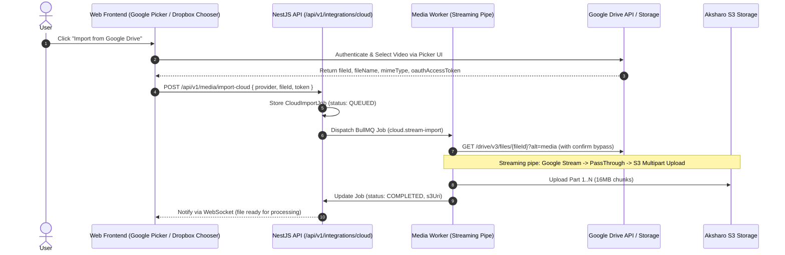

# Feature Blueprint: Cloud Storage Connectors (Google Drive, Dropbox, Box, OneDrive)

**Domain:** Pillar 1 — Ingestion & Input Engine  
**Functionality:** 02 — Cloud Storage Connectors  
**Path:** `docs/features/01-ingestion-and-input/02-cloud-storage-connectors/`  
**Status:** Approved Architectural Specification & Engineering Plan  

---

## 1. Feature Overview & Requirements

Corporate teams, remote podcast studios, and video agencies store multi-gigabyte raw video files on cloud storage providers (Google Drive, Dropbox, Box, Microsoft OneDrive). Requiring creators to download 5 GB files to their local machines and then upload them again to Aksharo wastes time and client bandwidth.

### Core User Stories
1. **Direct Cloud File Picker:** As a creator, I want to click "Import from Google Drive" or "Dropbox", browse my folders in a secure picker modal, and select any video file for instant import.
2. **Server-to-Server Direct Streaming:** The video file must transfer directly from the cloud provider's storage to Aksharo's S3 storage at multi-gigabit speeds, without routing through the client's web browser.
3. **Resumable Chunked Transfer:** Large 5–10 GB files must ingest reliably even if network packets drop or connections reset.
4. **Shared Team Drive Support:** Full support for Google Workspace Shared Drives (formerly Team Drives) and enterprise Dropbox team spaces.

### Key Performance SLAs
- OAuth Picker modal launch latency: $\le 800\text{ ms}$.
- Server-to-server transfer throughput: $\ge 45\text{ MB/s}$ on gigabit worker instances.
- Failure rate due to OAuth token expiration: $0.0\%$ (automated refresh token rotation).

---

## 2. Competitor Forensic Reverse-Engineering

### 2.1 How Market Leaders (Vizard.ai, Opus Clip, Descript) Build It
1. **Vizard.ai & Descript:**
   - **Frontend Integration via Cloud Pickers:** Rather than building a complete custom cloud file browser from scratch, they embed the native provider SDKs:
     - Google Drive: **Google Picker API** (`gapi.client.drive`). Returns a `fileId` and a short-lived OAuth Bearer token.
     - Dropbox: **Dropbox Chooser API**. Returns direct HTTPS signed download links valid for 4 hours.
     - OneDrive: **Microsoft OneDrive File Picker SDK** (`ms-graph`).
   - **Backend Server-Side Ingestion Worker:**
     - The frontend sends `{ provider: "google_drive", fileId, token }` to the API.
     - The API delegates the download to a worker running a streaming pipeline: `HTTP GET (range-aware) | S3 Multipart Upload Stream`.
     - Data is piped through a chunk stream (16 MB buffer) directly to S3/MinIO, consuming less than 64 MB of RAM on the worker instance.

2. **Common Competitor Failure Modes:**
   - Google Drive's "Virus scan warning: file is larger than 100MB" interstitial blocking standard `alt=media` downloads if the `confirm=xxx` token is missing.
   - Dropbox API rate limits (HTTP 429) when downloading massive files without chunked exponential backoff.
   - Expired Google OAuth tokens during long multi-file imports.

---

## 3. Current Aksharo Baseline & Gap Audit

### 3.1 Existing Repository Assets
- `apps/api/src/media`: Contains local upload and acquisition handlers.
- `apps/worker-media/src/processors/acquire.ts`: Supports downloading from HTTP URLs with `Content-Length` checks.
- `apps/web`: Currently has local file drag-and-drop and YouTube URL input fields, but **no cloud storage picker buttons or SDK integrations**.

### 3.2 Gaps & Deficiencies
1. **Missing OAuth Storage Integration in DB:** `schema.prisma` has no model for storing user or workspace third-party cloud integration tokens (`WorkspaceIntegration`).
2. **Missing Google Drive / Dropbox API clients:** Aksharo lacks server-side handlers to exchange file IDs for authenticated download streams or bypass Google's 100MB+ virus warning interstitials.
3. **No Direct Stream-to-Storage Pipe:** Currently, `acquire.ts` writes files to a local temp disk before uploading to S3, risking local disk exhaustion on large 10GB cloud files.

---

## 4. Target System Architecture & Data Flow



### 4.1 Prisma Schema Additions (`packages/db/prisma/schema.prisma`)
```prisma
model WorkspaceCloudIntegration {
  id           String   @id @default(uuid())
  workspaceId  String
  provider     String   // GOOGLE_DRIVE, DROPBOX, ONEDRIVE, BOX
  accountEmail String
  accessToken  String   // Encrypted AES-256-GCM
  refreshToken String?  // Encrypted AES-256-GCM
  expiresAt    DateTime?
  createdAt    DateTime @default(now())
  updatedAt    DateTime @updatedAt

  workspace    Workspace @relation(fields: [workspaceId], references: [id], onDelete: Cascade)
  @@unique([workspaceId, provider, accountEmail])
}

model CloudImportJob {
  id           String    @id @default(uuid())
  workspaceId  String
  provider     String
  fileId       String
  fileName     String
  fileSizeBytes BigInt
  status       String    @default("QUEUED") // QUEUED, STREAMING, COMPLETED, FAILED
  progressPct  Int       @default(0)
  errorMessage String?
  s3Key        String?
  createdAt    DateTime  @default(now())
  completedAt  DateTime?
}
```

---

## 5. Step-by-Step Engineering Implementation Plan

### Step 1: Implement Cloud Provider Token Vault
- Create `apps/api/src/integrations/vault.service.ts` using Node.js `crypto` (`aes-256-gcm`) to securely encrypt and decrypt cloud OAuth tokens at rest using `ENCRYPTION_KEY`.

### Step 2: Implement Google Drive & Dropbox Streaming Clients
- Create `apps/worker-media/src/cloud/google-drive-stream.ts`:
  - Request file metadata to check byte size.
  - Stream binary using `https.request` with `Authorization: Bearer <token>`.
  - Handle Google's virus-scan prompt on large files by automatically parsing the `confirm` cookie/query parameter.
- Create `apps/worker-media/src/cloud/dropbox-stream.ts`:
  - Utilize Dropbox `/2/files/get_temporary_link` to obtain signed download stream.

### Step 3: Zero-Disk S3 Multipart Streaming Pipeline
- Connect the readable stream directly to AWS S3 SDK `@aws-sdk/lib-storage` `Upload` utility:
  ```typescript
  const parallelUploads3 = new Upload({
    client: s3Client,
    params: { Bucket: BUCKET_NAME, Key: s3Key, Body: incomingStream },
    partSize: 16 * 1024 * 1024, // 16MB parts
    queueSize: 4,
  });
  parallelUploads3.on("httpUploadProgress", (progress) => emitProgress(progress));
  await parallelUploads3.done();
  ```

### Step 4: Frontend Picker Integration in `apps/web`
- Add Google Picker API script loader in `apps/web/components/media/google-picker.tsx`.
- Add Dropbox Chooser script loader in `apps/web/components/media/dropbox-chooser.tsx`.
- Display progress bar in the UI displaying streaming transfer percentage.

### Step 5: Automated Testing Suite
- Unit test: `google-drive-stream.test.ts` testing chunked streaming and error interception.
- Integration test: Mocking Google Drive and Dropbox HTTP endpoints and validating S3 multipart upload completion.

