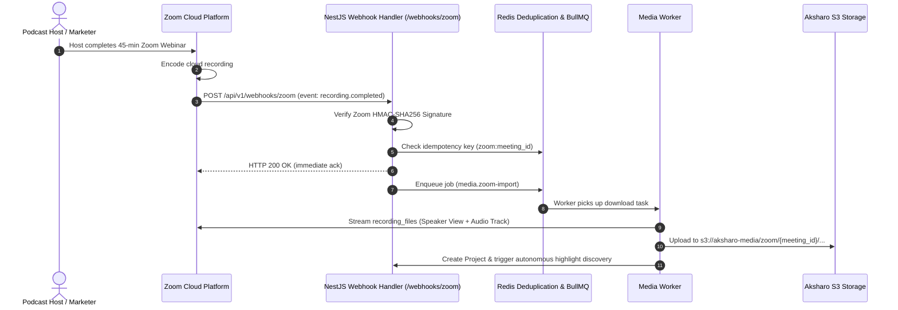

# Feature Blueprint: Meeting & Studio Connectors (Zoom Cloud, Riverside.fm, Google Meet)

**Domain:** Pillar 1 — Ingestion & Input Engine  
**Functionality:** 03 — Meeting & Studio Connectors  
**Path:** `docs/features/01-ingestion-and-input/03-meeting-studio-connectors/`  
**Status:** Approved Architectural Specification & Engineering Plan  

---

## 1. Feature Overview & Requirements

Over 40% of B2B webinars, interviews, and executive podcasts are hosted on Zoom Cloud, Google Meet, StreamYard, and Riverside.fm. Currently, hosts must wait 30 minutes for Zoom to process the cloud recording, manually download it to their desktop, and upload it to a video tool.

The **Meeting & Studio Connectors** feature provides direct OAuth integration and webhook automation: the moment a Zoom meeting, webinar, or Riverside studio session ends, Aksharo automatically ingests the isolated recordings, begins transcription, generates shorts, and sends a notification to the creator.

### Core User Stories
1. **Automated Post-Webinar Repurposing:** As a marketing manager, when my Zoom webinar finishes, I want Aksharo to automatically receive the recording and create draft shorts without me touching a button.
2. **Multi-Speaker Track Separation:** When Zoom or Riverside records separate audio/video files for the host and guest, Aksharo must ingest both tracks and link them to the project for accurate speaker framing.
3. **Selective Ingestion Rules:** As a user, I want to set auto-repurpose filters (e.g., only repurpose Zoom meetings with tag `#webinar` or duration $> 20\text{ minutes}$).

### Key Performance SLAs
- Webhook acknowledgment latency: $\le 200\text{ ms}$ (HTTP 200).
- Cloud recording download initiation: $\le 30\text{ seconds}$ following webhook delivery.
- Zero lost recordings (persistent idempotent webhook ledger).

---

## 2. Competitor Forensic Reverse-Engineering

### 2.1 How Market Leaders (Vizard.ai & Riverside.fm) Build It
1. **Vizard.ai Zoom Cloud App:**
   - Listed on the **Zoom App Marketplace** as an authorized OAuth App.
   - Requires Zoom OAuth scopes: `recording:read`, `user:read`.
   - Listens to Zoom Webhook Event: `recording.completed`.
   - Payload contains:
     ```json
     {
       "event": "recording.completed",
       "payload": {
         "object": {
           "id": "meeting_id",
           "topic": "Q3 Growth Review",
           "recording_files": [
             { "file_type": "MP4", "recording_type": "shared_screen_with_speaker_view", "download_url": "..." },
             { "file_type": "M4A", "recording_type": "audio_only", "download_url": "..." }
           ]
         }
       }
     }
     ```
   - Zoom requires webhook endpoint validation: responds to Zoom's `endpoint.url_validation` challenge with HMAC-SHA256 hash using the Zoom Webhook Secret Token.
   - Downloads recording using the bearer token via `download_url?access_token=...`.

2. **Riverside.fm:**
   - Employs local WebAssembly recording on the browser edge.
   - Pushes separated multi-track WAV and uncompressed MP4 to Riverside Cloud.
   - Riverside's Magic Clips pipeline ingests these pre-separated host/guest tracks directly.

---

## 3. Current Aksharo Baseline & Gap Audit

### 3.1 Existing Repository Assets
- `apps/api/src/webhooks`: Directory exists, but currently only handles payment webhooks (Stripe / Razorpay).
- `apps/api/src/media`: Media acquisition framework.
- No Zoom OAuth apps or webhook listeners exist in the current codebase.

### 3.2 Gaps & Missing Logic
1. **Missing Zoom App Verification Endpoint:** Zoom requires an endpoint responding to `endpoint.url_validation` with a CRC hash. Aksharo has no such endpoint.
2. **No Webhook Idempotency Ledger:** If Zoom retries a `recording.completed` webhook, Aksharo would duplicate project imports without an idempotency store.
3. **No Automatic Ingestion Rules Table:** No configuration in `Workspace` for auto-import preferences.

---

## 4. Target System Architecture & Data Flow



### 4.1 Schema Additions (`packages/db/prisma/schema.prisma`)
```prisma
model WorkspaceZoomIntegration {
  id             String    @id @default(uuid())
  workspaceId    String    @unique
  zoomUserId     String
  zoomEmail      String
  accessToken    String    // AES-256-GCM
  refreshToken   String    // AES-256-GCM
  expiresAt      DateTime
  autoRepurpose  Boolean   @default(true)
  minDurationSec Int       @default(600) // 10 minutes minimum
  nameFilter     String?   // Regex or tag filter
  createdAt      DateTime  @default(now())

  workspace      Workspace @relation(fields: [workspaceId], references: [id], onDelete: Cascade)
}

model ZoomRecordingEvent {
  id           String    @id @default(uuid())
  meetingId    String    @unique
  topic        String
  durationMin  Int
  fileCount    Int
  status       String    @default("PENDING") // PENDING, PROCESSING, COMPLETED, IGNORED
  projectId    String?
  createdAt    DateTime  @default(now())
}
```

---

## 5. Step-by-Step Engineering Implementation Plan

### Step 1: Implement Zoom Webhook Verification & CRC Validation
- Create `apps/api/src/webhooks/zoom.controller.ts`:
  - Handle `endpoint.url_validation` challenge:
    ```typescript
    const hash = crypto.createHmac('sha256', process.env.ZOOM_WEBHOOK_SECRET_TOKEN)
      .update(body.payload.plainToken)
      .digest('hex');
    return { plainToken: body.payload.plainToken, encryptedToken: hash };
    ```
  - Verify `x-zm-signature` header on all incoming events.

### Step 2: Implement OAuth Connect & Refresh Token Service
- Create `apps/api/src/integrations/zoom.service.ts`:
  - Handle Zoom OAuth callback, store credentials encrypted in `WorkspaceZoomIntegration`.
  - Automatic token refresh interceptor when token expires within 5 minutes.

### Step 3: Implement Webhook Event Ingestion Worker
- Create `apps/worker-media/src/processors/zoom-ingest.ts`:
  - Inspect `recording_files` array.
  - Select `shared_screen_with_speaker_view` or `active_speaker` as primary video.
  - Select `audio_only` as primary audio.
  - Stream directly into Aksharo S3 using the authenticated bearer token.

### Step 4: Automated Testing Suite
- Unit test: Zoom HMAC validation and CRC response generation.
- Integration test: End-to-end simulation of Zoom `recording.completed` webhook triggering project creation.

