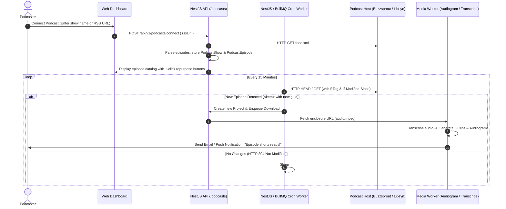

# Feature Blueprint: Podcast RSS Ingestion & Automated Episode Watcher

**Domain:** Pillar 1 — Ingestion & Input Engine  
**Functionality:** 06 — Podcast RSS Ingestion  
**Path:** `docs/features/01-ingestion-and-input/06-podcast-rss-ingestion/`  
**Status:** Approved Architectural Specification & Engineering Plan  

---

## 1. Feature Overview & Requirements

Over 5 million podcasts globally distribute audio and video episodes via standard RSS feeds (Apple Podcasts, Spotify, Buzzsprout, Libsyn, Transistor). Podcasters follow strict weekly release schedules. Requiring them to manually log into Aksharo every time a new episode goes live is friction that leads to churn.

The **Podcast RSS Ingestion Engine** allows creators to link their show's RSS feed once. Aksharo automatically watches the feed, ingests new episodes upon publication, generates clips, social posts, and audiograms, and notifies the podcaster when ready.

### Core User Stories
1. **Podcast Show Linking:** As a podcaster, I want to paste my Apple Podcasts, Spotify, or RSS link and see all historical episodes indexed instantly.
2. **Autonomous Episode Watcher:** As a creator, when my podcast host publishes Episode 42 at 5:00 AM, I want Aksharo to automatically detect it, download the audio/video enclosure, and generate viral shorts before I wake up.
3. **Smart Show Notes & Chapters Extraction:** Aksharo must parse `<itunes:summary>` and timestamped chapters from the RSS XML to seed highlight boundaries.

### Key Performance SLAs
- RSS feed parsing latency: $\le 800\text{ ms}$.
- New episode detection delay: $\le 15\text{ minutes}$ from RSS publish time.

---

## 2. Competitor Forensic Reverse-Engineering

### 2.1 How Castmagic & Munch Build It
1. **Castmagic (`castmagic.io`):**
   - Connects to the Apple Podcasts Search API (`https://itunes.apple.com/search?term=...&entity=podcast`) to let users find their show by name without knowing their raw RSS URL.
   - Extracts the `feedUrl` property from the iTunes directory.
   - Parses the XML schema:
     - Root metadata: `<title>`, `<itunes:image>`, `<itunes:author>`.
     - Episode `<item>` tags: `<title>`, `<pubDate>`, `<enclosure url="..." type="audio/mpeg" length="...">`, `<itunes:duration>`.
   - Stores `lastBuildDate` and the latest item `<guid>`.
   - Runs a periodic cron worker (every 15–30 minutes) fetching `If-Modified-Since` or `ETag` headers to avoid downloading the XML when nothing has changed.

---

## 3. Current Aksharo Baseline & Gap Audit

### 3.1 Existing Repository Assets
- `apps/api/src/scheduler`: Basic internal job scheduler exists.
- `apps/worker-media/src/processors/audiogram.ts`: Generates visual waveform audiograms from audio-only files!
- No RSS feed parser or show subscription tables currently exist.

### 3.2 Current Gaps
1. **Missing RSS Feed Models:** `schema.prisma` does not have a model for `PodcastFeed` or `PodcastEpisode`.
2. **Missing XML Stream Parser:** Aksharo lacks a high-performance XML parser (e.g. `fast-xml-parser`) for parsing iTunes podcast namespace attributes (`itunes:summary`, `itunes:episode`, `itunes:image`).

---

## 4. Target System Architecture & Data Flow



### 4.1 Schema Additions (`packages/db/prisma/schema.prisma`)
```prisma
model PodcastShow {
  id             String           @id @default(uuid())
  workspaceId    String
  title          String
  feedUrl        String           @unique
  author         String?
  imageUrl       String?
  lastBuildDate  DateTime?
  etag           String?
  autoRepurpose  Boolean          @default(true)
  createdAt      DateTime         @default(now())
  updatedAt      DateTime         @updatedAt

  workspace      Workspace        @relation(fields: [workspaceId], references: [id], onDelete: Cascade)
  episodes       PodcastEpisode[]
}

model PodcastEpisode {
  id           String       @id @default(uuid())
  showId       String
  guid         String       @unique
  title        String
  audioUrl     String
  durationSec  Float?
  publishedAt  DateTime
  isProcessed  Boolean      @default(false)
  projectId    String?
  createdAt    DateTime     @default(now())

  show         PodcastShow  @relation(fields: [showId], references: [id], onDelete: Cascade)
}
```

---

## 5. Step-by-Step Engineering Implementation Plan

### Step 1: Implement RSS Parser Service
- Install `fast-xml-parser` in `apps/api`.
- Create `apps/api/src/podcasts/rss-parser.service.ts`:
  - Parses standard RSS and `<itunes:*>` tags.
  - Extracts episode audio URLs, publication dates, and embedded timestamps.

### Step 2: Implement iTunes Directory Search API
- Create `apps/api/src/podcasts/itunes-search.service.ts`:
  - Calls `https://itunes.apple.com/search?term=${encodeURIComponent(query)}&entity=podcast&limit=10`.
  - Returns show title, artwork URL, and direct RSS feed URL for fast user onboarding.

### Step 3: Implement Automated Ingestion Cron
- Create `apps/api/src/podcasts/podcast-watcher.processor.ts`:
  - BullMQ repeatable job running every 15 minutes.
  - Queries active `PodcastShow` records where `autoRepurpose = true`.
  - Performs conditional HTTP requests using stored `etag`.
  - Automatically dispatches `media.acquire` and `ai.transcribe` for new episodes.

### Step 4: Automated Testing Suite
- Unit test: RSS XML parsing with sample feeds from Buzzsprout, Spotify, and Libsyn.
- Integration test: New episode detection triggering BullMQ acquisition job.

