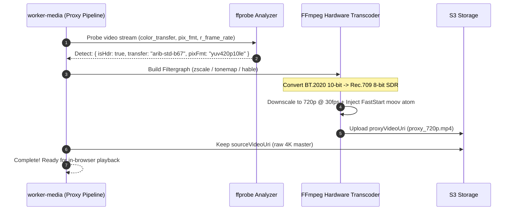

# Feature Blueprint: 4K 60fps HDR Ingestion & Color Tone-Mapped Proxy Pipeline

**Domain:** Pillar 1 — Ingestion & Input Engine  
**Functionality:** 07 — 4K HDR Ingestion & Proxy Pipeline  
**Path:** `docs/features/01-ingestion-and-input/07-4k-hdr-proxy-pipeline/`  
**Status:** Approved Architectural Specification & Engineering Plan  

---

## 1. Feature Overview & Requirements

Modern content creators record on iPhones (Dolby Vision / HLG HDR), Sony alpha mirrorless cameras (S-Log3, HLG), and high-framerate 4K 60fps setups. When uploaded to web platforms, untreated HDR footage appears severely washed-out, milky gray, or over-exposed because web browsers default to standard SDR (sRGB / Rec.709) color spaces.

The **4K 60fps HDR Ingestion & Proxy Pipeline**:
1. Ingests master files up to 4K (3840×2160) at 60 fps in 10-bit color spaces (BT.2020, HLG, PQ/HDR10).
2. Generates a lightweight 720p 30fps fast-start SDR proxy with high-fidelity tone-mapping for buttery smooth in-browser editing.
3. Preserves the full 4K 10-bit mezzanine in cold storage for 4K final master exports.

### Core User Stories
1. **Accurate Color Representation:** As an iPhone creator filming in Dolby Vision HDR, when I look at the editor preview, I want colors, contrast, and skin tones to look vibrant and natural instead of washed out.
2. **Instant In-Browser Timeline Scrubbing:** When scrubbing the editor timeline, playback must never drop frames or lag, even if the uploaded master is a 60fps 4K file.
3. **4K Master Export Preservation:** When I click "Export in 4K", Aksharo renders from the original 4K master asset with crisp detail rather than upscaling the 720p proxy.

### Key Performance SLAs
- 720p proxy generation speed: $\ge 4.5\times$ realtime on GPU/CPU workers.
- Color accuracy: Peak Signal-to-Noise Ratio (PSNR) $\ge 38\text{ dB}$ relative to reference BT.709 SDR transform.

---

## 2. Competitor Forensic Reverse-Engineering

### 2.1 How Descript & CapCut Build It
1. **Descript & CapCut Studio:**
   - **HDR Detection via FFprobe:**
     Inspects video stream metadata:
     - `color_space`: `bt2020nc` or `bt2020c`
     - `color_transfer`: `arib-std-b67` (HLG) or `smpte2084` (PQ / HDR10)
     - `color_primaries`: `bt2020`
     - `pix_fmt`: `yuv420p10le` (10-bit)
   - **Tone-Mapping Filtergraph in FFmpeg:**
     Converts 10-bit wide-gamut HDR to 8-bit Rec.709 SDR using high-quality tone-mapping:
     ```bash
     ffmpeg -i input.mov \
       -vf "zscale=t=linear:npl=100,format=gbrpf32le,zscale=p=bt709,tonemap=tonemap=hable:desat=2,zscale=t=bt709:m=bt709:r=tv,format=yuv420p" \
       -c:v libx264 -preset veryfast -crf 22 -movflags +faststart \
       proxy_720p.mp4
     ```
   - **Hardware Acceleration:** Uses NVIDIA NVENC (`h264_nvenc`) with hardware-based `tonemap_cuda` when running on GPU worker instances to achieve $12\times$ realtime conversion speed.

---

## 3. Current Aksharo Baseline & Gap Audit

### 3.1 Existing Repository Assets
- `apps/worker-media/src/processors/proxy.ts`:
  - Contains basic proxy generation logic (`ffmpeg -i ... -vf scale=-2:720 -c:v libx264`).
- `apps/worker-media/src/processors/clip-frame.ts`:
  - Enforces `MAX_CLIP_HEIGHT = 1920` for mezzanine cuts.

### 3.2 Gaps & Bugs
1. **Washed-Out Colors on iPhone HDR Uploads:** `proxy.ts` does not inspect `color_transfer` or apply color tone-mapping. Any iPhone HDR or Sony HLG upload results in a washed-out, milky-gray proxy in the preview player!
2. **Missing Faststart Flag:** Some generated MP4 proxies do not place the MP4 `moov` atom at the front (`-movflags +faststart`), forcing the browser to download hundreds of megabytes before starting playback.

---

## 4. Target System Architecture & Data Flow



### 4.1 Schema Additions (`packages/db/prisma/schema.prisma`)
```prisma
// Extension to existing MediaAsset model:
// model MediaAsset already has proxyVideoUri and sourceVideoUri.
// Adding color space metadata fields:
// isHdr           Boolean   @default(false)
// colorTransfer   String?   // bt709, arib-std-b67, smpte2084
// colorPrimaries  String?   // bt709, bt2020
```

---

## 5. Step-by-Step Engineering Implementation Plan

### Step 1: Enhance `probe.ts` with Color Space Extraction
- In `apps/worker-media/src/processors/probe.ts`, extract:
  - `stream.color_space`
  - `stream.color_transfer`
  - `stream.color_primaries`
  - `stream.pix_fmt`
- Flag `isHdr: boolean = (color_transfer === 'arib-std-b67' || color_transfer === 'smpte2084' || pix_fmt.includes('10'))`.

### Step 2: Implement Tone-Mapped Filter Pipeline in `proxy.ts`
- In `apps/worker-media/src/processors/proxy.ts`:
  - When `isHdr` is true, inject the Hable/Mobius tone-mapping filter chain.
  - Downsample framerate to 30 fps (`-r 30`) to eliminate unnecessary decoding load during in-browser preview.
  - Always enforce `-movflags +faststart` so preview starts after loading the first 64 KB.

### Step 3: Dual-Resolution Render Dispatch in `apps/render`
- When rendering export:
  - If user selects "1080p", render from source video using high-quality tone-mapping.
  - If user selects "4K UHD", render at full 3840×2160 resolution directly from `sourceVideoUri`.

### Step 4: Automated Testing Suite
- Unit test: Color space detection for SDR vs HDR10 vs HLG fixtures.
- Visual regression test: Assert histogram distribution of tone-mapped proxy to ensure luminance is preserved without clipping.

