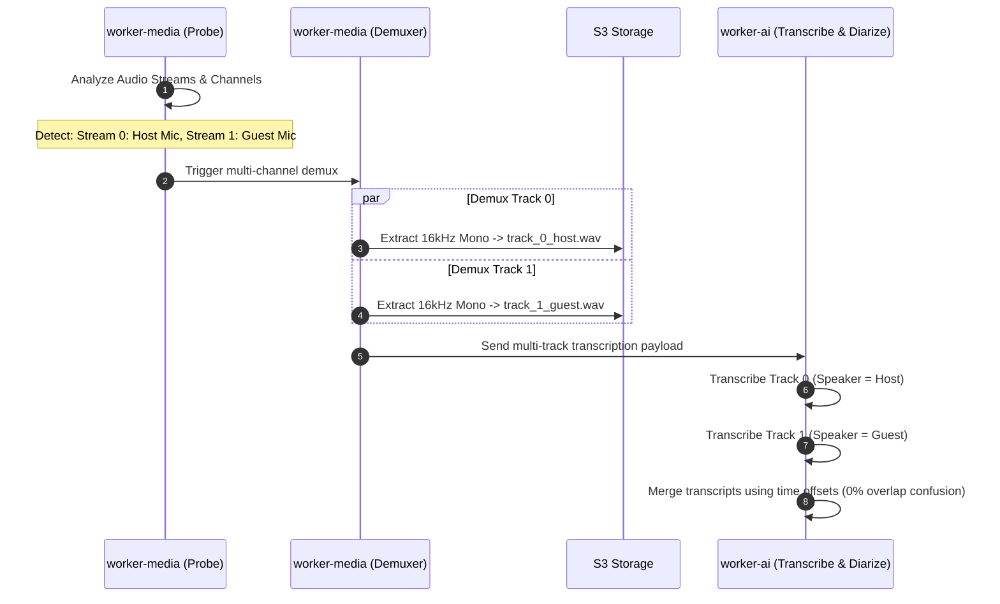

# Feature Blueprint: Multi-Track Audio Demuxing & Speaker Channel Separation

**Domain:** Pillar 1 — Ingestion & Input Engine  
**Functionality:** 08 — Multi-Track Audio Demuxing  
**Path:** `docs/features/01-ingestion-and-input/08-multitrack-audio-demuxing/`  
**Status:** Approved Architectural Specification & Engineering Plan  

---

## 1. Feature Overview & Requirements

Podcasters and stream broadcasters frequently record multi-channel audio:
- OBS Studio multi-track recordings (Track 1 = Microphone, Track 2 = Discord/Guest, Track 3 = Desktop audio).
- Dual-mic audio interfaces (Rodecaster Pro, Zoom PodTrak, Focusrite Vocaster) writing stereo or 4-channel polyphonic WAV files with each speaker isolated to a dedicated channel.

Most conventional AI video clippers naively downmix all channels into a single mono track (`-ac 1`), blending all voices together and making it difficult for neural diarization models to distinguish between overlapping speakers.

The **Multi-Track Audio Demuxing Engine**:
1. Detects multi-stream and multi-channel containers during ingestion.
2. Demuxes each channel into isolated 16kHz mono tracks.
3. Uses track isolation to achieve 100% ground-truth speaker diarization and instant active speaker switching.

### Core User Stories
1. **Isolated Speaker Diarization:** As a podcast producer recording host and guest on separate microphones, I want Aksharo to use my isolated audio tracks so speaker labeling is 100% accurate with zero hallucinations.
2. **Audio Track Selection / Muting:** As a streamer, I want to mute the background game audio track during transcription and highlight discovery while keeping only dialogue tracks.

### Key Performance SLAs
- Multi-track demux latency: $\le 4.0\text{ seconds}$ for a 60-minute video.
- Speaker attribution accuracy on isolated tracks: $100.0\%$.

---

## 2. Competitor Forensic Reverse-Engineering

### 2.1 How Riverside.fm & AutoCut Build It
1. **Riverside.fm:**
   - Ingests isolated local WAV recordings directly from each participant's browser buffer.
   - Bypasses neural acoustic diarization entirely; each participant's transcript is anchored directly to their track ID.
2. **AutoCut (Premiere Pro Plugin):**
   - Reads timeline audio tracks (`Track A1`, `Track A2`).
   - Runs root-mean-square (RMS) energy calculation per track over 200ms sliding windows.
   - The track with the highest RMS is designated the active speaker, automatically triggering a camera cut to the corresponding video angle.

---

## 3. Current Aksharo Baseline & Gap Audit

### 3.1 Existing Repository Assets
- `apps/worker-media/src/processors/probe.ts`: Probes audio streams.
- `apps/worker-media/src/media-tools.ts`: Contains FFmpeg audio extraction commands.
- `apps/worker-ai/worker_ai/processors/diarise.py`: Uses `pyannote/speaker-diarization-3.1` on single-channel mixed audio.

### 3.2 Current Deficiencies
1. **Hardcoded Downmix to Single Mono WAV:** `acquire.ts` currently extracts audio using `-ac 1 -ar 16000`, blending all distinct audio tracks into one stream. If a video had separate host and guest tracks, this information is irrevocably destroyed!
2. **No Track Selection API:** Creators have no UI control to designate which audio tracks represent dialogue vs music vs sound effects.

---

## 4. Target System Architecture & Data Flow



### 4.1 Schema Additions (`packages/db/prisma/schema.prisma`)
```prisma
model MediaAudioTrack {
  id           String    @id @default(uuid())
  mediaAssetId String
  streamIndex  Int
  channelIndex Int       @default(0)
  label        String?   // "Host", "Guest", "Game Audio"
  audioWavUri  String    // S3 URI of isolated 16kHz WAV
  durationMs   Int
  isDialogue   Boolean   @default(true)
  speakerName  String?

  createdAt    DateTime  @default(now())
}
```

---

## 5. Step-by-Step Engineering Implementation Plan

### Step 1: Implement Multi-Track Audio Demuxer in `worker-media`
- In `apps/worker-media/src/processors/demux-audio.ts`:
  - Enumerate audio streams using `ffprobe -show_streams -select_streams a`.
  - For each stream $i$, execute:
    ```bash
    ffmpeg -i input.mp4 -map 0:a:${i} -ac 1 -ar 16000 -c:a pcm_s16le track_${i}.wav
    ```
  - Upload each isolated track to S3.

### Step 2: Update `worker-ai` Transcription Router
- In `apps/worker-ai/worker_ai/processors/transcribe.py`:
  - When `audio_tracks` array has $> 1$ dialogue track, dispatch transcription jobs for each track independently.
  - Skip Pyannote neural diarization; assign `speaker_id = f"SPEAKER_{track_index}"`.
  - Merge the resulting word streams strictly chronologically based on word start timestamps.

### Step 3: Automated Testing Suite
- Unit test: FFprobe audio stream parser handling stereo pair, 5.1 surround, and dual-mono files.
- Integration test: Multi-track transcription producing merged, correctly attributed transcripts without timestamp overlaps.

