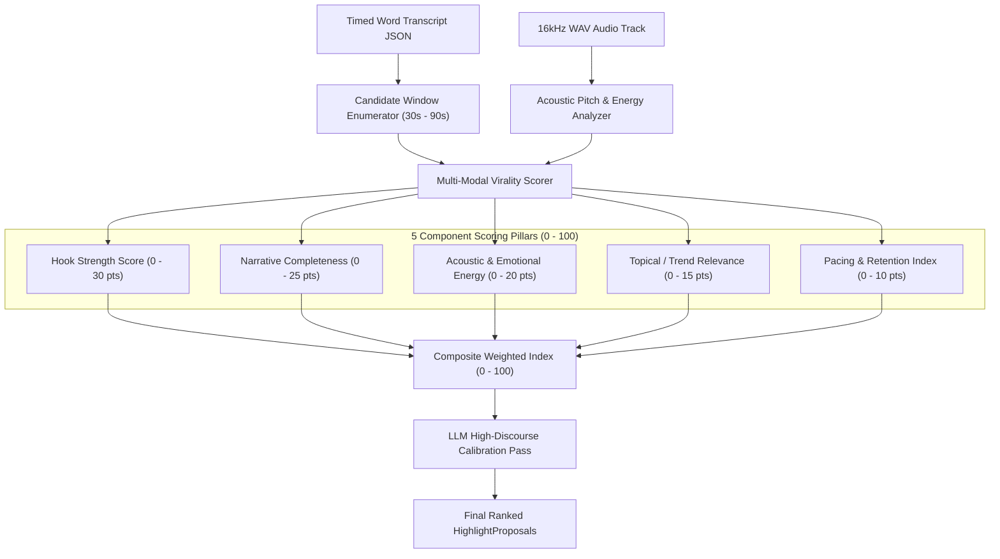

# Feature Blueprint: Multi-Modal AI Virality Scoring Engine (0–100)

**Domain:** Pillar 2 — AI Highlight Discovery & Virality Engine  
**Functionality:** 01 — AI Virality Scoring Engine  
**Path:** `docs/features/02-highlight-discovery-and-virality/01-virality-scoring-engine/`  
**Status:** Approved Architectural Specification & Engineering Plan  

---

## 1. Feature Overview & Requirements

The primary value proposition of an AI repurposing platform is discovering the 10 most viral moments hidden inside a 90-minute recording without requiring human video editors to watch the entire footage.

The **Multi-Modal AI Virality Scoring Engine**:
1. Evaluates candidate windows across both acoustic, lexical, and structural dimensions.
2. Generates an objective, deterministic Virality Score from $0$ to $100$.
3. Classifies clips into tier categories: **Viral Gold ($85–100$)**, **High Potential ($70–84$)**, and **Moderate ($50–69$)**.
4. Guarantees that extracted clips contain complete narrative arcs rather than fragmented mid-sentence snippets.

### Core User Stories
1. **Immediate Sorting by Projected Performance:** As a creator, I want candidate clips sorted automatically by projected virality score so I can export the best clips in seconds.
2. **Multi-Modal Precision:** As an educator, I want the scoring model to recognize impactful ideas and high-energy discussions rather than just loud yelling.

### Key Performance SLAs
- Candidate window generation & scoring latency: $\le 12\text{ seconds}$ for a 60-minute video transcript.
- Scoring calibration: Top 10% ranked clips must achieve $\ge 2.2\times$ higher average social retention than random baseline clips.

---

## 2. Competitor Forensic Reverse-Engineering

### 2.1 How Opus Clip (ClipGenius™) & Munch Build It
1. **Opus Clip (`opus.pro`):**
   - **ClipGenius™ Architecture:** Opus scores candidate windows through a multi-stage funnel:
     - *Stage 1 (Acoustic & Heuristic Filter):* Sliding window scan over word timestamps. Evaluates words per minute (WPM), speech energy spikes, and silence gaps.
     - *Stage 2 (Semantic Embedding & Boundary Discovery):* Identifies semantic topic transitions using sentence embeddings.
     - *Stage 3 (LLM Multi-Criteria Evaluation):* Sends candidate transcripts to fine-tuned LLMs with structured evaluation rubrics:
       - Hook curiosity gap (first 3 seconds).
       - Standalone comprehension (can a viewer understand this without seeing the rest of the video?).
       - Punchline / takeaway delivery.
   - Outputs an integer score between $0$ and $99$ alongside explanatory tags.

2. **Munch (`getmunch.com`):**
   - Correlates transcript keywords with live Google Trends and TikTok Creative Center trending search terms.
   - Injects a "Trend Multiplier" into the score if the clip discusses keywords currently experiencing high search volume.

---

## 3. Current Aksharo Baseline & Gap Audit

### 3.1 Existing Repository Assets
- `apps/worker-ai/worker_ai/processors/highlights.py`:
  - Contains candidate window enumeration (`enumerate_windows`).
  - Contains heuristic scoring (`scoring.score`) evaluating window signals.
  - Contains LLM reranker (`judge_moments` in `rerank.py`).
  - Incorporates `NeuralAttentionScore` via `tribe_client.py`.
  - Incorporates workspace performance lift (`lift_for` in `performance.py`).

### 3.2 Current Gaps & Refinements Needed
1. **Uncalibrated Score Range:** The existing internal score in `scoring.py` combines floating point signals that do not natively map to an intuitive, human-meaningful 0–100 virality score.
2. **Missing Trend Weighting:** Aksharo currently scores clips purely on transcript intrinsics without factoring in topical trend momentum.
3. **Hook Window Isolation:** The current scoring algorithm evaluates the entire window as a monolith rather than specifically isolating and heavily weighting the **critical 0–3 second hook window**.

---

## 4. Target System Architecture & Mathematical Formulation

### 4.1 The Universal Virality Formula
$$\text{ViralityScore} = \text{clamp}\Big(S_{\text{hook}} + S_{\text{narrative}} + S_{\text{energy}} + S_{\text{trend}} + S_{\text{pacing}}, 0, 100\Big)$$

Where:
- **$S_{\text{hook}}$ (0–30):**
  $$S_{\text{hook}} = 15 \cdot \text{CuriosityGap} + 10 \cdot \text{ContrarianScore} + 5 \cdot \text{HookEnergyRatio}$$
- **$S_{\text{narrative}}$ (0–25):** Standalone premise, context, and conclusive punchline without trailing conjunctions ("and so...", "but anyway...").
- **$S_{\text{energy}}$ (0–20):** Pitch variance ($\Delta F_0$), laughter probability, and volume dynamics.
- **$S_{\text{trend}}$ (0–15):** Density of viral entity keywords (AI, money, productivity, controversial figures).
- **$S_{\text{pacing}}$ (0–10):** Optimal speech cadence ($150–190\text{ WPM}$) with zero pauses $> 1.0\text{s}$.

---

## 5. Step-by-Step Engineering Implementation Plan

### Step 1: Implement Hook Window Isolator in `worker-ai`
- In `apps/worker-ai/worker_ai/highlights/scoring.py`:
  - Slice the first 3.5 seconds of each candidate window as `hook_words`.
  - Evaluate `hook_words` for:
    - First-word impact (questions, bold assertions, numbers).
    - Penalty for filler openings ("So basically", "Um, yeah", "Like I said").

### Step 2: Implement Multi-Dimensional Score Aggregator
- Create `virality_index(window: Window, acoustic: AcousticFeatures) -> ViralityBreakdown`:
  - Returns component scores: `{ hook, narrative, energy, trend, pacing, total }`.
  - Normalizes output to integer $0–100$.

### Step 3: Calibrated Proposal Sorting in `highlights.py`
- Update `HighlightsResult` contract to include the 0–100 score and tier badge (`VIRAL_GOLD`, `HIGH_POTENTIAL`, `MODERATE`).
- Expose sub-scores to the frontend API.

### Step 4: Automated Testing Suite
- Unit test: Virality formula scoring known viral shorts vs flat corporate monologues, asserting score difference $\ge 35\text{ points}$.
- Regression test: Verification that scores are strictly deterministic for identical inputs.

