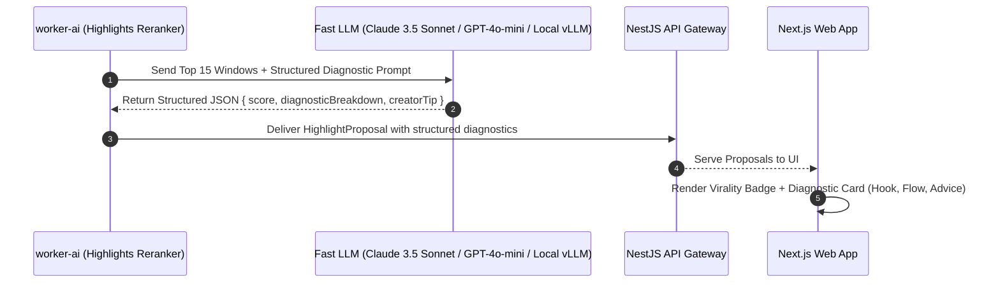

# Feature Blueprint: Virality Scoring Diagnostic Rationale (Explainable AI)

**Domain:** Pillar 2 — AI Highlight Discovery & Virality Engine  
**Functionality:** 02 — Scoring Diagnostic Rationale  
**Path:** `docs/features/02-highlight-discovery-and-virality/02-scoring-diagnostic-rationale/`  
**Status:** Approved Architectural Specification & Engineering Plan  

---

## 1. Feature Overview & Requirements

When an AI system provides an arbitrary number like "Score: 88" without explanation, creators hesitate to trust it. Opus Clip's breakthrough design was introducing **human-readable diagnostic breakdowns** explaining *why* a clip scored well and *what specific elements* make it viral.

The **Scoring Diagnostic Rationale Engine**:
1. Analyzes each proposed clip's hook, emotional inflection, and narrative resolution.
2. Generates concise, creator-friendly bullet-point explanations (e.g., *"Strong contrarian hook in first 2.5s"*, *"High-stakes emotional conflict"*, *"Memorable concluding takeaway"*).
3. Provides an actionable **Creator Recommendation** (e.g., *"Add a fast zoom at 00:04 to emphasize the shocking metric"*).

### Core User Stories
1. **Explainable AI Trust:** As a creator reviewing 10 generated clips, I want clear bullet points explaining why Clip #1 scored 94 and Clip #7 scored 62 so I can select clips with confidence.
2. **Actionable Polish Suggestions:** As an editor, I want diagnostic tips suggesting where to place B-roll or zooms to maximize viewer retention.

### Key Performance SLAs
- Diagnostic generation overhead: $\le 1.2\text{ seconds}$ during the batch reranking pass.
- Relevance score: $\ge 95\%$ factual alignment with actual spoken words in the window.

---

## 2. Competitor Forensic Reverse-Engineering

### 2.1 How Opus Clip (ClipGenius™ Rationale) Builds It
1. **Opus Clip:**
   - In their reranking LLM prompt, Opus requests a structured JSON schema:
     ```json
     {
       "virality_score": 92,
       "reasons": [
         { "category": "hook", "text": "Starts with a provocative question that immediately sparks curiosity." },
         { "category": "flow", "text": "Smooth progression from personal struggle to actionable business lesson." },
         { "category": "punchline", "text": "Ends on a memorable one-liner suitable for saving or sharing." }
       ],
       "improvement_tip": "Trim the 0.5s pause before the word 'millions' to heighten tension."
     }
     ```
   - These reasons are mapped directly to UI pills on the clip cards in the dashboard.

---

## 3. Current Aksharo Baseline & Gap Audit

### 3.1 Existing Repository Assets
- `apps/worker-ai/worker_ai/highlights/rerank.py`:
  - Contains `model_reasons` and `reason_for`.
  - Parses heuristic and track-record reasons into `HighlightProposal.reasons`.
- `apps/web`: Displays basic reason strings if present on proposal cards.

### 3.2 Gaps & Weaknesses
1. **Generic Heuristic Reasons:** Current reasons are often programmatic strings like `"good_window_cadence"` or `"topic_match"`, which lack human nuance.
2. **No Structured Diagnostic Schema:** Aksharo lacks categories (`HOOK`, `NARRATIVE`, `ENGAGEMENT`, `IMPROVEMENT_TIP`) in the wire contract.

---

## 4. Target System Architecture & Data Flow



### 4.1 Schema Additions (`packages/repurpose-contracts/src/schema.ts`)
```typescript
export interface DiagnosticItem {
  readonly category: 'HOOK' | 'FLOW' | 'EMOTION' | 'TREND' | 'RETENTION';
  readonly label: string;       // e.g. "Shocking Metric Opening"
  readonly detail: string;      // e.g. "Opens with 'I lost $40,000 in one week', triggering immediate curiosity gap."
  readonly sentiment: 'POSITIVE' | 'NEUTRAL' | 'WARNING';
}

export interface ViralityDiagnostic {
  readonly overallSummary: string;
  readonly items: readonly DiagnosticItem[];
  readonly creatorTip?: string; // e.g. "Add a punch-in camera zoom on second 03."
}
```

---

## 5. Step-by-Step Engineering Implementation Plan

### Step 1: Define Structured Few-Shot Prompt in `rerank.py`
- In `apps/worker-ai/worker_ai/highlights/rerank.py`:
  - Inject explicit formatting instructions requesting structured `ViralityDiagnostic` outputs.
  - Provide few-shot examples of high-performing vs low-performing short-form clips.

### Step 2: Implement Fallback Heuristic Formatter
- If the LLM provider fails or times out:
  - Generate rule-based humanized reasons from acoustic and lexical signals:
    - If question in first 3s: `"Opens with a direct audience inquiry."`
    - If laughter detected: `"Contains authentic humor and contagious laughter."`
    - If high energy: `"Delivered with passionate acoustic intensity."`

### Step 3: Frontend Diagnostic Modal & Card UI in `apps/web`
- In `apps/web/components/repurpose/clip-card.tsx`:
  - Render an interactive accordion or hover card displaying the diagnostic breakdown.
  - Include the virality tier color badge (Gold/Green/Orange).

### Step 4: Automated Testing Suite
- Unit test: Parsing and validation of diagnostic JSON response across edge cases.
- Fallback test: Verifying heuristic explanations trigger cleanly when LLM returns invalid JSON.

