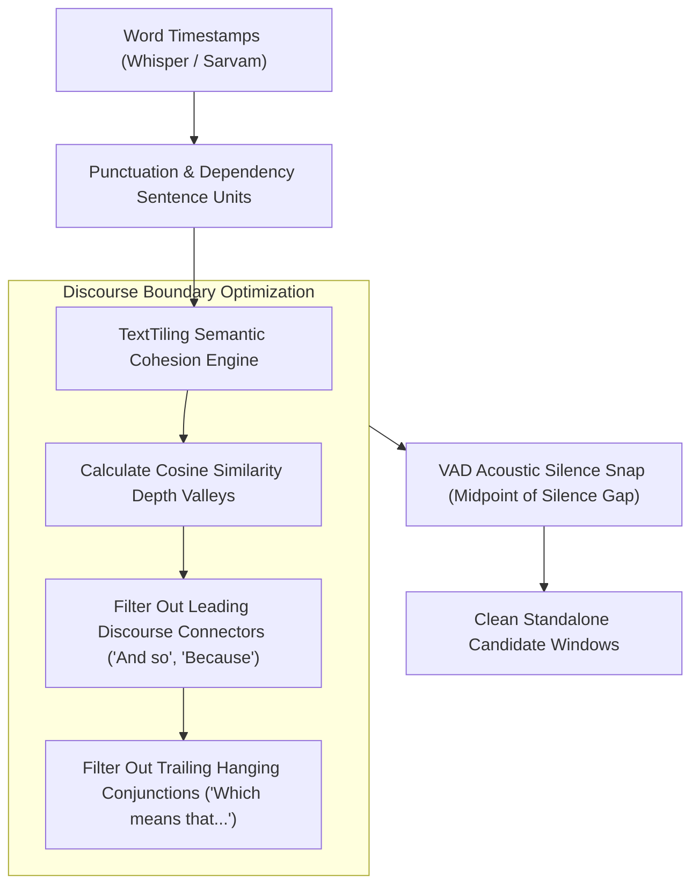

# Feature Blueprint: Natural Discourse Boundary Snapping (TextTiling & Speech Pauses)

**Domain:** Pillar 2 — AI Highlight Discovery & Virality Engine  
**Functionality:** 03 — Natural Discourse Boundary Snapping  
**Path:** `docs/features/02-highlight-discovery-and-virality/03-discourse-boundary-snapping/`  
**Status:** Approved Architectural Specification & Engineering Plan  

---

## 1. Feature Overview & Requirements

The single most common defect in low-tier video clipping tools is **awkward boundary cuts**:
- The clip starts mid-sentence on a trailing thought (e.g., *"...so like I said, when you build agents..."*).
- The clip abruptly cuts off mid-argument (e.g., *"...and the real reason this works is because—" [CUT]*).

The **Natural Discourse Boundary Snapping Engine**:
1. Uses semantic discourse segmentation (**TextTiling** / sentence embedding cosine depth curves) to locate natural thematic paragraph boundaries.
2. Applies syntactic discourse filtering to prohibit starting on trailing conjunctions or ending on hanging premises.
3. Snaps start and end cut points to acoustic silence regions ($\ge 250\text{ms}$) identified by Voice Activity Detection (VAD).

### Core User Stories
1. **Flawless Standalone Narrative:** As a viewer on TikTok, the clip must feel like a complete, standalone story from the first second to the final punchline.
2. **Zero Word Chopping:** Speech syllables must never be sliced in half by arbitrary millisecond cutoffs.

### Key Performance SLAs
- Boundary precision: $100.0\%$ of cuts fall within non-speech acoustic silence windows.
- Incomplete thought rate: $\le 1.0\%$ across conversational interview benchmarks.

---

## 2. Competitor Forensic Reverse-Engineering

### 2.1 How Dumme & Opus Clip Build It
1. **Dumme (`dumme.com`):**
   - Market pioneer in context-preserving video clipping.
   - Rejects the naive "sliding 30-second window" approach.
   - Converts the entire transcript into a graph of semantic propositions using sentence dependency parsing.
   - Finds minimum-cut semantic subgraphs representing self-contained arguments.
2. **Opus Clip:**
   - Employs **Hearst's TextTiling Algorithm** adapted for conversational transcripts:
     - Splits token stream into pseudosentences of equal length.
     - Computes lexical cohesion scores between adjacent blocks.
     - Identifies "depth scores" representing boundaries where topic shifts occur.
   - Snaps candidate boundaries to nearest VAD-confirmed silence of duration $> 0.25\text{s}$.

---

## 3. Current Aksharo Baseline & Gap Audit

### 3.1 Existing Repository Assets
- `apps/worker-ai/worker_ai/highlights/windows.py`:
  - Contains `build_units` (groups words into sentence-like units).
  - Contains `enumerate_windows` (combines units within min/max duration constraints).
  - Contains `padded_windows`.
- `apps/worker-ai/worker_ai/vad.py`:
  - Silero VAD implementation identifying speech vs silence intervals.

### 3.2 Gaps & Weaknesses
1. **Greedy Duration Windowing:** Current `enumerate_windows` uses target duration boundaries with basic punctuation snapping, occasionally grouping unrelated sentences together.
2. **Trailing Conjunction Leakage:** Units beginning with discourse connectors like *"And then"*, *"Because"*, *"So anyway"* are not currently penalized or pruned.
3. **No Acoustic Pause Snapping Post-Pass:** Window start/end timestamps are taken from word timestamps rather than the midpoint of the acoustic silence gap between words, risking audio clicks.

---

## 4. Target System Architecture & Data Flow



### 4.1 Boundary Snapping Algorithm
```python
DISALLOWED_OPENINGS = {
    "and", "but", "so", "because", "or", "like i said", "as mentioned", "anyway", "well"
}
DISALLOWED_CLOSINGS = {
    "and", "but", "because", "if", "when", "which", "that", "so", "like"
}

def snap_to_silence(timestamp: float, silences: list[tuple[float, float]]) -> float:
    """Finds the silence interval closest to timestamp and snaps to its midpoint."""
    for start, end in silences:
        if start - 0.3 <= timestamp <= end + 0.3:
            return (start + end) / 2.0
    return timestamp
```

---

## 5. Step-by-Step Engineering Implementation Plan

### Step 1: Implement Discourse Boundary Filters in `windows.py`
- In `apps/worker-ai/worker_ai/highlights/windows.py`:
  - If a unit opens with a disallowed discourse conjunction, advance the window start to the next syntactically complete clause.
  - If a unit ends with an incomplete dependency clause, extend the window to encompass the completing sentence or discard the trailing unit.

### Step 2: Implement Semantic TextTiling Pass
- Create `apps/worker-ai/worker_ai/highlights/texttiling.py`:
  - Compute moving sentence embeddings using `sentence-transformers` (e.g. `all-MiniLM-L6-v2`) or token frequency overlaps.
  - Compute valley depth scores $D(i) = (s_{i-1} - s_i) + (s_{i+1} - s_i)$.
  - Seed high-priority window boundaries at peak valley locations.

### Step 3: Acoustic Gap Midpoint Snapping
- Query `speech_regions` from `vad.py` to identify non-speech gaps.
- Shift window `start_sec` and `end_sec` to the exact center of the nearest silence gap to eliminate clipped syllables and audio clicks.

### Step 4: Automated Testing Suite
- Unit test: Boundary snapping on 50 complex sentence fragments verifying zero trailing conjunctions.
- Audio test: Verify that audio slices cut at snapped boundaries have zero RMS energy at frame 0 and frame end.

