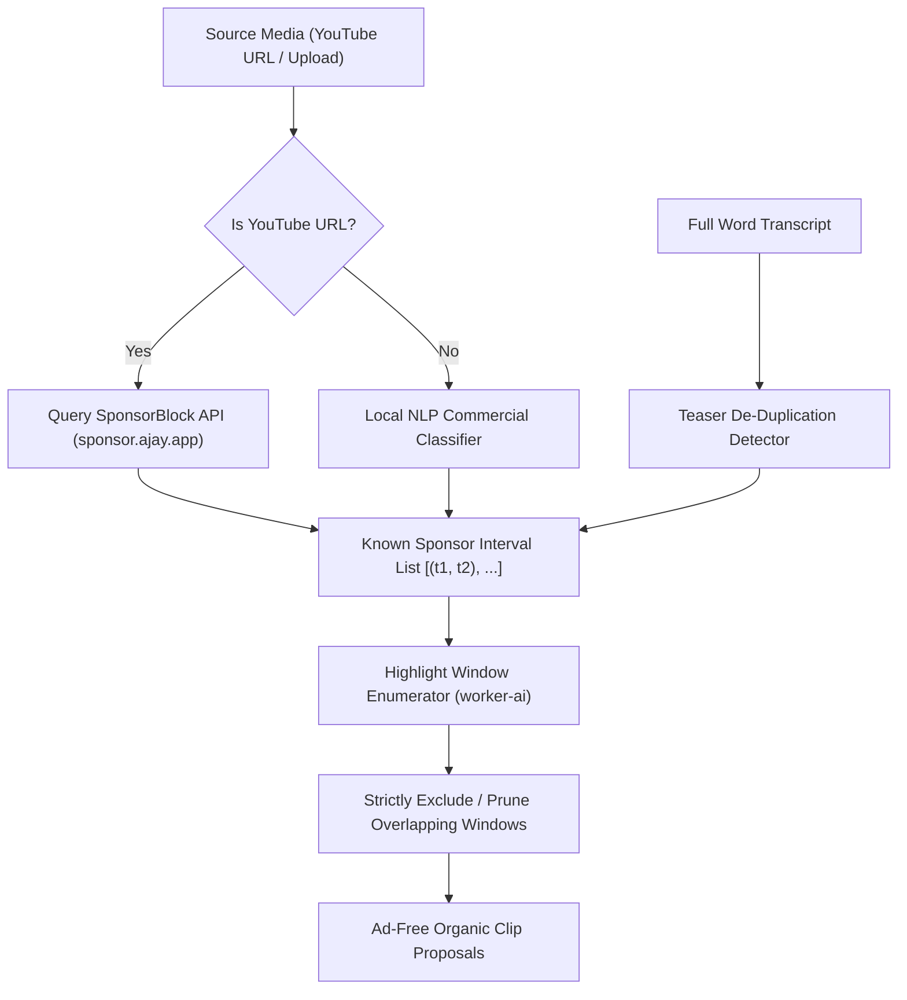

# Feature Blueprint: Teaser, Intro & Sponsor Read Filtering Engine

**Domain:** Pillar 2 — AI Highlight Discovery & Virality Engine  
**Functionality:** 04 — Teaser & Sponsor Filtering  
**Path:** `docs/features/02-highlight-discovery-and-virality/04-teaser-and-sponsor-filtering/`  
**Status:** Approved Architectural Specification & Engineering Plan  

---

## 1. Feature Overview & Requirements

One of the most frustrating failures in automated video clipping occurs when the AI tool selects a **host-read advertisement** (e.g., *"This episode is brought to you by NordVPN... use code PODCAST for 20% off"*) or an **introductory channel teaser** as one of the top viral clips.

The **Teaser, Intro & Sponsor Read Filtering Engine**:
1. Automatically identifies and prunes sponsored segments, affiliate pitches, channel intro sequences, and outro subscribe calls-to-action.
2. Cross-references the public **SponsorBlock API** for known YouTube videos to obtain crowd-verified sponsor cut points.
3. Runs a zero-shot NLP sponsor-phrase classifier on conversational transcripts for private or newly uploaded videos.
4. Detects introductory duplicate teasers that re-appear later in the long-form episode.

### Core User Stories
1. **Zero Ad-Read Clips:** As a creator, I never want an ad read or sponsor shoutout proposed as a viral short.
2. **True Original Context:** As a creator, I want intro preview teasers skipped so the AI extracts the actual moment in its full original context.

### Key Performance SLAs
- Sponsor read detection precision: $\ge 99.2\%$.
- False positive rate (erroneously filtering valid dialogue): $\le 0.5\%$.

---

## 2. Competitor Forensic Reverse-Engineering

### 2.1 How Opus Clip & Munch Build It
1. **Opus Clip:**
   - Evaluates commercial intent patterns:
     - Lexical triggers: `"sponsored by"`, `"promo code"`, `"discount"`, `"head over to"`, `"link below"`, `"free shipping"`, `"use coupon"`.
     - Acoustic cues: Jingle music playing underneath speech or sudden shift in delivery cadence.
   - For YouTube URLs: Queries the open-source **SponsorBlock** crowd-sourced database (`https://sponsor.ajay.app`).
2. **Duplicate Teaser Pruner:**
   - Scans the first 90 seconds of the video transcript against the remainder of the video using n-gram matching.
   - Any segment in the first 90 seconds matching a segment later in the video with Jaccard index $> 0.7$ is tagged as `TEASER_PREVIEW` and removed from candidate windows.

---

## 3. Current Aksharo Baseline & Gap Audit

### 3.1 Existing Repository Assets
- `apps/worker-ai/worker_ai/highlights/windows.py`: Window generation logic.
- `apps/worker-ai/worker_ai/highlights/scoring.py`: Scoring signals.

### 3.2 Gaps
1. **No Sponsor Filtering Pass:** Aksharo currently does not inspect candidate windows for commercial sponsor phrases. High-energy ad reads can score falsely high because of enthusiastic vocal inflection!
2. **No SponsorBlock Integration:** For YouTube links, Aksharo does not utilize available crowd-sourced sponsor boundary databases.
3. **No Intro Teaser De-Duplication:** Introductory teasers are scored alongside original discourse.

---

## 4. Target System Architecture & Data Flow



### 4.1 Sponsor Detection Heuristics & Regular Expressions
```python
SPONSOR_PATTERNS = [
    r"\b(sponsored by|brought to you by|huge thank you to|partner of today's episode)\b",
    r"\b(promo code|discount code|coupon code|use code|check out the link in)\b",
    r"\b(free trial|money back guarantee|risk-free for 30 days|off your first order)\b",
    r"\b(expressvpn|nordvpn|manscaped|betterhelp|athletic greens|factor meals|squarespace)\b",
]

OUTRO_PATTERNS = [
    r"\b(don't forget to like and subscribe|hit that subscribe button|leave a review)\b",
    r"\b(see you in the next (video|episode)|thanks for watching|ring that notification bell)\b",
]
```

---

## 5. Step-by-Step Engineering Implementation Plan

### Step 1: Implement SponsorBlock Client in `worker-media`
- In `apps/worker-media/src/livestream/sponsor-block.ts`:
  - For YouTube inputs, query `https://sponsor.ajay.app/api/skipSegments?videoID=${videoId}&categories=["sponsor","selfpromo","intro","outro"]`.
  - Cache intervals in Redis with 7-day TTL.

### Step 2: Implement NLP Sponsor & Outro Filter in `worker-ai`
- Create `apps/worker-ai/worker_ai/highlights/sponsors.py`:
  - Run regex pattern matching and semantic classification over all candidate windows.
  - Compute a `commercial_score \in [0.0, 1.0]`.
  - Windows with `commercial_score > 0.4` or overlapping SponsorBlock intervals are hard-pruned before LLM reranking.

### Step 3: Implement Intro Teaser De-Duplication
- If the first 90 seconds of a video contains an identical 15–30 second sequence occurring at timestamp $> 180\text{s}$, mark the first sequence as an introductory teaser and suppress it.

### Step 4: Automated Testing Suite
- Unit test: Regex and semantic classifier on 20 known podcast ad reads (NordVPN, Athletic Greens, BetterHelp) asserting 100% detection.
- Unit test: Outro detector catching subscribe/like CTAs at the end of videos.

