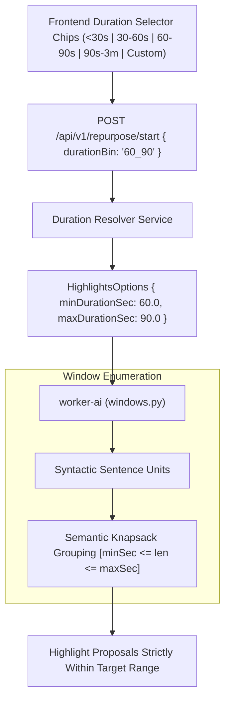

# Feature Blueprint: Target Duration Customization & Intelligent Binning

**Domain:** Pillar 2 — AI Highlight Discovery & Virality Engine  
**Functionality:** 05 — Target Duration Customization  
**Path:** `docs/features/02-highlight-discovery-and-virality/05-target-duration-binning/`  
**Status:** Approved Architectural Specification & Engineering Plan  

---

## 1. Feature Overview & Requirements

Different social media algorithms and creator monetization programs require vastly different video durations:
- **TikTok Creator Rewards Program:** Clips must be strictly $\ge 60.1\text{ seconds}$ to qualify for CPM monetization.
- **YouTube Shorts:** Highest completion rates occur between $30–50\text{ seconds}$.
- **Instagram Reels:** Short loops ($15–30\text{ seconds}$) maximize replay algorithms.
- **LinkedIn & X Video:** In-depth professional breakdowns ($90\text{s}–3\text{m}$) perform best for thought leadership.

The **Target Duration Customization & Intelligent Binning Engine**:
1. Allows creators to select explicit duration bins: `< 30s`, `30s–60s`, `60s–90s`, `90s–3m`, or a custom range (e.g., `45s–75s`).
2. Constrains candidate window generation to these bounds while preserving semantic complete thoughts.
3. Automatically warns creators if a platform target cannot be monetized (e.g. "Clips $< 60s$ are not eligible for TikTok Rewards").

### Core User Stories
1. **TikTok Creator Rewards Optimization:** As a creator monetizing on TikTok, I want to filter clips for $\ge 60\text{s}$ so every generated short earns ad revenue.
2. **Short Punchy Reels:** As a brand marketer, I want clips under $30\text{s}$ for rapid Instagram Reels deployment.

### Key Performance SLAs
- Duration boundary compliance: $100.0\%$ of generated clips satisfy user-specified duration bounds.
- Semantic integrity: Zero clips cut prematurely to meet artificial time caps.

---

## 2. Competitor Forensic Reverse-Engineering

### 2.1 How Opus Clip & Klap Build It
1. **Opus Clip:**
   - In the submission drawer, users pick one of 4 duration chips: `< 30s`, `30s–60s`, `60s–90s`, `90s–3m` (or "Auto").
   - When "Auto" is picked, Opus uses an entropy-based density selector: high-information dense videos get 30–60s, while slow narrative podcasts get 60–90s.
2. **Klap:**
   - Provides a dual-slider UI control: `Min Duration` (e.g. 20s) and `Max Duration` (e.g. 60s).

---

## 3. Current Aksharo Baseline & Gap Audit

### 3.1 Existing Repository Assets
- `apps/worker-ai/worker_ai/highlights/contracts.py`:
  - `HighlightsOptions` contains optional `minDuration` and `maxDuration`.
- `apps/worker-ai/worker_ai/highlights/windows.py`:
  - Uses hardcoded default durations (typically 15s to 90s) when options are omitted.

### 3.2 Gaps
1. **No UI Duration Selector in `apps/web`:** The frontend repurpose modal currently lacks a duration picker, forcing all runs to use backend default ranges.
2. **No TikTok Monetization Mode Preset:** No pre-configured 60s+ preset matching TikTok creator monetization guidelines.

---

## 4. Target System Architecture & Data Flow



### 4.1 Preset Duration Bins
```typescript
export const DURATION_BINS = {
  UNDER_30: { minSec: 15, maxSec: 30, label: "< 30s (Rapid Loops)" },
  BETWEEN_30_60: { minSec: 30, maxSec: 60, label: "30s–60s (Shorts & Reels)" },
  BETWEEN_60_90: { minSec: 60, maxSec: 90, label: "60s–90s (TikTok Monetization)" },
  BETWEEN_90_180: { minSec: 90, maxSec: 180, label: "90s–3m (Deep Dives & LinkedIn)" },
  AUTO: { minSec: 20, maxSec: 90, label: "AI Recommended" },
} as const;
```

---

## 5. Step-by-Step Engineering Implementation Plan

### Step 1: Update API Contract & Validation
- In `packages/repurpose-contracts/src/schema.ts`, define `DurationBinSchema`.
- Validate `0 < minDurationSec < maxDurationSec <= 300`.

### Step 2: Implement Semantic Knapsack in `windows.py`
- In `apps/worker-ai/worker_ai/highlights/windows.py`:
  - Enforce strict filtering: discard any window whose total duration after acoustic pause snapping falls outside `[minDurationSec, maxDurationSec]`.

### Step 3: Frontend Duration Chips in `apps/web`
- In `apps/web/components/repurpose/duration-picker.tsx`:
  - Render selectable duration chips with helper badges (e.g., `"TikTok Monetization Eligible"` for $\ge 60\text{s}$).

### Step 4: Automated Testing Suite
- Unit test: Window generation verifying zero proposals violate specified duration bounds.

