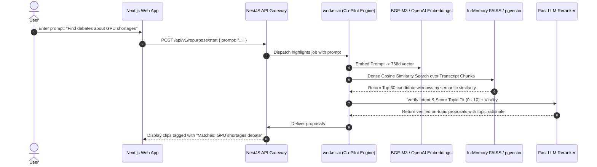

# Feature Blueprint: AI Co-Pilot & Natural Language Prompt-Based Clipping

**Domain:** Pillar 2 — AI Highlight Discovery & Virality Engine  
**Functionality:** 06 — Topic & Prompt-Based Co-Pilot  
**Path:** `docs/features/02-highlight-discovery-and-virality/06-topic-prompt-copilot/`  
**Status:** Approved Architectural Specification & Engineering Plan  

---

## 1. Feature Overview & Requirements

While generic highlight discovery extracts the overall highest-scoring moments of an episode, creators frequently have **targeted editorial intentions**:
- *"Extract only the moments where the guest talks about AI agent architectures."*
- *"Find all actionable advice for first-time founders."*
- *"Show me funny banter and jokes between the hosts."*
- *"Clip the heated debate about remote work productivity."*

The **AI Co-Pilot & Prompt-Based Clipping Engine**:
1. Accepts free-form natural language directives from the creator.
2. Converts the prompt into semantic vector embeddings and structured intent queries.
3. Retrieves and ranks moments matching the specific topic, filtering out off-topic discourse while maintaining high virality standards.

### Core User Stories
1. **Targeted Topic Extraction:** As a tech podcaster, I want to type *"Find moments explaining vector databases"* and receive only clips discussing vector search, discarding everything else.
2. **Humor / Energy Mode:** As a comedy channel editor, I want to prompt *"Find the funniest moments"* and have the system prioritize laughter spikes and punchlines.

### Key Performance SLAs
- Topic retrieval latency: $\le 4.5\text{ seconds}$ over a 90-minute transcript.
- Topic precision: $\ge 94\%$ of returned clips directly address the prompt.

---

## 2. Competitor Forensic Reverse-Engineering

### 2.1 How Opus Clip (AI Co-Pilot) & Descript (Underlord) Build It
1. **Opus Clip AI Co-Pilot:**
   - Provides a text prompt input box: *"What kind of clips are you looking for?"*
   - Passes the prompt to their reranker LLM alongside candidate window transcripts.
   - Evaluates `topic_fit_score \in [0.0, 1.0]`. If `topic_fit_score < 0.70`, the window is discarded regardless of virality score.
2. **Descript Underlord:**
   - Computes dense vector embeddings of every transcript paragraph using OpenAI or local embeddings.
   - Runs Approximate Nearest Neighbor (ANN) search over embeddings to surface top semantic matches, then applies conversational filtering.

---

## 3. Current Aksharo Baseline & Gap Audit

### 3.1 Existing Repository Assets
- `apps/worker-ai/worker_ai/highlights/rerank.py`:
  - Contains `TOPIC_FIT_FLOOR = 0.70`.
  - Accepts `topic` in options and includes topic relevance criteria in LLM prompts!
- `apps/worker-ai/worker_ai/highlights/contracts.py`:
  - `HighlightsOptions` has `topic: Optional[str]`.

### 3.2 Gaps
1. **No Dense Vector Pre-Filter:** When a video has 400 candidate windows, Aksharo currently filters by heuristic before sending windows to the LLM. If the heuristic picks windows that happen to be off-topic, on-topic windows may be dropped before the LLM ever sees them!
2. **No Frontend Prompt Input Box:** `apps/web` does not yet expose a prominent natural language prompt bar in the repurpose flow.

---

## 4. Target System Architecture & Data Flow

---

## 5. Step-by-Step Engineering Implementation Plan

### Step 1: Implement Dense Vector Semantic Retrieval in `worker-ai`
- In `apps/worker-ai/worker_ai/highlights/topic_search.py`:
  - Embed transcript sentence units using local ONNX `bge-small-en-v1.5` or `text-embedding-3-small`.
  - Embed user query.
  - Calculate cosine similarity: $\cos(\mathbf{q}, \mathbf{u}) = \frac{\mathbf{q} \cdot \mathbf{u}}{\|\mathbf{q}\| \|\mathbf{u}\|}$.
  - Pre-filter windows so that at least $70\%$ of the candidates sent to the LLM reranker have high semantic similarity to the prompt.

### Step 2: Strict Topic Floor in `rerank.py`
- In `apps/worker-ai/worker_ai/highlights/rerank.py`:
  - When `topic` is present, evaluate whether the clip directly addresses the prompt.
  - If `topic_fit < TOPIC_FIT_FLOOR`, hard-drop the candidate and log the drop reason.

### Step 3: Frontend Co-Pilot Prompt Interface in `apps/web`
- In `apps/web/components/repurpose/copilot-bar.tsx`:
  - Add natural language search bar with suggestion chips:
    - *"Actionable Tips"*, *"Controversial Takes"*, *"Funny Moments"*, *"Key Metrics & Numbers"*.

### Step 4: Automated Testing Suite
- Unit test: Search query "crypto crash" on 60-minute business podcast verifying only crypto-related segments are returned.

