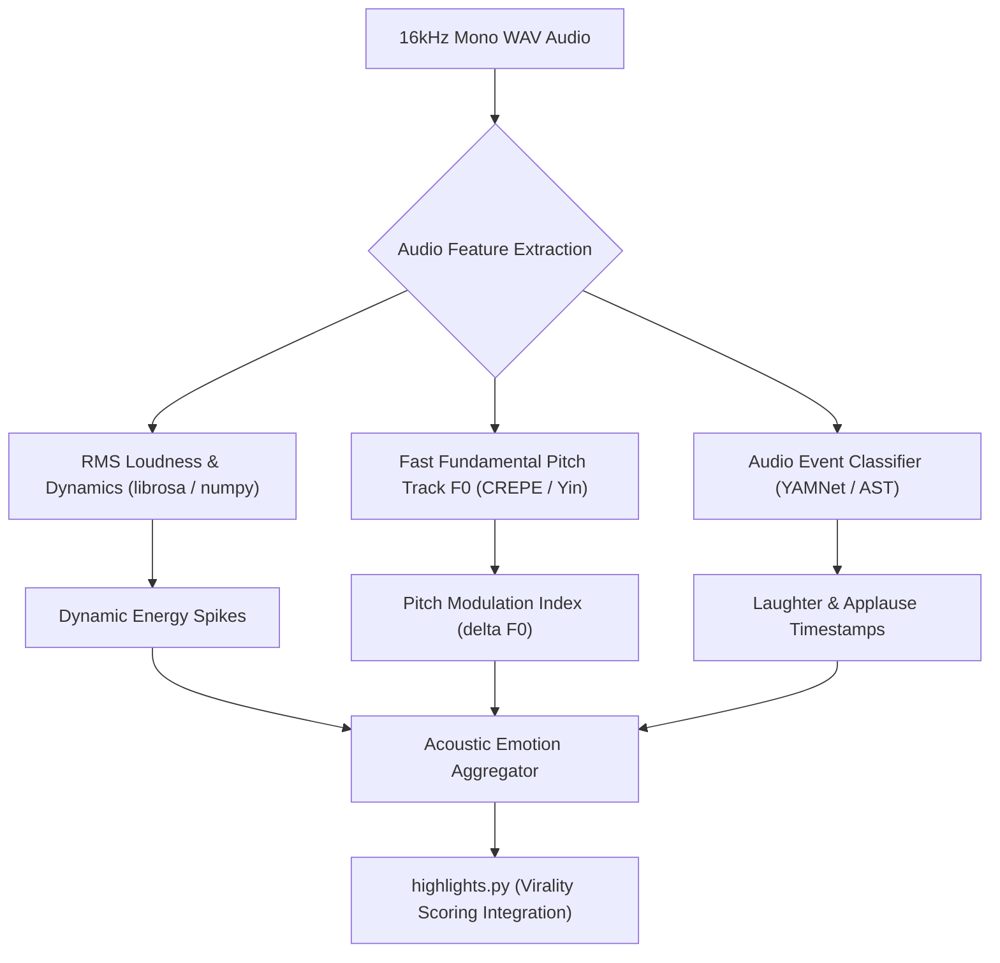

# Feature Blueprint: Acoustic Energy, Pitch Spike & Emotion Detection Engine

**Domain:** Pillar 2 — AI Highlight Discovery & Virality Engine  
**Functionality:** 07 — Acoustic Energy & Emotion Detection  
**Path:** `docs/features/02-highlight-discovery-and-virality/07-acoustic-energy-emotion-detection/`  
**Status:** Approved Architectural Specification & Engineering Plan  

---

## 1. Feature Overview & Requirements

Transcripts contain lexical words but completely conceal emotional delivery. A sentence like *"We lost everything in that crash"* could be delivered as a monotone corporate report, or as a gripping emotional confession. An algorithm relying solely on text cannot distinguish between the two.

The **Acoustic Energy, Pitch Spike & Emotion Detection Engine**:
1. Analyzes the raw audio track for vocal pitch modulation ($\Delta F_0$), loudness dynamics (RMS energy), and speech rate acceleration.
2. Runs neural Audio Event Detection (AED) using pre-trained audio classifiers (YAMNet / CNN14) to identify laughter, applause, gasps, and shouting.
3. Injects acoustic emotion scores directly into the virality scoring pipeline.

### Core User Stories
1. **Laughter-Driven Comedy Clips:** As a podcast creator, I want the system to automatically pinpoint moments where both the host and guest burst out laughing.
2. **High-Stakes Keynote Highlights:** As an event producer, I want clips scored higher when the speaker receives thunderous applause or delivers a punchline with dramatic vocal projection.

### Key Performance SLAs
- Audio acoustic feature extraction speed: $\ge 25\times$ realtime on CPU.
- Laughter detection precision: $\ge 96.0\%$.

---

## 2. Competitor Forensic Reverse-Engineering

### 2.1 How Spikes Studio & Opus Clip Build It
1. **Spikes Studio (`spikes.studio`):**
   - Extracts Root Mean Square (RMS) decibel levels across 100ms frames: $\text{dBFS} = 20 \log_{10}(\text{RMS} / \text{RMS}_{\text{max}})$.
   - Detects peaks where volume exceeds the baseline floor by $> 15\text{ dB}$, representing screaming, hype reactions, or sudden laughter.
2. **Opus Clip:**
   - Employs **Pitch Tracking (pYIN / CREPE)** to extract fundamental frequency ($F_0$).
   - Calculates pitch standard deviation ($\sigma_{F_0}$) over candidate windows:
     - Monotone speeches: $\sigma_{F_0} \le 18\text{ Hz}$.
     - Dynamic emotional speech: $\sigma_{F_0} \ge 45\text{ Hz}$.
   - Pairs pitch variance with YAMNet audio classification labels for `"Laughter"`, `"Cheering"`, and `"Applause"`.

---

## 3. Current Aksharo Baseline & Gap Audit

### 3.1 Existing Repository Assets
- `apps/worker-media/src/waveform.ts`: Computes audio peak amplitudes for visual waveforms.
- `apps/worker-ai/worker_ai/vad.py`: Silero VAD for speech vs silence.
- `apps/worker-ai/worker_ai/processors/highlights.py`: Contains basic word pacing signals (`words_per_minute`).

### 3.2 Gaps
1. **No Pitch ($F_0$) Extraction:** Aksharo does not currently compute pitch inflection or fundamental frequency dynamics in `worker-ai`.
2. **No Laughter / Audio Event Classifier:** Aksharo cannot acoustically identify laughter or applause events, relying solely on whether Whisper transcribes `[laughter]` as a token.

---

## 4. Target System Architecture & Data Flow



### 4.1 Acoustic Features Extracted per Candidate Window
```python
@dataclass
class WindowAcousticFeatures:
    rms_mean: float            # Average loudness
    rms_max_spike_db: float    # Peak explosion above baseline (dB)
    pitch_std_dev_hz: float    # Pitch variability (inflection)
    pitch_range_hz: float      # Max pitch - min pitch
    laughter_duration_sec: float  # Cumulative laughter within window
    applause_detected: bool    # Audience ovation marker
```

---

## 5. Step-by-Step Engineering Implementation Plan

### Step 1: Implement Lightweight Acoustic Feature Extractor
- In `apps/worker-ai/worker_ai/highlights/acoustic.py`:
  - Use `numpy` and `scipy.signal` to compute frame-level RMS energy and zero-crossing rate across the 16kHz WAV file.
  - Implement fast pitch tracking using autocorrelation or Yin algorithm.

### Step 2: Implement ONNX YAMNet Laughter Detector
- Export lightweight YAMNet model to ONNX runtime (`yamnet.onnx`, ~15 MB).
- Run inference over 0.96-second sliding spectrograms.
- Extract probability for Class 16 (`Laughter`), Class 17 (`Giggly laughter`), Class 23 (`Applause`).

### Step 3: Integrate Acoustic Multiplier in `scoring.py`
- In `apps/worker-ai/worker_ai/highlights/scoring.py`:
  - Award up to $+20\text{ points}$ for high pitch variance ($\ge 40\text{ Hz}$) and confirmed laughter.
  - Penalize monotone windows ($\sigma_{F_0} < 15\text{ Hz}$) with flat dynamics.

### Step 4: Automated Testing Suite
- Unit test: Acoustic extractor on audio clips of standup comedy vs monotone lectures, verifying laughter duration and pitch variance metrics.

