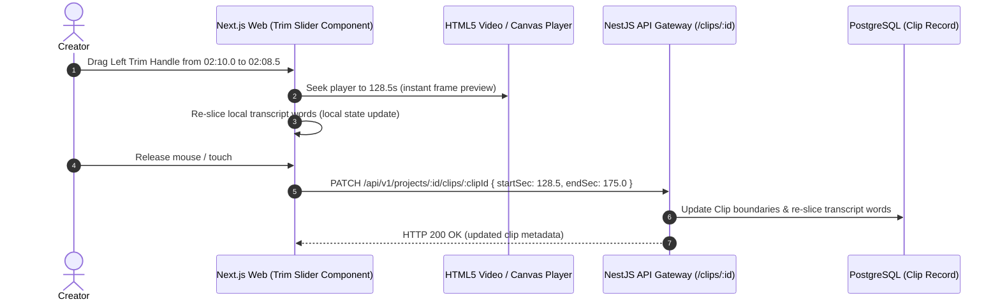

# Feature Blueprint: Manual Timestamp Selection & Frame-Accurate Boundary Trimming

**Domain:** Pillar 2 — AI Highlight Discovery & Virality Engine  
**Functionality:** 08 — Manual Timestamp Controls  
**Path:** `docs/features/02-highlight-discovery-and-virality/08-manual-timestamp-controls/`  
**Status:** Approved Architectural Specification & Engineering Plan  

---

## 1. Feature Overview & Requirements

While AI automated discovery identifies high-potential segments, human video editors frequently want **fine-grained editorial control**:
- Shift the start point 2.0 seconds earlier to catch the speaker's facial reaction.
- Extend the clip end by 3.5 seconds to let the punchline resonate.
- Manually create a brand-new clip by specifying exact start and end timestamps (e.g. `04:15.000` to `05:02.500`) without running full AI discovery.

The **Manual Timestamp Selection & Boundary Trimming Engine**:
1. Provides frame-accurate draggable trim handles over visual waveforms and filmstrip sprites.
2. Re-slices underlying word transcripts and kinetic subtitle animations in real time without requiring re-transcription.
3. Allows instant manual moment creation by timecode input.

### Core User Stories
1. **Interactive Trim Handles:** As an editor, I want to drag start and end handles on the waveform and see the video frame update instantaneously so I can dial in the cut point down to the exact frame.
2. **Instant Transcript Word Re-Slicing:** When I adjust a clip boundary, subtitle lines and word timings must automatically adapt to the new range with zero delay.
3. **Add Moment by Timecode:** If the AI missed a specific segment I know exists at minute 14, I want to type `14:00` to `14:45` and generate a clip immediately.

### Key Performance SLAs
- Frontend scrubber update latency: $\le 16\text{ ms}$ (60 fps frame seek).
- Backend re-slice & API response time: $\le 150\text{ ms}$.

---

## 2. Competitor Forensic Reverse-Engineering

### 2.1 How Klap & Choppity Build It
1. **Klap (`klap.app`):**
   - Clip detail view includes an interactive waveform bar with dual boundary thumbs.
   - Snapping guides: Thumbs magnetically snap (with 8px deadband) to the nearest word boundary or sentence boundary, with a modifier key (`Shift` or `Alt`) to bypass snapping for free-form frame trimming.
   - When thumbs are moved, the client sends `PATCH /clips/{id}` with new `start` and `end`. The server updates the clip's boundary and re-slices cached transcript words.
2. **Choppity (`choppity.com`):**
   - Features text-linked timeline: dragging the timestamp updates highlighted words in the transcript, and selecting words in the transcript shifts the timeline handles.

---

## 3. Current Aksharo Baseline & Gap Audit

### 3.1 Existing Repository Assets
- `apps/worker-media/src/processors/clip.ts`: Cuts video mezzanines based on `startSec` and `endSec`.
- `apps/api/src/projects`: Contains project and clip data structures.
- `apps/worker-media/src/filmstrip.ts`: Generates WebP sprite sheets for timeline scrubbing.

### 3.2 Gaps
1. **No Interactive Trimmer Component:** In `apps/web`, creators currently have limited ability to drag start/end handles with frame-accurate video scrubbing.
2. **Word Re-Slicing Utility:** Aksharo lacks a dedicated fast client/server helper to recalculate word start offsets and line breaks when clip boundaries change.

---

## 4. Target System Architecture & Data Flow



### 4.1 Schema Additions (`packages/db/prisma/schema.prisma`)
```prisma
// Extension to Clip record in schema.prisma:
// isManualOverride Boolean  @default(false)
// manualStartSec   Float?
// manualEndSec     Float?
```

---

## 5. Step-by-Step Engineering Implementation Plan

### Step 1: Implement Word Re-Slicing Function in Shared Package
- In `packages/shared/src/transcript-slice.ts`:
  ```typescript
  export function sliceTranscriptWords(
    allWords: readonly TimedWord[],
    startSec: number,
    endSec: number
  ): TimedWord[] {
    return allWords
      .filter((w) => w.end >= startSec && w.start <= endSec)
      .map((w) => ({
        ...w,
        clipRelativeStart: Math.max(0, w.start - startSec),
        clipRelativeEnd: Math.max(0, w.end - startSec),
      }));
  }
  ```

### Step 2: Build Timeline Trim Handle Component in `apps/web`
- In `apps/web/components/editor/timeline-trimmer.tsx`:
  - Dual slider with left/right handles over waveform canvas.
  - Implement magnetic snapping to word boundaries within $\pm 0.2\text{s}$.
  - Support `Shift` drag to disable snapping and trim down to 1/30th second frame precision.

### Step 3: Implement Clip Boundary Update Controller in `apps/api`
- Create `PATCH /api/v1/projects/:id/clips/:clipId/trim`:
  - Validates `0 <= startSec < endSec <= videoDurationSec`.
  - Updates clip entity and invalidates cached preview renders.

### Step 4: Automated Testing Suite
- Unit test: `sliceTranscriptWords` across edge cases (words spanning boundary, negative offsets).
- E2E test: Simulating trim handle drag and verifying updated clip payload.

