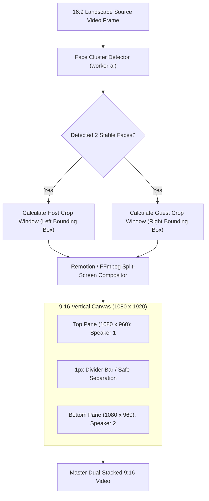

# Feature Blueprint: Two-Speaker Vertical Split-Screen Layout Engine

**Domain:** Pillar 3 — Visual Framing & Multi-Speaker Layout Engine  
**Functionality:** 02 — Two-Speaker Split Screen  
**Path:** `docs/features/03-visual-framing-and-layouts/02-two-speaker-split-screen/`  
**Status:** Approved Architectural Specification & Engineering Plan  

---

## 1. Feature Overview & Requirements

In conversational podcasts, interviews, and debates filmed in widescreen 16:9, two speakers frequently sit side-by-side or occupy opposite sides of the frame. Cropping only the single active speaker creates an awkward ping-pong back-and-forth camera whip and destroys the viewer's ability to see the non-speaking person's facial reactions.

The **Two-Speaker Vertical Split-Screen Layout Engine**:
1. Automatically detects when two primary speakers are present in the source frame.
2. Crops each speaker into an optimized frame and stacks them vertically (Top Pane: Host / Speaker 1; Bottom Pane: Guest / Speaker 2) inside a 9:16 vertical canvas.
3. Renders a polished aesthetic divider line with optional dynamic speaker activity halos.
4. Intelligently alternates between split-screen during rapid dialogue and solo full-screen during extended monologues.

### Core User Stories
1. **Reaction Engagement:** As a podcast producer, I want the split-screen layout to show the guest laughing at the host's joke even while the host is speaking.
2. **Automated Detection:** As a creator, I want Aksharo to automatically recognize two-speaker interviews and apply the split layout without requiring manual crop configuration.

### Key Performance SLAs
- Layout classification accuracy: $\ge 98.0\%$ for two-person interview setups.
- Compositing render overhead: $\le 10\%$ increase in render time compared to single-frame cropping.

---

## 2. Competitor Forensic Reverse-Engineering

### 2.1 How Opus Clip & Vizard.ai Build It
1. **Opus Clip:**
   - Detects two distinct stable face clusters across the video duration.
   - Computes fixed bounding boxes for Person A ($x \approx 0.25$) and Person B ($x \approx 0.75$).
   - Generates a vertical split Remotion composition:
     - Upper pane: Source video cropped to Person A, scaled to fill $1080 \times 960\text{ px}$.
     - Lower pane: Source video cropped to Person B, scaled to fill $1080 \times 960\text{ px}$.
     - Middle divider: 2px solid line (`#1A1A1A` or subtle glassmorphic blur).
   - Audio energy indicator: Subtly increases border opacity or scales the talking person by $1.02\times$ to guide viewer gaze.

---

## 3. Current Aksharo Baseline & Gap Audit

### 3.1 Existing Repository Assets
- `apps/worker-media/src/processors/clip-frame.ts`: Handles single aspect crops.
- `apps/render/src/compilation`: Video composition logic.
- `apps/worker-ai/worker_ai/processors/faces.py`: Face detection.

### 3.2 Gaps
1. **Single-Source Crop Limit in `clip-frame.ts`:** The current mezzanine cutter only extracts a single rectangular crop from the source video. It cannot slice two separate regions from the same frame simultaneously!
2. **Missing Multi-Pane Remotion Compositor:** `apps/render` does not have a pre-built `<SplitScreenLayout />` Remotion component that accepts two independent crop coordinate sets.

---

## 4. Target System Architecture & Data Flow



### 4.1 FFmpeg Filtergraph for Dual Stack
```bash
ffmpeg -i input_16x9.mp4 -filter_complex "\
  [0:v]crop=w=640:h=720:x=80:y=180,scale=1080:960[top]; \
  [0:v]crop=w=640:h=720:x=1200:y=180,scale=1080:960[bottom]; \
  [top][bottom]vstack[stacked]; \
  [stacked]drawbox=y=959:color=black@0.6:width=1080:height=2:t=fill[v] \
" -map "[v]" -map 0:a -c:v libx264 -c:a copy output_split.mp4
```

---

## 5. Step-by-Step Engineering Implementation Plan

### Step 1: Implement Dual Crop Coordinates in Contracts
- In `packages/repurpose-contracts/src/formats.ts`, define `SplitScreenConfig`:
  ```typescript
  export interface SplitScreenConfig {
    readonly enabled: boolean;
    readonly topCrop: { readonly x: number; readonly y: number; readonly width: number; readonly height: number };
    readonly bottomCrop: { readonly x: number; readonly y: number; readonly width: number; readonly height: number };
    readonly dividerColor?: string;
    readonly activeSpeakerHighlight?: boolean;
  }
  ```

### Step 2: Implement Face Clustering in `worker-ai/processors/faces.py`
- Group detected face centers across sample frames using k-means ($k=2$).
- If cluster centers are separated by $\Delta x > 0.35 \times \text{width}$, classify video as `TWO_SPEAKER_CONVERSATION`.
- Compute stable median bounding boxes for each speaker.

### Step 3: Implement Remotion Split-Screen Component in `apps/render`
- Create `apps/render/src/components/SplitScreenView.tsx`:
  - Uses two `<OffthreadVideo>` elements referencing the same source video.
  - Applies CSS clip-path and absolute positioning to lock Top and Bottom panes.
  - Places animated kinetic captions centered across the divider line or in the lower third.

### Step 4: Automated Testing Suite
- Unit test: K-means face clustering separating host and guest.
- Render test: Verifying 1080×1920 canvas output contains both speakers without aspect distortion.

