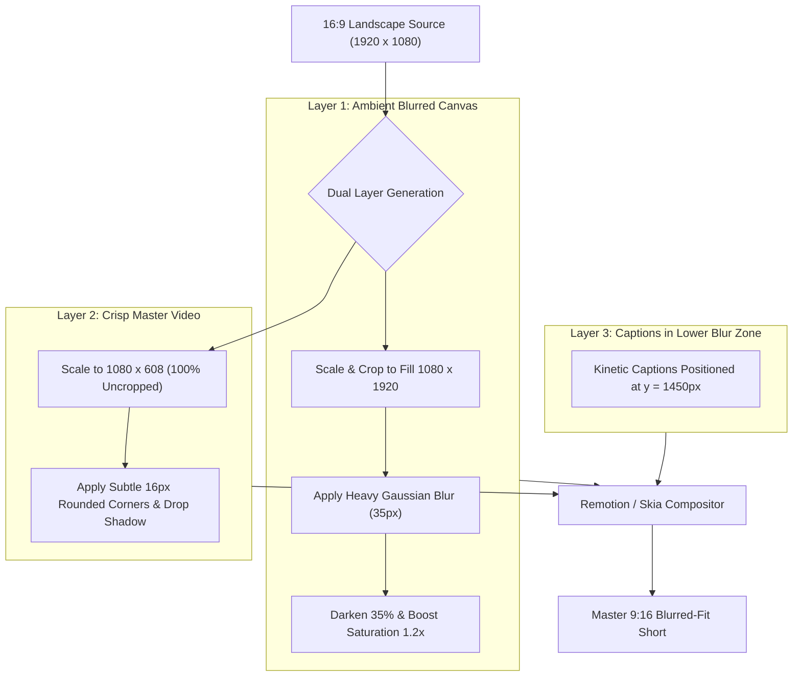

# Feature Blueprint: Blurred Background Canvas Fit (16:9 in 9:16)

**Domain:** Pillar 3 — Visual Framing & Multi-Speaker Layout Engine  
**Functionality:** 05 — Blurred Background Canvas Fit  
**Path:** `docs/features/03-visual-framing-and-layouts/05-blurred-background-fit/`  
**Status:** Approved Architectural Specification & Engineering Plan  

---

## 1. Feature Overview & Requirements

Cropping widescreen 16:9 footage into a tight 9:16 vertical window is not always desirable. In wide cinematic landscapes, movie reviews, sports plays, multi-person dance videos, and music performances, cropping removes essential context. When creators do not want a crop, standard black letterboxing (bars on top and bottom) looks amateurish and unengaging on social media feeds.

The **Blurred Background Canvas Fit Engine**:
1. Scales the original 16:9 footage to fill the entire 9:16 vertical canvas in the background layer.
2. Applies a heavy Gaussian blur ($\sigma \approx 35\text{px}$) and luminance attenuation (darkening by $35\%$) to the background.
3. Places the un-cropped, crisp 16:9 footage centered in the foreground with subtle corner rounding and shadow depth.
4. Places dynamic kinetic captions in the blurred bottom canvas area, preventing subtitle text from obscuring the main video action.

### Core User Stories
1. **Full Context Preservation:** As a sports creator, I want to show the full widescreen field play in a 9:16 reel without cropping out the ball or players.
2. **Dedicated Caption Zone:** As an editor, I want captions to sit below the widescreen video in the blurred safe zone so they never cover the subject's face.

### Key Performance SLAs
- Render efficiency: $\le 12\%$ overhead over standard 1-layer encode.
- Visual aesthetic: Zero harsh boundary artifacts between blurred backdrop and foreground.

---

## 2. Competitor Forensic Reverse-Engineering

### 2.1 How Opus Clip, Submagic & CapCut Build It
1. **Opus Clip & Submagic:**
   - Available as a layout preset: `"Fit with Blur"`.
   - Remotion / WebGL Layering:
     - `Background`: `<Video>` element scaled to `width: 'auto', height: '100%'`, centered, with CSS filter `blur(40px) brightness(0.65) saturate(1.2)`.
     - `Foreground`: `<Video>` element centered at `y: 656px` on `1080x1920` canvas.
     - `Shadow & Border`: `boxShadow: '0 25px 50px -12px rgba(0, 0, 0, 0.7)'`, `borderRadius: '16px'`.
2. **FFmpeg Filtergraph Implementation:**
   ```bash
   ffmpeg -i input_16x9.mp4 -filter_complex "\
     [0:v]scale=1080:1920:force_original_aspect_ratio=increase,crop=1080:1920,boxblur=luma_radius=35:luma_power=2,colorchannelmixer=aa=1.0:rr=0.6:gg=0.6:bb=0.6[bg]; \
     [0:v]scale=1080:608[fg]; \
     [bg][fg]overlay=x=0:y=656[v] \
   " -map "[v]" -map 0:a -c:v libx264 -preset fast output_blurred_fit.mp4
   ```

---

## 3. Current Aksharo Baseline & Gap Audit

### 3.1 Existing Repository Assets
- `docs/background-looks`: Contains documentation on background aesthetic looks!
- `apps/render/src/render`: Compositing engine.
- `apps/worker-media/src/processors/clip-frame.ts`: Contains aspect ratio definitions.

### 3.2 Gaps
1. **Missing Preset Flag in Video Processing Pipeline:** While background looks were documented in `docs/background-looks`, the active render pipeline in `apps/render/src/processors/render-video.ts` does not yet expose a simple `layout: 'BLURRED_FIT'` parameter in `RenderPayload`.

---

## 4. Target System Architecture & Data Flow



---

## 5. Step-by-Step Engineering Implementation Plan

### Step 1: Add `BLURRED_FIT` to Repurposing Contracts
- In `packages/repurpose-contracts/src/formats.ts`:
  ```typescript
  export type VideoLayoutMode = 'CROP_FACE' | 'SPLIT_TWO_SPEAKER' | 'BLURRED_FIT' | 'STREAMER_SPLIT';
  ```

### Step 2: Implement Remotion `BlurredFitView` in `apps/render`
- Create `apps/render/src/components/BlurredFitView.tsx`:
  - Renders the dual video layers with synchronized playheads.
  - Applies styling parameters (`blurRadius`, `dimOpacity`, `borderRadius`).

### Step 3: Implement FFmpeg Accelerated Fallback in `worker-media`
- In `apps/worker-media/src/ffmpeg/filtergraphs.ts`:
  - Add `buildBlurredFitFiltergraph(sourceWidth, sourceHeight, targetWidth, targetHeight)`.

### Step 4: Automated Testing Suite
- Unit test: Filtergraph string generator with aspect ratio validations.
- Render test: Verifying background blur effect renders cleanly without frame drops.

