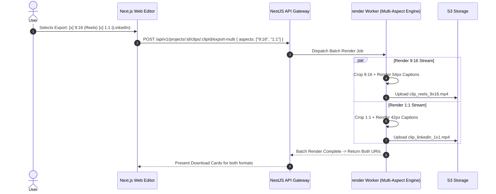

# Feature Blueprint: Multi-Aspect Ratio Engine (9:16, 1:1, 4:5, 16:9)

**Domain:** Pillar 3 — Visual Framing & Multi-Speaker Layout Engine  
**Functionality:** 06 — Multi-Aspect Ratio Variants  
**Path:** `docs/features/03-visual-framing-and-layouts/06-multiaspect-ratio-variants/`  
**Status:** Approved Architectural Specification & Engineering Plan  

---

## 1. Feature Overview & Requirements

While 9:16 vertical video dominates TikTok and Instagram Reels, omnichannel creators also distribute content across platforms with different aspect ratio requirements:
- **1:1 Square (1080×1080):** High-converting format for LinkedIn feed posts, Instagram square carousels, and X timelines.
- **4:5 Portrait (1080×1350):** Maximum vertical screen estate allowed in the standard Instagram and Facebook home feed.
- **16:9 Landscape (1920×1080):** YouTube standard clips, webinar recaps, and desktop websites.

The **Multi-Aspect Ratio Engine**:
1. Supports one-click conversion between 9:16, 1:1, 4:5, and 16:9 formats.
2. Dynamically re-centers the subject and re-scales captions and overlays for each specific target geometry.
3. Enables **Simultaneous Multi-Format Batch Export**, rendering all requested aspect ratio variants in a single render job.

### Core User Stories
1. **Omnichannel Social Delivery:** As a social media manager, I want to export a highlight in both 9:16 (for Reels) and 1:1 (for LinkedIn) with a single click.
2. **Adaptive Caption Sizing:** Captions must automatically scale and adjust their safe-zone padding so they do not overlap platform UI on square or 4:5 feeds.

### Key Performance SLAs
- Multi-aspect re-composition calculation: $\le 10\text{ ms}$.
- Simultaneous multi-format export efficiency: $2.8\times$ faster than sequential rendering.

---

## 2. Competitor Forensic Reverse-Engineering

### 2.1 How Vizard.ai & Vidyo.ai Build It
1. **Vizard.ai & Vidyo.ai:**
   - Allow users to select multiple aspect checkboxes: `[x] 9:16  [x] 1:1  [x] 4:5  [x] 16:9`.
   - Maintain a normalized coordinate space ($[0.0, 1.0] \times [0.0, 1.0]$) for face tracking and crop centers.
   - For each target aspect ratio $(W_T, H_T)$:
     - Compute crop rectangle:
       $$\text{crop\_w} = \min\left(W_{\text{src}}, \frac{H_{\text{src}} \cdot W_T}{H_T}\right), \quad \text{crop\_h} = \min\left(H_{\text{src}}, \frac{W_{\text{src}} \cdot H_T}{W_T}\right)$$
     - Center crop on normalized face position $(c_x, c_y)$, clamped to frame boundaries.
   - Scale typography font size:
     - 9:16 Canvas: Base font size $54\text{ px}$.
     - 1:1 Canvas: Base font size $42\text{ px}$.
     - 4:5 Canvas: Base font size $48\text{ px}$.

---

## 3. Current Aksharo Baseline & Gap Audit

### 3.1 Existing Repository Assets
- `apps/worker-media/src/processors/clip-frame.ts`:
  - Contains `CLIP_ASPECTS`:
    ```typescript
    export const CLIP_ASPECTS = {
      "9:16": { width: 9, height: 16 },
      "4:5": { width: 4, height: 5 },
      "1:1": { width: 1, height: 1 },
      "16:9": { width: 16, height: 9 },
    } as const;
    ```
- `apps/api/src/exports`: Export job dispatcher.

### 3.2 Gaps
1. **Single-Aspect Export Limitation:** In `schema.prisma`, `ExportJob` has `presetPlatform` but does not support queuing and rendering multiple aspect ratios in a single batch package.
2. **No Aspect Switcher in Editor Preview:** `apps/web` does not yet allow editors to switch preview canvas ratio on the fly between 9:16, 1:1, and 4:5.

---

## 4. Target System Architecture & Data Flow



---

## 5. Step-by-Step Engineering Implementation Plan

### Step 1: Multi-Aspect Batch Export Contract
- In `packages/repurpose-contracts/src/formats.ts`:
  ```typescript
  export interface MultiAspectExportPayload {
    readonly clipId: string;
    readonly targets: Array<{
      readonly aspect: '9:16' | '1:1' | '4:5' | '16:9';
      readonly resolution: '720p' | '1080p' | '4k';
    }>;
  }
  ```

### Step 2: Implement Dynamic Typography Scaling per Aspect
- In `packages/caption-styles/src/scaling.ts`:
  - Calculate proportional font size and line height based on canvas aspect ratio and width.
  - Automatically adjust vertical positioning offset (`yOffset`) to prevent captions from hitting bottom letterboxes or platform UI.

### Step 3: Aspect Ratio Toggle Component in `apps/web`
- In `apps/web/components/editor/canvas-toolbar.tsx`:
  - Add segmented control: `[9:16 | 1:1 | 4:5 | 16:9]`.
  - Instantly resize the preview canvas wrapper and re-run client crop calculations.

### Step 4: Automated Testing Suite
- Unit test: `clip-frame.test.ts` verifying crop bounds for each of the 4 aspect ratios across portrait, landscape, and square source videos.
- Render test: End-to-end multi-format export producing valid MP4s for all selected aspects.

