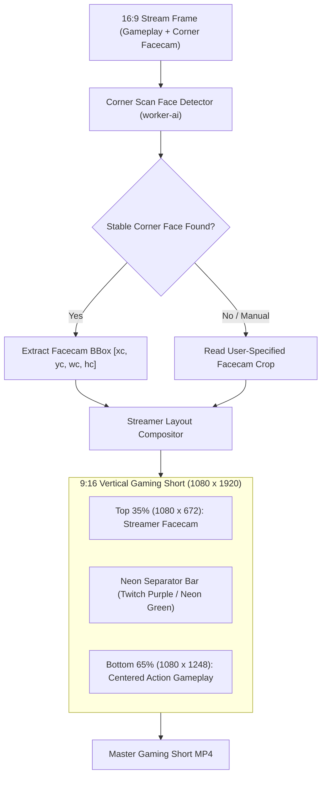

# Feature Blueprint: Streamer Layout (Facecam + Gameplay Split)

**Domain:** Pillar 3 — Visual Framing & Multi-Speaker Layout Engine  
**Functionality:** 07 — Streamer Gameplay & Facecam Split  
**Path:** `docs/features/03-visual-framing-and-layouts/07-streamer-gameplay-facecam/`  
**Status:** Approved Architectural Specification & Engineering Plan  

---

## 1. Feature Overview & Requirements

Gaming broadcasts (Twitch, Kick, YouTube Gaming) represent one of the highest-volume sources of short-form video content. A standard 16:9 stream consists of full-screen gameplay footage with a streamer webcam overlay ("facecam") positioned in one of the corners.

If a standard clipper crops this stream to 9:16:
- Centering on the gameplay cuts out the streamer's reaction completely.
- Centering on the tiny facecam box creates an over-pixelated crop that excludes the in-game action.

The **Streamer Layout (Facecam + Gameplay Split) Engine**:
1. Automatically identifies the facecam bounding box in the 16:9 stream (or provides a fast 1-click drag box selector).
2. Crops the facecam and places it prominently in the **Top 35%** of the 9:16 canvas.
3. Crops the gameplay centered around the game's focal action point (crosshair, HUD) and places it in the **Bottom 65%** of the canvas.
4. Renders dynamic gamer borders, kill-streak sound effect cues, and kinetic captions across the boundary.

### Core User Stories
1. **Twitch Viral Clip Creation:** As a gaming streamer, I want my TikTok shorts to show both my facial reaction at the top and my epic in-game clutch play at the bottom.
2. **Auto Facecam Detection:** As a creator, I want Aksharo to automatically detect my webcam overlay box without requiring manual crop configuration every stream.

### Key Performance SLAs
- Facecam detection accuracy: $\ge 97.0\%$ across popular stream overlays.
- Compositing speed: Parity with standard single-track renders.

---

## 2. Competitor Forensic Reverse-Engineering

### 2.1 How Spikes Studio & Framedrop.ai Build It
1. **Spikes Studio (`spikes.studio`):**
   - **Corner Facecam Detection:** Scans the 4 corners of the 16:9 video for a persistent human face. Because the streamer is stationary in their webcam overlay, the face bounding box exhibits near-zero displacement relative to the stream frame across time.
   - Computes webcam crop: $[x_{\text{cam}}, y_{\text{cam}}, w_{\text{cam}}, h_{\text{cam}}]$.
   - Computes game crop: Centered on the center of the 16:9 frame $[x = (W - W_{\text{game}})/2, y = 0]$.
   - Compositing Layout:
     - Top Pane ($0 \le y \le 672\text{ px}$): Facecam scaled up with slight blur backdrop or border.
     - Bottom Pane ($672 \le y \le 1920\text{ px}$): 9:16 game footage.
     - Separator: 3px neon gamer border (customizable color, e.g. `#8B5CF6` Twitch purple or `#00FFA3` neon green).

---

## 3. Current Aksharo Baseline & Gap Audit

### 3.1 Existing Repository Assets
- `docs/competitive-analysis/COMPETITOR_MASTER_FEATURE_SPEC_AND_ROADMAP.md`: Cataloged as Pillar 3, Feature 23.
- `apps/worker-ai/worker_ai/processors/faces.py`: Face detection.
- `apps/worker-media/src/processors/clip-frame.ts`: Crop calculations.

### 3.2 Gaps
1. **No Streamer Preset in `clip-frame.ts`:** Aksharo currently has no dual-crop logic dedicated to separating corner webcam overlays from central gameplay footage.
2. **No Facecam Box Selector in `apps/web`:** Streamers cannot designate where their webcam box sits if the overlay has complex graphics or chroma key green-screening.

---

## 4. Target System Architecture & Data Flow

---

## 5. Step-by-Step Engineering Implementation Plan

### Step 1: Implement Corner Facecam Detector in `faces.py`
- In `apps/worker-ai/worker_ai/processors/faces.py`:
  - Run face detector on first 30 seconds of video.
  - If a face is found consistently residing in one corner (e.g. $x > 0.70$ or $x < 0.30$) with high position stability ($\sigma_x < 5\text{ px}$), classify as `FACECAM_OVERLAY`.
  - Return `facecam_rect = { x, y, width, height }`.

### Step 2: Implement Streamer Remotion Composition in `apps/render`
- Create `apps/render/src/components/StreamerLayout.tsx`:
  - Renders top webcam view with aspect-fill.
  - Renders bottom gameplay view with center crop.
  - Renders customizable border separator with glow effect.

### Step 3: Interactive Facecam Selector in `apps/web`
- In `apps/web/components/editor/facecam-selector.tsx`:
  - Overlay an interactive resizable bounding box on the video preview so creators can easily adjust the facecam crop region with a single click.

### Step 4: Automated Testing Suite
- Unit test: Corner facecam detector on Twitch stream clips (Valorant, Apex Legends) asserting accurate extraction.
- Render test: Verifying 1080×1920 output displays clear facecam on top and gameplay on bottom.

