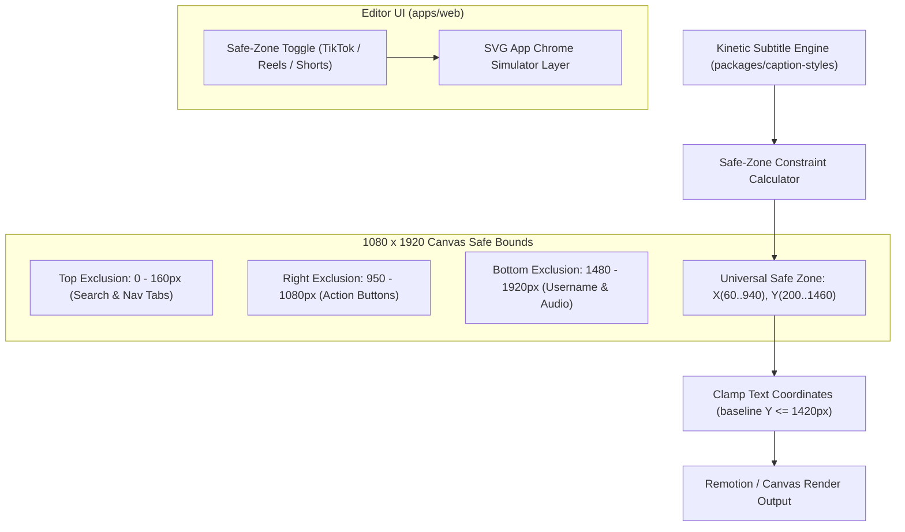

# Feature Blueprint: Social Media Safe-Zone & UI Avoidance Engine

**Domain:** Pillar 3 — Visual Framing & Multi-Speaker Layout Engine  
**Functionality:** 08 — Safe-Zone Guides & UI Avoidance  
**Path:** `docs/features/03-visual-framing-and-layouts/08-safe-zone-ui-avoidance/`  
**Status:** Approved Architectural Specification & Engineering Plan  

---

## 1. Feature Overview & Requirements

One of the most widespread amateur errors on vertical video platforms (TikTok, Instagram Reels, YouTube Shorts) is **UI element occlusion**:
- Captions placed too low are covered by the platform's multi-line caption, creator handle, and audio track ticker.
- Text placed too close to the right edge is obscured by the Like, Comment, Bookmark, and Share buttons.
- Important visual elements placed at the top are blocked by search bars and "For You / Following" navigation tabs.

The **Social Media Safe-Zone & UI Avoidance Engine**:
1. Implements strict, pixel-precise bounding boxes representing the active UI layouts of TikTok, Instagram Reels, and YouTube Shorts on a $1080 \times 1920$ canvas.
2. Automatically constrains all animated subtitles, headlines, emojis, and graphics to the universal safe zone.
3. Provides an interactive, toggleable **Safe-Zone Overlay Simulator** in the web editor so creators can preview how their video will appear inside native mobile apps before publishing.

### Core User Stories
1. **Unobscured Subtitles:** As a creator posting to TikTok, I want my kinetic subtitles placed high enough so TikTok's username and description text never cover the words.
2. **Native App Preview:** In the web editor, I want to toggle a simulated TikTok or Instagram Reels UI overlay to verify that no important facial features or graphics are covered by platform buttons.

### Key Performance SLAs
- Subtitle placement compliance: $100.0\%$ within platform safe bounds.
- Safe-zone toggle render latency: $0\text{ ms}$ (pure CSS overlay).

---

## 2. Competitor Forensic Reverse-Engineering

### 2.1 How Submagic, CapCut & Opus Clip Build It
1. **Submagic & CapCut:**
   - Both tools define the **Universal 9:16 Safe Zone** (the intersection of TikTok, Reels, and Shorts safe margins):
     - Canvas: $1080 \times 1920\text{ px}$.
     - Top Danger Zone: Top $160\text{ px}$ (app headers, status bars, search icons).
     - Bottom Danger Zone: Bottom $440\text{ px}$ (username, captions, audio marquee, home bar).
     - Right Danger Zone: Right $130\text{ px}$ from $y = 600$ to $y = 1500$ (like, comment, bookmark, share buttons).
     - Left Danger Zone: Left $40\text{ px}$ (screen edge margin).
   - Safe Rectangle for Subtitles:
     $$X \in [60, 940], \quad Y \in [300, 1460]$$
   - Default caption baseline: Centered horizontally at $X = 540\text{ px}$, vertically at $Y = 1380\text{ px}$ (comfortably above TikTok's $1480\text{ px}$ text baseline).
2. **Interactive UI Simulator:**
   - A toggle button in the editor player toolbar: `[Overlay: None | TikTok | Reels | Shorts]`.
   - Renders SVG overlays replicating actual platform buttons with realistic dimensions.

---

## 3. Current Aksharo Baseline & Gap Audit

### 3.1 Existing Repository Assets
- `packages/caption-styles/src/schema.ts`: Defines subtitle positions (`verticalPosition: 'top' | 'center' | 'bottom'`).
- `apps/render/src/subtitles.ts`: Subtitle positioning and offsets.

### 3.2 Gaps
1. **Hardcoded Bottom Position Too Low:** In default exports, captions rendered with `position: 'bottom'` sit at $Y \approx 1620\text{ px}$, which is directly inside TikTok's bottom text clutter!
2. **No Visual Safe-Zone Simulator in `apps/web`:** Creators have no visual guides in the web editor to preview platform button placements.

---

## 4. Target System Architecture & Data Flow



### 4.1 Safe Zone Coordinate Specifications
```typescript
export interface SafeZoneSpec {
  readonly topMarginPx: number;
  readonly bottomMarginPx: number;
  readonly rightMarginPx: number;
  readonly leftMarginPx: number;
  readonly defaultCaptionY: number; // Baseline Y on 1920 canvas
}

export const PLATFORM_SAFE_ZONES: Record<'tiktok' | 'reels' | 'shorts' | 'universal', SafeZoneSpec> = {
  tiktok: {
    topMarginPx: 160,
    bottomMarginPx: 440,
    rightMarginPx: 130,
    leftMarginPx: 50,
    defaultCaptionY: 1380,
  },
  reels: {
    topMarginPx: 140,
    bottomMarginPx: 380,
    rightMarginPx: 110,
    leftMarginPx: 50,
    defaultCaptionY: 1400,
  },
  shorts: {
    topMarginPx: 120,
    bottomMarginPx: 340,
    rightMarginPx: 120,
    leftMarginPx: 50,
    defaultCaptionY: 1420,
  },
  universal: {
    topMarginPx: 160,
    bottomMarginPx: 440,
    rightMarginPx: 130,
    leftMarginPx: 50,
    defaultCaptionY: 1380,
  },
};
```

---

## 5. Step-by-Step Engineering Implementation Plan

### Step 1: Update Caption Positioning in `packages/caption-styles`
- In `packages/caption-styles/src/registry.ts`:
  - Enforce `defaultCaptionY = 1380` on 1920 canvas height for all `bottom` aligned presets.
  - Set maximum bounding box width to $880\text{ px}$ (centered at $X = 540$) to prevent long lines from running beneath right-side social buttons.

### Step 2: Build Safe-Zone Overlay Component in `apps/web`
- Create `apps/web/components/editor/safe-zone-overlay.tsx`:
  - Renders SVG wireframe of TikTok/Instagram buttons (heart, comment bubble, share arrow, sound ticker).
  - Add quick-access toggle in editor header toolbar: `[Show Safe Guides]`.

### Step 3: Implement Magnetic Snap in Subtitle Drag Handler
- If the editor allows dragging caption position, snap vertical position back into the safe zone if dragged below $Y = 1440\text{ px}$, displaying a helpful warning tooltip: *"Snapped to TikTok safe zone"*.

### Step 4: Automated Testing Suite
- Unit test: Verifying all registered caption presets calculate bounding boxes strictly within `PLATFORM_SAFE_ZONES.universal`.

