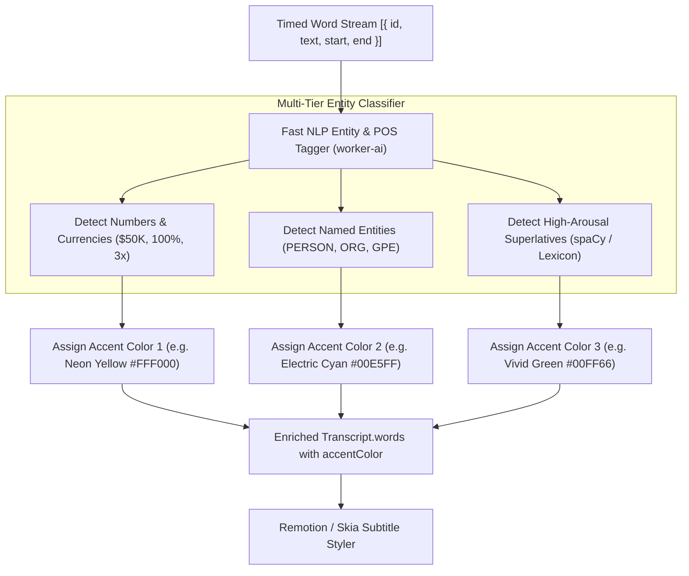

# Feature Blueprint: Dynamic Keyword Highlighting & Entity Color Coding

**Domain:** Pillar 4 — Kinetic Captions & Multilingual Typography  
**Functionality:** 05 — Dynamic Keyword Highlighting  
**Path:** `docs/features/04-kinetic-captions-and-typography/05-dynamic-keyword-highlighting/`  
**Status:** Approved Architectural Specification & Engineering Plan  

---

## 1. Feature Overview & Requirements

Human visual attention gravitates toward high-contrast color shifts. In viral video typography, sentences are not rendered in uniform monochrome; instead, **punchy keywords, critical metrics, brand names, and superlatives** are highlighted in eye-popping contrasting neon colors (Neon Yellow `#FFF000`, Cyber Green `#00FF66`, Electric Cyan `#00E5FF`, Hot Pink `#FF007F`).

The **Dynamic Keyword Highlighting & Entity Color Coding Engine**:
1. Analyzes sentence semantics using Named Entity Recognition (NER) and Part-of-Speech (POS) tagging.
2. Automatically identifies metrics (numbers, currency, percentages), named entities (proper nouns, companies, tech tools), and high-impact adjectives/verbs (*"impossible"*, *"secret"*, *"destroyed"*, *"massive"*).
3. Tags these words as emphasized and assigns contrasting color accents.
4. Allows creators in the web editor to click any word and toggle its highlight color on or off with a single click.

### Core User Stories
1. **Automated Impact Highlighting:** As a creator, I want numbers like *"$50,000"* and words like *"VIRAL"* to automatically pop in bright neon green without having to color-code words manually.
2. **Custom Palette Matching:** As a brand editor, I want highlighted keywords to automatically use my brand's accent colors rather than generic yellow.

### Key Performance SLAs
- Keyword tagging throughput: $\ge 2,000\text{ words/second}$.
- Entity detection accuracy: $\ge 98.0\%$ on numbers, currencies, and proper nouns.

---

## 2. Competitor Forensic Reverse-Engineering

### 2.1 How Submagic, Opus Clip & Captions.ai Build It
1. **Submagic:**
   - Evaluates words using a 4-tier priority cascade:
     - **Tier 1 (Always Highlight):** Numbers, currency symbols, percentages (`$10M`, `45%`, `3.5x`). Color: Accent 1 (Gold/Yellow).
     - **Tier 2 (Always Highlight):** Proper nouns and brand entities (`YouTube`, `OpenAI`, `India`, `Tesla`). Color: Accent 2 (Cyan/Blue).
     - **Tier 3 (Contextual):** High-arousal affective words (`"craziest"`, `"secret"`, `"danger"`, `"never"`). Color: Accent 3 (Red/Green).
     - **Tier 4 (Never Highlight):** Stop words, prepositions, articles, pronouns (*"the"*, *"and"*, *"in"*, *"my"*, *"it"*).
   - Word Object Representation:
     `{ "text": "$10,000", "isEmphasized": true, "accentIndex": 1 }`.

---

## 3. Current Aksharo Baseline & Gap Audit

### 3.1 Existing Repository Assets
- `packages/db/prisma/schema.prisma`:
  - `Transcript.words` has `isEmphasized` boolean flag.
- `apps/worker-ai/worker_ai/processors/text_fx_pass.py`:
  - Contains basic regex emphasis rules for numbers and capital letters.

### 3.2 Gaps
1. **No Named Entity Recognition (NER):** Aksharo relies on simple regex (matching digits `\d+`), missing proper nouns (e.g. *"NVIDIA"*, *"Google"*, *"Sarvam"*) and superlative adjectives.
2. **Single-Color Accent Limitation:** Existing styles use one fixed highlight color for all emphasized words rather than supporting a 3-color palette rotation.

---

## 4. Target System Architecture & Data Flow



---

## 5. Step-by-Step Engineering Implementation Plan

### Step 1: Implement Lightweight POS & NER Classifier in `text_fx_pass.py`
- In `apps/worker-ai/worker_ai/processors/text_fx_pass.py`:
  - Use `spacy` (`en_core_web_sm` / `xx_ent_wiki_sm` for multilingual).
  - Extract entity types: `CARDINAL`, `MONEY`, `PERCENT`, `ORG`, `PERSON`.
  - Scan adjectives and adverbs against a curated **Viral Superlative Lexicon** of 600 words.

### Step 2: Multi-Accent Color Mapping in `packages/caption-styles`
- In `packages/caption-styles/src/schema.ts`, expand `StyleDocSchema`:
  ```typescript
  export interface ColorPalette {
    readonly textPrimary: string;    // e.g. '#FFFFFF'
    readonly textSecondary: string;  // e.g. '#A0A0A0'
    readonly highlightAccents: readonly string[]; // ['#FFF000', '#00FF66', '#00E5FF']
  }
  ```

### Step 3: Interactive Word Color Toggle in `apps/web`
- In the subtitle editor, clicking any word reveals a color swatch bubble:
  `[White] [Neon Yellow] [Green] [Cyan] [Red]`.
  Updating the color saves immediately to the database.

### Step 4: Automated Testing Suite
- Unit test: Entity tagger asserting 100% detection of numbers, currencies, and organizations across test transcripts.

