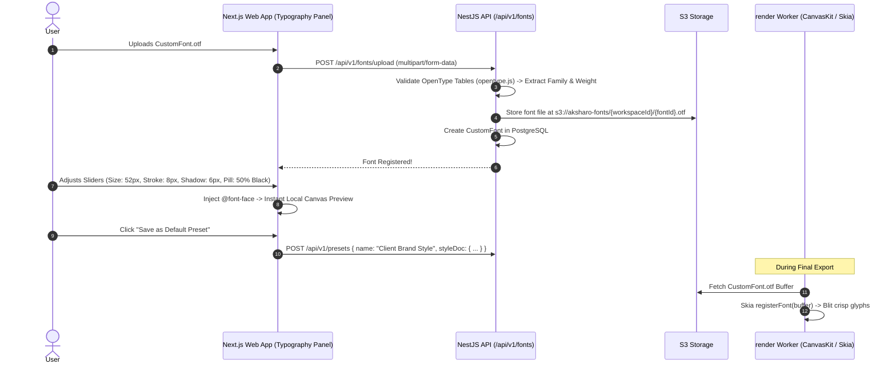

# Feature Blueprint: Custom Typography Engine & Font Uploader

**Domain:** Pillar 4 — Kinetic Captions & Multilingual Typography  
**Functionality:** 07 — Custom Typography Engine  
**Path:** `docs/features/04-kinetic-captions-and-typography/07-custom-typography-engine/`  
**Status:** Approved Architectural Specification & Engineering Plan  

---

## 1. Feature Overview & Requirements

Enterprises, media companies, and brand agencies have strict visual identity guidelines. They cannot use generic preset fonts; they require their proprietary custom corporate typefaces (e.g., custom TTF/OTF fonts) and brand color tokens.

The **Custom Typography Engine & Font Uploader**:
1. Allows creators to upload custom `.ttf`, `.otf`, and `.woff2` font files into their workspace.
2. Sanitizes and registers font assets across web preview players and backend rendering workers.
3. Provides granular typographic parameter controls:
   - Font family, weight, and size.
   - Tracking (letter spacing) and leading (line height).
   - Outer stroke width (0–20px) and color.
   - Multi-layer drop shadow and neon glow.
   - Background pill / bounding box (color, opacity, padding, corner radius).
4. Enables 1-click **"Save as Workspace Brand Kit Preset"**.

### Core User Stories
1. **Brand Font Consistency:** As an agency editor, I want to upload my client's custom font `ApexGrotesk.otf` so every short strictly adheres to brand guidelines.
2. **Granular Stroke & Glow Control:** As a creator, I want to fine-tune stroke thickness and shadow blur so my subtitles remain legible against complex, brightly-lit video backgrounds.

### Key Performance SLAs
- Custom font upload & validation latency: $\le 1.5\text{ seconds}$.
- Font glyph rendering fidelity: $100.0\%$ match with desktop Adobe / Figma rendering.

---

## 2. Competitor Forensic Reverse-Engineering

### 2.1 How Opus Clip, Submagic & Vizard.ai Build It
1. **Submagic & Vizard.ai:**
   - **Font Sanitization Pipeline:**
     - Uses `opentype.js` or `fonttools` to parse uploaded binary font files.
     - Validates that the font contains required OpenType tables (`cmap`, `glyf` or `CFF `, `head`).
     - Rejects malicious or corrupted binaries.
   - **Dynamic Web & Worker Registration:**
     - Frontend: Injects `@font-face` rule into the DOM dynamically using `FontFace` API.
     - Remotion / Skia Worker: Registers font dynamically using `CanvasKit.FontMgr.FromData(fontBuffer)` or Skia's `registerFont`.

---

## 3. Current Aksharo Baseline & Gap Audit

### 3.1 Existing Repository Assets
- `packages/db/prisma/schema.prisma`:
  - Contains `CustomFont` model:
    ```prisma
    model CustomFont {
      id          String    @id @default(uuid())
      workspaceId String
      family      String
      format      String    @default("truetype")
      fontUrl     String
      fontFace    String    @default("Regular")
      workspace   Workspace @relation(...)
    }
    ```
- `apps/api/src/fonts`: Contains basic font upload and listing controllers.

### 3.2 Gaps
1. **Missing Opentype Table Sanitization:** Uploaded font files are not currently verified for OpenType table integrity, allowing broken font files to cause Skia rendering segfaults.
2. **Missing Granular Control Sliders in Web Editor:** `apps/web` provides basic font family selection, but lacks sliders for tracking, line height, and multi-layer stroke thickness.

---

## 4. Target System Architecture & Data Flow



---

## 5. Step-by-Step Engineering Implementation Plan

### Step 1: Implement Font Validation Service in `apps/api`
- Install `opentype.js` in `apps/api`.
- Create `apps/api/src/fonts/font-validator.service.ts`:
  - Parse font buffer: `opentype.parse(buffer)`.
  - Extract true font family name, subfamily, and glyph count.
  - Reject fonts with missing Unicode `cmap` table.

### Step 2: Implement Typography Inspector Controls in `apps/web`
- In `apps/web/components/editor/typography-panel.tsx`:
  - Add slider controls for:
    - Font Size (`32px` to `84px`).
    - Letter Spacing (`-2px` to `+8px`).
    - Stroke Width (`0px` to `16px`) + Stroke Color picker.
    - Background Pill (`color`, `opacity`, `paddingX`, `borderRadius`).

### Step 3: Dynamic Font Registration in `render` Worker
- In `apps/render/src/subtitles.ts`:
  - If `styleDoc.customFontUrl` is present, fetch buffer from S3 cache and invoke `registerFont(fontBuffer, familyName)`.

### Step 4: Automated Testing Suite
- Unit test: Font validator verifying valid TTF, OTF, and rejecting corrupted binaries.
- Rendering test: Verify custom font renders identically in both browser DOM and Skia Canvas export.

