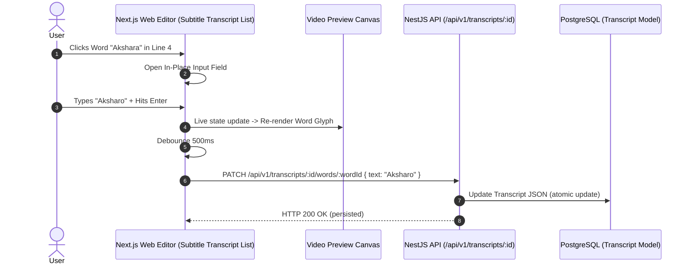

# Feature Blueprint: Interactive In-Line Subtitle & Line-Break Editor

**Domain:** Pillar 4 — Kinetic Captions & Multilingual Typography  
**Functionality:** 08 — In-Line Subtitle Editor  
**Path:** `docs/features/04-kinetic-captions-and-typography/08-inline-subtitle-editor/`  
**Status:** Approved Architectural Specification & Engineering Plan  

---

## 1. Feature Overview & Requirements

Even the most advanced ASR models ($98\%$ accuracy) occasionally misspell rare proper nouns, guest names (e.g. *"Dikshant"* $\rightarrow$ *"Deekshant"*), product trademarks (*"Aksharo"* $\rightarrow$ *"Akshara"*), or domain jargon. Furthermore, creators often want to fine-tune visual pacing by splitting a 6-word sentence across two sequential 3-word screens.

The **Interactive In-Line Subtitle & Line-Break Editor**:
1. Allows creators to click on any word in the transcript sidebar or directly on the video preview canvas to edit spelling, casing, and punctuation.
2. Preserves exact millisecond acoustic timing anchors during text modifications.
3. Provides 1-click **Line Splitting** (`Enter`) and **Line Merging** (`Backspace`) to control words per screen.
4. Includes a global **Find & Replace** modal to fix misspelled names across the entire video in seconds.

### Core User Stories
1. **Instant Typo Correction:** As an editor, I want to click on a misspelled guest name, fix the spelling in 2 seconds, and see the change reflected on the video frame immediately.
2. **Pacing Line Splitting:** As a creator who prefers rapid-fire 2-word captions, I want to press `Enter` between words to split a subtitle into two consecutive screens.

### Key Performance SLAs
- In-line text edit canvas reflection latency: $\le 16\text{ ms}$ (instant React state update).
- Server persistence debouncing: $500\text{ ms}$ debounce before background `PATCH` sync.

---

## 2. Competitor Forensic Reverse-Engineering

### 2.1 How Submagic & Klap Build It
1. **Submagic & Klap:**
   - Maintain a normalized transcript data structure:
     ```typescript
     interface CaptionCard {
       id: string;
       startSec: number;
       endSec: number;
       words: Array<{ id: string; text: string; start: number; end: number }>;
     }
     ```
   - **Editing a word:** Mutates `word.text` while leaving `word.start` and `word.end` unchanged.
   - **Splitting a card:**
     - User presses `Enter` after Word $k$.
     - Card splits into Card 1 (Words $1..k$) and Card 2 (Words $k+1..N$).
     - Card 1 `endSec` becomes Word $k$'s `end`.
     - Card 2 `startSec` becomes Word $k+1$'s `start`.
   - **Merging cards:** Concatenates word arrays and expands time bounds.

---

## 3. Current Aksharo Baseline & Gap Audit

### 3.1 Existing Repository Assets
- `packages/db/prisma/schema.prisma`:
  - `Transcript.lines` and `Transcript.words` stored as JSON.
- `apps/api/src/transcripts`:
  - Contains endpoints for retrieving transcripts.

### 3.2 Gaps
1. **Missing Transcript Mutation API:** Aksharo lacks a dedicated `PATCH /api/v1/transcripts/:id` endpoint that accepts atomic word edits and line re-segmentations.
2. **No Canvas Direct-Click Edit:** In `apps/web`, creators cannot click directly on a word on the video canvas to edit it; edits must be done via a raw text box.

---

## 4. Target System Architecture & Data Flow



---

## 5. Step-by-Step Engineering Implementation Plan

### Step 1: Implement Transcript Word Mutation Endpoints
- In `apps/api/src/transcripts/transcripts.controller.ts`:
  - `PATCH /:id/words/:wordId`: Updates single word text, emphasis, or emoji.
  - `POST /:id/lines/split`: Splits a line at word index $k$.
  - `POST /:id/lines/merge`: Merges line $j$ with line $j+1$.
  - `POST /:id/replace-all`: Global find and replace across all words.

### Step 2: Build Interactive Transcript Sidebar in `apps/web`
- In `apps/web/components/editor/transcript-editor.tsx`:
  - Render timed caption cards with auto-scroll following video playhead.
  - Each word rendered as an editable chip with keyboard shortcuts:
    - `Tab` / `Shift+Tab`: Move to next/previous word.
    - `Enter`: Split line at current word.
    - `Backspace` on first word of line: Merge with previous line.

### Step 3: Global Find & Replace Modal
- Add modal dialog in editor toolbar supporting case-sensitive and whole-word matching options.

### Step 4: Automated Testing Suite
- Unit test: Line split and merge functions verifying preservation of word timing continuity.
- E2E test: Simulating typing in transcript editor and verifying database persistence.

