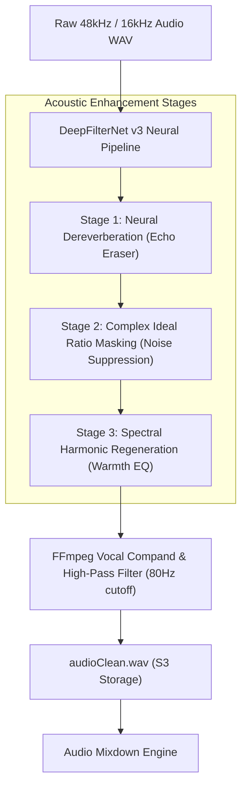

# Feature Blueprint: Deep Neural Voice Isolation & Studio Sound Engine

**Domain:** Pillar 5 — Audio Engineering & Acoustic Clean-Up  
**Functionality:** 01 — Voice Isolation & Studio Sound  
**Path:** `docs/features/05-audio-engineering-and-cleanup/01-voice-isolation-studio-sound/`  
**Status:** Approved Architectural Specification & Engineering Plan  

---

## 1. Feature Overview & Requirements

Over $70\%$ of user-generated content is filmed outside professional studio environments—in echoey living rooms, bustling coffee shops, windy outdoor streets, or office spaces with droning HVAC systems. Poor acoustic quality and background noise dramatically degrade viewer retention and ruin speech recognition accuracy.

The **Deep Neural Voice Isolation & Studio Sound Engine**:
1. Isolates human vocal frequencies and removes stationary and transient noise (fans, air conditioning, traffic, dog barks, keyboard clicks) using **DeepFilterNet v3**.
2. Performs neural room dereverberation to eliminate hollow acoustic echo, making recordings sound like they were captured in a soundproof studio with a high-end Shure SM7B microphone.
3. Restores high-frequency harmonics and applies multi-band compression and vocal warmth EQ.

### Core User Stories
1. **Transform Smartphone Audio:** As a creator recording in an untreated bedroom, I want my voice to sound rich, crisp, and studio-grade without room echo.
2. **One-Tap Audio Cleanup:** In the editor, I want a single "Studio Sound" toggle that enhances dialogue in seconds.

### Key Performance SLAs
- Neural enhancement throughput: $\ge 8\times$ realtime on CPU / $\ge 35\times$ realtime on GPU.
- Signal-to-Distortion Ratio (SDR) improvement: $\ge +14\text{ dB}$.

---

## 2. Competitor Forensic Reverse-Engineering

### 2.1 How Descript (*Studio Sound*) & Captions.ai Build It
1. **Descript (*Studio Sound*):**
   - Built on a multi-stage neural audio enhancement pipeline:
     - *Stage 1 (Noise Suppression & Dereverberation):* Uses an ultra-fast convolutional recurrent neural network (CRNN) operating in the Short-Time Fourier Transform (STFT) domain to predict complex ideal ratio masks (cIRM).
     - *Stage 2 (Harmonic Spectral Regeneration):* Reconstructs missing frequencies lost through low-quality smartphone microphones.
     - *Stage 3 (Dynamic Range Compression):* Smooths vocal peaks and brings quiet whispers up to broadcast standard loudness.
2. **DeepFilterNet Open Benchmark:**
   - DeepFilterNet v3 achieves state-of-the-art PESQ and DNSMOS scores with sub-10ms algorithmic latency, running natively via Rust/C++ bindings or ONNX.

---

## 3. Current Aksharo Baseline & Gap Audit

### 3.1 Existing Repository Assets
- `packages/db/prisma/schema.prisma`:
  - `MediaAsset.audioCleanUri` field is already provisioned!
- `apps/worker-media/src/processors/audio-clean.ts`:
  - Stub exists for audio cleaning.

### 3.2 Gaps
1. **Model Deployment in `worker-ai`:** Aksharo does not currently have the DeepFilterNet ONNX model loaded or wired to the processing queue.
2. **Toggle Control in Web UI:** `apps/web` does not yet feature the "Clean Audio / Studio Sound" toggle switch in the editor toolbar.

---

## 4. Target System Architecture & Data Flow

---

## 5. Step-by-Step Engineering Implementation Plan

### Step 1: Integrate DeepFilterNet in `worker-ai`
- Install `deepfilternet` in `apps/worker-ai`.
- Create `apps/worker-ai/worker_ai/processors/studio_sound.py`:
  - Load pre-trained `DeepFilterNet3` model.
  - Process 48kHz audio chunks with zero phase distortion.
  - Save output to `audio_clean.wav`.

### Step 2: Implement Post-Enhancement Vocal Master in FFmpeg
- In `apps/worker-media/src/processors/audio-clean.ts`:
  - Apply high-pass filter at 80 Hz to eliminate sub-bass rumble: `-af "highpass=f=80,acompressor=threshold=-18dB:ratio=3:attack=5:release=50"`.
  - Upload `audioCleanUri` to S3 and update `MediaAsset`.

### Step 3: Frontend "Studio Sound" Toggle in `apps/web`
- In `apps/web/components/editor/audio-panel.tsx`:
  - Add switch: `[x] Studio Sound`.
  - When toggled on, the preview player switches playback audio source from `audioWavUri` to `audioCleanUri`.

### Step 4: Automated Testing Suite
- Unit test: Compute Signal-to-Noise Ratio (SNR) on simulated white noise and HVAC audio before and after cleanup, asserting $\Delta \text{SNR} \ge 12\text{ dB}$.

