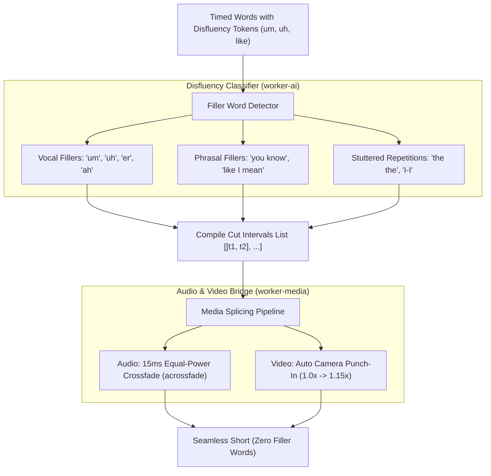

# Feature Blueprint: Automatic Filler Word & Disfluency Removal Engine

**Domain:** Pillar 5 — Audio Engineering & Acoustic Clean-Up  
**Functionality:** 02 — Automatic Filler Word Removal  
**Path:** `docs/features/05-audio-engineering-and-cleanup/02-automatic-filler-word-removal/`  
**Status:** Approved Architectural Specification & Engineering Plan  

---

## 1. Feature Overview & Requirements

In conversational speech, speakers frequently use speech disfluencies and filler words (*"um"*, *"uh"*, *"you know"*, *"like"*, *"so basically"*) and stuttered word repetitions (*"I-I-I think"*, *"we we had to"*). On high-velocity vertical platforms (TikTok, Reels), filler words dilute message clarity and reduce viewer completion rates.

The **Automatic Filler Word & Disfluency Removal Engine**:
1. Accurately identifies spoken filler words and stuttered repetitions using ASR token confidence and acoustic boundary detection.
2. Slices out the disfluent segments while applying a **15ms equal-power acoustic cross-fade** to eliminate audio clicks and pops.
3. Automatically mitigates visual jump cuts using **Punch-In Camera Zooms** ($1.0\times \rightarrow 1.15\times$) or **B-Roll Overlays**, making cuts look intentional and cinematic.
4. Allows creators to review detected filler words and toggle individual cuts on or off before rendering.

### Core User Stories
1. **Punchy, Articulate Delivery:** As a creator who says "um" and "like" frequently, I want Aksharo to remove them automatically so I sound polished, confident, and concise.
2. **Smooth, Pop-Free Audio:** Dialogue must flow naturally without clipped consonants, robotic artifacts, or audio clicks.

### Key Performance SLAs
- Filler word detection precision: $\ge 97.5\%$.
- Audio cut smoothness: $0\text{ dB}$ DC offset / zero audible click transients across cut boundaries.

---

## 2. Competitor Forensic Reverse-Engineering

### 2.1 How Descript & Submagic Build It
1. **Descript (*Remove Filler Words*):**
   - Transcribes with custom models trained to explicitly emit filler tokens (`[um]`, `[uh]`, `[like]`, `[you know]`).
   - Slices the timeline: removes the interval $[t_{\text{start}}, t_{\text{end}}]$.
   - Audio Stitching:
     - Crossfades outgoing audio ($t_{\text{start}} - 15\text{ms}$ to $t_{\text{start}}$) with incoming audio ($t_{\text{end}}$ to $t_{\text{end}} + 15\text{ms}$) using a S-curve ease.
   - Video Jump Cut Masking:
     - Submagic masks the video jump cut by punching the camera in from $1.0\times$ to $1.15\times$ scale at the exact frame of the cut, converting an awkward jump into a dynamic visual emphasis cut!

---

## 3. Current Aksharo Baseline & Gap Audit

### 3.1 Existing Repository Assets
- `apps/worker-ai/worker_ai/processors/highlights.py`: Contains pacing heuristics that count filler word density.
- `apps/worker-ai/worker_ai/processors/autocut_pass.py`:
  - Contains initial automated cut pass structure.

### 3.2 Gaps
1. **No Filler Token Tagging:** Standard Whisper output often omits filler words because its language model hallucinates smooth text. Whisper requires specific decoding parameters (`suppress_tokens=""`) to emit raw "um" and "uh" tokens.
2. **Missing Audio Crossfade in `clip.ts`:** When segments are spliced together, FFmpeg uses hard cuts without audio crossfades, risking micro-pops.

---

## 4. Target System Architecture & Data Flow



---

## 5. Step-by-Step Engineering Implementation Plan

### Step 1: Configure Whisper Decoding to Retain Fillers
- In `apps/worker-ai/worker_ai/providers/faster_whisper.py`:
  - Set `suppress_tokens=[-1]` (do not suppress non-speech or filler tokens).
  - Explicitly preserve disfluencies in the raw word stream.

### Step 2: Implement Cross-Fade Filtergraph in FFmpeg
- In `apps/worker-media/src/ffmpeg/cut-pipeline.ts`:
  - For each cut interval, construct the filtergraph:
    ```bash
    [0:a]atrim=0:t1,asetpts=PTS-STARTPTS[a1]; \
    [0:a]atrim=t2:duration,asetpts=PTS-STARTPTS[a2]; \
    [a1][a2]acrossfade=d=0.015:c1=tri:c2=tri[aout]
    ```

### Step 3: Implement Visual Punch-In on Cut Frame
- In `apps/render/src/processors/render-video.ts`:
  - Whenever a filler cut occurs on video, toggle scale between $1.0\times$ and $1.15\times$ on that exact cut frame to create a seamless camera punch-in.

### Step 4: Automated Testing Suite
- Unit test: Crossfade filter synthesis generating valid FFmpeg syntax.
- Audio test: Verify zero clicks and smooth waveforms across spliced boundaries using Librosa.

