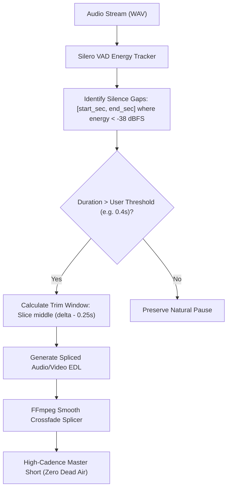

# Feature Blueprint: Dead-Air & Silence Trimming Engine

**Domain:** Pillar 5 — Audio Engineering & Acoustic Clean-Up  
**Functionality:** 03 — Silence Trimming / Dead-Air Removal  
**Path:** `docs/features/05-audio-engineering-and-cleanup/03-silence-dead-air-trimming/`  
**Status:** Approved Architectural Specification & Engineering Plan  

---

## 1. Feature Overview & Requirements

On short-form video platforms, viewer attention span is measured in fractions of a second. A pause longer than $0.8\text{ seconds}$ where neither speaker talks ("dead air") results in immediate swipe-aways. In long-form source footage (interviews, lectures, think-aloud discussions), pauses between sentences frequently span $1.5–3.0\text{ seconds}$.

The **Dead-Air & Silence Trimming Engine**:
1. Accurately detects non-speech intervals where acoustic energy falls below $-38\text{ dBFS}$ using Silero VAD.
2. Shortens long pauses down to a crisp, natural breathing interval ($0.25–0.30\text{ seconds}$) rather than deleting pauses entirely (which creates breathless, unnatural speech).
3. Provides an adjustable **Silence Sensitivity Slider** ($0.2\text{s}–1.0\text{s}$) in the web editor.

### Core User Stories
1. **Pacing Acceleration:** As a creator, I want Aksharo to compress awkward 2-second pauses so my video feels fast-paced and high-energy.
2. **Natural Breathing Preservation:** Dialogue must not sound like a machine gun; brief breath pauses ($0.25\text{s}$) must be preserved to retain human conversational rhythm.

### Key Performance SLAs
- Silence detection precision: $\ge 99.0\%$.
- Speech syllable clipping rate: $0.0\%$ (safe lead-in/lead-out margins of $80\text{ ms}$).

---

## 2. Competitor Forensic Reverse-Engineering

### 2.1 How Submagic (*Magic Cut*) & Choppity Build It
1. **Submagic (*Magic Cut*):**
   - Implements **Adaptive Pause Compression**:
     - Any silence interval $T_{\text{pause}} > \text{threshold}$ (default $0.4\text{s}$) is shortened:
       $$T_{\text{new}} = \min(T_{\text{pause}}, 0.25\text{s})$$
     - Slices out the middle section $(T_{\text{pause}} - 0.25\text{s})$, preserving $80\text{ms}$ of natural decay from the preceding word and $50\text{ms}$ of room tone before the succeeding word.
2. **Choppity:**
   - Exposes an interactive slider: *"Remove silences longer than [0.3s]"*.
   - Displays highlighted silence regions directly on the waveform timeline with 1-click delete/restore controls.

---

## 3. Current Aksharo Baseline & Gap Audit

### 3.1 Existing Repository Assets
- `apps/worker-ai/worker_ai/vad.py`:
  - Silero VAD implementation returning `speech_regions`.
- `apps/worker-ai/worker_ai/processors/autocut_pass.py`:
  - Autocut routines.

### 3.2 Gaps
1. **Binary Delete vs Compression:** Current logic either cuts the interval or leaves it; it does not compress long pauses into a standardized $0.25\text{s}$ breath duration.
2. **Missing UI Control:** `apps/web` lacks the silence threshold slider in the project editor.

---

## 4. Target System Architecture & Data Flow

---

## 5. Step-by-Step Engineering Implementation Plan

### Step 1: Implement Pause Compressor in `worker-ai`
- In `apps/worker-ai/worker_ai/processors/silence_trimmer.py`:
  - Extract silence intervals between adjacent transcript words:
    $\Delta t = \text{word}_{i+1}.\text{start} - \text{word}_i.\text{end}$.
  - If $\Delta t > \text{targetThreshold}$:
    - Keep first $0.12\text{s}$ (word decay room tone).
    - Remove middle interval.
    - Keep final $0.13\text{s}$ (speech onset buffer).

### Step 2: Update Word Timestamps Post-Compression
- Shift all subsequent word timestamps forward by the removed duration so subtitle animations stay perfectly synchronized with the shortened video.

### Step 3: Silence Sensitivity Slider in `apps/web`
- In `apps/web/components/editor/pacing-controls.tsx`:
  - Add slider: *"Silence threshold: [0.3s | 0.5s | 0.8s]"*.
  - Show time saved badge: e.g. *"Trimmed 14.2s of dead air!"*.

### Step 4: Automated Testing Suite
- Unit test: Pause compressor verifying that speech boundaries never lose onset/offset phonemes.

