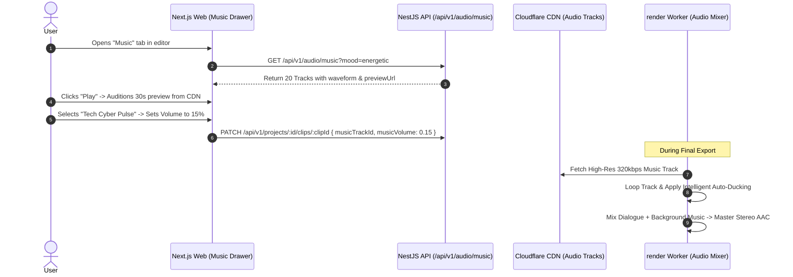

# Feature Blueprint: Royalty-Free Background Music Library Integration

**Domain:** Pillar 5 — Audio Engineering & Acoustic Clean-Up  
**Functionality:** 04 — Royalty-Free Music Library  
**Path:** `docs/features/05-audio-engineering-and-cleanup/04-royalty-free-music-library/`  
**Status:** Approved Architectural Specification & Engineering Plan  

---

## 1. Feature Overview & Requirements

Short-form videos without background music often feel sterile and unengaging. High-performing viral shorts on TikTok, Instagram Reels, and YouTube Shorts leverage background music to establish emotional tone, build tension, and sustain viewer attention.

The **Royalty-Free Background Music Library Engine**:
1. Provides a built-in catalog of 200+ commercially-cleared, royalty-free background audio tracks categorized by **Mood** (*Energetic, Dramatic, Chill Lo-Fi, Corporate, Inspirational, Mysterious*) and **Tempo / BPM**.
2. Automatically recommends matching tracks based on the semantic sentiment and acoustic energy of the video highlight.
3. Supports seamless audio looping and volume attenuation sliders (defaulting to a subtle $-20\text{ dBFS}$ background bed).

### Core User Stories
1. **1-Click Emotional Atmosphere:** As a creator, I want to add an upbeat Lo-Fi or cinematic music track with one click so my video feels engaging.
2. **Safe Commercial Licensing:** As a business account, I need commercial-use clearance guarantees so my videos never receive copyright strikes or muting on Instagram/TikTok.

### Key Performance SLAs
- Music track preview streaming latency: $\le 150\text{ ms}$.
- Audio mixdown render overhead: $\le 5\%$ increase in render time.

---

## 2. Competitor Forensic Reverse-Engineering

### 2.1 How Opus Clip & Submagic Build It
1. **Opus Clip & Submagic:**
   - License curated music bundles from royalty-free providers (e.g. Epidemic Sound, Audiio, or bespoke in-house synth compositions).
   - Audio tracks are hosted on CDN as lightweight 128kbps AAC/MP3 files for fast in-browser preview, with uncompressed 320kbps WAV files fetched during server-side master rendering.
   - **Semantic Music Recommendation:**
     - Reads the `virality_diagnostics` mood tag:
       - High energy / startup hustle $\rightarrow$ *"Future Bass / Tech Hype"*.
       - Serious story / failure lesson $\rightarrow$ *"Cinematic Piano / Melancholy"*.
       - Comedy banter $\rightarrow$ *"Quirky Acoustic / Lo-Fi Beat"*.

---

## 3. Current Aksharo Baseline & Gap Audit

### 3.1 Existing Repository Assets
- `apps/api/src/audio-assets`: Audio asset directory exists.
- `apps/worker-ai/worker_ai/processors/music_pass.py`:
  - Contains music pass pipeline!
- `packages/db/prisma/schema.prisma`:
  - `BrandAsset` table exists with `assetType: AUDIO`.

### 3.2 Gaps
1. **No Seeded Public Music Catalog:** Aksharo lacks a pre-populated public library table of licensed tracks categorized by genre, mood, and BPM.
2. **Missing Music Selector Drawer in `apps/web`:** Creators currently cannot browse, audition, and pick music tracks in the web editor.

---

## 4. Target System Architecture & Data Flow



### 4.1 Schema Additions (`packages/db/prisma/schema.prisma`)
```prisma
model MusicTrack {
  id          String   @id @default(uuid())
  title       String
  artist      String   @default("Aksharo Originals")
  mood        String   // ENERGETIC, CHILL, DRAMATIC, CORPORATE, INSPIRATIONAL
  tempo       String   // SLOW, MEDIUM, FAST
  bpm         Int?
  durationSec Float
  previewUri  String   // CDN 128kbps MP3
  masterUri   String   // CDN 320kbps WAV
  waveformJson String? // JSON peaks for UI player
  isPublic    Boolean  @default(true)
  createdAt   DateTime @default(now())
}
```

---

## 5. Step-by-Step Engineering Implementation Plan

### Step 1: Seed Music Catalog in PostgreSQL
- Create Prisma migration adding `MusicTrack` model.
- Seed initial catalog of 50 commercially cleared, CC0/licensed tracks stored in S3/Cloudflare R2.

### Step 2: Implement Music Browse & Filter API
- In `apps/api/src/audio/music.controller.ts`:
  - `GET /api/v1/audio/music`: Filter by `mood`, `tempo`, `search`.

### Step 3: Implement Music Picker UI in `apps/web`
- In `apps/web/components/editor/music-picker-drawer.tsx`:
  - Visual track list with Play/Pause button, mood pills, and volume slider ($0\%$ to $100\%$, default $15\%$).

### Step 4: Automated Testing Suite
- Unit test: Music query filters by mood and BPM.
- Render test: Verify music looping seamlessly without clicks when clip duration exceeds track duration.

