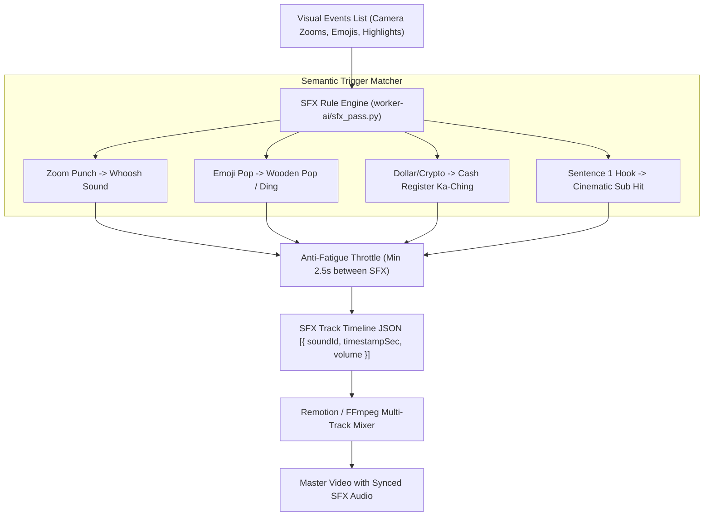

# Feature Blueprint: Semantic Contextual Sound Effects (SFX) Placement Engine

**Domain:** Pillar 5 — Audio Engineering & Acoustic Clean-Up  
**Functionality:** 06 — Contextual Sound Effects (SFX)  
**Path:** `docs/features/05-audio-engineering-and-cleanup/06-contextual-sound-effects-sfx/`  
**Status:** Approved Architectural Specification & Engineering Plan  

---

## 1. Feature Overview & Requirements

Human auditory perception is deeply tied to visual stimuli. Submagic's market leadership in engagement is largely driven by its **automated sound design**: pairing visual events (emoji pop-ins, kinetic word bounces, camera zoom punches, chapter transitions) with micro-sound effects (**SFX**).
- Camera punch-in $\rightarrow$ Crisp *Whoosh* sound.
- Emoji pop $\rightarrow$ Subtle wooden *Pop* / *Bubble* sound.
- Money mention / emoji $\rightarrow$ Cash register *Ka-ching*.
- Idea / metric reveal $\rightarrow$ Clean bell *Ding* / *Chime*.
- Dramatic contrarian claim $\rightarrow$ Cinematic sub-bass *Impact Hit*.

The **Semantic Contextual Sound Effects (SFX) Placement Engine**:
1. Analyzes visual edit events (camera cuts, zooms, emoji placements) and transcript semantic cues.
2. Automatically inserts contextual sound effects aligned down to the exact millisecond ($\pm 15\text{ms}$) with visual transitions.
3. Automatically mixes SFX at a calibrated non-intrusive level ($-18\text{ dBFS}$ with soft high-cut filtering).
4. Provides an interactive SFX editor allowing creators to preview, change, or mute individual effects.

### Core User Stories
1. **Auditory Retention Hooks:** As a creator, I want sound effects to automatically accompany visual cuts so my video feels produced by a professional agency.
2. **Granular SFX Control:** In the editor, I want to see audio markers for each SFX and delete or swap any effect that feels unnecessary.

### Key Performance SLAs
- Visual-to-auditory sync accuracy: $\le 16.6\text{ ms}$ (frame-accurate sync at 60 fps).
- Audio mixing latency: $\le 1.8\text{ seconds}$ during final render.

---

## 2. Competitor Forensic Reverse-Engineering

### 2.1 How Submagic (*Magic SFX*) Builds It
1. **Submagic:**
   - Maintains a library of 80+ micro-SFX categorized by trigger type:
     - `WHOOSH`: 8 variations (Fast, Cinematic, Whip, Air).
     - `POP`: 6 variations (Bubble, Wood, Soft Pop, Cork).
     - `CHIME`: 5 variations (Ding, Success Bell, Notification).
     - `CASH`: 4 variations (Register Bell, Coin Clink).
     - `IMPACT`: 5 variations (Bass Thud, Sub Boom, Riser).
   - **Trigger Rules:**
     - Whenever a camera zoom-in or zoom-out occurs $\rightarrow$ Trigger `WHOOSH` at zoom start frame.
     - Whenever an emoji appears $\rightarrow$ Trigger matching category SFX (`POP` or `CASH` or `CHIME`).
     - Limit density: Maximum 1 SFX every $2.5\text{ seconds}$ to prevent auditory exhaustion.

---

## 3. Current Aksharo Baseline & Gap Audit

### 3.1 Existing Repository Assets
- `apps/worker-ai/worker_ai/processors/sfx_pass.py`:
  - Contains basic SFX pass structure!
- `apps/api/src/audio-assets`: Audio asset management.

### 3.2 Gaps
1. **No SFX Sound Library Bundled:** The repository does not currently contain the curated library of royalty-free micro-WAV sound effects.
2. **Missing Frame Alignment in Remotion:** `apps/render` does not currently consume the SFX track in the Remotion timeline composition.

---

## 4. Target System Architecture & Data Flow

---

## 5. Step-by-Step Engineering Implementation Plan

### Step 1: Package Curated Micro-SFX Library
- Add 50 commercially cleared 24-bit WAV sound effects to `packages/shared/assets/sfx/`:
  - `whoosh_fast.wav`, `pop_bubble.wav`, `ding_bell.wav`, `cash_register.wav`, `cinematic_hit.wav`.

### Step 2: Implement SFX Trigger Logic in `sfx_pass.py`
- In `apps/worker-ai/worker_ai/processors/sfx_pass.py`:
  - Scan `keyframes` (zooms) and `words` (emojis and key highlights).
  - Assign corresponding SFX IDs with frame-accurate timestamps.
  - Enforce pacing throttle ($\ge 2.5\text{s}$ spacing).

### Step 3: Implement SFX Track in Remotion Audio Sequencer
- In `apps/render/src/components/AudioMixer.tsx`:
  - Map each SFX cue to a Remotion `<Audio src={sfxUri} startFrom={0} volume={0.4} />` anchored at the exact frame.

### Step 4: Automated Testing Suite
- Unit test: SFX pass on sample video asserting that every zoom transition has a matching whoosh sound cue within $\pm 1$ frame.

