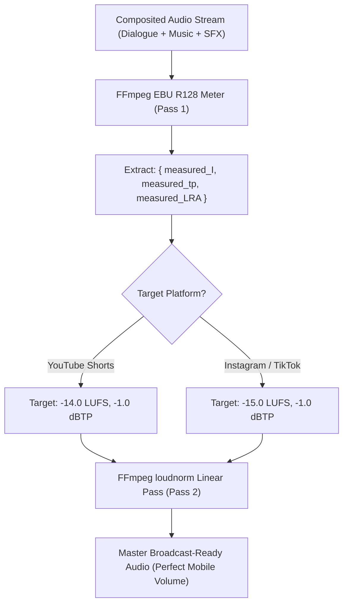

# Feature Blueprint: Automated Platform Loudness Normalization Engine

**Domain:** Pillar 5 — Audio Engineering & Acoustic Clean-Up  
**Functionality:** 07 — Loudness Normalization  
**Path:** `docs/features/05-audio-engineering-and-cleanup/07-loudness-normalization/`  
**Status:** Approved Architectural Specification & Engineering Plan  

---

## 1. Feature Overview & Requirements

When exporting video for social media distribution, audio loudness balance is critical:
- If audio is **too quiet** (e.g. $-24\text{ LUFS}$), mobile viewers cannot hear dialogue without turning phone volume to maximum, leading to high drop-off rates.
- If audio is **too loud** (e.g. $-10\text{ LUFS}$ with true-peak clipping), YouTube, Instagram, and TikTok apply automated server-side volume reduction penalties that introduce audio pumping, distortion, and harshness.

The **Automated Platform Loudness Normalization Engine**:
1. Analyzes integrated loudness using ITU-R BS.1770-4 / EBU R128 measurement algorithms.
2. Normalizes output audio to exact platform target specs:
   - **YouTube Shorts:** $-14.0\text{ LUFS}$ Integrated, $-1.0\text{ dBTP}$ True Peak.
   - **TikTok & Instagram Reels:** $-15.0\text{ LUFS}$ Integrated, $-1.0\text{ dBTP}$ True Peak.
3. Applies transparent brickwall peak limiting to eliminate audio distortion and clipping.

### Core User Stories
1. **Consistent Commercial Loudness:** As a creator, I want my video audio to sound punchy, full, and clear on smartphone speakers without distortion.
2. **Zero Platform Penalties:** When posted to YouTube Shorts, YouTube's "Stats for Nerds" must show $100\%$ volume with $0.0\text{ dB}$ volume penalty.

### Key Performance SLAs
- Integrated Loudness accuracy: Target $\pm 0.5\text{ LUFS}$.
- True peak compliance: $\le -1.0\text{ dBTP}$ across all exported media.

---

## 2. Competitor Forensic Reverse-Engineering

### 2.1 How Descript & Opus Clip Build It
1. **Descript & Opus Clip:**
   - Both utilize FFmpeg's `loudnorm` filter (EBU R128 specification).
   - **Two-Pass vs Linear Single-Pass:**
     - *Pass 1 (Measurement):* Measures source audio metrics (`input_i`, `input_tp`, `input_lra`, `input_thresh`).
     - *Pass 2 (Linear Normalization):* Applies precise gain and dynamic range compression based on measured statistics:
       ```bash
       ffmpeg -i input.wav -af "\
         loudnorm=I=-14:LRA=7:tp=-1.0:\
         measured_I=-22.4:measured_tp=-2.1:measured_LRA=9.2:measured_thresh=-33.5:offset=0.2:linear=true\
       " -c:a pcm_s16le normalized.wav
       ```
     - Setting `linear=true` ensures the filter applies pure linear gain without dynamic compressor pumping whenever the dynamic range permits.

---

## 3. Current Aksharo Baseline & Gap Audit

### 3.1 Existing Repository Assets
- `apps/worker-media/src/ffmpeg`: FFmpeg execution wrappers.
- `apps/render/src/processors/render-video.ts`: Final export render pipeline.

### 3.2 Gaps
1. **No Standard Loudness Target Pass in Final Export:** Currently, exports render audio directly from the source or Remotion audio mix without a final ITU-R BS.1770 `loudnorm` pass, resulting in unpredictable volume across different source videos.

---

## 4. Target System Architecture & Data Flow



---

## 5. Step-by-Step Engineering Implementation Plan

### Step 1: Implement Two-Pass Loudness Normalizer in `worker-media`
- Create `apps/worker-media/src/ffmpeg/loudness.ts`:
  - Execute FFmpeg Pass 1 with `-af loudnorm=I=-14:tp=-1:print_format=json -f null -`.
  - Parse JSON metrics from stderr.
  - Execute FFmpeg Pass 2 injecting measured parameters with `linear=true`.

### Step 2: Integrate into Final Video Packaging
- In `apps/render/src/processors/render-video.ts`:
  - Pipe the composited Remotion audio through the loudness normalization pass prior to muxing with the H.264/H.265 video stream.

### Step 3: Automated Testing Suite
- Unit test: Run test WAV files of quiet speech ($-26\text{ LUFS}$) and loud shouting ($-8\text{ LUFS}$) through normalizer, asserting output integrated loudness strictly equals $-14.0 \pm 0.4\text{ LUFS}$.

