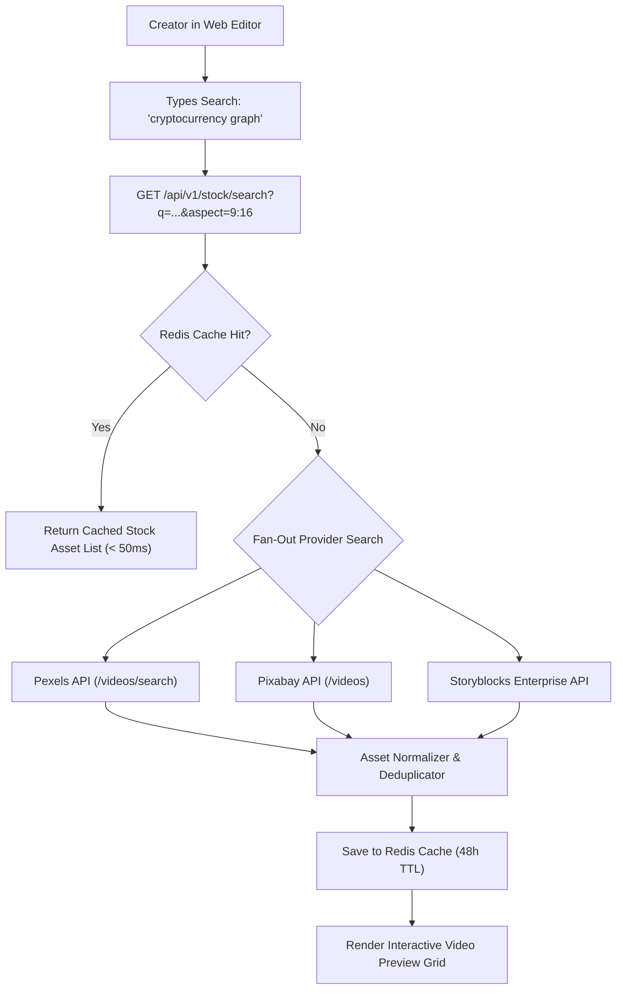

# Feature Blueprint: Integrated Stock Media Library (Pexels, Storyblocks, Pixabay)

**Domain:** Pillar 6 — Generative B-Roll & Visual Assets  
**Functionality:** 02 — Integrated Stock Library  
**Path:** `docs/features/06-generative-broll-and-visual-assets/02-integrated-stock-libraries/`  
**Status:** Approved Architectural Specification & Engineering Plan  

---

## 1. Feature Overview & Requirements

While automated AI B-roll discovery handles initial placement, video creators frequently want to **manually search, browse, and replace visual clips** from an integrated royalty-free stock library without leaving the Aksharo web editor:
- Creator searches *"New York traffic night timelapse"*.
- The editor displays a responsive grid of high-resolution stock video clips.
- Hovering over any card plays an instant 3-second preview.
- Clicking *"Insert"* drops the stock clip directly onto the editor timeline at the current playhead.

The **Integrated Stock Media Library Engine**:
1. Aggregates millions of commercially-cleared video and photo assets from **Pexels**, **Storyblocks**, and **Pixabay** via a unified API gateway.
2. Filters by orientation (prioritizing 9:16 vertical video and 16:9 widescreen), minimum resolution ($1080\text{p}$), and duration.
3. Implements an edge-caching proxy to cache downloaded stock assets in S3, eliminating redundant external API downloads.

### Core User Stories
1. **In-Editor Stock Search:** As an editor, I want to search for stock clips inside the editor sidebar and drop them onto my timeline with one click.
2. **Hover Video Preview:** I want video cards to play a low-res preview when I hover my mouse over them so I can find the perfect clip quickly.

### Key Performance SLAs
- Stock search query latency: $\le 650\text{ ms}$.
- Video card hover preview load time: $\le 200\text{ ms}$.

---

## 2. Competitor Forensic Reverse-Engineering

### 2.1 How CapCut & Submagic Build It
1. **CapCut & Submagic:**
   - Maintain multi-provider API proxy handlers:
     - `Pexels Video API`: `GET https://api.pexels.com/videos/search?query=...&orientation=portrait&per_page=20`.
     - `Pixabay Video API`: `GET https://pixabay.com/api/videos/?key=...&q=...`.
   - **Unified Search Normalization:**
     Map vendor responses to a standardized DTO:
     ```typescript
     interface StockAsset {
       id: string;
       provider: 'pexels' | 'storyblocks' | 'pixabay';
       title: string;
       durationSec: number;
       thumbnailUrl: string;
       previewVideoUrl: string; // 480p fast MP4
       downloadVideoUrl: string; // 1080p full MP4
       width: number;
       height: number;
     }
     ```
   - Rate limit mitigation: Redis cache with a 48-hour TTL for popular search terms.

---

## 3. Current Aksharo Baseline & Gap Audit

### 3.1 Existing Repository Assets
- `apps/api/src/broll`: B-roll services.
- `apps/api/src/config`: Environment configuration for third-party keys.

### 3.2 Gaps
1. **No Unified Stock Search Controller:** Aksharo lacks a dedicated `GET /api/v1/stock/search` endpoint aggregating multiple providers.
2. **Missing Stock Search Drawer in `apps/web`:** The web client has no stock media browser sidebar with search inputs and category filters.

---

## 4. Target System Architecture & Data Flow



---

## 5. Step-by-Step Engineering Implementation Plan

### Step 1: Implement Unified Stock Service in `apps/api`
- Create `apps/api/src/stock/stock.service.ts`:
  - Implement concurrent search queries across Pexels and Pixabay with `Promise.allSettled`.
  - Filter for resolution $\ge 1080 \times 1920$ or $1920 \times 1080$.
  - Rank results: prioritize vertical videos when project aspect is 9:16.

### Step 2: Implement Asset Caching Downloader
- When a user inserts an asset, download the high-res MP4 to Aksharo's S3 bucket: `s3://aksharo-stock-cache/{provider}/{assetId}.mp4`.
- Serve the asset from local S3 during final rendering to guarantee zero external dependency failures.

### Step 3: Build Stock Media Drawer in `apps/web`
- In `apps/web/components/editor/stock-drawer.tsx`:
  - Search input with category chips (*"Business"*, *"Technology"*, *"Nature"*, *"City"*, *"Abstract"*).
  - Infinite scroll grid with on-hover `<video>` playback.
  - *"Add to Timeline"* button.

### Step 4: Automated Testing Suite
- Unit test: Aggregator handling provider timeouts gracefully.
- Integration test: Verify stock search returns standardized asset objects with playable preview URLs.

