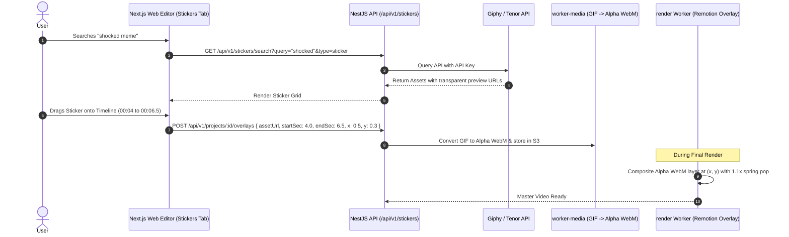

# Feature Blueprint: Sticker, Meme & Reaction GIF Overlay Engine (Giphy/Tenor)

**Domain:** Pillar 6 — Generative B-Roll & Visual Assets  
**Functionality:** 04 — Sticker & GIF Integration  
**Path:** `docs/features/06-generative-broll-and-visual-assets/04-stickers-gifs-memes/`  
**Status:** Approved Architectural Specification & Engineering Plan  

---

## 1. Feature Overview & Requirements

Viral short-form culture is deeply intertwined with internet memes and visual punchlines. Inserting iconic reaction memes (e.g. *Confused Nick Young*, *Pedro Pascal Laughing/Crying*, *Michael Jordan Laughing*, *Shocked Steve Harvey*) and animated vector stickers (pointing arrows, glowing neon rings, skull reactions) elevates humor and drives comments and shares.

The **Sticker, Meme & Reaction GIF Overlay Engine**:
1. Integrates with **Giphy** and **Tenor** APIs to provide an in-editor search catalog of millions of transparent stickers and trending reaction GIFs.
2. Uses transcript sentiment analysis to automatically propose 2–3 contextual reaction memes during humor peaks or dramatic mistakes.
3. Supports alpha-channel transparency, drag-and-drop positioning, scaling, and rotation.
4. Renders at full framerate using Remotion's animated GIF / WebP image sequencers.

### Core User Stories
1. **Meme Reaction Insertion:** As a podcast creator telling a funny story, I want to insert an iconic reaction GIF over the video for 2 seconds to punctuate the punchline.
2. **Transparent Animated Stickers:** As an educator, I want animated arrow and circle stickers to highlight key numbers and graphs on screen.

### Key Performance SLAs
- GIF/Sticker search response time: $\le 450\text{ ms}$.
- Alpha transparency rendering: $100.0\%$ clean edges (zero black matting artifacts).

---

## 2. Competitor Forensic Reverse-Engineering

### 2.1 How CapCut & Submagic Build It
1. **CapCut & Submagic:**
   - Integrate Giphy Stickers API (`https://api.giphy.com/v1/stickers/search`) and Giphy GIFs API.
   - Stickers use transparent WebP / APNG format to blend seamlessly over the video canvas without rectangular backgrounds.
   - **Remotion Composition Technique:**
     - Traditional `.gif` files cause heavy decoding lag in headless Chromium.
     - Submagic transposes `.gif` files into transparent WebM (`vp9` with alpha) or APNG frame sequences on the server:
       ```bash
       ffmpeg -i meme.gif -c:v libvpx-vp9 -pix_fmt yuva420p meme_alpha.webm
       ```
     - Serves lightweight WebM with full alpha channel, rendering at $60\text{ fps}$ with zero frame drops.

---

## 3. Current Aksharo Baseline & Gap Audit

### 3.1 Existing Repository Assets
- `packages/db/prisma/schema.prisma`:
  - `BrandAsset` table supports `assetType: OVERLAY`.
- `apps/render/src/render`: Compositing engine.

### 3.2 Gaps
1. **No Giphy / Tenor API Integration:** Aksharo lacks API client modules connecting to public sticker and meme repositories.
2. **Missing Sticker Overlay Track in Web Timeline:** `apps/web` timeline does not have a dedicated overlay track allowing users to reposition stickers.

---

## 4. Target System Architecture & Data Flow



---

## 5. Step-by-Step Engineering Implementation Plan

### Step 1: Implement Giphy & Tenor Search Gateway in `apps/api`
- Create `apps/api/src/stickers/stickers.service.ts`:
  - Query Giphy Stickers (`api.giphy.com/v1/stickers/search`) and GIFs.
  - Return standardized DTO: `{ id, url, previewUrl, width, height, isTransparent }`.

### Step 2: Implement Transparent Video Transcoder in `worker-media`
- In `apps/worker-media/src/processors/sticker-transcode.ts`:
  - Convert uploaded or selected GIFs into transparent WebM (`-c:v libvpx-vp9 -pix_fmt yuva420p`) or frame-optimized WebP to ensure butter-smooth rendering.

### Step 3: Interactive Sticker Canvas Gizmo in `apps/web`
- In `apps/web/components/editor/sticker-overlay-canvas.tsx`:
  - Draggable, resizable canvas gizmo with rotation handle to let creators position stickers freely over the video preview.

### Step 4: Automated Testing Suite
- Unit test: Giphy API response parser handling rate limits and null assets.
- Render test: Verifying transparent WebM overlay composites over video with clean alpha transparency.

