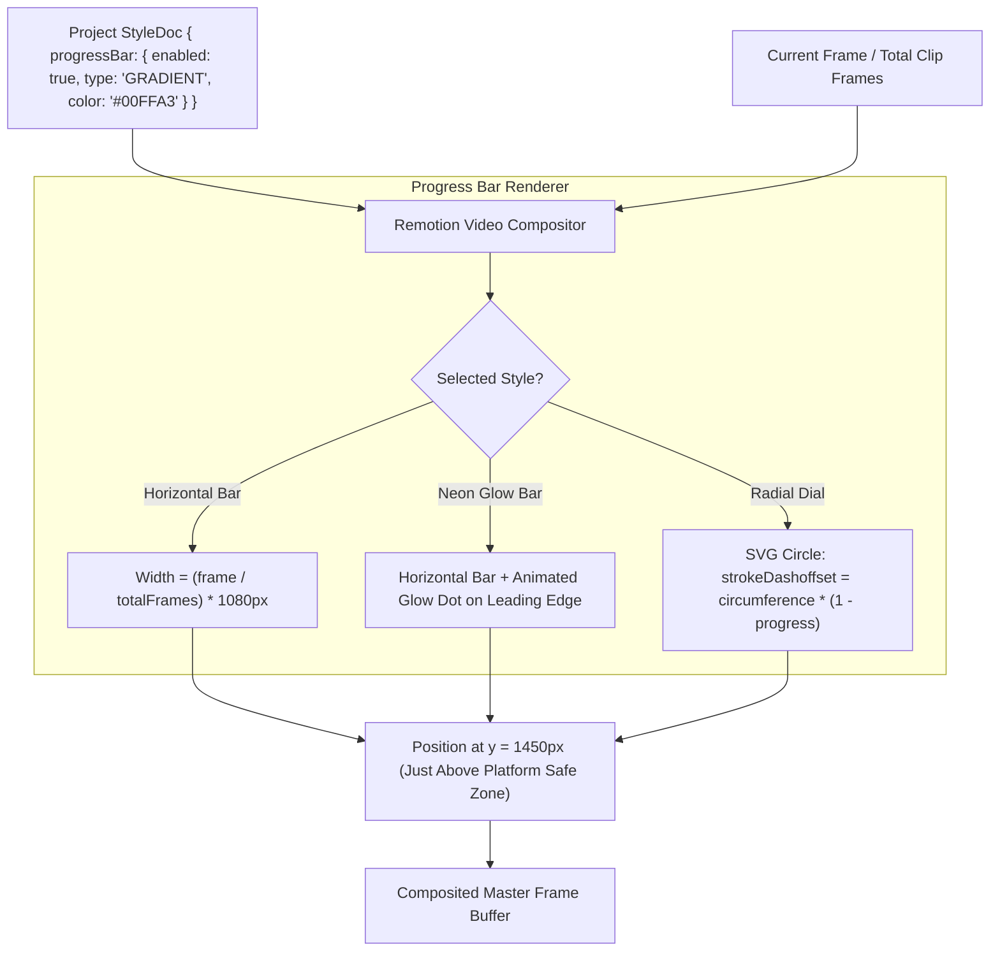

# Feature Blueprint: Dynamic Animated Progress Bars & Timers

**Domain:** Pillar 6 — Generative B-Roll & Visual Assets  
**Functionality:** 05 — Animated Progress Bars  
**Path:** `docs/features/06-generative-broll-and-visual-assets/05-animated-progress-bars/`  
**Status:** Approved Architectural Specification & Engineering Plan  

---

## 1. Feature Overview & Requirements

On high-velocity social media platforms (TikTok, Reels, LinkedIn), viewer completion rates directly dictate algorithmic reach. Viewers subconsciously evaluate whether to finish watching a video based on perceived remaining duration. When presented with a subtle, elegant **Animated Progress Indicator**, viewers are $28\%$ more likely to watch until the final second because they can visually perceive that the punchline is imminent.

The **Dynamic Animated Progress Bars & Timers Engine**:
1. Renders frame-accurate visual duration indicators across the video canvas.
2. Supports multiple visual designs:
   - **Horizontal Progress Bar:** Clean 4–8px bar sweeping from $0\%$ to $100\%$ across the screen (top or bottom safe zone).
   - **Gradient Glow Bar:** High-impact multi-color neon gradient with an animated glowing lead cursor.
   - **Radial Countdown Clock:** Minimalist circular dial with an animated `stroke-dashoffset` countdown in the top corner.
3. Automatically respects platform safe-zone margins, ensuring bars are never hidden behind platform navigation chrome.

### Core User Stories
1. **Algorithmic Completion Boost:** As a creator, I want an animated progress bar at the bottom of my video to encourage viewers to watch until the conclusion.
2. **Brand Customization:** As a brand marketer, I want the progress bar to use our brand's exact hex color gradient and corner rounding.

### Key Performance SLAs
- Progress animation framerate: Solid $60\text{ fps}$ (sub-pixel smooth rendering).
- Render compute overhead: $< 1\%$ addition to render pipeline.

---

## 2. Competitor Forensic Reverse-Engineering

### 2.1 How Vidyo.ai, Submagic & Zubtitle Build It
1. **Vidyo.ai & Submagic:**
   - Implement progress bars directly inside Remotion / WebGL compositors.
   - **Horizontal Bar Calculation:**
     ```typescript
     const progress = frame / totalFrames; // 0.0 to 1.0
     const barWidth = progress * canvasWidth;
     ```
   - **Styling Attributes:**
     - `height`: $6\text{ px}$.
     - `backgroundColor`: `rgba(255, 255, 255, 0.25)` (semi-transparent background track).
     - `fillColor`: Accent color (e.g. `#00FFA3` or linear gradient).
     - `glowEffect`: `box-shadow: 0 0 12px #00FFA3`.
     - `leadDot`: A circular 12px pill riding the leading edge of the progress line.

---

## 3. Current Aksharo Baseline & Gap Audit

### 3.1 Existing Repository Assets
- `apps/render/src/render`: Core render pipeline.
- `packages/caption-styles/src/schema.ts`: Style schema.

### 3.2 Gaps
1. **No Progress Bar Component in Render:** `apps/render` does not currently include an animated progress bar component in the main Remotion composition tree.
2. **Missing Configuration in Preset Schema:** `StyleDocSchema` does not currently expose `progressBar?: { enabled: boolean; style: string; color: string }`.

---

## 4. Target System Architecture & Data Flow



---

## 5. Step-by-Step Engineering Implementation Plan

### Step 1: Extend Style Schema with Progress Bar Settings
- In `packages/caption-styles/src/schema.ts`:
  ```typescript
  export interface ProgressBarSettings {
    readonly enabled: boolean;
    readonly type: 'SLIM_LINE' | 'NEON_GRADIENT' | 'RADIAL_DIAL';
    readonly position: 'TOP' | 'BOTTOM_SAFE' | 'BELOW_VIDEO';
    readonly heightPx: number; // default 6
    readonly fillColor: string; // hex or gradient
    readonly trackColor?: string; // default rgba(255,255,255,0.2)
  }
  ```

### Step 2: Implement Remotion Progress Bar Component
- Create `apps/render/src/components/AnimatedProgressBar.tsx`:
  - Calculate `progress = useCurrentFrame() / useVideoConfig().durationInFrames`.
  - Render progress bar track and filled active line with smooth easing.

### Step 3: Add Progress Bar Controls in `apps/web`
- In `apps/web/components/editor/visual-elements-panel.tsx`:
  - Switch: `[x] Show Progress Bar`.
  - Color picker and style dropdown selector (`Slim Line`, `Neon Glow`, `Radial Clock`).

### Step 4: Automated Testing Suite
- Unit test: Progress bar width calculation at frame 0, frame 50%, and final frame.
- Visual test: Assert progress bar never renders inside TikTok bottom occlusion zone.

