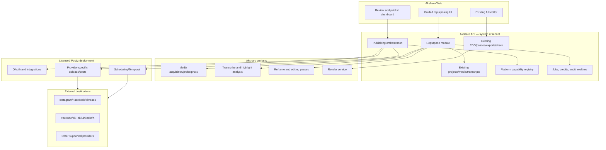

# Aksharo Repurposing Platform — Master Implementation Plan

**Document status:** Implementation-ready blueprint  
**Prepared:** 15 September 2026  
**Primary repository:** `C:\Dikshant\Crest Mond\Product 2\05-build\montaj`  
**Integrated source trees:** `opensource-clipping-main` and `postiz-app-main`  
**Product name in all user-facing copy:** Aksharo  
**Engineering codename:** `montaj` may remain in package names, queue names, and internal paths only

## Live implementation checkpoint

> This block must be updated in the same commit or pull request as every implementation change. It is the first place a developer, reviewer, or agent should look before starting work. Detailed update rules and templates are in Section 27.

| Field | Current value |
|---|---|
| Overall status | `IN_PROGRESS` — live for one workspace since 2026-09-15 (`DEPLOY-0002`). A YouTube link runs acquire → probe → proxy → transcribe and stops at highlight discovery, which has no producer. `repurpose_flow` and `source_youtube_acquire` are on for workspace `01M1KFX35NJRD5N58H0J6YGAPC` only; `highlight_discovery`, `publishing_postiz` and `publishing_tiktok` remain absent, and absent is off |
| Current checkpoint | `CP-000 — Master plan prepared` |
| Current wave | Wave 0 in progress |
| Active work item | `REP-000 — Wave 0 foundation and baseline` (`BLOCKED` on external evidence) |
| Last completed item | `REP-010 — media.acquire worker` (consumer only; no producer, per the ticket's own "no production hookup until threat review"). REP-003 to REP-009 have been through an adversarial cross-owner review and all fifteen surviving findings are fixed |
| Last verified | 15 September 2026 — 39 typecheck tasks; API 2,167 tests across 204 files; Python 902; worker-media 193; web 39 repurpose tests; migration and hand SQL applied and re-applied on a scratch PostgreSQL. The baseline failures in `WAVE-0-FOUNDATION.md` are unchanged and now explicitly accepted (`DEC-010`) |
| Current blockers | Provider credentials/app reviews, rights-cleared test accounts, and commercial licence evidence locations are not available in the repository. The baseline failures are no longer a blocker — they were explicitly accepted on 2026-09-15 (`DEC-010`). |
| Next required action | Obtain the Wave 0 protected licence/provider/test-account evidence, which is all that still blocks `CP-010`. For `CP-020`: the adversarial review is done and its findings are fixed (`DEC-011`), so what remains is a named owner's sign-off and the migration applied to a staging snapshot. For Wave 3: record the publisher's SHA-256 for `yt-dlp 2026.08.19`, hold the security review of `apps/worker-media/src/yt-dlp.ts`, run the isolated staging spike, and only then write the API producer |
| Responsible owner | Codex, then Claude (implementation); product/legal/provider owners remain to be assigned |
| Last status update | 2026-09-15T20:20:00+05:30 |

### Current work summary

**Completed**

- Audited the existing Aksharo architecture and relevant feature foundations.
- Audited the clipping repository and identified adopt/adapt/reject boundaries.
- Audited the Postiz public API/SDK/provider architecture and identified the MP4 upload integration risk.
- Defined the recommended beginner workflow, target architecture, contracts, implementation waves, quality gates, and rollout plan.
- Confirmed by the product owner that the required source licenses have been secured.
- Created the Wave 0 platform-boundary ADR, source/compliance and capability drafts, and five server-side rollout flags seeded off.
- Corrected the isolated stack's MinIO registry tags and excluded imported archives, local environment files, and build caches from Docker contexts.
- Built and smoke-tested the isolated compose stack, then seeded the demo workspace and sample project only in its scratch database.
- Aligned browser-facing test origins with scratch ports and made the stack wrapper override `.env` port values safely. A partial Chromium/WebKit smoke run exposed stale `/share` expectations and browser hydration timeouts.
- Completed REP-001's provisional strict contract package with JSON examples, eight passing tests, and repository-wide typecheck verification.
- Completed REP-002's four strictly disabled/test platform profiles with official-source pointers and activation-evidence structure; no app imports the registry.
- Completed REP-003 and REP-004: one additive migration adds the repurposing core and the publishing ledger, with the bounds, rights, schedule and provider-reference constraints and the live-idempotency partial unique index that Prisma cannot express. `channel_connections` has no column that can hold a provider token, and a test asserts the column list.
- Completed REP-005: five queues registered across all four runtime copies, a `publish` family whose policy is one attempt, `@montaj/publishing-contracts`, versioned job payload/result contracts and storage-key helpers, and an `ai.highlights@1` Pydantic mirror that parses the same fixtures as the TypeScript side.
- Completed REP-006 and REP-009: the run CRUD module (create, list, get, cancel, retry) with workspace isolation, idempotency, audit and a realtime stage event, and the pure YouTube/direct-media URL normaliser it calls. Both are inert while `repurpose_flow` is off.
- Completed REP-007 and REP-008: the five-stage workspace and the unified start form, built on the existing pickers, upload seam and design tokens.

**In progress**

- `REP-000` records the Wave 0 provenance, license/access placeholders, launch-provider decision, feature flags, tooling baseline, and blockers without changing the imported source trees.
- `REP-000` still awaits protected license/access evidence and a clean or explicitly accepted baseline before `CP-010`. Nothing an engineer can do closes it; it needs named owners.

**Not started**

- `REP-010` (`media.acquire` worker) and every ticket after it: highlight discovery, manual timestamps, materialisation, caption wiring, review bundles, the Postiz connection and publishing. Wave 0 has not passed `CP-010` and Wave 1 has not passed `CP-020`; no gate is claimed by any of the work above.

**Known limitations at this checkpoint**

- A repurposing run cannot progress past `draft`. Acquisition, discovery, materialisation, review and publishing have no producers yet, so the surface creates and resumes runs and honestly says what each later stage is waiting for.
- No provider connection, no OAuth, no post, and no media-pipeline change. The publishing ledger records intent only, and its tables are unreferenced by any runtime.
- The contracts and the Prisma models are implemented but NOT reviewed. `CP-020` needs the cross-owner review and a migration proven against a staging snapshot; neither has happened.
- Existing dirty-tree lint/unit/browser failures and missing external provider/license evidence keep `CP-010` unproven, which keeps every flag off.

---

## 0. How to use this document

This file is the implementation source of truth for turning Aksharo into a start-to-finish video repurposing and publishing product. Every engineering task, design task, test, and release decision should point back to a section in this document.

The team must execute the plan in the stated order. A wave is complete only when all of its acceptance gates pass. Do not begin dependent work against an unstable contract. Frontend work may use contract mocks while backend work is underway, but the mock must be generated from the same schemas that the API uses.

This plan deliberately does **not** promise that software will be flawless “in one go.” No responsible engineering plan can guarantee that across AI models, media codecs, OAuth providers, and changing social APIs. It instead makes a one-flow experience credible through durable jobs, idempotency, schema validation, golden media tests, platform capability checks, staged rollout, and recovery from partial failures.

### Operating rules

1. Keep the existing Aksharo production architecture as the system of record.
2. Treat the two pasted applications as capability sources, not as three independent products presented to the user.
3. Do not rewrite transcription, captions, the editor, rendering, exports, jobs, credits, or review features that already exist in Aksharo.
4. Do not run the clipping repository's prototype FastAPI job store in production.
5. Keep Postiz as a bounded publishing service with a narrow Aksharo adapter, even though the required source licenses have been secured. This limits deployment coupling and protects the editing pipeline from publishing outages.
6. Never expose technical terms such as queue, worker, EDG, webhook, manifest, ffmpeg, or Postiz in the beginner workflow.
7. Do not auto-publish without a final, explicit user confirmation.
8. A failed destination must never cause a successful destination to be posted twice.
9. Never run development or end-to-end checks against the laptop production ports `3913` and `3914`. Use isolated scratch ports and test databases.
10. Preserve all existing user changes in the working tree. Implement this plan in small, reviewable branches or worktrees.

---

## 1. Product decision in one page

### 1.1 Recommended product

Build a guided repurposing workspace with five visible stages:

1. **Add video** — paste an authorized YouTube link or upload a video; choose spoken language, caption output, and a caption style.
2. **Find clips** — Aksharo transcribes once, proposes ranked moments, and also accepts exact manual timestamps.
3. **Style formats** — turn selected moments into a small set of reusable aspect variants, add captions, and generate platform-specific copy.
4. **Review** — preview every output, open any variant in the existing full editor, approve it, or request changes.
5. **Publish** — connect accounts, choose destinations and timing, confirm once, and track each destination separately.

The page should have the calm visual rhythm of an n8n flow, but it must **not** be a draggable or editable automation canvas. Use connected stage cards with clear status, one expanded stage at a time, and a persistent preview. The workflow is opinionated; users edit the content, not the pipeline topology.

### 1.2 Core differentiation

The defensible product is not “AI captions” or “AI clips” by itself. It is the combination of:

- India-first speech and script handling, especially native Hindi and Roman-script Hinglish (`hi-Latn`);
- transcript plus audio plus visual evidence when ranking moments;
- transparent candidate reasons instead of an unexplained “viral” number;
- exact manual timestamp control in the same flow;
- one editable master per useful aspect ratio, not a black-box render;
- platform-safe captions, crop, metadata, consent, and account rules;
- approval and partial-publish recovery in one workspace;
- reuse of Aksharo's existing professional editor after the beginner flow has done the heavy lifting.

### 1.3 Product promise

Use this promise in product planning:

> One long video becomes reviewed, captioned, platform-ready short videos from a single guided workspace—while the creator stays in control of every cut and post.

Do **not** market AI scores as a guarantee that a clip “will go viral.” The user-facing label should be **Potential score** or **Why this moment may work**. Show the evidence behind it.

### 1.4 MVP boundary

The first public-quality version must include:

- video upload and authorized YouTube-link acquisition;
- English, Hindi, Hinglish, and the regional language lanes already supported by Aksharo;
- AI-ranked and manual-timestamp candidates;
- selection before expensive renders;
- 9:16, 1:1 or 4:5, and 16:9 aspect families;
- burned-in captions using existing Aksharo presets;
- editor deep links for every generated variant;
- review and approval;
- account connection through the publishing service;
- publish now and schedule where the destination supports it;
- per-destination status, retry, and external post URL;
- download or device-handoff fallbacks when silent server-side publishing is unavailable.

Defer these until the core flow is stable:

- automatic B-roll insertion;
- AI voice-over;
- synthetic avatars;
- collaborative n8n-style custom workflow editing;
- auto-publishing without review;
- analytics-driven self-training;
- a marketplace of community workflows;
- every social network on day one.

---

## 2. What already exists: repository-grounded audit

The main Aksharo repository is already the strongest foundation. It has a Next.js web application, NestJS API, Prisma/PostgreSQL data model, BullMQ job system, Python AI worker, media worker, render service, signed render manifests, credits, storage boundaries, review links, public API, caption style system, and full editor.

### 2.1 Aksharo capabilities to preserve and extend

| Capability | Existing anchor | Decision |
|---|---|---|
| Project creation and media upload | `apps/api/src/projects`, `apps/api/src/media`, `apps/web/app/(app)/home/home-view.tsx` | Reuse. Add a repurposing facade; do not replace the upload pipeline. |
| Direct HTTPS media ingestion | `apps/api/src/public-api/v1/source-url-ingest.service.ts` | Reuse only for direct media URLs. It cannot acquire a YouTube watch page because it correctly requires an allowed media content type. |
| Durable job ledger, retries, events, credits, DLQ | `apps/api/src/jobs`, `apps/api/prisma/schema.prisma`, `docs/CONTRACTS.md` | Reuse for every new background operation. |
| Transcription and language detection | `apps/api/src/transcripts`, `apps/worker-ai/worker_ai` | Reuse. It already detects Roman Hindi as `hi-Latn`. |
| Translation/transliteration/script tracks | transcript modules and EDG word `scripts` | Reuse and expose more clearly in setup. |
| Captions and presets | `packages/caption-styles`, `packages/render-core` | Reuse. Snapshot the selected style on each run/variant. |
| AI passes: cut, reframe, zoom, text, SFX, music | `apps/api/src/passes`, `apps/worker-ai/worker_ai/processors` | Reuse where relevant. Add highlight discovery as a separate candidate stage. |
| Insights: chapters, summary, hooks, titles, hashtags | `apps/api/src/insights`, `apps/worker-ai/worker_ai/llm` | Extend. Current hooks are copy suggestions, not time-ranged multimodal clip candidates. |
| Full editor | `apps/web/app/(app)/p/[id]/editor-client.tsx` | Reuse through explicit “Edit video” deep links. |
| Rendering and exports | `apps/render`, `apps/api/src/exports`, `packages/render-manifest` | Reuse for all final media. |
| Review and approval | `apps/api/src/share`, `ProjectReviewStatus` | Reuse per generated project and add a run-level review aggregate. |
| Batch ingest and public API | `apps/api/src/batch`, `apps/api/src/public-api/v1` | Extend after the interactive flow is stable. |
| Brand and design tokens | `packages/config/src/brand.ts`, `packages/ui/src/styles/tokens.css` | Reuse. No raw product colors in new UI. |

### 2.2 `opensource-clipping-main` assessment

The clipping repository is useful as an algorithm and behavior reference. Its pipeline is:

1. download a source with `yt-dlp`;
2. transcribe with Faster Whisper or source subtitles;
3. ask an AI model for time-ranged highlights and metadata;
4. normalize metadata;
5. optionally diarize speakers;
6. render clips with face tracking, hooks, captions, music, and other effects;
7. write a render manifest.

Strong reusable areas:

- prompt concepts and structured highlight fields in `clipping/engine.py`;
- candidate start/end, rank, potential score, rationale, titles, and hashtags;
- visual framing and face-tracking concepts in `clipping/studio`;
- diarization-assisted speaker layout;
- clip metadata normalization ideas;
- hook and scene-selection experiments;
- download behavior and source-platform handling as a reference.

Areas that must **not** become production infrastructure:

- `web/api/store.py` uses an in-memory dictionary plus best-effort JSON persistence;
- `web/api/worker.py` relies on in-process tasks and thread semaphores;
- the wrapper has no Aksharo tenancy, authentication, credits, durable idempotency, object-storage isolation, or signed callbacks;
- `clipping/runner.py` is one tightly coupled synchronous orchestration function;
- metadata normalization contains Indonesian-specific assumptions;
- the repository currently exposes no meaningful automated test suite in its source tree;
- the request accepts one ratio and does not expose the required manual timestamp workflow.

Decision: port only bounded, testable algorithms into Aksharo worker modules. Keep the pasted tree unchanged as a traceable reference until parity tests pass. Do not call its web API from production.

### 2.3 `postiz-app-main` assessment

Postiz supplies account connection and publishing integrations for many required destinations. Its public API includes integrations, uploads, posts, schedules, and post listing under `/public/v1`. The SDK exposes `post`, `postList`, `upload`, and `integrations`.

Strong reusable areas:

- OAuth/provider implementations;
- provider-specific post settings;
- scheduling and orchestration;
- integrations for Instagram, Facebook, Threads, YouTube, TikTok, LinkedIn, X, Pinterest, Reddit, Discord, Slack, and others;
- public API and API-key authentication;
- its provider configuration and validation knowledge.

Integration constraints:

- keep Postiz on its own PostgreSQL/Redis/Temporal lifecycle;
- keep provider tokens in Postiz; Aksharo stores only external integration identifiers and safe display metadata;
- use a server-to-server Aksharo publishing adapter;
- do not use the current Postiz SDK's `upload()` method for MP4 without fixing or bypassing it: it defaults unknown extensions to `image/jpeg`;
- add contract tests for multipart video upload, post creation, scheduling, status lookup, token expiry, and provider errors;
- add a signed status callback to the licensed Postiz deployment if practical; otherwise begin with bounded polling and reconciliation;
- never let Postiz availability block editing, captioning, review, or download.

### 2.4 License assumption

The product owner has confirmed that all required licenses have been obtained. Wave 0 records the exact grants, versions, attribution requirements, and modification rights in the engineering compliance register. That is evidence preservation, not a development blocker.

### 2.5 Adopt / adapt / reject summary

| Source | Adopt | Adapt | Reject |
|---|---|---|---|
| Aksharo | projects, upload, storage, jobs, transcription, captions, EDG editor, render, review, credits, exports | insights, project creation facade, progress UI, data model | none of the stable platform foundation |
| Clipping repo | prompt ideas, ranking fields, scene/face concepts, acquisition lessons | algorithms into durable Aksharo processors with tests and India-first schemas | prototype web API, in-memory jobs, synchronous runner, duplicate caption renderer |
| Postiz | providers, OAuth, scheduler, public posting surface | narrow adapter, MP4 upload, callbacks/reconciliation, Aksharo-branded connection UI | embedding Postiz's full frontend or database into the editing app |

---

## 3. Target user experience

### 3.1 Page structure

Create two new routes:

- `/repurpose/new` — a calm start screen for input and initial preferences;
- `/repurpose/[runId]` — the resumable guided workspace.

On desktop, the workspace has:

- a horizontal connected stage rail at the top;
- the current stage in the main left column;
- a sticky video preview and compact run summary in the right column;
- a bottom action bar with one primary action and, at most, one secondary action.

On mobile, the same stages become a vertical list. Only the active stage is expanded. Completed stages collapse into one-line summaries with a check mark and an Edit action.

### 3.2 Visible stages and beginner copy

| Internal concept | User-facing label | Helper copy |
|---|---|---|
| acquisition + upload | Add video | Paste a link or choose a video from your device. |
| transcription + multimodal analysis | Find clips | We’ll understand the video and suggest its strongest moments. |
| materialization + reframe + captions | Style formats | Choose the looks and sizes you want to publish. |
| exports + editor + approval | Review | Preview each video and make any final changes. |
| channel integrations + publish jobs | Publish | Choose accounts, post now, or schedule for later. |

Never show “AI worker,” “render queue,” “job,” or raw errors. A technical detail drawer may be available to support staff only.

### 3.3 Stage 1 — Add video

The first card contains two equal tabs:

- **Paste a link** — URL input with a Paste button and supported-source helper text;
- **Upload a video** — drop zone with Browse button, file limits, and selected-file summary.

Both paths converge into the same setup panel below:

- **Spoken language** — required; default to last used, never silently charge transcription without a choice;
- **Caption output** — Same as spoken / English / Hindi / Hinglish / another supported language;
- **Writing style** — Automatic / Roman / Native script / Bilingual, shown only when meaningful;
- **Caption look** — a small visual preset carousel with “Recommended” first and “See all styles” second;
- **Clip method** — “Let AI suggest moments” selected by default, with “I know the timestamps” as an equally visible alternative;
- **Number of suggestions** — default 5, advanced control only;
- **I own or have permission to use this video** — required for external links;
- primary button: **Start finding clips**.

Do not put audio enhancement, emojis, B-roll, music, voice-over, aspect ratios, all networks, and advanced model controls on this screen. Store professional settings behind **Advanced settings** and supply safe defaults.

### 3.4 Processing presentation

The rail should move through friendly sub-statuses without changing pages:

1. Getting your video
2. Preparing audio and preview
3. Creating the transcript
4. Finding promising moments
5. Preparing suggestions

Show overall progress, the current message, and a quiet “You can leave this page; we’ll keep working” note. Persist the run immediately so refresh, navigation, and browser closure do not lose it.

If a step fails, the active card must show:

- what happened in plain language;
- whether the user's work is safe;
- one recommended action;
- **Try again** for retryable failures;
- **Choose another video** for permanent source failures;
- a support code that maps to the job/run trace.

### 3.5 Stage 2 — Find clips

Show AI candidates as vertically stacked cards, ranked by **Potential score**, each with:

- playable 9:16 preview or source preview with crop overlay;
- title suggestion;
- start and end time;
- duration;
- transcript excerpt;
- three evidence chips such as “Strong opening,” “Clear takeaway,” “High energy”;
- one sentence under **Why it may work**;
- checkbox selected/unselected;
- **Adjust timing** and **Edit transcript** actions.

At the top, provide:

- Select all / Clear;
- desired number of clips;
- sort by Recommended / Earliest / Duration;
- **Add exact timestamp**.

The manual timestamp panel accepts `hh:mm:ss` or seconds for Start and End, shows calculated duration, snaps to word boundaries by default, and offers a live source preview. It creates a candidate with source `manual`; manual candidates are never re-ranked below AI candidates or silently changed.

The primary action is **Create selected clips**. No final rendering should happen for unselected candidates.

### 3.6 Stage 3 — Style formats

Group destinations by reusable video shape instead of rendering a separate identical file for every platform:

- **Vertical 9:16** — Instagram Reels, Facebook Reels, TikTok, YouTube Shorts, Snapchat Spotlight/Story, WhatsApp Status handoff;
- **Portrait 4:5** — Instagram feed, LinkedIn feed, Facebook feed;
- **Square 1:1** — LinkedIn, X, Threads, feed posts;
- **Landscape 16:9** — YouTube, LinkedIn, X, archive/download.

The platform profile registry, not hardcoded UI, decides exact duration, resolution, codec, safe zones, file size, text length, and supported publish mode.

Display one card per selected aspect family with:

- crop preview;
- destinations using it;
- caption language and style summary;
- automatic face tracking on/off;
- safe-zone overlay toggle;
- **Edit this format** link;
- readiness or render progress.

Changing caption language or preset offers **Apply to all** or **Only this format**. Avoid separate renders when two destinations can use the same artifact unchanged.

### 3.7 Stage 4 — Review

The review grid is the final quality-control center. Each output card contains:

- platform badges;
- video player;
- aspect, resolution, and duration;
- caption language and preset;
- generated title/copy/hashtags preview;
- status: Needs review / Approved / Changes requested / Rendering / Failed;
- **Edit video** — opens the existing editor at `/p/{projectId}` with a return-to-run context;
- **Edit post text** — inline platform copy editor;
- **Approve**;
- overflow actions: duplicate, download, remove from publish plan, regenerate.

Provide **Approve all ready videos** only after the person has opened the review stage. Never approve automatically.

When the editor is opened, include a persistent **Back to repurposing run** action. Saving an edit marks only affected variants and publish targets stale, queues a new export, and preserves already approved unrelated variants.

### 3.8 Stage 5 — Publish

Show destination rows, not one opaque “all platforms” result. Each row includes:

- platform and account identity;
- connected / needs connection / expired permission;
- selected video variant;
- post text preview;
- publish mode: Direct, Schedule, Mobile handoff, or Download only;
- target time and timezone where scheduling is supported;
- validation warnings from the latest platform capability profile.

The final button states exactly what will happen, for example:

> Publish 4 posts now and prepare 2 mobile shares

The confirmation dialog lists accounts, times, and irreversible effects. After confirmation, show independent destination states:

- Waiting
- Uploading
- Platform processing
- Published
- Scheduled
- Needs your action
- Failed — retry available
- Failed — change required

**Retry failed** targets only failed rows. A successful row is immutable unless the user explicitly chooses **Post again**.

---

## 4. End-to-end workflow and state model

### 4.1 Logical workflow

```mermaid
flowchart LR
    A[Paste authorized link\nor upload video] --> B[Acquire and verify media]
    B --> C[Probe, proxy, audio, thumbnails]
    C --> D[Transcribe once]
    D --> E[Generate language/script tracks]
    C --> F[Extract visual/audio signals]
    E --> G[Find and rank clip candidates]
    F --> G
    G --> H{Creator selects\nAI or manual moments}
    H --> I[Materialize clip projects]
    I --> J[Reframe by aspect family]
    J --> K[Apply captions and copy]
    K --> L[Render review outputs]
    L --> M{Approve or edit}
    M -->|Edit| N[Existing Aksharo editor]
    N --> L
    M -->|Approve| O[Build publish targets]
    O --> P{Capability registry}
    P -->|Postiz| Q[Direct or scheduled post]
    P -->|Native adapter| R[Direct platform post]
    P -->|Handoff| S[Mobile share or download]
    Q --> T[Per-target status and reconciliation]
    R --> T
    S --> T
```



### 4.2 Run status

Store a coarse `RepurposeRun.status` for fast listing, but derive detailed UI progress from child records and jobs. Recommended values:

```text
draft
acquiring
preparing_media
transcribing
analyzing
candidates_ready
materializing
rendering
review_ready
changes_requested
approved
publishing
partially_published
published
failed
cancelled
```

Rules:

- transitions are server-owned;
- forward transitions are monotonic except `review_ready ↔ changes_requested` and retry transitions from `failed`;
- cancellation is best effort and never deletes completed artifacts;
- a run can be `partially_published` indefinitely while failed destinations are retried or removed;
- user refresh never restarts work;
- a duplicate command with the same idempotency key returns the original result;
- status updates are emitted through the existing real-time mechanism and remain queryable by REST.

### 4.3 Per-target publish state

Use a separate state machine for each external destination:

```text
draft → validating → ready → submitted → processing → published
                     └────→ scheduled
                     └────→ action_required
any nonterminal state → failed_retryable → validating
any nonterminal state → failed_permanent
draft/ready/scheduled → cancelled
```

Do not claim true exactly-once publishing across third-party APIs. Implement **at-most-once submission per attempt plus reconciliation**:

1. create and commit a target with a stable idempotency key;
2. look for an existing provider reference before submission;
3. submit once;
4. persist the provider reference immediately;
5. reconcile uncertain network outcomes before retrying;
6. retry only when the adapter can prove the first request was not accepted, or after the user explicitly approves a potential duplicate.

---

## 5. Target technical architecture

### 5.1 System ownership



### 5.2 New module boundaries

Add the following bounded modules; names are recommendations and may be refined before Wave 1 contracts are frozen:

```text
apps/api/src/repurpose/
  repurpose.module.ts
  repurpose.controller.ts
  repurpose.service.ts
  repurpose.repository.ts
  repurpose-state.service.ts
  candidates/
  materialization/
  platform-profiles/

apps/api/src/publishing/
  publishing.module.ts
  publishing.controller.ts
  publishing.service.ts
  publishing.repository.ts
  postiz/
    postiz.client.ts
    postiz.adapter.ts
    postiz.schemas.ts
    postiz.errors.ts
  reconciliation/

apps/web/app/(app)/repurpose/new/
apps/web/app/(app)/repurpose/[runId]/
apps/web/components/repurpose/

apps/worker-media/src/processors/acquire-source.ts
apps/worker-ai/worker_ai/processors/highlight_candidates.py
apps/worker-ai/worker_ai/highlights/

packages/repurpose-contracts/
packages/platform-profiles/
packages/publishing-contracts/
```

The new contract packages are browser-safe Zod/TypeScript packages. The Python worker keeps Pydantic mirror schemas and contract fixtures. Add parity tests so a field added on one side cannot be silently ignored on the other.

### 5.3 Deployment boundaries

- Aksharo continues to own product authentication, tenancy, billing/credits, projects, media, AI, edits, approvals, and the canonical publish ledger.
- Postiz owns provider tokens, provider OAuth refresh, provider settings, and provider transport.
- Aksharo calls Postiz only from the API/worker network, never directly from the browser with the Postiz API key.
- The browser receives short-lived, Aksharo-issued connection URLs or redirects; it never receives provider refresh tokens.
- Use separate databases even if both deployments share a PostgreSQL cluster.
- Use separate Redis key prefixes and Temporal namespaces.
- Give Postiz read access only to time-limited media URLs or upload bytes through the adapter. It must not have broad object-store credentials.
- A Postiz outage degrades account connection/publishing, not media creation or review.

---

## 6. Canonical domain model

The names below should be frozen in Wave 1 before implementation. Store structured configurations as schema-versioned JSON only when provider variability makes relational columns unstable; keep lifecycle and lookup fields relational.

### 6.1 New enums

```prisma
enum RepurposeSourceKind { upload youtube_url direct_media_url }
enum RepurposeMode { ai manual mixed }
enum RepurposeRunStatus {
  draft acquiring preparing_media transcribing analyzing candidates_ready
  materializing rendering review_ready changes_requested approved publishing
  partially_published published failed cancelled
}
enum CandidateSource { ai manual }
enum CandidateState { proposed selected rejected materialized }
enum VariantStatus { preparing rendering ready stale failed }
enum PublishMode { direct schedule mobile_handoff download_only }
enum PublishTargetStatus {
  draft validating ready submitted processing published scheduled
  action_required failed_retryable failed_permanent cancelled
}
```

Map enum values according to existing Prisma conventions. Do not rename existing public enums casually.

### 6.2 `RepurposeRun`

Recommended fields:

| Field | Type | Purpose |
|---|---|---|
| `id` | ULID | Public run identifier. |
| `workspaceId` | FK | Tenant boundary on every query. |
| `sourceProjectId` | FK Project | Canonical full-length source project. |
| `sourceKind` | enum | Upload, YouTube URL, or direct media URL. |
| `sourceUrlEncrypted` | text nullable | Encrypted external URL if retention requires it; prefer a normalized source ID plus redacted display URL. |
| `sourceDisplay` | text nullable | Safe domain/title shown in UI. |
| `rightsAttestedAt` | timestamp nullable | Required before external acquisition. |
| `rightsAttestedBy` | user FK/id nullable | Audit identity. |
| `mode` | enum | AI, manual, or mixed. |
| `status` | enum | Coarse run status. |
| `configVersion` | int | Version of `config`. |
| `config` | JSONB | Frozen initial language, caption, candidate, aspect, and style choices. |
| `requestedCandidates` | int | Requested AI suggestions. |
| `progress` | int | Cached 0–100 summary only. |
| `currentStage` | text | Friendly stage identifier, not raw queue name. |
| `failureCode` | text nullable | Stable safe error code. |
| `createdBy` | id | Creator. |
| `createdAt`, `updatedAt` | timestamp | Audit and ordering. |
| `completedAt`, `cancelledAt` | timestamp nullable | Terminal lifecycle. |

Indexes: `(workspaceId, createdAt desc)`, `(workspaceId, status, updatedAt)`, `sourceProjectId`, and partial active-run indexes if query volume requires them.

### 6.3 `ClipCandidate`

| Field | Type | Purpose |
|---|---|---|
| `id` | ULID | Stable candidate identity. |
| `runId` | FK | Parent run. |
| `source` | enum | AI or manual. |
| `state` | enum | Proposed, selected, rejected, or materialized. |
| `rank` | int nullable | AI ordering; manual candidates may be pinned. |
| `startMs`, `endMs` | int | Source-timeline bounds. |
| `startWordId`, `endWordId` | text nullable | Word-boundary anchoring. |
| `title` | text | Editable candidate name. |
| `transcriptExcerpt` | text | Review context. |
| `potentialScore` | int nullable | Calibrated 0–100, not a viral guarantee. |
| `scoreBreakdown` | JSONB | Hook, clarity, emotion, visual activity, novelty, standalone value, safety. |
| `reasons` | JSONB | Schema-validated evidence labels and one-line explanation. |
| `signals` | JSONB | Versioned aggregate features, not raw biometric identification data. |
| `promptVersion`, `model`, `featureVersion` | text nullable | Reproducibility. |
| `createdAt`, `updatedAt` | timestamp | Audit. |

Constraints:

- `startMs >= 0`;
- `endMs > startMs`;
- `endMs <= sourceProject.durationMs` in service validation;
- default duration 15–60 seconds; hard configurable limits 3–180 seconds;
- no duplicate candidate for the same run and exact bounds;
- candidate overlap is allowed for manual inputs but AI results are deduplicated.

### 6.4 `RepurposeClip`

One record represents one selected moment, independent of its output shapes.

| Field | Type | Purpose |
|---|---|---|
| `id` | ULID | Clip family id. |
| `runId`, `candidateId` | FK | Provenance. |
| `title` | text | User-editable family title. |
| `sourceStartMs`, `sourceEndMs` | int | Frozen materialization bounds. |
| `copy` | JSONB | Base copy: summary, hook, CTA, hashtags, locale. |
| `copyVersion` | int | Optimistic editing. |
| `createdAt`, `updatedAt` | timestamp | Audit. |

Unique constraint: one clip family per materialized candidate.

### 6.5 `ClipVariant`

Create variants per distinct aspect/edit family, not per social destination.

| Field | Type | Purpose |
|---|---|---|
| `id` | ULID | Variant identity. |
| `clipId` | FK | Parent moment. |
| `projectId` | unique FK Project | Existing editor/render project for this variant. |
| `profileVersion` | text | Platform-profile snapshot version. |
| `aspect` | existing Aspect | 9:16, 4:5, 1:1, 16:9. |
| `captionConfig` | JSONB | Output language, script mode, style id/version, safe-zone behavior. |
| `editFingerprint` | text | Hash of EDG revision plus render-relevant settings. |
| `status` | enum | Preparing/rendering/ready/stale/failed. |
| `latestExportId` | FK nullable | Current approved media artifact. |
| `approvedAt`, `approvedBy` | nullable | Variant approval. |
| `createdAt`, `updatedAt` | timestamp | Audit. |

Materialization strategy for the first release:

1. cut a short mezzanine from the source with configurable edit handles (default two seconds before/after selected bounds);
2. create one Aksharo child project per requested aspect family;
3. attach the short mezzanine through the normal media pipeline;
4. copy the selected transcript words with timestamps rebased to the child media;
5. create EDG/caption state normally;
6. run existing reframe/zoom/text passes;
7. use the normal editor and export path.

This intentionally spends modest storage to avoid a dangerous migration that makes full-length project media globally shared. Add storage-object deduplication later only after retention and erasure semantics are designed and load justifies it.

### 6.6 `ReviewBundle` and `ReviewItem`

Use a run-level bundle so a team can approve the collection while continuing to reuse existing project review links.

- `ReviewBundle`: `id`, `runId`, `status`, `shareLinkId` or dedicated token, `expiresAt`, `createdBy`, timestamps.
- `ReviewItem`: `id`, `bundleId`, `variantId`, `status`, `decisionBy`, `decisionAt`, `note`, `fingerprintAtDecision`.

If an approved variant's `editFingerprint` changes, mark only that review item `needs_review` and invalidate affected ready publish targets.

### 6.7 `ChannelConnection`

Aksharo stores safe references, not provider secrets:

- `id`, `workspaceId`, `provider`;
- `externalIntegrationId` from Postiz;
- `externalOrganizationId` if required;
- `displayName`, `username`, `avatarUrl`;
- `connectionStatus`: connected / attention / disconnected;
- `capabilities` snapshot and `capabilitiesVersion`;
- `lastVerifiedAt`, `createdAt`, `updatedAt`;
- unique `(workspaceId, externalIntegrationId)`.

All provider tokens and refresh tokens remain in the licensed publishing service's secret boundary.

### 6.8 `PublishBatch` and `PublishTarget`

`PublishBatch` records one user confirmation:

- `id`, `runId`, `workspaceId`, `confirmedBy`, `confirmedAt`;
- `mode`: now/mixed/scheduled;
- `timezone`, `status`, counts, timestamps.

`PublishTarget` records one destination/account/post:

- `id`, `batchId`, `clipId`, `variantId`, `channelConnectionId`;
- `provider`, `publishMode`, `scheduledAt`;
- `copy` JSONB and `settings` JSONB, both schema-versioned;
- `artifactFingerprint` and `exportId` frozen at confirmation;
- `status`, `attemptNo`, `idempotencyKey`;
- `externalPostId`, `externalUrl`, `externalStatus`;
- `lastErrorCode`, `lastErrorSafeMessage`, `retryAfter`;
- `submittedAt`, `publishedAt`, timestamps.

Indexes: batch, run, connection, status/retryAfter, external provider reference. Enforce a live uniqueness rule on the idempotency key.

### 6.9 Configuration snapshot schema

`RepurposeRun.config` should validate approximately as:

```ts
{
  sourceLanguage: string,
  caption: {
    outputLanguage: "same" | string,
    scriptMode: "auto" | "roman" | "native" | "bilingual",
    styleId: string,
    styleVersion: number
  },
  discovery: {
    mode: "ai" | "manual" | "mixed",
    requestedCandidates: number,
    minDurationMs: number,
    maxDurationMs: number,
    contentGoal: "reach" | "education" | "authority" | "engagement"
  },
  formats: Array<{
    aspect: "9:16" | "4:5" | "1:1" | "16:9",
    destinations: string[],
    reframe: "auto" | "center" | "speaker"
  }>,
  enhancements: {
    audioClean: boolean,
    autoZoom: boolean,
    autoTextFx: boolean,
    music: "off" | "recommended"
  }
}
```

Store the entire setup as a snapshot so later changes to defaults do not reinterpret an old run.

---

## 7. API contracts

All mutating endpoints require workspace authorization, an `Idempotency-Key`, schema validation, and audit logging. Use existing error envelopes and real-time event conventions.

### 7.1 Create a run

`POST /repurpose/runs`

URL request:

```json
{
  "source": {
    "kind": "youtube_url",
    "url": "https://www.youtube.com/watch?v=…",
    "rightsAttested": true
  },
  "setup": {
    "sourceLanguage": "hi-Latn",
    "caption": {
      "outputLanguage": "hi-Latn",
      "scriptMode": "roman",
      "styleId": "punch-pop"
    },
    "discovery": {
      "mode": "ai",
      "requestedCandidates": 5,
      "contentGoal": "reach"
    }
  }
}
```

Upload request contains filename, MIME, byte size, and optional client SHA-256. The response reuses the existing multipart-upload contract rather than accepting large bytes through this endpoint.

Response:

```json
{
  "run": { "id": "01…", "status": "acquiring", "currentStage": "getting_video" },
  "projectId": "01…",
  "upload": null,
  "next": { "rel": "run", "href": "/repurpose/01…" }
}
```

For an upload, `upload` contains the normal signed multipart information and the run remains `draft`/`acquiring` until completion.

### 7.2 Complete upload

Keep existing media completion semantics. Add a repurpose orchestration hook after `media.proxy` completion so URL and upload converge on the exact same path. Do not ask the browser to remember to start transcription after a background media job.

### 7.3 Get/list runs

- `GET /repurpose/runs?status=&cursor=&limit=`
- `GET /repurpose/runs/{runId}`

The detail response returns a view model with stage summaries, candidates, variants, review state, and publish targets. It does not dump raw job params or model traces.

### 7.4 Retry or cancel

- `POST /repurpose/runs/{runId}/retry` — retries only the failed current stage after validating prerequisites;
- `POST /repurpose/runs/{runId}/cancel` — stops future work best effort; completed media remains until retention or explicit deletion.

### 7.5 Candidate discovery

- `POST /repurpose/runs/{runId}/discover` — internal/user retry entry; quotes credits and enqueues analysis;
- `GET /repurpose/runs/{runId}/candidates`;
- `POST /repurpose/runs/{runId}/candidates/manual`;
- `PATCH /repurpose/runs/{runId}/candidates/{candidateId}` — title/timing/state with optimistic version;
- `POST /repurpose/runs/{runId}/candidates/selection` — atomic selected-id update;
- `POST /repurpose/runs/{runId}/materialize` — freeze selected candidates and desired aspect families.

Manual candidate request:

```json
{
  "startMs": 330000,
  "endMs": 340000,
  "snapToWords": true,
  "title": "Optional label"
}
```

The response returns requested and effective bounds so the UI can explain word snapping.

### 7.6 Variants and review

- `GET /repurpose/runs/{runId}/variants`;
- `PATCH /repurpose/variants/{variantId}/caption-config`;
- `POST /repurpose/variants/{variantId}/render`;
- `POST /repurpose/variants/{variantId}/approve` with current fingerprint;
- `POST /repurpose/variants/{variantId}/request-changes`;
- `GET /repurpose/variants/{variantId}/editor-link` or construct an authorized internal route from returned `projectId`;
- `POST /repurpose/runs/{runId}/review-bundles`.

Never approve an old fingerprint. If the variant changed after the review card loaded, return `409` with the new fingerprint.

### 7.7 Connections

- `GET /publishing/connections`;
- `POST /publishing/connections/{provider}/start`;
- `GET /publishing/connections/callback`;
- `POST /publishing/connections/{id}/refresh`;
- `DELETE /publishing/connections/{id}`.

The `start` endpoint obtains or builds the publishing service OAuth URL and stores signed state binding provider, workspace, user, nonce, return path, and expiry. The callback verifies state before syncing integration metadata from Postiz.

### 7.8 Publish planning and confirmation

- `POST /repurpose/runs/{runId}/publish-plan/validate` — returns target-specific constraints and fixes without publishing;
- `POST /repurpose/runs/{runId}/publish-batches` — final confirmation, freezes artifacts/copy/settings, creates targets, enqueues ready targets;
- `GET /publishing/batches/{batchId}`;
- `POST /publishing/targets/{targetId}/retry`;
- `POST /publishing/targets/{targetId}/cancel` where supported;
- `POST /publishing/targets/{targetId}/reconcile` for operator/manual recovery;
- `POST /internal/publishing/postiz/events` — signed callback from the licensed Postiz deployment.

### 7.9 Event names

Add stable product events:

```text
repurpose.run.created
repurpose.stage.changed
repurpose.candidates.ready
repurpose.variant.ready
repurpose.variant.stale
repurpose.review.changed
publishing.connection.changed
publishing.target.changed
publishing.batch.completed
```

Events carry workspace/run/resource identifiers and safe status data, never OAuth tokens, raw prompts, or private signed media URLs.

---

## 8. Background job and queue contracts

### 8.1 New queues

Add these names to the canonical queue table in `docs/CONTRACTS.md`, `apps/api/src/jobs/contracts/queue-names.ts`, the relevant worker constants, queue policies, metrics, DLQ tooling, and parity tests:

| Queue | Owner | Purpose |
|---|---|---|
| `media.acquire` | worker-media | Acquire an authorized external source into Aksharo object storage. |
| `media.clip` | worker-media | Cut a selected source interval into a short mezzanine with edit handles. |
| `ai.highlights` | worker-ai | Produce ranked candidates from transcript, audio, and visual features. |
| `publish.dispatch` | API publishing worker or dedicated worker | Validate and submit one publish target. |
| `publish.reconcile` | API publishing worker or dedicated worker | Poll/callback reconciliation for uncertain or processing states. |

If maintainers prefer fewer BullMQ queues, `media.clip` may run on an existing media queue and `ai.highlights` may be a typed `ai.llm` job only if the payloads, retry policy, credit rate, metrics, and concurrency remain independently controllable. Do not overload `ai.pass` with discovery; a candidate is not an EDG pass item until selected.

### 8.2 Common envelope

Every new job uses the existing signed/canonical job envelope and includes:

- job id and attempt id;
- workspace id and relevant project/run/resource id;
- schema version;
- immutable parameters or references to immutable snapshots;
- bounded signed input URLs minted for the worker attempt;
- callback URL and signature behavior already used by Aksharo;
- idempotency/job key;
- credit hold where applicable;
- trace id/correlation id.

Workers never trust a path, filename, URL, duration, MIME type, or timestamp because it was produced by another internal component. Revalidate at each trust boundary.

### 8.3 `media.acquire@1`

Payload:

```ts
{
  schemaVersion: 1,
  runId: string,
  projectId: string,
  mediaId: string,
  source: {
    kind: "youtube_url" | "direct_media_url",
    normalizedUrl: string,
    sourceId?: string
  },
  destination: {
    bucket: string,
    key: string
  },
  limits: {
    maxBytes: number,
    maxDurationMs: number,
    timeoutMs: number
  }
}
```

Result:

```ts
{
  mediaId: string,
  bucket: string,
  key: string,
  filename: string,
  mime: string,
  sizeBytes: number,
  sourceMetadata: {
    provider: string,
    sourceId?: string,
    title?: string,
    channel?: string,
    durationMs?: number
  },
  checksum: string
}
```

Job key: `media.acquire:{runId}:{normalizedSourceFingerprint}`.

Success must atomically persist the media row and enqueue the normal `media.probe` chain. A replay must detect the existing checksum/object and return success without downloading twice.

### 8.4 `ai.highlights@1`

Payload references the existing transcript revision and immutable feature artifacts:

```ts
{
  schemaVersion: 1,
  runId: string,
  projectId: string,
  transcriptId: string,
  transcriptRevision: number,
  proxy: { bucket: string, key: string },
  waveform?: { bucket: string, key: string },
  options: {
    count: number,
    minDurationMs: number,
    maxDurationMs: number,
    contentGoal: string,
    language: string
  },
  promptVersion: string,
  featureVersion: string
}
```

Result is a schema-validated array of candidate proposals with bounds, word ids, score breakdown, reasons, and reproducibility metadata. The API completion handler performs all final clamping, overlap dedupe, tenant lookup, and database writes in a transaction.

Job key: `ai.highlights:{runId}:{transcriptId}:{revision}:{configFingerprint}`.

### 8.5 `media.clip@1`

Payload includes source media, effective start/end, handle duration, destination, expected codec profile, and candidate id. The worker must:

1. seek accurately, not only to a preceding keyframe;
2. preserve A/V sync;
3. rebase timestamps to zero;
4. include edit handles when source bounds permit;
5. normalize rotation/SAR metadata;
6. output a standard mezzanine accepted by the existing media pipeline;
7. calculate a checksum;
8. report exact effective duration.

Job key: `media.clip:{candidateId}:{boundsFingerprint}:{profileVersion}`.

### 8.6 `publish.dispatch@1`

Payload should normally carry only `publishTargetId`. The worker loads the frozen target under its workspace, verifies current status and artifact fingerprint, obtains a short-lived export URL, and sends a normalized request through the provider adapter. This avoids leaving post text, integration IDs, and signed URLs in long-lived queue payloads.

Job key: `publish.dispatch:{targetId}:{attemptNo}`.

Retry policy:

- validation/permission/content errors: permanent until user changes data;
- 429: respect `Retry-After`, provider limits, and workspace fairness;
- network/5xx before confirmed provider acceptance: exponential backoff with jitter;
- timeout after possible acceptance: reconcile before a new submission;
- token expiry: refresh through Postiz once, then require reconnection;
- never retry a `published` target.

### 8.7 `publish.reconcile@1`

This job accepts `publishTargetId` and queries Postiz/provider state. It updates status and schedules its next bounded check. Stop automatically at a terminal state or after a documented maximum processing window; then create an operator-visible uncertain state instead of polling forever.

### 8.8 Credits and cost accounting

Add rates to `packages/config/src/credits.ts` only after measuring actual costs. Quote before enqueue and settle against measurable work:

- acquisition: no AI credits; enforce plan file/duration limits;
- transcription: existing source-minute rate, once per source;
- highlight discovery: source minutes plus model usage;
- translation/transliteration: existing usage;
- clip materialization: output seconds or media processing rate;
- render: output seconds/resolution using current export rules;
- publishing transport: preferably included, or a flat automation feature entitlement rather than per-post microcredits.

Never transcribe once per clip or run highlight AI once per aspect ratio.

---

## 9. Source acquisition specification

### 9.1 Why this needs a new worker path

`apps/api/src/public-api/v1/source-url-ingest.service.ts` safely fetches direct HTTPS media and rejects non-media content types. A YouTube watch URL is an HTML page, so it must not be forced through that service or added to its allow-list. It needs a dedicated acquisition job with provider-aware resolution, strict process invocation, progress, limits, and post-download probing.

### 9.2 URL handling

At request time:

1. parse with a real URL parser;
2. require HTTPS;
3. normalize hostname and reject embedded credentials;
4. map recognized YouTube hostnames to a YouTube provider resolver;
5. send genuine direct media URLs through the existing safe-fetch path where possible;
6. reject unknown page URLs in MVP with a clear supported-source message;
7. normalize the source id for dedupe without keeping unnecessary query parameters;
8. store the user's rights attestation and the source's redacted display form;
9. create a placeholder media record/run before enqueueing;
10. enforce workspace plan limits before acquisition.

At worker time:

1. use a pinned `yt-dlp` version and checksum-controlled installation;
2. build arguments from a closed constant list—never concatenate user input into a shell command;
3. invoke without a shell;
4. disable playlists for a single-video workflow;
5. reject live streams in MVP;
6. cap duration and expected size before download when metadata is available;
7. cap actual bytes, wall time, and temp-disk usage during download;
8. select a compatible video+audio format and merge to a supported container;
9. probe the result independently with existing media validation;
10. upload to the normal raw storage key;
11. delete only the job's verified temporary directory;
12. record source metadata and tool version for debugging;
13. enqueue `media.probe` through the existing completion handler.

### 9.3 Ownership and platform terms

The UI must say that external-link acquisition is for videos the user owns or is authorized to reuse. Keep a timestamped attestation. Add a takedown/contact path and workspace-level abuse controls. For higher-trust imports, plan a later **Import from my YouTube channel** OAuth experience; it proves account relationship but does not by itself grant a downloadable media file through the YouTube Data API.

### 9.4 Upload convergence

Uploads continue through current multipart upload, hash dedupe, probe, proxy, audio, waveform, and auto-transcribe behavior. External acquisition must land in the same `MediaAsset` lifecycle before transcription. From that point forward, no downstream service should care whether the source was pasted or uploaded.

### 9.5 Acquisition acceptance tests

- valid owned/public test YouTube video succeeds;
- short and long YouTube URL forms dedupe to the same source id;
- playlist URL imports one explicit video only;
- direct MP4 URL follows the existing safe fetch policy;
- private, unavailable, age-restricted, live, oversized, and too-long sources fail safely;
- redirect to a private/metadata IP is blocked;
- malicious URL/filename cannot become a command argument or storage path;
- cancellation removes only the job temp directory;
- restart/retry does not duplicate source media;
- source with separate audio/video produces synchronized media;
- unsupported codec reaches the normal friendly media error path;
- tenant A cannot observe or reuse tenant B's acquired media.

---

## 10. Highlight discovery specification

### 10.1 Principle

Do not send the whole video blindly to a model and accept arbitrary timecodes. Build candidates from auditable transcript boundaries and measured features, then use an LLM to reason over bounded options. This reduces hallucinated timestamps, cost, and unrepeatable results.

### 10.2 Pipeline

1. **Transcript preparation**
   - load the pinned transcript revision;
   - form sentence/turn units from word timing and punctuation;
   - preserve speaker labels;
   - create native/Roman/English text views as available;
   - omit deleted words;
   - mark long silence and protected ranges.
2. **Deterministic window generation**
   - propose windows on sentence and speaker-turn boundaries;
   - honor requested duration range;
   - avoid starting mid-clause or ending before a payoff;
   - allow a short lead-in for context;
   - generate more windows than the requested final count.
3. **Audio features**
   - speech energy and change;
   - pitch/pace change at aggregate level;
   - laughter/applause if reliably detected;
   - silence and clipping/noise penalties;
   - do not infer sensitive personal traits.
4. **Visual features**
   - scene changes and motion;
   - face/speaker presence and framing confidence;
   - visual variety without frantic-cut bias;
   - text/slide presence;
   - reframe feasibility for 9:16;
   - store boxes/features, not face identities.
5. **Semantic features**
   - hook in first seconds;
   - standalone clarity;
   - complete idea/payoff;
   - surprise, specificity, useful takeaway, or emotional turn;
   - novelty relative to other candidates;
   - content goal alignment;
   - potential safety/brand issues.
6. **Structured LLM ranking**
   - supply numbered bounded windows with exact word/time boundaries;
   - require the model to select window ids, not invent timestamps;
   - require reasons and score components;
   - validate with Pydantic/Zod;
   - retry schema repair once, then fail safely.
7. **Post-processing**
   - clamp and snap to words;
   - dedupe windows above an overlap-IoU threshold such as 0.65;
   - diversify topics;
   - enforce minimum score only as a ranking aid, not a truth claim;
   - return fewer candidates if quality is poor rather than padding with weak clips.
8. **Persistence**
   - write proposals transactionally;
   - store model/prompt/feature versions;
   - emit `repurpose.candidates.ready`.

### 10.3 Suggested scoring

Begin with an interpretable weighted score and recalibrate with real creator approvals:

| Component | Initial weight | Notes |
|---|---:|---|
| Opening/hook | 20 | Understandable and attention-holding in first 1–3 seconds. |
| Standalone clarity | 20 | Makes sense without the full episode. |
| Payoff/value | 20 | Delivers an insight, story turn, answer, or emotion. |
| Emotion/energy | 15 | Aggregate audiovisual change; avoid cultural or accent bias. |
| Visual suitability | 10 | Can be reframed and remains legible. |
| Novelty/diversity | 10 | Not redundant with higher-ranked suggestions. |
| Safety/quality | 5 | Technical quality and brand-safety adjustment. |

The displayed score should be rounded and accompanied by reasons. Keep raw features internal. Never rank a manual candidate.

### 10.4 India-first language behavior

- Treat source language, caption output language, and writing script as three different choices.
- Use `hi-Latn` for Hinglish/Roman Hindi; do not flatten it into English.
- Preserve mixed-language word timing and choose script-appropriate fonts line by line.
- Use workspace glossary/memory for names and brand terms.
- Evaluate Hindi/Hinglish hooks in their original language; do not rank only an English translation.
- Generate platform copy in the user-selected copy language, which may differ from burned-in captions.
- Test code-switching within a sentence, Hindi numerals, English brand names, and punctuation in Devanagari/Latin mixes.

### 10.5 Highlight quality benchmark

Create a private, rights-cleared benchmark set covering:

- solo podcast;
- two-person interview;
- panel with speaker changes;
- tutorial/screen recording;
- motivational talk;
- comedy/storytelling;
- noisy phone recording;
- English, Hindi, Hinglish, Bengali, Tamil, Telugu, and Punjabi samples supported by the product;
- 16:9, 9:16, webcam, slide-heavy, and face-free video.

Each sample needs human annotations for acceptable clip regions, unacceptable boundaries, standalone quality, and preferred top three. Measure:

- boundary precision within two seconds;
- top-5 recall of a human-approved moment;
- top-3 preference rate in blinded reviewer comparisons;
- duplicate rate;
- invalid/hallucinated timestamp rate;
- language-specific score gaps;
- reframe feasibility;
- reviewer selection and timing-adjustment rates in production.

Initial release gates:

- zero invalid timestamps in the benchmark;
- at least one human-approved moment in top 5 for 85% of benchmark videos;
- duplicate final candidates below 5%;
- no supported language lane more than 10 percentage points below the aggregate without a documented mitigation;
- manual timestamp creation succeeds for 100% of valid test ranges.

---

## 11. Clip materialization, captions, and rendering

### 11.1 Materialize only selected candidates

Rendering all suggestions into all formats before selection is the largest avoidable cost. The correct order is:

1. analyze cheaply using source proxy/features;
2. show candidate previews using source playback and virtual crop overlays;
3. let the creator select moments;
4. cut short mezzanines only for selected moments;
5. create only requested aspect families;
6. render review quality;
7. render final quality only when needed or reuse a qualifying review export.

### 11.2 Child project creation

For each candidate:

1. freeze effective source bounds and candidate provenance;
2. run `media.clip` once for a canonical short mezzanine with edit handles;
3. create an Aksharo child project for each selected aspect family;
4. attach/import the mezzanine through a server-side media service seam, not by faking a browser upload;
5. rebase transcript words and speaker turns relative to the mezzanine start;
6. initialize EDG using existing project/editor logic;
7. add accepted cut items to hide handles outside the selected region while leaving them editable;
8. set canvas aspect;
9. apply the snapshotted caption style/config;
10. enqueue reframe where necessary;
11. optionally enqueue selected enhancement passes in a deterministic chain;
12. render a review export;
13. create/update `ClipVariant` with the exact project and export fingerprints.

Every step must be idempotent. A replay checks for the existing child project/variant before creating anything.

### 11.3 Caption pipeline

Resolve caption output in this order:

1. original transcript word timing;
2. cleaned transcript text;
3. requested translation if output language differs;
4. requested transliteration/script view;
5. copied/rebased words for the clip project;
6. segmentation with current Aksharo rules;
7. selected StyleDoc preset and version;
8. script-specific font fallback and `scriptScale`;
9. platform safe-zone adjustment;
10. preview/render parity test.

Do not use the clipping repository's caption renderer in final outputs. Aksharo already has a tested shared caption rendering system; using two renderers would make editor preview and export diverge.

### 11.4 Reframing

Use existing scene, tracking, and reframe modules as the base. Adapt any useful face-tracking logic from the clipping repository behind a common tracking interface and parity fixtures.

Reframe rules:

- prefer active speaker/primary face when confidence is high;
- use smooth, bounded camera motion;
- switch targets only after hysteresis/minimum hold;
- fall back to center crop or letterbox when tracking is uncertain;
- protect caption and platform UI safe zones;
- offer split-screen only when speaker layout and aspect make it useful;
- expose manual crop/keyframes in the existing editor;
- never fail a whole run because face detection found no face.

### 11.5 Platform profiles

Create `packages/platform-profiles` as versioned data and validators. A profile contains:

- provider and surface, for example `instagram.reel`;
- accepted aspects and recommended aspect;
- min/max duration;
- width/height, max pixels, fps range;
- codecs, container, audio codec/sample rate;
- file-size limits;
- visual safe zones;
- caption/copy/title/hashtag limits;
- cover/thumbnail behavior;
- privacy and disclosure fields;
- scheduling support;
- publish modes supported by each adapter;
- approval/app-review requirements;
- last verified date and source documentation URL.

Never scatter these constants through UI and adapters. A provider policy update should be one versioned profile change plus tests.

### 11.6 Render reuse

An artifact is reusable for multiple targets when all of these match:

- variant edit fingerprint;
- aspect and resolution requirements;
- duration and codec profile;
- burned-in captions;
- watermark/disclosure policy;
- safe-zone policy.

Hash these into an `artifactFingerprint`. If only post text differs, reuse the exact video. If a platform requires a different cover or external caption file, store that as target-side metadata without duplicating video.

---

## 12. Publishing architecture and capability matrix

### 12.1 Adapter interface

All publishing routes implement one normalized interface:

```ts
interface PublishingAdapter {
  capabilities(connection: ChannelConnection): Promise<Capabilities>;
  validate(input: FrozenPublishTarget): Promise<ValidationResult>;
  submit(input: FrozenPublishTarget): Promise<SubmissionResult>;
  status(externalRef: string): Promise<ExternalStatus>;
  cancel?(externalRef: string): Promise<CancelResult>;
}
```

Initial adapters:

- `PostizPublishingAdapter` for providers supported and approved in the licensed deployment;
- `SnapchatPublicProfileAdapter` only after Snap partner/API access is confirmed;
- `MobileHandoffAdapter` for user-mediated share flows such as WhatsApp Status where appropriate;
- `DownloadOnlyAdapter` as a truthful universal fallback.

### 12.2 Postiz client

Build a small internal client instead of coupling the API to Postiz DTOs:

- base URL and API key from secret configuration;
- strict connect/read/overall timeouts;
- response-size limits;
- Zod validation for every response;
- redacted structured logging;
- retry only safe GETs automatically;
- circuit breaker for repeated 5xx/timeouts;
- multipart MP4 upload with the correct `video/mp4` MIME;
- request correlation header;
- test-mode organization and fixtures;
- mapping from Postiz provider settings to Aksharo platform profiles.

Do not blindly call `postiz-app-main/apps/sdk/src/index.ts#upload` until its MP4 MIME behavior is fixed and released in the version being used.

### 12.3 Connection flow

1. User clicks **Connect** in Aksharo.
2. Aksharo creates signed, expiring OAuth state tied to workspace/user/provider.
3. API obtains a Postiz social connection URL from `/public/v1/social/{integration}` or the licensed equivalent.
4. Browser completes provider consent.
5. Callback verifies state and returns to the exact run.
6. API fetches `/public/v1/integrations` and upserts safe `ChannelConnection` rows.
7. UI immediately validates current provider capabilities.
8. Tokens remain in Postiz.

### 12.4 Media and post submission

1. Freeze approved export and copy into `PublishTarget`.
2. Validate target against current profile and live account capability.
3. Create a time-limited, provider-accessible media URL or upload bytes to Postiz.
4. Persist returned media identifier before creating the post.
5. Map target to Postiz `CreatePostDto` with `type` `now` or `schedule`, integration id, content/media, provider settings, and explicit date.
6. Persist Postiz post/external reference immediately.
7. Move to submitted/processing/scheduled.
8. Reconcile through callback or `GET /public/v1/posts` polling.
9. Store public post URL when available.
10. Expire signed media URLs and retain audit references according to policy.

### 12.5 Honest destination matrix

The product must distinguish “we can make the correct file” from “this account and approved API can publish it automatically.” Confirm every row during Wave 0 and store the result in the platform registry.

| Destination | Media preparation | Intended publish route | Launch gate / fallback |
|---|---|---|---|
| Instagram Reels/Feed | Aksharo profile | Postiz/Meta provider | Connected professional account, permissions, app review. |
| Facebook Reels/Page | Aksharo profile | Postiz/Meta provider | Page access and approved permissions. |
| Threads | Aksharo profile | Postiz Threads provider | Current API permission and media URL requirements. |
| YouTube Shorts/video | Aksharo profile | Postiz YouTube or native YouTube upload | OAuth `youtube.upload`; unverified API projects may be private until audited. |
| TikTok | Aksharo profile | Postiz TikTok or native Content Posting API | `video.publish`, explicit user consent, creator info, and platform audit; unaudited clients are private-only. |
| LinkedIn member/page | Aksharo profile | Postiz LinkedIn | `w_member_social` or `w_organization_social`; versioned Videos API. |
| X | Aksharo profile | Postiz X | Paid/API access tier, chunked video upload, current limits. |
| Snapchat Spotlight/Story | Aksharo 9:16 profile | Native Public Profile API after access | Partner/public-profile authorization; until then download/handoff. |
| WhatsApp Status | Aksharo 9:16 profile | Mobile Share to Status handoff where supported | User-mediated action; do not label as silent server auto-post. Download fallback on unsupported devices. |
| Pinterest/Reddit/others | Aksharo profile | Postiz after product decision | Add only after validation and UI copy exist. |

Current official platform references are collected in Section 23. Their requirements change; the profile's `lastVerifiedAt` is a release control, not documentation decoration.

### 12.6 Scheduling semantics

- Store all scheduled instants as UTC plus the user's selected IANA timezone.
- Display timezone beside every date/time.
- Validate provider minimum lead time and maximum horizon.
- Decide whether Postiz or Aksharo is the scheduler of record; recommended: Postiz executes, Aksharo mirrors and reconciles.
- A changed approved artifact must not silently replace media on an already scheduled external post. Require explicit **Update scheduled post** or cancel/recreate according to provider capability.
- Daylight-saving transitions use timezone library rules and require confirmation for ambiguous local times.

### 12.7 Partial success

If five targets are confirmed and three publish:

- batch status becomes `partially_published`;
- the three successful targets show public links and cannot be included in bulk retry;
- retryable failures show **Retry failed**;
- permanent validation failures show the exact editable field or reconnection action;
- mobile handoffs show **Continue on phone** and do not block direct targets;
- the run remains usable and exports downloadable.

---

## 13. Detailed UI implementation specification

### 13.1 Component map

Recommended components:

```text
RepurposeStartPage
  SourceChooser
    LinkSourceForm
    UploadSourceForm
  InitialPreferences
    SpokenLanguageField
    CaptionOutputField
    CaptionStylePreviewPicker
    ClipMethodSelector

RepurposeWorkspace
  RunStageRail
    RunStageNode
    RunStageConnector
  StagePanel
  PersistentPreview
  RunActionBar
  StageErrorCard

FindClipsStage
  CandidateToolbar
  CandidateCard
  PotentialScore
  CandidateEvidence
  ManualTimestampDialog

StyleFormatsStage
  FormatFamilyCard
  CropPreview
  CaptionConfigSummary
  DestinationBadges

ReviewStage
  ReviewVariantCard
  PostCopyEditor
  ApprovalToolbar

PublishStage
  ConnectionRow
  PublishTargetRow
  ScheduleField
  PublishConfirmationDialog
  PublishProgressSummary
```

### 13.2 Stage rail visual behavior

- fixed order; no dragging, adding, deleting, or branching nodes;
- nodes are compact rounded cards connected by a thin line;
- current node uses the product accent and expanded detail;
- completed node uses a check and a short summary;
- future nodes are visible but muted, so the whole journey is understandable;
- failed node uses icon, label, and text—not color alone;
- animated connector only while a stage is actively progressing;
- clicking a completed node opens it for review without changing server state;
- clicking a future node explains its prerequisite rather than doing nothing;
- on small screens use a vertical stepper and keep primary action sticky.

### 13.3 Design rules

- use tokens from `packages/ui/src/styles/tokens.css` and existing UI primitives;
- use the brand definition from `packages/config/src/brand.ts`;
- do not expose the engineering codename in UI;
- no more than one primary button per viewport section;
- advanced options collapsed by default;
- prefer sentences over unexplained icons;
- show an example preview for caption style choices;
- use skeletons with fixed dimensions to prevent layout shift;
- every progress state has accessible live-region text;
- every status has icon + text, not color only;
- keyboard order follows visual stage order;
- dialogs trap focus and return it to the trigger;
- video players have captions, play/pause, seek, mute, and time readout;
- target WCAG 2.2 AA for the complete flow.

### 13.4 Copy rules

Use plain verbs:

- “Getting your video,” not “Acquiring source asset.”
- “Creating captions,” not “Running ASR/transliteration.”
- “Preparing Instagram Reel,” not “Rendering platform manifest.”
- “Instagram needs to be reconnected,” not “OAuth refresh failed.”
- “This post may already have reached TikTok; we’re checking before retrying,” not “unknown provider state.”

Keep a stable safe-error dictionary in code. Never render raw provider or worker exceptions to end users.

### 13.5 Editor deep-link contract

Each `ClipVariant` response returns:

```ts
{
  projectId: string,
  editorHref: `/p/${projectId}?returnTo=/repurpose/${runId}&variant=${variantId}`,
  editFingerprint: string
}
```

The editor header detects the signed/validated return context and shows **Back to repurposing run**. On save:

1. normal EDG revision is written;
2. variant fingerprint changes;
3. variant becomes stale;
4. approval for the old fingerprint is invalidated;
5. a new review render is queued;
6. user may return immediately and watch progress in the workflow.

Do not create a second simplified editor inside the workflow. Inline controls may adjust candidate bounds and copy; complex video edits belong in the existing editor.

### 13.6 Responsive and slow-device behavior

- source preview uses existing proxy, never the full original by default;
- candidate cards lazy-load previews;
- only one video plays at a time;
- virtualize large candidate/variant lists;
- polling backs off and realtime events update visible resources;
- preserve form drafts locally and on server;
- allow background processing and notify in-app on completion;
- render thumbnails/posters before videos;
- offer lower-resolution review preview on slow connections without changing final export.

### 13.7 Analytics events for product learning

Instrument without storing private transcript text in analytics:

```text
repurpose_start_viewed
repurpose_source_submitted {kind, duration_bucket}
repurpose_candidates_viewed {count, latency_bucket}
repurpose_candidate_selected {source, rank_bucket, score_bucket}
repurpose_candidate_timing_adjusted {source, delta_bucket}
repurpose_manual_candidate_added {duration_bucket}
repurpose_variant_editor_opened {aspect}
repurpose_variant_approved {aspect, edits_before_approval}
repurpose_connection_started/completed {provider}
repurpose_publish_confirmed {target_count, modes}
repurpose_publish_target_terminal {provider, outcome, failure_class}
```

Use these to improve ranking and flow, not to train on customer content without the contractual consent path.

---

## 14. Step-by-step implementation plan

The waves below are dependency-ordered. Effort ranges assume a focused team of roughly two backend/media engineers, one AI engineer, two frontend/full-stack engineers, one product designer, and shared QA/DevOps. A smaller team can follow the same order with a longer calendar. Estimates are planning ranges, not commitments.

### Wave 0 — Freeze scope, access, and baseline

**Goal:** Make the starting point reproducible and remove external-access surprises before building.

**Estimated effort:** 3–5 working days.

#### Tasks

1. Create an architecture decision record referencing this master plan.
2. Record the exact commits/versions of Aksharo, `opensource-clipping-main`, and `postiz-app-main` used for the integration.
3. Record the secured license grant for each external codebase, including modification, deployment, white-label, distribution, attribution, and source-offer terms as applicable.
4. Keep both imported trees isolated; do not add either to the Aksharo pnpm workspace.
5. Inventory Postiz provider credentials, callback URLs, domains, account types, and app-review status for every intended launch destination.
6. Build a capability spreadsheet or versioned YAML draft with one row per provider/surface and four outcomes: direct, schedule, mobile handoff, download only.
7. Choose launch providers. Recommended first cohort: Instagram/Facebook, YouTube, LinkedIn, and one of TikTok or X depending on approval readiness. Keep Snapchat and WhatsApp as truthful fallbacks until their exact access mode is proven.
8. Prepare rights-cleared test accounts and test videos for every launch provider.
9. Snapshot baseline checks for the main repo:
   - `pnpm lint`
   - `pnpm typecheck`
   - `pnpm test`
   - the repository's isolated e2e stack on scratch ports only.
10. Record pre-existing failures separately; do not “fix” unrelated dirty-tree work in this project.
11. Verify worker images/runtimes have ffmpeg/ffprobe and decide how pinned `yt-dlp` will be packaged and updated.
12. Define environment names and secret ownership for Aksharo staging and Postiz staging.
13. Create feature flags:
   - `repurpose_flow`;
   - `source_youtube_acquire`;
   - `highlight_discovery`;
   - `publishing_postiz`;
   - provider-specific flags such as `publishing_tiktok`.
14. Approve the MVP scope and explicitly place deferred features in a backlog.

#### Deliverables

- ADR and version/license register;
- platform capability register with current app-review state;
- baseline test report;
- staging/test-account inventory;
- feature-flag definitions;
- release-provider decision.

#### Acceptance gate

- Every launch provider has a test account, credential owner, redirect URI, required scopes, and named fallback.
- Baseline failures are known.
- No code from the two imported roots has been copied into production modules yet.
- Production ports and data were not used for testing.

### Wave 1 — Freeze contracts and database model

**Goal:** Establish one typed language shared by web, API, workers, rendering, and publishing.

**Estimated effort:** 5–8 working days.

#### Tasks

1. Create `packages/repurpose-contracts` with:
   - run/config/status schemas;
   - candidate request/result schemas;
   - clip/variant view schemas;
   - stage progress and safe-error schemas;
   - API request/response schemas;
   - schema-version constants.
2. Create `packages/publishing-contracts` with:
   - connection, capability, publish batch, and target schemas;
   - normalized provider error classes;
   - callback event schema;
   - post copy/settings schema versioning.
3. Create `packages/platform-profiles` with four test profiles initially: Instagram Reel, YouTube Short, LinkedIn video, TikTok video. Profiles may be disabled if credentials are not ready.
4. Create Pydantic mirrors/fixtures for `ai.highlights@1`.
5. Add JSON parity fixtures consumed by TypeScript and Python tests.
6. Add Prisma enums/models from Section 6, relations on `Workspace`, `Project`, `Export`, and `Job` only where required.
7. Create a handwritten migration with:
   - tables, foreign keys, checks, indexes;
   - partial uniqueness for live idempotency if Prisma cannot express it;
   - no destructive column drops;
   - rollback notes.
8. Update `docs/CONTRACTS.md` with:
   - new queue names;
   - payload/result contracts;
   - storage keys;
   - callback signatures;
   - state transitions;
   - new error codes.
9. Add new queue names to the canonical TypeScript list and relevant worker copies.
10. Add queue policy entries: attempts, backoff, timeout, concurrency, DLQ, retention.
11. Define storage keys, for example:
    - `ws/{workspaceId}/p/{sourceProjectId}/repurpose/{runId}/features/{version}.json`;
    - `ws/{workspaceId}/p/{sourceProjectId}/repurpose/{runId}/clips/{candidateId}/master.mp4`;
    - child projects continue using normal project keys.
12. Add safe error-code namespaces such as `repurpose/source_*`, `repurpose/highlights_*`, `publishing/*`.
13. Generate Prisma client and run schema/contract tests.

#### Files likely touched

- `apps/api/prisma/schema.prisma`
- `apps/api/prisma/migrations/<timestamp>_repurpose_publish/*`
- `apps/api/src/jobs/contracts/queue-names.ts`
- `apps/worker-ai/worker_ai/queues.py`
- `apps/worker-media/src/queues.ts` or its current queue registry
- `docs/CONTRACTS.md`
- `packages/config/src/credits.ts` only for placeholder/approved rates
- new contract/profile packages

#### Required tests

- schema accepts every documented example and rejects unknown enum/version fields as intended;
- TypeScript/Python highlight fixtures round-trip identically;
- database check constraints reject invalid candidate bounds;
- tenant foreign keys and unique keys behave correctly;
- queue-name parity fails when one runtime omits a new queue;
- migrations apply to an empty test DB and a representative populated snapshot;
- no existing API snapshot changes unintentionally.

#### Acceptance gate

- Contracts reviewed by web, API, AI, media, and publishing owners.
- Migration succeeds on staging snapshot.
- `pnpm typecheck`, relevant unit tests, and contract parity tests pass.
- No endpoint implementation begins with unversioned JSON shapes.

### Wave 2 — Repurpose run API and read-only workflow shell

**Goal:** A user can create/resume a run and see the entire five-stage journey, initially using mocked downstream results.

**Estimated effort:** 6–9 working days.

#### Backend tasks

1. Create `apps/api/src/repurpose` module, controller, service, repository, and state service.
2. Implement run create/get/list/cancel endpoints.
3. Authorize every lookup through workspace membership; never query by run id alone.
4. Integrate existing idempotency middleware for create/cancel.
5. Create the source Project through existing project service seams.
6. For upload mode, call/reuse existing media initialization rather than cloning it.
7. Add a real-time stage event publisher.
8. Implement a run projection builder that converts internal job/resource state into the beginner view model.
9. Add audit events and safe error mapping.
10. Add feature-flag checks and entitlement stub.

#### Frontend tasks

1. Create `/repurpose/new` and `/repurpose/[runId]` routes.
2. Reuse `LanguagePicker`, `WritingScriptPicker`, caption preset registry, upload queue, and existing UI primitives.
3. Build `RunStageRail`, `RunStageNode`, `StagePanel`, `PersistentPreview`, `RunActionBar`, and error state.
4. Implement link/upload tabs and initial preferences with Advanced settings collapsed.
5. Persist a run before background work begins and navigate to its route.
6. Subscribe to existing realtime events; fall back to bounded polling with backoff.
7. Implement refresh/resume, loading, empty, permission, cancelled, and failed states.
8. Use mock candidate/variant/publish data from contract fixtures for later stages; visually mark unavailable actions in development only.
9. Add all required `data-testid` values using stable semantic names.
10. Verify responsive and keyboard behavior.

#### Required tests

- run CRUD and tenant isolation e2e tests;
- idempotent create test;
- refresh/resume browser test;
- upload form validation and link rights-attestation test;
- stage transition component tests;
- accessibility checks for tabs, forms, stage rail, live progress, and error focus;
- viewport tests for desktop and mobile;
- no user-facing “montaj,” queue name, Postiz, or raw error text.

#### Acceptance gate

- A test user creates an upload or URL-shaped run, refreshes, and sees the same run.
- The five-stage workflow is understandable in an unmoderated test with beginner users.
- No downstream engine is needed to render the complete UI shell with contract fixtures.

### Wave 3 — Authorized YouTube acquisition

**Goal:** A pasted YouTube URL reliably becomes a normal Aksharo media asset and joins the existing media/transcription chain.

**Estimated effort:** 7–12 working days.

#### Tasks

1. Add `media.acquire@1` to API producer and worker consumer.
2. Create provider-specific URL parser and normalizer in the API.
3. Validate rights attestation before enqueue.
4. Package a pinned `yt-dlp`; record version in worker health and job result.
5. Invoke it without a shell and with closed arguments.
6. Add metadata preflight for title, source id, expected duration, availability, and approximate size.
7. Enforce plan duration/file limits before and during download.
8. Stream progress to job events and run stage projection without parsing secrets into logs.
9. Use a job-scoped temp directory created by the platform temp API.
10. Download best compatible video/audio, merge, and run ffprobe.
11. Store to the planned raw key and calculate checksum.
12. Complete the placeholder media record and enqueue existing `media.probe` exactly once.
13. Make upload and URL paths converge at media-ready completion.
14. Trigger the existing auto-transcription only after proxy/media prerequisites are ready.
15. Implement cancel and retry cleanup.
16. Add operator metrics and DLQ context.
17. Keep `opensource-clipping-main/clipping/engine.py` as reference; copy only reviewed resolver behavior with attribution evidence.

#### Required tests

- every acquisition acceptance case from Section 9.5;
- job retry after worker termination at metadata, mid-download, post-upload, and pre-callback points;
- object-store outage and full temp disk;
- URL normalization/dedupe property tests;
- shell/argument injection corpus;
- redirect/SSRF corpus for direct URLs;
- real rights-cleared staging YouTube video;
- progress survives API/web restart;
- media-ready state triggers one transcription, never zero or two.

#### Acceptance gate

- Ten repeated acquisitions of the same test video yield one logical source per idempotency request and no orphan active jobs.
- Upload and URL inputs are indistinguishable downstream.
- Retry after forced worker death finishes without duplicate storage or transcription.
- Security review signs off process invocation, temp cleanup, SSRF, and limits.

### Wave 4 — Highlight candidate engine

**Goal:** Produce explainable, time-valid, India-first candidate suggestions without rendering them.

**Estimated effort:** 10–15 working days.

#### Tasks

1. Create the benchmark and annotation format before optimizing the model.
2. Implement transcript unit/window generation with stable word ids.
3. Implement lightweight audio features from existing waveforms/audio.
4. Implement frame sampling using the existing worker pattern.
5. Adapt scene and face/speaker features from existing Aksharo passes first.
6. Port only useful bounded concepts from `opensource-clipping-main/clipping/studio`, with unit tests and no global configuration.
7. Define `highlight-candidates@1` prompt with India-first examples and a strict output schema.
8. Require selection of enumerated window ids rather than free timecodes.
9. Implement score calculation, dedupe, topic diversity, and safety flags.
10. Persist candidate records transactionally in the completion handler.
11. Add credit quote/hold/settle.
12. Add provider submission/retention records for model inputs using existing policy.
13. Build candidate cards and source-preview virtual clips in Stage 2.
14. Add candidate select/clear/sort and selection persistence.
15. Add regenerate with explicit new prompt/feature version and preserved manual candidates.
16. Instrument selection and timing-adjustment analytics without transcript content.

#### Required tests

- deterministic window generation fixtures;
- schema repair and malformed-model-output tests;
- output bounds/word-id verification;
- overlap dedupe and topic diversification tests;
- model timeout/rate limit/fallback behavior;
- English/Hindi/Hinglish/regional benchmark;
- source with no faces, slides only, multiple faces, noise, silence, and music;
- no raw provider output reaches the UI;
- repeat completion callback does not create duplicate candidates;
- benchmark release gates from Section 10.5.

#### Acceptance gate

- Benchmark thresholds pass.
- Every candidate has valid bounds, a playable preview, and a plain-language reason.
- No final video render occurs until selection.
- Product copy uses “Potential score,” not a virality guarantee.

### Wave 5 — Manual timestamp workflow

**Goal:** Exact creator-selected clips are first-class and work even if AI discovery is disabled or fails.

**Estimated effort:** 3–5 working days; may overlap late Wave 4 after contracts freeze.

#### Tasks

1. Implement manual candidate endpoint and authorization.
2. Parse `hh:mm:ss(.SSS)` and integer/decimal seconds in the web form; send milliseconds only to API.
3. Validate source duration server-side.
4. Snap to nearest valid word boundary by default and return requested/effective bounds.
5. Provide frame-accurate preview and draggable in/out handles.
6. Allow keyboard nudging by frame and by 100 ms, with accessible controls.
7. Create manual candidate with no AI score and a visible **Chosen by you** badge.
8. Allow exact bounds without snapping when requested.
9. Prevent zero/negative/over-limit duration.
10. Preserve manual candidates during AI regeneration and run retry.

#### Required tests

- examples `05:30–05:40`, `00:00–00:10`, decimals, near-end bounds;
- invalid format, negative, end-before-start, equal bounds, and beyond duration;
- word snapping at first/last word and silence gaps;
- frame-rate variations and VFR source preview;
- keyboard/screen-reader operation;
- AI service fully unavailable while manual flow still materializes.

#### Acceptance gate

- The user can create, preview, adjust, select, and materialize a manual clip without any highlight model call.
- Effective output stays within the displayed tolerance and A/V remains synchronized.

### Wave 6 — Clip materialization and editable variants

**Goal:** Selected candidates become normal, fully editable Aksharo projects for each requested aspect family.

**Estimated effort:** 10–15 working days.

#### Tasks

1. Add `media.clip@1` producer/consumer and accurate ffmpeg cut logic.
2. Define canonical mezzanine codec/profile and two-second default handles.
3. Add a server-side “attach/import trusted object” seam to the media service so internal workflows do not duplicate controller logic.
4. Add child-project provenance to the run/clip/variant models; do not overload `batchId` unless its semantics truly match.
5. Make materialization a durable orchestrated chain whose steps are individually idempotent.
6. Cut one canonical mezzanine per selected candidate.
7. Create one child project per requested distinct aspect family.
8. Copy/rebase the pinned transcript revision and speaker/script data.
9. Initialize EDG through the existing document service.
10. Add accepted boundary cuts that hide the edit handles while remaining adjustable in the editor.
11. Run existing reframe for non-source aspects.
12. Apply existing caption style and language/script configuration.
13. Generate editable base copy per clip family and platform variants through the current insights infrastructure or a new schema-validated copy kind.
14. Produce a low-cost review render through existing export manifests.
15. Persist variant/export fingerprints and emit readiness events.
16. Implement **Edit this format** links and return context.
17. Detect EDG saves and mark affected variant/review/publish rows stale.
18. Implement regeneration that creates a new export, not destructive overwrite of an approved artifact.

#### Required tests

- accurate cutting on keyframe and non-keyframe starts;
- A/V sync, rotation, VFR, multi-channel, and no-audio sources;
- transcript word timing rebase and handles;
- existing editor loads every child project and saves revisions;
- 9:16, 4:5, 1:1, and 16:9 preview/export parity;
- duplicate materialization request creates no duplicate projects;
- failed aspect does not destroy successful sibling variants;
- editing one variant invalidates only its fingerprint/approval/targets;
- retention/delete behavior removes child artifacts safely;
- credit settlement uses actual selected/output duration.

#### Acceptance gate

- Every selected candidate yields the requested variants and opens in the existing editor.
- Candidate-to-output boundaries remain traceable.
- A forced crash at every orchestration step resumes without duplicate child projects or charges.

### Wave 7 — Caption language, script, and style completion

**Goal:** Caption choices made at the beginning survive through every editable output with preview/export parity.

**Estimated effort:** 6–10 working days, depending on current translation/script coverage.

#### Tasks

1. Replace the ambiguous single “language” UI model with distinct source language, output language, and script mode fields.
2. Wire the writing-script choice past `prepare-media-modal.tsx`; its current header states that it is only a client-side default and does not reach transcription.
3. Map Hinglish consistently to `hi-Latn` at API, worker, EDG, analytics, and UI boundaries.
4. Use current translation/transliteration queues and word `scripts` slots.
5. Add missing output-language option validation based on provider availability and fonts.
6. Snapshot `styleId` and style version on the run/variant.
7. Reuse current `packages/caption-styles` registry and previews.
8. Verify fonts and `scriptScale` for each supported script.
9. Add safe-zone offsets by platform profile without permanently mutating the underlying style preset.
10. Implement Apply to all / Only this format.
11. Regenerate caption segmentation when output script changes.
12. Preserve user word edits during style-only changes.
13. Add a clear missing-glyph preflight before rendering.
14. Generate external SRT/VTT only for platforms/features that use them; burned-in captions remain the default short-form experience.

#### Required tests

- English, Hindi native, Hinglish Roman, bilingual, and each supported regional script;
- mixed Devanagari/Latin line and English brand names;
- font fallback/missing glyph;
- preview/export golden frames in `packages/render-core/fixtures/goldens`;
- style changes do not change transcript timings;
- script/language changes intentionally invalidate the correct renders;
- safe zones at representative platform overlays;
- long words, emoji, punctuation, RTL if supported, and line overflow.

#### Acceptance gate

- The same words, timing, wrapping, styling, and script appear in editor preview and final export.
- No supported test language produces missing glyphs or clipped caption boxes.
- The initial choice is visible and editable at every later stage.

### Wave 8 — Review bundle and approval

**Goal:** Users or collaborators can confidently approve the actual artifacts that will be published.

**Estimated effort:** 5–8 working days.

#### Tasks

1. Add run-level review bundle/item services.
2. Reuse existing share links and project comments where possible.
3. Display variants in the Stage 4 review grid.
4. Add platform copy editing with per-provider length counters.
5. Approve against `editFingerprint`/`artifactFingerprint`.
6. Add **Approve all ready videos** with a clear count and confirmation for large batches.
7. Mark approval stale on editor changes, caption changes, crop changes, or replacement export.
8. Keep post-copy-only changes independent from the video fingerprint, while still versioning target copy.
9. Add external reviewer path if included in MVP: no account required, expiring link, least privilege, watermark policy from existing share behavior.
10. Add comments/request changes that deep-link to the relevant timestamp/project.

#### Required tests

- stale-fingerprint 409;
- approve/reject/request changes permissions;
- external share expiry/revocation;
- edit after approval invalidation;
- one variant changes while sibling approvals remain;
- approval event appears in run projection and audit;
- publish validation refuses unapproved/stale media.

#### Acceptance gate

- It is impossible to publish an unapproved or changed-since-approval artifact through the standard UI/API.
- The reviewer can always identify platform, account intent, video, and copy being approved.

### Wave 9 — Postiz connection and read-only integration

**Goal:** Connect/sync publishing accounts without sending a post.

**Estimated effort:** 6–10 working days plus external provider review time.

#### Tasks

1. Deploy a dedicated licensed Postiz staging environment with its own DB, Redis, Temporal namespace, storage configuration, and secrets.
2. Pin the Postiz commit/container digest.
3. Configure an Aksharo-specific Postiz organization/API key boundary.
4. Create `PostizClient` with timeouts, validation, redaction, health, and circuit breaker.
5. Implement integrations list sync from `/public/v1/integrations`.
6. Implement signed OAuth state and provider connection start/callback.
7. Store only external integration id and safe metadata in Aksharo.
8. Implement connection refresh/disconnect semantics.
9. Map Postiz providers to canonical Aksharo provider/surface ids.
10. Build the Stage 5 connection UI.
11. Add a synthetic health check that never creates a post.
12. Test token expiry and permission removal.
13. Decide callback design: add signed event output to licensed Postiz or document polling-only initial behavior.

#### Required tests

- Postiz unavailable/slow/malformed response;
- API key redaction and rotation;
- OAuth state CSRF/replay/expiry;
- workspace A cannot attach workspace B's integration id;
- connection list sync idempotency;
- provider account removal and expired token;
- browser never receives Postiz API key/provider refresh token;
- editing/review continues normally while Postiz is offline.

#### Acceptance gate

- Test accounts connect, refresh, list, and disconnect from Aksharo.
- Security review confirms token boundaries.
- No post has been sent by this wave.

### Wave 10 — Publish, schedule, and reconciliation

**Goal:** Approved variants publish or schedule to launch providers with per-target recovery.

**Estimated effort:** 10–15 working days plus provider audits.

#### Tasks

1. Implement publish plan validation from current platform profiles and live account capability.
2. Build final confirmation and frozen `PublishBatch`/`PublishTarget` records.
3. Implement correct multipart MP4 upload to Postiz; bypass/fix the SDK MIME fallback.
4. Map normalized targets to Postiz `CreatePostDto` including provider settings.
5. Add `publish.dispatch` and `publish.reconcile` workers/policies.
6. Persist media/provider references before subsequent external calls.
7. Add signed Postiz callback or polling reconciliation.
8. Add per-target status UI and public post links.
9. Add partial-success summary and failed-only retry.
10. Add schedule timezone rules, edit/cancel behavior, and provider minimum lead times.
11. Add rate-limit fairness per workspace/provider.
12. Add uncertain-outcome state and manual operator reconcile.
13. Add Post again as an explicit separate command; never use ordinary retry for it.
14. Add retention/deletion records through existing `ProviderSubmission` concepts.
15. Complete one provider at a time behind a flag; do not merge five half-tested adapters.

#### Provider rollout order

For each provider, repeat:

1. profile and capability confirmed;
2. connect test account;
3. validate media/copy only;
4. upload private/unlisted/draft where available;
5. verify processing status;
6. publish to a dedicated test account;
7. verify status link and metadata;
8. force timeout and reconcile;
9. test schedule/cancel if supported;
10. enable for staff only;
11. enable for pilot cohort;
12. enable generally.

#### Required tests

- direct and scheduled happy path per launch provider;
- MP4 MIME and file validation;
- provider-specific text/duration/aspect/size/privacy settings;
- 429 with `Retry-After`;
- token expiry and reconnect;
- upload succeeds then create-post fails;
- create-post response lost after provider accepted it;
- provider processing failure after submission;
- five-target batch with mixed success/failure/handoff;
- retry failed does not call successful targets;
- callback replay and signature failure;
- scheduled artifact edited after confirmation;
- Postiz restart and Temporal delay;
- public link reconciliation;
- real staging-provider smoke suite.

#### Acceptance gate

- Every launch provider passes its rollout checklist.
- Network uncertainty does not create duplicates in the tested failure matrix.
- Partial failures are recoverable without support database edits.
- The UI truthfully distinguishes published, scheduled, processing, handoff, and failed.

### Wave 11 — Snapchat, WhatsApp, and nonuniform destinations

**Goal:** Complete the requested destination story without making false promises.

**Estimated effort:** provider-access dependent; 5–15 working days after access.

#### Snapchat tasks

1. Confirm Public Profile API partner authorization for content management.
2. Implement encrypted/chunked media upload as required by Snap.
3. Add Story constraints (official docs currently state MP4, 5–60 seconds, at least 540×960, media object used within 24 hours).
4. Add Spotlight constraints (official docs currently state MP4, 6–60 seconds, at least 540×960).
5. Add native adapter, status, and public-profile authorization.
6. If access is not approved, ship download/handoff and label it accurately.

#### WhatsApp tasks

1. Confirm target form factor: mobile app Share to Status, not WhatsApp Business messaging.
2. Implement a mobile/deep-link or companion-device handoff only through the official supported mechanism.
3. Require the user to finish the share; represent state as `action_required`, not `published`, until confirmation/evidence is available.
4. Provide download fallback with correctly sized 9:16 media.
5. Do not use unofficial browser automation or personal-account token workarounds.

#### Acceptance gate

- Each surface is labeled Direct, Handoff, or Download based on proven account/API capability.
- No UI text says “posted” when the user still must complete an action.

### Wave 12 — Reliability, security, and performance hardening

**Goal:** Convert a functioning integration into a trustworthy product.

**Estimated effort:** 10–15 working days, with work beginning earlier and closing here.

#### Tasks

1. Run the complete failure-injection matrix.
2. Add run/target admin views and DLQ replay support.
3. Add structured traces across run → job → child project → export → publish target → external ref.
4. Add SLO dashboards and alerts.
5. Load test concurrent long sources, clip cuts, renders, and publishes.
6. Implement queue concurrency and workspace fairness.
7. Audit temp disk, object retention, signed URL expiry, and deletion.
8. Threat-model external URL acquisition, AI prompt injection, OAuth, callback replay, cross-tenant ids, and provider errors.
9. Add content safety warnings and prohibited-content escalation appropriate to product policy.
10. Add dependency/container/model vulnerability scanning.
11. Add database backup/restore exercise for both Aksharo and Postiz staging.
12. Add disaster recovery and degraded-mode runbooks.
13. Measure and reduce cost per source minute and per published clip.
14. Perform accessibility, localization, and slow-network QA.
15. Complete privacy/retention documentation and user deletion behavior.

#### Acceptance gate

- SLOs in Section 17 meet pilot thresholds.
- No unresolved critical/high security issue.
- Restore exercise succeeds.
- On-call can recover documented failures without ad hoc SQL.
- Cost envelope is accepted by product owner.

### Wave 13 — Pilot and general release

**Goal:** Validate real value before broad acquisition spend.

**Estimated effort:** two to four weeks of staged observation.

#### Tasks

1. Staff-only dogfood with rights-cleared videos.
2. Recruit 10–20 pilot creators across English, Hindi, Hinglish, and at least two regional languages.
3. Give each pilot a named feedback channel and record their content type/platform mix.
4. Track time to candidates, selection rate, edit rate, approval rate, publish success, and support incidents.
5. Review every failed publish and every AI candidate rated poor.
6. Tune defaults and copy; do not silently retrain on private content.
7. Enable providers one flag/cohort at a time.
8. Publish incident/status communication and support runbooks.
9. Move to general availability only after release gates hold for two consecutive pilot weeks.

#### General-release gates

- at least 90% of eligible pilot runs reach review-ready without staff intervention;
- at least 80% of creators select one or more AI suggestions, or manual mode clearly serves the remainder;
- median selected candidate requires less than three seconds of boundary adjustment;
- at least 98% of valid direct publish targets reach a correct terminal state, excluding provider-wide outages;
- zero confirmed duplicate posts caused by Aksharo retry logic;
- no critical cross-tenant, token, or source-acquisition security incident;
- support can diagnose any run from its support code;
- accessibility and language QA sign off;
- unit economics fit the selected plan pricing.

---

## 15. Dependency order and parallel work

The safe critical path is:

```text
Wave 0 access/baseline
  → Wave 1 contracts/schema
  → Wave 2 run shell
  → Wave 3 acquisition
  → Wave 4 discovery
  → Wave 6 materialization
  → Wave 7 captions
  → Wave 8 approval
  → Wave 10 publishing
  → Wave 12 hardening
  → Wave 13 release
```

Safe parallel tracks after Wave 1:

- Manual timestamps (Wave 5) alongside highlight discovery.
- Postiz staging and read-only connection (Wave 9) alongside materialization.
- UI fixtures for later stages alongside their backend contracts.
- Platform app-review processes from Wave 0 onward; these often take longer than code.
- Benchmark annotation and golden media production alongside early backend work.
- Snapchat/WhatsApp access research alongside initial provider rollout, without blocking MVP.

Do not parallelize by creating independent copies of schemas, status names, or provider constants. Shared contracts remain single-owner and versioned.

---

## 16. Test strategy and quality gates

### 16.1 Test pyramid

1. **Schema/unit tests** — timestamp math, windowing, scores, URL parsing, profile constraints, state machines, adapter mappings.
2. **Contract tests** — TS/Python job payload parity, Aksharo/Postiz requests, provider response fixtures, callback signatures.
3. **Database integration tests** — idempotency, transitions, tenant isolation, stale fingerprints, migration behavior.
4. **Worker integration tests** — real ffmpeg/ffprobe, test object store, Redis queues, signed callbacks, crash/retry.
5. **Render goldens** — representative frames, caption wrapping, crop, script/font parity, A/V sync.
6. **Application e2e** — beginner flow from source to approved artifact and mocked/real-sandbox publish.
7. **External staging smoke tests** — one rights-cleared private/test post per provider.
8. **Failure/chaos tests** — restart components and interrupt at every external boundary.

### 16.2 Fixture library

Create a small deterministic library with clear usage rights:

- 10-second, 60-second, 10-minute, and 60-minute videos;
- constant and variable frame rate;
- H.264/AAC, HEVC where supported, WebM input, rotated phone video;
- audio-only and silent video;
- mono/stereo and noisy audio;
- English/Hindi/Hinglish/Bengali/Tamil/Telugu/Punjabi transcripts;
- single/multiple/no faces;
- cuts near keyframes and between keyframes;
- overlong words, emojis, mixed scripts, and named entities;
- malicious filenames/URLs and malformed provider responses.

Store large binaries in the repository's established fixture/object-storage approach, not casually in Git.

### 16.3 Mandatory end-to-end scenarios

1. Upload → Hinglish transcript → AI candidate → select → 9:16 captions → edit → approve → download.
2. Authorized YouTube link → Hindi native captions → manual `05:30–05:40` → 9:16 and 1:1 → approve.
3. Upload → AI discovery unavailable → manual candidate → normal completion.
4. Two AI candidates → three aspect families → change caption preset for one → only affected render reruns.
5. Editor change after approval → stale approval → re-render → reapprove.
6. Connect a test provider → publish private/test post → reconcile public link/status.
7. Five targets → two success, one processing, one retryable failure, one mobile handoff.
8. Lost response after provider accepted post → reconcile without duplicate.
9. Refresh/browser close during every stage → run resumes.
10. Delete run/workspace → media/provider retention actions are correct.
11. Workspace A attempts every Workspace B resource id → all denied without data leakage.

### 16.4 CI policy

- Every schema or queue change runs parity tests.
- Every render/caption change runs affected goldens.
- Every Prisma change applies from empty DB and upgrades a fixture snapshot.
- Provider adapters run recorded-fixture tests in normal CI and real sandbox smoke tests in a protected scheduled/pre-release job.
- Do not put live provider secrets in pull-request jobs.
- E2E uses isolated ports/databases/Redis prefixes; never production `3913`/`3914`.
- A flaky test is quarantined only with an owner, issue, expiry, and non-flaky coverage of the critical invariant.

### 16.5 Definition of done for any work item

A task is not done until:

- contracts and validation are updated;
- tenant authorization is present;
- idempotency/retry behavior is defined;
- audit/realtime/metrics are emitted where applicable;
- safe user error exists;
- unit and proportional integration/e2e tests pass;
- failure path and cleanup are tested;
- documentation and feature flag are updated;
- accessibility is checked for UI work;
- no unrelated user file is modified.

---

## 17. Reliability, security, privacy, and operations

### 17.1 Service objectives

Use these as initial pilot objectives, then revise with measured baselines:

| Measure | Pilot objective |
|---|---:|
| Run creation API availability | 99.9% monthly |
| Valid upload/source accepted into media pipeline | 99.0%, excluding unavailable/unauthorized external sources |
| Candidate job completion | 98.0% without manual support |
| Invalid candidate timestamps | 0% |
| Review render success | 98.5% for supported media |
| Valid direct publish target reaches correct terminal state | 98.0%, excluding confirmed provider outage |
| Duplicate posts caused by retry | 0 confirmed |
| API p95 excluding job time | under 500 ms for ordinary reads/writes |
| Stage progress freshness | under 10 seconds p95 |
| Recovery point for canonical DB | 15 minutes or better |
| Recovery time for core creation/review | documented target under 4 hours |

AI quality has separate benchmark/product metrics; it should not be hidden inside availability.

### 17.2 Observability

Every run gets a trace/correlation id derived safely from `runId`. Attach these fields to structured events:

- workspace id;
- run id;
- source/child project id;
- candidate/variant/export id;
- job/attempt id;
- publish batch/target id;
- provider and external reference when safe;
- schema/profile/model/prompt versions;
- elapsed and queue time;
- cost and egress;
- safe error class.

Dashboards:

1. runs by stage/status and age;
2. queue depth, oldest age, attempts, DLQ by queue;
3. acquisition success by source/provider/tool version;
4. transcript/discovery latency per source minute and language;
5. candidate selection/adjustment by language/content type;
6. render success and real-time factor by codec/aspect;
7. publish success, processing time, 429, auth, validation, uncertain state by provider;
8. cost per source minute, selected clip, rendered minute, and published target;
9. storage/egress and retention backlog;
10. Postiz health, Temporal backlog, token refresh failures.

Alerts should fire on user impact or a leading indicator with a runbook: growing oldest-job age, DLQ spike, auth failures, duplicate-risk uncertain outcomes, callback verification failures, storage exhaustion, and provider-wide error rate.

### 17.3 Security controls

#### External sources

- HTTPS only and explicit supported providers;
- existing SSRF-safe fetch for direct media;
- provider resolver for page URLs;
- no shell interpolation;
- bounded child process resources;
- temp directories per job;
- content sniffing plus ffprobe, not MIME/extension trust;
- antivirus/malware policy appropriate to media uploads;
- archive/bomb formats rejected;
- logs redact URLs containing tokens/query secrets;
- source rights attestation and abuse controls.

#### AI

- treat transcript/source text as untrusted data, not instructions;
- delimit content in prompts and keep system/tool instructions separate;
- JSON schema validation and allow-listed fields;
- no executable model output;
- provider retention/region tracked through existing submission ledger;
- never infer or store face identity or sensitive traits;
- no customer-content training without explicit contractual opt-in.

#### OAuth and publishing

- signed, expiring, single-use OAuth state;
- least required provider scopes;
- provider secrets/tokens stored only in Postiz secret boundary;
- Aksharo-to-Postiz API key rotation and network allow-list/mTLS where available;
- HMAC-signed callbacks with timestamp and replay store;
- strict response schema/size/time limits;
- signed media URLs short-lived and scoped to one object/action;
- target validation repeated at dispatch;
- final explicit consent and audit before publish;
- rate limits per user/workspace/provider;
- no raw external error or token in analytics/support codes.

#### Multi-tenancy

- all new tables carry or derive workspace id;
- repository methods accept workspace id and resource id together;
- external integration id always resolved under workspace;
- object keys retain `ws/{workspaceId}` prefix;
- background completion rechecks job workspace/resource relationships;
- cross-tenant negative tests on every endpoint and callback.

### 17.4 Privacy and retention

- source URL: retain the minimum normalized identifier/display data; encrypt full URL only if needed;
- raw source: use existing plan-based purge rules;
- short mezzanines/variants: use project retention rules;
- feature artifacts: purge with derived media and do not store raw face crops unless required and approved;
- transcripts: follow current transcript/project deletion behavior;
- job events: current 30-day behavior unless stricter policy applies;
- external provider submissions: retain references needed for deletion/audit;
- Postiz tokens: remove/disconnect on request and ensure provider revocation where supported;
- workspace deletion: enqueue provider cleanup, remove Aksharo objects/rows, and record completion without retaining content.

### 17.5 Operational runbooks to add

Create concise runbooks under `docs/runbooks/` during implementation:

- `repurpose-stuck-run.md`;
- `source-acquisition-failures.md`;
- `highlight-quality-regression.md`;
- `repurpose-materialization-replay.md`;
- `postiz-outage.md`;
- `publishing-uncertain-outcome.md`;
- `publishing-provider-auth-spike.md`;
- `publishing-callback-failure.md`;
- `scheduled-post-reconciliation.md`;
- `repurpose-retention-cleanup.md`.

Each runbook contains detection, safe diagnosis, user impact, reversible mitigation, replay method, escalation owner, and proof of recovery. Reuse existing queue drain/DLQ tooling; do not prescribe ad hoc row edits as the normal remedy.

---

## 18. Performance and unit economics

### 18.1 Performance budgets

Initial targets on supported infrastructure:

- run creation response: under 1 second p95, excluding signed upload setup;
- progress first visible: under 2 seconds after enqueue;
- media acquisition: bounded by source/network, with progress at least every 10 seconds;
- transcript plus candidates for a 60-minute podcast: target under 20 minutes p50 on the chosen tier, measure before promising;
- manual candidate preview: under 2 seconds on an existing source proxy;
- review render for a 60-second 1080p vertical variant: target under 2× real time p50, hardware dependent;
- connection list: under 2 seconds p95 including Postiz, with cached stale-safe display when Postiz is unavailable;
- publish confirmation: create/freeze targets under 2 seconds, then asynchronous processing;
- UI interaction input latency: under 200 ms for ordinary controls.

Do not advertise a processing time until staging measurements exist across input classes.

### 18.2 Cost controls

1. Hash/dedupe upload before expensive work.
2. Acquire and transcribe once per source.
3. Reuse the source transcript and features across regeneration when inputs/versions match.
4. Use cheap deterministic windowing before LLM ranking.
5. Send compact window data, not raw video, to text models where possible.
6. Render only selected candidates.
7. Create one artifact per compatible aspect/profile fingerprint, not per destination.
8. Use proxy for analysis and review when final resolution is unnecessary.
9. Cache model results by transcript revision/config/prompt version.
10. Bound retries and schema repair.
11. Enforce requested suggestion and duration limits by plan.
12. Purge temp/intermediate artifacts predictably.
13. Prefer provider pull-from-URL only when the domain is verified and security/cost is better; otherwise upload once through Postiz.
14. Track egress between Aksharo, Postiz, and providers.

### 18.3 Cost model to record

For every representative run, capture:

```text
source duration
acquisition bytes/time
transcription provider/model/seconds/cost
highlight provider/model/tokens/cost
feature extraction CPU/GPU time
selected candidates
materialized/output seconds
render CPU/GPU time by aspect
storage GB-days
egress bytes to browser/Postiz/providers
number of publish targets
support/retry overhead
```

Calculate gross margin at p50 and p95 usage for each intended plan. Price the workflow on creator value and predictable bundles, not a confusing charge per internal step.

---

## 19. Risks and mitigations

| Risk | Why it matters | Mitigation / gate |
|---|---|---|
| Platform approvals lag engineering | Direct posting may be private-only or unavailable. | Begin approvals in Wave 0; capability registry and honest handoff/download modes. |
| YouTube acquisition violates user rights/terms | Legal/account/reputation risk. | Rights attestation, supported-source policy, abuse/takedown, explore owned-channel import. |
| “Viral score” overpromises | Trust and marketing risk. | Potential score, evidence, benchmark, user control. |
| Model invents timecodes | Broken clips. | Enumerated deterministic windows, word-bound validation, zero-invalid release gate. |
| Hinglish flattened into English | Core differentiation lost. | `hi-Latn`, separate language/script fields, native benchmark. |
| Three products become one tangled monolith | Upgrades and incidents become unmanageable. | Aksharo system of record, bounded Postiz service, algorithm-level clipping reuse. |
| Clipping prototype job model loses work | Restarts/scale cause corruption. | Use existing Aksharo Job/BullMQ/DB/DLQ only. |
| SDK uploads MP4 as image MIME | Publishing fails mysteriously. | Direct validated client or fix/pin SDK; contract test `video/mp4`. |
| Publishing retry duplicates posts | Visible and costly failure. | Frozen target, external ref persistence, reconcile-before-retry, explicit Post again. |
| Rendering all formats explodes cost | Poor unit economics and latency. | Select before render; reuse by aspect/profile fingerprint. |
| Editor changes stale approved output | Wrong media published. | Fingerprint-bound approval and target freeze. |
| Provider constraints drift | Previously valid posts start failing. | Versioned profiles, verified dates, pre-release smoke tests. |
| Face/emotion features create bias/privacy issues | Harm and poor ranking across cultures. | Aggregate non-identity signals, semantic value weighted strongly, language benchmarks, no sensitive inference. |
| Postiz outage blocks product | Bad dependency boundary. | Editing/review/download independent, circuit breaker, async publish/reconcile. |
| Child projects multiply storage | Retention/cost. | Short mezzanines, select before materialize, dedupe later only with safe storage model. |
| Existing dirty work is overwritten | Loss of user work. | Isolated branches/worktrees, tight diffs, no resets/checkouts, owner review. |
| Production laptop used for tests | User-facing outage/data pollution. | Scratch ports/database/Redis prefix; explicit CI guard against 3913/3914. |

---

## 20. Team ownership and delivery cadence

### 20.1 Recommended ownership

- **Product/Design:** beginner journey, defaults, copy, user tests, capability truthfulness.
- **API/domain:** run, candidates, variants, review, publish ledger, idempotency, auth.
- **Media:** acquisition, accurate clip cuts, codecs, temp/storage, probe/proxy convergence.
- **AI:** windowing, features, ranking, India-first benchmark, copy generation.
- **Render/editor:** child project creation, captions, reframe, fingerprints, preview/export parity.
- **Publishing:** Postiz deployment/client, OAuth, provider profiles, dispatch/reconciliation.
- **QA/Security:** fixture library, e2e/failure matrix, platform smoke tests, threat model.
- **DevOps/SRE:** queues, scaling, secrets, dashboards, backups, runbooks.

One named technical lead owns cross-cutting contracts and may reject duplicate domain concepts.

### 20.2 Pull request policy

- one bounded behavior per PR;
- contract/schema PR precedes consumers;
- include migration and rollback note where relevant;
- include screenshots/video for UI;
- include job retry/idempotency reasoning for async work;
- include provider fixture and real-sandbox evidence for adapters;
- include before/after cost or performance data for media/AI changes;
- avoid bulk formatting of unrelated files;
- never mix changes in imported source trees with Aksharo integration changes unless the PR explicitly updates the pinned external version.

### 20.3 Review demonstrations

At each wave review, demonstrate the failure case as well as the happy case. Examples:

- kill acquisition worker mid-download and resume;
- return malformed AI JSON and show safe retry/failure;
- edit an approved variant and show approval invalidation;
- lose provider response after accepted post and show reconciliation;
- disconnect Postiz and show editor/review/download still work.

---

## 21. File-level implementation map

This map tells an engineer where to begin. Confirm current ownership before editing; repository structure may evolve.

### Main Aksharo repository

| Area | Existing files to study first | Expected change |
|---|---|---|
| Global product contracts | `docs/CONTRACTS.md`, `docs/PLAN.md` | Add repurpose/publish queues, states, payloads, storage/error contracts. |
| Brand/design | `packages/config/src/brand.ts`, `packages/ui/src/styles/tokens.css` | Reuse only; add tokens only through design-system process. |
| Database | `apps/api/prisma/schema.prisma` | Add run/candidate/clip/variant/review/connection/publish tables and indexes. |
| Job infrastructure | `apps/api/src/jobs`, `apps/api/src/jobs/contracts/queue-names.ts` | Register jobs/policies/completions/DLQ/metrics. |
| Project/media creation | `apps/api/src/projects`, `apps/api/src/media` | Add internal trusted-object attach and child project provenance seams. |
| Direct URL fetch | `apps/api/src/public-api/v1/source-url-ingest.service.ts` | Reuse for direct media; do not loosen it for YouTube HTML pages. |
| Media worker | `apps/worker-media` | Add provider acquisition and accurate clip processor. |
| Transcription/script | `apps/api/src/transcripts`, `apps/worker-ai/worker_ai` | Reuse; make output language/script choices first-class. |
| AI insights | `apps/api/src/insights`, `apps/worker-ai/worker_ai/llm` | Add strict time-ranged highlight discovery/copy kinds. |
| Editing passes | `apps/api/src/passes`, `apps/worker-ai/worker_ai/processors/autocut_pass.py`, `passes/reframe.py`, `passes/tracking.py`, `passes/scenes.py` | Reuse for selected variants; adapt improved tracking behind interface. |
| EDG | `packages/edg`, `apps/api/src/edg`, Prisma EDG models | Create normal child documents and track fingerprints; avoid a second editor format. |
| Caption styles | `packages/caption-styles`, `packages/render-core` | Reuse presets; add language/script/profile safe-zone validation. |
| Render/export | `apps/render`, `apps/api/src/exports`, `packages/render-manifest` | Render variants and reuse artifacts by fingerprint. |
| Review | `apps/api/src/share`, share UI | Aggregate existing review into run bundle. |
| Existing editor | `apps/web/app/(app)/p/[id]/editor-client.tsx` | Add safe return-to-run context and variant stale signal. |
| Existing setup UI | `apps/web/components/projects/prepare-media-modal.tsx` | Reuse pickers; wire script selection end to end rather than leaving it presentational. |
| Export UI | `apps/web/components/editor/export/ExportDialog.tsx`, `ExportHistory.tsx` | Reuse data/actions inside review cards as appropriate. |
| New web flow | `apps/web/app/(app)/repurpose`, `apps/web/components/repurpose` | Build five-stage guided workspace. |
| Publishing | new `apps/api/src/publishing` | Postiz adapter, connections, target ledger, dispatch/reconcile. |

### Clipping reference tree

| File/area | Use |
|---|---|
| `clipping/runner.py` | Understand stage order; do not port orchestration wholesale. |
| `clipping/engine.py` | Review downloader/transcription/AI prompt behavior; extract only bounded logic. |
| `clipping/metadata.py` | Borrow normalization concepts, replace Indonesian assumptions with versioned platform profiles/locales. |
| `clipping/studio/*` | Evaluate face tracking, crop, hook, and render ideas against existing Aksharo modules. |
| `clipping/diarization.py` | Compare with existing diarization and speaker layout. |
| `web/api/models.py` | Reference user-facing options only; do not treat as Aksharo contract. |
| `web/api/worker.py`, `web/api/store.py` | Explicitly not production architecture. |

### Postiz reference/deployment tree

| File/area | Use |
|---|---|
| `apps/sdk/src/index.ts` | Reference API shape; fix/bypass MP4 MIME fallback. |
| `libraries/nestjs-libraries/src/dtos/posts/create.post.dto.ts` | Map frozen Aksharo targets to actual Postiz post DTO. |
| public API upload/posts/integrations controllers | Build contract tests for the deployed version. |
| public auth middleware | Confirm organization/API-key boundary. |
| integration manager/provider implementations | Source of provider capabilities/settings. |
| Postiz Prisma/deployment files | Operate its own schema/services; do not merge into Aksharo DB. |

---

## 22. Exact execution checklist

This is the condensed sequence a delivery lead should track. Each item links to the detailed wave above.

### Foundation

- [ ] Record source versions and secured license evidence.
- [ ] Freeze launch providers and fallbacks.
- [ ] Create rights-cleared media/test accounts.
- [ ] Capture baseline tests on isolated infrastructure.
- [ ] Add feature flags.
- [ ] Freeze domain/API/job/profile contracts.
- [ ] Add non-destructive database migration and parity tests.

### Guided workflow

- [ ] Create run API, repository, projection, audit, and realtime events.
- [ ] Build Add video and five-stage shell.
- [ ] Make refresh/resume reliable.
- [ ] Add `media.acquire` and secure YouTube resolver.
- [ ] Converge URL/upload into existing probe/proxy/transcribe chain.
- [ ] Build transcript windowing and feature extraction.
- [ ] Add schema-constrained highlight ranking.
- [ ] Build candidate UI and benchmark gates.
- [ ] Build exact manual timestamp UI/API.

### Editable outputs

- [ ] Add `media.clip` accurate mezzanine creation.
- [ ] Create idempotent child projects by aspect family.
- [ ] Rebase transcript/EDG and apply cuts.
- [ ] Reuse reframe/caption/render pipelines.
- [ ] Wire source/output language and script choices end to end.
- [ ] Add editor return link and stale fingerprint behavior.
- [ ] Render only selected variants and reuse compatible artifacts.
- [ ] Build review bundle and fingerprint-bound approvals.

### Publishing

- [ ] Deploy pinned isolated Postiz staging.
- [ ] Build validated internal Postiz client.
- [ ] Sync/connect/disconnect integrations securely.
- [ ] Build versioned platform profile registry.
- [ ] Validate publish plan before confirmation.
- [ ] Freeze publish batch/targets and approved artifact fingerprints.
- [ ] Upload MP4 with correct MIME.
- [ ] Dispatch one target idempotently.
- [ ] Reconcile callbacks/polls before retry.
- [ ] Implement partial success and failed-only retry.
- [ ] Complete provider rollout checklist one provider at a time.
- [ ] Implement truthful Snapchat/WhatsApp modes.

### Release

- [ ] Complete failure-injection matrix.
- [ ] Finish observability, alerts, admin views, and runbooks.
- [ ] Pass security, privacy, accessibility, localization, and retention review.
- [ ] Load test and approve unit economics.
- [ ] Dogfood, then pilot behind flags.
- [ ] Hold release gates for two consecutive weeks.
- [ ] Enable generally and keep provider smoke checks scheduled.

---

## 23. External platform facts to re-verify before release

These are official/current references checked while preparing the plan. Platform requirements can change, so every enabled profile must carry its own last-verified date and release smoke test.

- TikTok Direct Post requires an approved `video.publish` scope; unaudited clients are restricted to private visibility. It supports file upload or pull from a verified URL and requires current creator information/consent: <https://developers.tiktok.com/docs/en/content-posting-api-get-started>
- TikTok's current content-sharing guidelines include audit and watermark/branding requirements: <https://developers.tiktok.com/docs/en/content-sharing-guidelines>
- YouTube uploads use `videos.insert` and an upload OAuth scope; unverified API projects can be restricted to private viewing until audit: <https://developers.google.com/youtube/v3/docs/videos/insert>
- LinkedIn's versioned Videos API supports upload initialization and member/organization social scopes: <https://learn.microsoft.com/en-us/linkedin/marketing/community-management/shares/videos-api>
- X provides media upload APIs, including video processing behavior that must be reconciled before creating the post: <https://docs.x.com/x-api/media/upload-media>
- Snap's Public Profile API describes content management for Stories and Spotlight: <https://developers.snap.com/marketing-api/Public-Profile-API/Introduction>
- Snap's current media/story/Spotlight workflow and constraints are documented here: <https://developers.snap.com/marketing-api/Public-Profile-API/ProfileAssetManagement>
- WhatsApp describes a Share to Status integration, which should be treated as an official user-mediated share mode rather than assumed silent business-server posting: <https://faq.whatsapp.com/669870872481343/>
- Meta's official Threads API collection includes media-container creation and publishing operations; revalidate against the licensed Postiz provider and current Meta app review: <https://www.postman.com/meta/threads/documentation/dht3nzz/threads-api>

---

## 24. Final product acceptance test

The product is ready when a beginner can perform this exact scenario without training or staff intervention:

1. Open **Create from a long video**.
2. Paste an authorized YouTube link or upload a file.
3. Choose Hinglish spoken language, Roman captions, and a visual caption preset.
4. Click **Start finding clips** and safely leave/refresh the page.
5. Return to five explainable AI suggestions.
6. Add the exact manual range `05:30–05:40`.
7. Select two AI suggestions plus the manual range.
8. Choose vertical and square formats.
9. Receive captioned, correctly reframed review videos.
10. Open one vertical variant in the existing editor, adjust captions/crop, save, and return.
11. See that only that variant needs a new review; approve all final variants.
12. Connect eligible Instagram, YouTube, and LinkedIn test accounts.
13. See truthful direct/schedule/handoff modes for all chosen destinations.
14. Confirm the exact accounts and times once.
15. Watch each target reach published, scheduled, action-required, or failed with a useful next step.
16. Retry a deliberately failed target without duplicating successful posts.
17. Open public/test post links and verify media, caption language, crop, title/copy, hashtags, privacy, and schedule.
18. Download any output regardless of publishing-service availability.

The engineering acceptance run repeats this scenario for English, Hindi native script, Hinglish, and supported regional-script fixtures; with worker/API/Postiz interruptions; and on desktop/mobile accessibility paths.

---

## 25. The first ten implementation tickets

Create these tickets only after Wave 0 decisions are recorded. They are intentionally small enough to review:

1. **REP-001 — Contract package skeleton:** create repurpose schemas, status enums, fixtures, and tests; no runtime behavior.
2. **REP-002 — Platform profile skeleton:** create versioned profile schema and four disabled/test profiles with source URLs and validation tests.
3. **REP-003 — Prisma repurpose core:** add run/candidate/clip/variant models and non-destructive migration with database tests.
4. **REP-004 — Publishing ledger schema:** add safe connection/batch/target models, idempotency indexes, and tests.
5. **REP-005 — Queue contract expansion:** add new queue names/policies/payload fixtures across TypeScript/Python and update `docs/CONTRACTS.md`.
6. **REP-006 — Run CRUD API:** create/list/get/cancel with workspace isolation, idempotency, audit, and e2e tests.
7. **REP-007 — Five-stage UI shell:** routes, stage rail, mock fixture panels, refresh/resume, responsive/accessibility tests.
8. **REP-008 — Unified source start form:** link/upload, spoken/output/script/style/method config, rights attestation, existing upload integration.
9. **REP-009 — YouTube URL normalizer:** pure provider parser, dedupe fingerprint, rejection codes, security/property tests.
10. **REP-010 — `media.acquire` worker spike:** pinned downloader in isolated staging, resource bounds, ffprobe result, no production hookup until threat review.

Do not start by merging Postiz UI, copying the clipping runner, or drawing an editable workflow canvas. Those actions generate visible activity but delay the critical contracts and reliable media path.

---

## 26. Final architecture decisions

These decisions are the recommended defaults. Change them only through an explicit ADR with evidence.

1. **Aksharo is the product and system of record.**
2. **The UI is a guided five-stage workflow with an n8n visual feel, not an editable node canvas.**
3. **Upload and YouTube link converge before transcription.**
4. **The source is transcribed once.**
5. **AI proposes candidates; the creator selects before rendering.**
6. **Manual timestamps are first-class and independent of AI availability.**
7. **One clip family may have multiple aspect projects, each opening in the existing full editor.**
8. **Aksharo's caption and render engines remain the only final-output engines.**
9. **Clipping code is adapted at algorithm boundaries, not deployed as its prototype web service.**
10. **Postiz remains a bounded licensed publishing service behind an Aksharo adapter.**
11. **Publishing status is tracked per destination, with reconciliation before retry.**
12. **Platform capabilities are versioned data and may resolve to direct, schedule, handoff, or download.**
13. **Approval is bound to the exact artifact fingerprint.**
14. **No external service outage prevents editing, review, or download.**
15. **No claim of guaranteed virality or universal silent auto-posting appears in the product.**

Following this plan produces a coherent, differentiated product because it combines the strongest existing Aksharo assets with selected clipping intelligence and proven publishing connectors—while keeping the beginner experience simple and the underlying execution recoverable.

---

## 27. Mandatory build journal and checkpoint protocol

This section turns the master plan into a live record of the build. It is mandatory for every person or coding agent working on the product.

### 27.1 Single-source-of-truth rule

The **Live implementation checkpoint** near the top of this file is the canonical current status. The detailed history is append-only in the tables in this section.

Every implementation pull request or commit must update this file when it:

- starts or completes a planned ticket;
- changes the current checkpoint or wave;
- adds/removes/renames an API, queue, schema, table, environment variable, feature flag, platform profile, worker, route, or deployment;
- makes an architectural or product decision;
- discovers a blocker, limitation, risk, or dependency;
- changes an acceptance criterion or test expectation;
- fixes a material bug in the new workflow;
- enables or disables a provider or cohort;
- completes a test, security review, migration, provider audit, or release gate.

Do not maintain a private parallel status document. A ticket tracker may link here, but it must not contradict this file.

### 27.2 Status vocabulary

Use only these work-item statuses:

| Status | Meaning |
|---|---|
| `NOT_STARTED` | No implementation work has begun. |
| `IN_PROGRESS` | An owner is actively working; branch/worktree and next step are known. |
| `BLOCKED` | Progress requires a named external decision, permission, dependency, or fix. |
| `IN_REVIEW` | Implementation and required local checks are complete; review is pending. |
| `VERIFYING` | Merged/deployed to an isolated environment and acceptance evidence is being collected. |
| `COMPLETE` | All stated acceptance criteria have evidence and no required work remains. |
| `DEFERRED` | Product owner intentionally moved the item out of the current scope, with a reason. |
| `ROLLED_BACK` | The implementation was reverted; the record explains impact and the replacement plan. |

Never mark work `COMPLETE` because code was written. It is complete only when tests, documentation, and the applicable acceptance gate pass.

### 27.3 Checkpoint ladder

Use these stable checkpoint IDs in status updates, commits, release notes, and support discussions:

| Checkpoint | Corresponding gate | Required evidence before advancing |
|---|---|---|
| `CP-000` | Master plan prepared | Repository audit, plan, scope, and initial checkpoint recorded. |
| `CP-010` | Wave 0 complete | Versions/licenses, provider capability/access, test assets/accounts, baseline checks, flags. |
| `CP-020` | Wave 1 complete | Reviewed contracts, migration, queue/profile parity, schema tests. |
| `CP-030` | Wave 2 complete | Run CRUD, five-stage shell, tenant/idempotency/accessibility/resume evidence. |
| `CP-040` | Wave 3 complete | Secure URL acquisition, convergence, retry/security/failure tests. |
| `CP-050` | Wave 4 complete | Highlight benchmark and schema/bounds/quality gates. |
| `CP-060` | Wave 5 complete | Manual timestamp accuracy and AI-independent flow. |
| `CP-070` | Wave 6 complete | Idempotent editable variants, A/V sync, crash recovery. |
| `CP-080` | Wave 7 complete | Language/script/style wiring and preview/export goldens. |
| `CP-090` | Wave 8 complete | Fingerprint-bound review/approval and stale-output protection. |
| `CP-100` | Wave 9 complete | Secure Postiz staging, connection sync, token-boundary tests. |
| `CP-110` | Wave 10 complete | Launch-provider publish/schedule/reconciliation and no-duplicate failure matrix. |
| `CP-120` | Wave 11 complete | Truthful Snapchat/WhatsApp direct/handoff/download behavior. |
| `CP-130` | Wave 12 complete | Reliability, security, SLO, load, restore, cost, and runbook gates. |
| `CP-140` | Wave 13 / GA approved | Pilot metrics and all general-release gates hold for two consecutive weeks. |

Rules:

1. Checkpoints are sequential; do not skip an incomplete prerequisite.
2. Parallel work may start where Section 15 allows, but the canonical checkpoint remains the last fully passed sequential gate.
3. If a passed invariant regresses, keep the historical record, set overall status to `BLOCKED` or `IN_PROGRESS`, name the affected checkpoint, and open a corrective work item.
4. A checkpoint entry must link or point to reproducible evidence—not “tested successfully” without commands/results/environment.
5. Only the designated delivery lead changes the canonical checkpoint after reviewer sign-off.

### 27.4 Update procedure for every work session

#### Before making changes

1. Read the Live implementation checkpoint.
2. Read the current wave, its dependencies, tasks, tests, and acceptance gate.
3. Inspect the latest build-journal, decision, blocker, and test-evidence rows.
4. Confirm the target files and check the working tree for user-owned changes.
5. Add/update the active work item in the top block:
   - ticket id and title;
   - owner;
   - `IN_PROGRESS` status;
   - branch/worktree if applicable;
   - start timestamp;
   - expected acceptance evidence;
   - immediate next action.
6. Append a `STARTED` row to the Build journal.

#### While working

1. Record material discoveries immediately; do not rely on chat history.
2. Add architectural/product choices to the Decision log before depending on them.
3. Add blockers to the Blocker log with owner and unblock condition.
4. Keep a precise list of files created/changed/deleted.
5. Record commands and environments used for tests; never include secrets.
6. If the implementation diverges from this plan, update the plan and record why before continuing.
7. If a database/API/job contract changes, update the contract documentation in the same work item.

#### Before ending the session

1. Run checks proportional to the change on isolated infrastructure.
2. Append evidence to the Test evidence log, including failures.
3. Append a Build journal row with:
   - exactly what was completed;
   - what remains;
   - files and contracts affected;
   - tests and results;
   - risks/limitations;
   - rollback/recovery note;
   - exact next action.
4. Update the top checkpoint block so it matches the detailed logs.
5. If unfinished, leave the work item `IN_PROGRESS` or `BLOCKED`; never present partial work as complete.
6. If a wave gate passes, add a Checkpoint evidence record and obtain reviewer sign-off before advancing.

### 27.5 Build journal

Append rows; never rewrite history. Use timestamps in ISO 8601 with timezone. If a row needs correction, append a correction row referencing its entry id.

| Entry | Timestamp | Checkpoint / wave | Work item | Status/event | Owner | What changed | Files/contracts affected | Verification | Remaining / exact next action |
|---|---|---|---|---|---|---|---|---|---|
| `BUILD-0001` | 2026-09-15 IST | `CP-000` / planning | Master implementation plan | `COMPLETE` | Codex | Audited all three codebases and created the implementation, UX, architecture, test, security, and rollout plan. Added live checkpoint protocol. | `docs/repurposing-platform-master-plan/MASTER_IMPLEMENTATION_PLAN.md` | `git diff --check` passed; 48 Markdown fences balanced; new planning folder is the only scope created by this work. | Assign Wave 0 owner; record pinned versions/provider access; run isolated baseline checks. |
| `BUILD-0002` | `2026-09-15T02:02:23+05:30` | `CP-000` / Wave 0 | `REP-000 — Wave 0 foundation and baseline` | `STARTED` | Codex | Began provenance, compliance/access, provider capability, feature-flag, runtime-tool, and baseline verification work. Preserved the existing dirty tree and treated its failures as baseline evidence. | Master plan; Wave 0 records; feature-flag seed registry | Root `pnpm typecheck` passed. Root `pnpm lint` failed on 9 pre-existing worker-ai Ruff findings. Root `pnpm test` failed on 3 pre-existing assertions (caption parity and memory hint fixtures). | Complete Wave 0 artifacts and run the compose e2e stack only on scratch ports. |
| `BUILD-0003` | `2026-09-15T13:24:53+05:30` | `CP-000` / Wave 0 | `REP-000 — Wave 0 foundation and baseline` | `UPDATED` | Codex | Added five disabled rollout flags; corrected the pinned MinIO test images to their published registry; excluded imported source trees, local environment files, venvs, and build caches from Docker contexts. | `apps/api/prisma/seed-data.ts`, seed tests, `docker-compose.test.yml`, Docker ignore files, Wave 0 ADR/register/capability draft | Focused unit/database flag tests PASS (3/3). Docker manifest inspection PASS for both pinned Quay images. Initial isolated stack failed on unavailable Docker Hub tag; build retried on scratch ports and remains in progress. | Observe the live compose session, run scratch-port smoke checks, and record its final result; then address external gate evidence. |
| `BUILD-0004` | `2026-09-15T13:37:00+05:30` | `CP-000` / Wave 0 | `REP-000 — Wave 0 foundation and baseline` | `UPDATED` | Codex | Verified isolated compose build and health; seeded demo/sample only in its test database after finding the sample seed's documented demo-workspace prerequisite. | Wave 0 plan/register; isolated `montaj-e2e` compose project | `up -d --build --wait` PASS; API `/health` 200; web `/` 200; base seed PASS (9 flags), sample seed PASS. Browser suite not yet run because its default config starts an independent web build and defaults to production ports. | Record a safe scratch-port browser baseline; obtain external Wave 0 gate evidence. |
| `BUILD-0005` | `2026-09-15T13:44:50+05:30` | `CP-000` / Wave 0 | `REP-000 — Wave 0 foundation and baseline` | `UPDATED` | Codex | Corrected test-only external origins and guarded the e2e wrapper against repository `.env` port overrides; ran a bounded browser smoke baseline, then interrupted repeated 90-second failures after collecting snapshots. | `docker-compose.test.yml`, `apps/web/playwright.config.ts`, `scripts/e2e-stack.mjs`, Wave 0 register | Isolated compose recovered healthy with explicit scratch ports. Playwright listed 466 tests; smoke run passed Chromium home/health/codename and WebKit health, but `/share` locator was absent and Chromium/WebKit hydration timed out. | Preserve this as baseline evidence; resume Wave 1 contract-only work behind disabled flags while Wave 0 owners supply external gate evidence. |
| `BUILD-0006` | `2026-09-15T13:47:00+05:30` | `CP-000` / provisional Wave 1 contract work | `REP-001 — Contract package skeleton` | `STARTED` | Codex | Began isolated, versioned schema/fixture/test work with no runtime entry points, migrations, queue registrations, or provider behavior. CP-010 remains unpassed. | `packages/repurpose-contracts`, plan decision/work-item records | Scope decision `DEC-005` recorded before implementation; five rollout flags remain seeded off. | Build and verify package contracts; seek Wave 0 owner evidence before any runtime rollout. |
| `BUILD-0007` | `2026-09-15T14:02:00+05:30` | `CP-000` / provisional Wave 1 contract work | `REP-001 — Contract package skeleton` | `COMPLETED` | Codex | Added strict v1 run/config/status, candidate/manual-request, clip/variant, progress/safe-error and URL/upload-create schemas with JSON examples; all are unconsumed runtime drafts. | `packages/repurpose-contracts/*`, `pnpm-lock.yaml` importer only | Package build/lint/typecheck PASS; 8 unit tests PASS; coverage lines 97.12% and branches 90.62%; repository `pnpm typecheck` PASS (36 tasks). | Review contracts across owners and add direct media-ticket parity before runtime integration/CP-020. |
| `BUILD-0008` | `2026-09-15T14:02:00+05:30` | `CP-000` / provisional Wave 1 profile work | `REP-002 — Platform profile skeleton` | `STARTED` | Codex | Began a four-profile disabled/test registry only, sourced from current official platform documentation; no direct or scheduled publishing permission will be inferred. | `packages/platform-profiles`, plan decision/work-item records | `DEC-006` recorded; Wave 0 capability draft has all direct/schedule modes off. | Verify official documentation, add versioned profile schema and disabled fixtures/tests, then seek provider evidence. |
| `BUILD-0009` | `2026-09-15T14:09:00+05:30` | `CP-000` / provisional Wave 1 profile work | `REP-002 — Platform profile skeleton` | `COMPLETED` | Codex | Added four test-only profiles, conservative preparation choices, official-owner source URLs, and a structural activation-evidence guard; no runtime consumer or live publishing mode. | `packages/platform-profiles/*`, `pnpm-lock.yaml` importer | Package typecheck/build/lint PASS; 5 tests PASS; coverage lines 96.25%, branches 92.30%; root typecheck PASS (38 tasks); built registry asserts every profile disabled and direct/schedule absent. | Obtain protected provider evidence and cross-owner review before any profile can become enabled. |
| `BUILD-0010` | `2026-09-15T14:10:00+05:30` | `CP-000` / Wave 0 | `REP-000 — Wave 0 foundation and baseline` | `UPDATED` | Codex | Repaired e2e stack seed ordering (base demo workspace before sample), then stopped only the isolated `montaj-e2e` containers/network without volume deletion. | `scripts/e2e-stack.mjs`, Wave 0 plan/register | Wrapper script lint/format PASS; `docker compose ... down` PASS; three named test volumes retained and no scratch containers running. | Await Wave 0 protected evidence and baseline owners; keep generated browser failure contexts for triage. |
| `BUILD-0011` | `2026-09-15T14:12:00+05:30` | `CP-000` / Wave 0 | `REP-000 — Wave 0 foundation and baseline` | `UPDATED` | Codex | Added checked official platform/owner documentation links for the four disabled test profiles to the Wave 0 register, explicitly separating documentation from account authorization. | `docs/repurposing-platform-master-plan/WAVE-0-FOUNDATION.md` | Official Meta/Google/Microsoft/TikTok documentation browsed; targeted Prettier and diff whitespace checks PASS. | Complete protected license, account, scope/review, rights-cleared fixture, and baseline evidence before CP-010. |
| `BUILD-0012` | `2026-09-15T14:14:00+05:30` | `CP-000` / Wave 0 | `REP-000 — Wave 0 foundation and baseline` | `UPDATED` | Codex | Inspected the finished isolated API, migration, and web images for locally copied environment files and imported reference trees after Docker context hardening. | Docker test images; Wave 0 register | `docker run --rm --entrypoint sh ... test ! -e` PASS for checked `.env` and imported-tree locations in all three finished images. | Keep Docker ignore rules; no test image push or production deployment. |

| `BUILD-0013` | `2026-09-15T16:10:00+05:30` | `CP-000` / provisional Wave 1 persistence work | `REP-003 — Prisma repurpose core` | `STARTED` | Claude (Anthropic) | Began the non-destructive persistence model for runs, candidates, clip families, and aspect variants. No flag is enabled and no runtime consumes the tables. | `apps/api/prisma/schema.prisma`, new `prisma/migrations/*_repurpose_publish/`, `prisma/sql/0008-*.sql`, API database tests | Pending; evidence will be recorded on completion. | Add models/enums, hand-written constraints, and database tests; keep `CP-010` unpassed. |
| `BUILD-0014` | `2026-09-15T16:10:00+05:30` | `CP-000` / provisional Wave 1 persistence work | `REP-004 — Publishing ledger schema` | `STARTED` | Claude (Anthropic) | Began the publishing ledger in the same non-destructive migration: safe channel connections without provider tokens, review bundles/items, and frozen publish batches/targets. | `apps/api/prisma/schema.prisma`, the same migration and hand-SQL file, API database tests | Pending; evidence will be recorded on completion. | Add ledger models, live idempotency uniqueness in hand SQL, and token-boundary tests. |
| `BUILD-0015` | `2026-09-15T16:20:00+05:30` | `CP-000` / provisional Wave 1 persistence work | `REP-003 — Prisma repurpose core` | `COMPLETED` | Claude (Anthropic) | Added `RepurposeRun`, `ClipCandidate`, `RepurposeClip` and `ClipVariant` with their enums, one additive migration, and the hand-written bounds/rights/progress checks plus active-run and live-source partial indexes Prisma cannot express. No existing table was altered. | `apps/api/prisma/schema.prisma`; `apps/api/prisma/migrations/20260915170000_repurpose_publish/migration.sql`; `apps/api/prisma/sql/0008-rep-repurpose-publish.sql`; `apps/api/test/repurpose-schema.e2e-spec.ts` | `prisma validate` PASS; `migrate deploy` PASS onto a scratch PostgreSQL 16 including every prior migration; `apply-sql.ts` PASS and idempotent on a second run; 25 new database tests PASS; existing `database.e2e-spec.ts` 27 tests PASS. | Cross-owner contract review before CP-020; no runtime consumes these tables. |
| `BUILD-0016` | `2026-09-15T16:20:00+05:30` | `CP-000` / provisional Wave 1 persistence work | `REP-004 — Publishing ledger schema` | `COMPLETED` | Claude (Anthropic) | Added `ReviewBundle`, `ReviewItem`, `ChannelConnection`, `PublishBatch` and `PublishTarget` to the same additive migration. `channel_connections` has no column that can hold a provider token and a test asserts the column list; one LIVE target per idempotency key is a partial unique index excluding cancelled/permanently-failed history. | Same migration and hand-SQL file; `apps/api/test/repurpose-schema.e2e-spec.ts` | Included in the 25 passing database tests: token-boundary column assertion, live-idempotency uniqueness with history beside it, published-without-provider-reference refused, schedule/instant agreement, and history preserved when an account is disconnected. | Provider evidence (`BLOCK-0002`) still gates every publishing behaviour; the ledger records intent only. |
| `BUILD-0017` | `2026-09-15T16:32:00+05:30` | `CP-000` / provisional Wave 1 contract work | `REP-005 — Queue and cross-runtime contract expansion` | `COMPLETED` | Claude (Anthropic) | Registered `media.acquire`, `media.clip`, `ai.highlights`, `publish.dispatch` and `publish.reconcile` in all four runtime copies; added a `publish` queue family whose policy is one attempt (a queue must never retry an external side effect) and lock overrides for the three long new queues; created `@montaj/publishing-contracts`; added versioned job payload/result contracts and storage-key helpers to `@montaj/repurpose-contracts`; added the `ai.highlights@1` Pydantic mirror and a shared-fixture parity test. | `apps/api/src/jobs/contracts/queue-names.ts` (+test), `apps/api/src/jobs/jobs.config.ts`, `apps/worker-media/src/queues.ts` (+test), `apps/worker-media/src/policies.ts`, `apps/worker-ai/worker_ai/queues.py` (+test), `apps/worker-ai/worker_ai/policies.py`, `apps/worker-ai/worker_ai/highlights/`, `apps/worker-ai/tests/test_highlight_contracts.py`, `packages/publishing-contracts/`, `packages/repurpose-contracts/src/jobs.ts`, `docs/CONTRACTS.md` §§3/6/8 | Queue/policy parity PASS in all three runtimes (API 21 tests, worker-media 20, worker-ai 33). `@montaj/publishing-contracts` typecheck/build/lint PASS, 22 tests, 98.31% lines / 91.42% branches. `@montaj/repurpose-contracts` typecheck/build/lint PASS, 27 tests, 98.11% lines / 93.87% branches. Python 14 contract tests PASS; ruff and mypy clean on the new module. | Nothing enqueues the new queues: `ai.highlights` answers `worker/not_implemented` and the two `media.*` names have no processor until Waves 3 and 6. Contracts remain provisional until the CP-020 cross-owner review. |
| `BUILD-0018` | `2026-09-15T16:45:00+05:30` | `CP-000` / provisional Wave 2 API work | `REP-006 — Run CRUD API` | `COMPLETED` | Claude (Anthropic) | Added the `apps/api/src/repurpose` module: create (link or upload), list with cursor, get, cancel and retry, all workspace-scoped, idempotent through the existing `IdempotencyService`, audited, and emitting a new `repurpose.stage.changed` realtime event. The source project comes from `ProjectsService.create` and an upload from `MediaService.initUpload` — no second project or upload path. The whole surface answers 404 while `repurpose_flow` is off, and a link is refused while `source_youtube_acquire` is off rather than creating a run that could never progress. | `apps/api/src/repurpose/{repurpose.constants,repurpose.dto,repurpose.projection,repurpose.service,repurpose.controller,repurpose.module}.ts`, `apps/api/src/realtime/realtime.protocol.ts` (+test), `apps/api/src/app.module.ts`, `apps/api/package.json` (test-only contracts dependency), `docs/CONTRACTS.md` §7 | `pnpm --filter @montaj/api typecheck` PASS. 41 unit tests PASS (projection 13, DTO 12, URL 16) and 16 database-backed run tests PASS, covering the flag gate, the deployment kill switch, tenant isolation returning not-found rather than forbidden, live-source duplicate refusal, cancel/retry transitions and a beginner-safety sweep over every rendered string. API lint clean on every file this ticket touched; the repository's 61 pre-existing API findings are untouched. | Wire the five-stage UI (REP-007/008); the run cannot progress past `draft` until Wave 3 and Wave 4 add their producers. |
| `BUILD-0019` | `2026-09-15T16:45:00+05:30` | `CP-000` / provisional Wave 3 preparation | `REP-009 — YouTube URL normalizer` | `COMPLETED` | Claude (Anthropic) | Added the pure source-URL parser: HTTPS only, recognised hosts matched exactly, credentials refused, every single-video YouTube form normalised to one canonical URL and one `youtube:{id}` fingerprint, playlists refused, direct media URLs routed to the existing safe fetcher with their signature kept out of the fingerprint and display form, and everything else refused with a plain sentence. `source-url-ingest.service.ts` was NOT loosened. | `apps/api/src/repurpose/source-url.ts` (+test) | 16 tests PASS including the injection corpus (shell metacharacters, traversal, credential URLs, look-alike hosts such as `youtube.com.evil.test`), long/short form dedupe, and a check that no rejection message contains a technical term. | The acquisition worker itself (REP-010) is not started; this is the normaliser it will call, and `source_youtube_acquire` stays off until it exists. |
| `BUILD-0020` | `2026-09-15T17:05:00+05:30` | `CP-000` / provisional Wave 2 UI work | `REP-007 — Five-stage UI shell` | `COMPLETED` | Claude (Anthropic) | Added `/repurpose/[runId]`: a fixed five-stage rail that cannot be dragged, reordered or branched, one expanded stage at a time, a persistent preview showing only the safe display form of the source, a one-primary-one-secondary action bar, and a failure card that states what happened, that the work is safe, one recommended action and a support code. Every string comes from one copy dictionary. Added `repurpose.stage.changed` to the realtime protocol and to CONTRACTS section 7. | `apps/web/app/(app)/repurpose/[runId]/`, `apps/web/components/repurpose/{RunStageRail,StagePanel,RunActionBar,copy}`, `packages/api-client/src/{types,endpoints,hooks,query-keys,index}.ts`, `packages/api-client/src/generated/operations.ts` and `openapi.json` (regenerated) | `pnpm --filter @montaj/web typecheck` PASS; 35 component/view tests PASS covering stage order, screen-reader step labels, icon-plus-word states, blocked-stage explanation, unknown-error-code fallback and not-found-not-forbidden; web lint stays at its 20 pre-existing findings with none in the new files; `@montaj/api-client` 172 tests PASS. Web production build PASS into a scratch output directory, with both new routes present. | Stages 2-5 have no engine; each says what it is waiting for rather than showing a mock. Downstream panels arrive with Waves 4, 6, 8 and 10. |
| `BUILD-0021` | `2026-09-15T17:05:00+05:30` | `CP-000` / provisional Wave 2 UI work | `REP-008 — Unified source start form` | `COMPLETED` | Claude (Anthropic) | Added `/repurpose/new`: equal link and upload tabs converging on one setup panel that reuses the existing `LanguagePicker` and `WritingScriptPicker` and the system caption-style catalogue; rights attestation required for a link; AI and manual clip methods given equal billing; advanced settings collapsed. The run is persisted before any background work and the browser then navigates to its own URL, with one idempotency key minted per form so a double submit cannot become two runs. | `apps/web/app/(app)/repurpose/new/`, `apps/web/components/repurpose/SourceStartForm.tsx` | Included in the 35 passing web tests: the form refuses an unattested link, refuses non-HTTPS, refuses a missing spoken language, requires a file on the upload tab, keeps advanced settings closed, and puts no aspect ratio, music or network on the first screen. | Upload bytes still go through the existing upload queue; wiring the returned ticket into `useUploadQueue` is the next UI step. |
| `BUILD-0022` | `2026-09-15T19:10:00+05:30` | `CP-000` / Wave 1-2 review | `REP-003 … REP-009 cross-owner review` | `COMPLETED` | Claude (Anthropic) | Ran the `CP-020` cross-owner review as an adversarial panel: eight owner perspectives (schema, tenancy, API/domain, contracts, cross-runtime, media/queues, web, plan-conformance) read the code independently, every blocker/major finding was then attacked by three refuters on distinct lenses (is it true of the code, does it matter, is the fix sound) with a majority needed to kill it, and a completeness critic asked what everyone missed. 117 agents, 12.3M tokens. 26 findings raised, 10 serious ones survived refutation, plus 5 from the critic. | Review only; no file was modified by the panel | Every surviving finding is listed in `BUILD-0023` with what was done about it. The panel refuted 16 findings, including two that argued for changes that would have been wrong. | Fix what survived, then re-verify. |
| `BUILD-0023` | `2026-09-15T19:40:00+05:30` | `CP-000` / Wave 1-2 review | `REP-003 … REP-009 review fixes` | `COMPLETED` | Claude (Anthropic) | Fixed all fifteen surviving findings. The three that mattered most: **a regression I introduced** — adding `ai.highlights` widened `AI_QUEUES` to ten and left `test_runtime.py`'s assertion pinned at nine, which I missed by running only a subset of the Python suite; **the start form's caption style** was a render-only fallback, so every default submit sent `styleId: ""` and the API would have rejected the primary happy path; and **`publish_targets_live_idempotency_idx` was globally unique** while every sibling uniqueness is tenant-scoped, letting one workspace's live key refuse — and detect — another's. Also: `z.url()` accepted `javascript:`/`data:` in the publishing contract; the Pydantic mirror used length where TypeScript uses format, so it accepted traversing storage keys and non-ULID ids (and my own new test then found a second instance — the traversal refinement); `direct_media_url` runs were ungated and unacquirable because the URL is deliberately not persisted; the run page had no refresh path at all (nothing consumed `repurpose.stage.changed` and polling was off for `draft`); `create` left an orphan project when the upload ticket was refused; `retry` could collide with a newer live run and surface a raw database conflict; the style id was frozen without being checked against the catalogue; and four a11y defects in the start form (labels pointing at ids nothing carries, a label announcing a different name than it shows, two unnamed control groups). | `apps/worker-ai/tests/test_runtime.py`, `apps/worker-ai/worker_ai/highlights/contracts.py` (+test), `apps/api/prisma/schema.prisma`, the migration and `prisma/sql/0008-*.sql`, `apps/api/src/repurpose/{repurpose.service,repurpose.controller,repurpose.module}.ts`, `apps/api/test/repurpose-{schema,runs}.e2e-spec.ts`, `packages/publishing-contracts/src/schema.ts` (+test), `packages/api-client/src/{hooks,query-keys,realtime}.ts`, `apps/web/components/repurpose/SourceStartForm.tsx`, `apps/web/components/shell/app-shell.tsx`, `apps/worker-media/src/policies.test.ts` | Python 902 tests PASS, ruff + mypy clean. API 2,167 tests across 204 files PASS, including 26 schema and 24 run tests (11 new: style validation, orphan compensation, direct-media gating, retry collision, cross-workspace idempotency scope, and four idempotent-replay cases). Web 39 repurpose tests PASS including the styleId regression and a sweep asserting no `<label for>` points at a missing id. `pnpm typecheck` 39 tasks PASS. | The `withIdempotency` helper's check-then-act race is shared with every `/v1` route and is documented on the controller rather than fixed unilaterally; closing it belongs in a change that covers `/v1` too. |
| `BUILD-0024` | `2026-09-15T19:40:00+05:30` | `CP-000` / provisional Wave 3 work | `REP-010 — media.acquire worker` | `COMPLETED (consumer only, by design)` | Claude (Anthropic) | Wrote the acquisition consumer in full, behind the disabled flag: a pinned `yt-dlp 2026.08.19` with a closed argument list built by one function and checked against a deny list (`--exec`, `--update`, `--cookies-from-browser`, config-file flags) on the BUILT list rather than its inputs; no shell anywhere — it reuses the existing `run()` helper, so the URL reaches `execve` as one argv entry; metadata preflight before any bytes, so a live, oversized or over-long source costs one request; limits enforced twice, against the metadata and against the file that landed; a job-scoped temp directory removed in a `finally`; ffprobe validation and a SHA-256 of the result; the storage key rebuilt from ids the API owns, never from anything the source said; and a failure classifier that refuses to retry a private or deleted video while retrying everything it does not recognise. The worker verifies the downloader's VERSION and DIGEST at boot, and refuses to start when they do not match. The Dockerfile installs exactly that release and verifies it, with the build argument checked before anything is installed. | `apps/worker-media/src/yt-dlp.ts` (+test), `apps/worker-media/src/processors/acquire.ts`, `apps/worker-media/src/{index,queues,settings}.ts` (+tests), `apps/worker-media/Dockerfile` | 193 media-worker tests PASS, 23 of them new: the argument list has the URL as its only caller value and last after `--`; a hostile URL passes through unsplit and unrewritten; every deny-listed flag is refused; metadata fetches no bytes; limits accept an unknown size but refuse a live stream, an over-long and an over-large source; the worker re-checks the URL itself rather than trusting the payload; a private video is not retried and an unrecognised failure is; a signed URL is redacted out of the stored detail. Typecheck and lint clean. | **No API producer, deliberately.** The plan's own REP-010 says "no production hookup until threat review", so nothing enqueues this queue: the API still refuses link-sourced runs while `source_youtube_acquire` is off. `EXPECTED_SHA256` is `null` and the worker refuses to verify against it — the publisher's digest has to be recorded by a person before production acquisition can start. An isolated staging spike against a rights-cleared video is still owed. |
| `BUILD-0025` | `2026-09-15T23:05:00+05:30` | `CP-000` / REP-010 production hookup | `REP-010 — the API producer, the completion handler, and three seam defects` | `COMPLETED` | Claude (Anthropic) | Closed the gap `BUILD-0024` left open: the acquisition consumer existed and nothing produced for it. `RepurposeService.create` now reserves a media row and enqueues `media.acquire` for a link source, inside the same compensated block as the rest of the create — the plan's limits are resolved at confirmation time and frozen into the payload, and the job key is `(run, source)` so ten submissions of one video inside a run are one download. `RepurposeAcquireCompletionHandler` owns what a settled acquisition MEANS: on success `MediaService.completeAcquisition` runs `complete`'s own tail so an acquired video becomes an ordinary upload (store-authoritative size, plan purge dates, project retention, `media.probe` as a child job on the slot the acquisition already holds); on terminal failure the run is marked `failed` with `repurpose/source_unavailable` and the open tab is told, rather than spinning forever. **Three defects were found by writing the tests, not by reading the code.** (1) The worker's result omitted `schemaVersion` and added a `probeToolVersion` the strict contract refused — every completion would have been unparseable, permanently, with a message about CONTRACTS §3. (2) `isMediaPayload` demanded a top-level `key`; an acquisition carries `destination.key`, so the runtime rejected every acquire job at the envelope check before any processor ran. (3) The create's compensation removed the project but not the run, so an enqueue that failed left a dead run in the person's list. `direct_media_url` is now refused in code regardless of the flag: `parseSourceUrl` accepts any https host ending in a media extension and resolves nothing, so accepting one would point a downloader running on this machine at any address that ends in `.mp4`. That needs an egress policy first. | `apps/api/src/repurpose/{repurpose.service,repurpose.constants,repurpose.module}.ts`, `apps/api/src/repurpose/acquire-completion.handler.ts` (new), `apps/api/src/media/media.service.ts`, `apps/worker-media/src/{queues,processors/acquire}.ts`, `packages/repurpose-contracts/src/jobs.ts` + its fixture, `apps/web/components/repurpose/SourceStartForm.tsx` | API repurpose suites 52 PASS (12 new: the producer's queue, dedupe key, frozen limits, reserved media row and destination key; no job for an upload; the compensation leaving nothing behind; the direct-link refusal with the flag ON; the handler's success, parse-failure, deleted-run and terminal-failure paths; and that a finished run is not dragged back into `failed`). New `acquire-result.parity.test.ts` reads the worker's source and the contract and fails on either drift — the guard that would have caught defect (1). worker-media 194 PASS (1 new, pinning defect (2)). repurpose-contracts 27 PASS. Full API suite 2,784 PASS. Web repurpose 35 PASS, typecheck clean, lint at its documented 20-error baseline. **End to end in production:** one real link-sourced run through acquire → probe → proxy → transcribe, 136,781,180 bytes and 538,076 ms measured, `hi-Latn` transcript produced, run view reading `analyzing`. | Two API specs fail and are **not** from this work — `prisma/seed-data.test.ts` (`editorial-ghost-type` declares `assExportable: false` and the A18a parity gate demands true) and `test/memory-transcribe-hints.e2e-spec.ts` (glossary terms leaking in from another suite); both come from the 2026-09-15 caption commit `7e9cd81f`. `test/media-pipeline.e2e-spec.ts` now names its two queues, because the default list includes `media.acquire` and a worker consuming that refuses to boot without a pinned digest. The publisher's yt-dlp digest is still unrecorded; the REP-010 threat review and the isolated staging spike are still owed. |
Copy this blank row for the next update:

```md
| `BUILD-XXXX` | `YYYY-MM-DDTHH:mm:ss+05:30` | `CP-___` / Wave _ | `REP-___ — title` | `STARTED/UPDATED/IN_REVIEW/VERIFIED/COMPLETED/BLOCKED/ROLLED_BACK` | `owner` | `Concise factual description` | `paths, schema/API/queue versions` | `commands/results/evidence references` | `One exact next action` |
```

### 27.6 Active work-item record

For any `IN_PROGRESS`, `IN_REVIEW`, `VERIFYING`, or `BLOCKED` ticket, add a subsection below this heading using the template. Remove it from **Active** only after appending its final build-journal row; historical details remain in the journal.

```md
#### REP-___ — Work-item title

- Status: `IN_PROGRESS`
- Checkpoint / wave: `CP-___` / Wave _
- Owner:
- Started:
- Branch/worktree:
- Goal:
- In scope:
- Out of scope:
- Dependencies:
- Files expected to change:
- Contracts/migrations/configuration expected to change:
- Acceptance evidence required:
- Work completed so far:
- Tests run and current result:
- Known issues or risks:
- Blocker and unblock condition:
- Exact next action:
- Last updated:
```

**Active work items:**

#### REP-000 — Wave 0 foundation and baseline

- Status: `BLOCKED` — every engineering task in Wave 0 is done; what remains is protected evidence and named owners, which no implementer can supply
- Checkpoint / wave: `CP-000` / Wave 0
- Owner: Codex; product/legal/provider owners unassigned
- Started: `2026-09-15T02:02:23+05:30`
- Branch/worktree: `codex/clipping` / primary workspace
- Goal: Make the repurposing implementation starting point reproducible, off by default, and honest about external access.
- In scope: ADR, source/version/license record, provider capability and test-account inventory, launch cohort, feature-flag definitions, runtime tool decision, and isolated baseline evidence.
- Out of scope: Copying imported source code, provider OAuth configuration, production deployment, runtime repurposing contracts, and all Wave 1+ behavior.
- Dependencies: Product/legal evidence locations; provider credential owners, redirect URIs, scopes, review status, and rights-cleared test accounts.
- Files expected to change: This plan; `docs/adr/0002-repurposing-platform-boundaries.md`; `docs/repurposing-platform-master-plan/WAVE-0-FOUNDATION.md`; `docs/repurposing-platform-master-plan/platform-capabilities.v1.yaml`; API feature-flag seed/test files and isolated test-stack configuration.
- Contracts/migrations/configuration expected to change: Five new server-side flags, all seeded off; no migration or environment-variable change.
- Acceptance evidence required: Version/tree fingerprints, license/access register, provider/fallback register, ffmpeg/ffprobe/yt-dlp versions, root lint/typecheck/test results, scratch-port e2e-stack result, and passing focused feature-flag tests.
- Work completed so far: Verified the attached plan matches the repository copy; captured source tree fingerprints and local tool versions; wrote the ADR, Wave 0 register with current official-source pointers, and disabled capability draft; added five disabled flag seeds; corrected the pinned MinIO test registry, hardened Docker build contexts, fixed scratch browser origins/port overrides and seed ordering without touching imported trees. The isolated containers were stopped; named volumes remain.
- Tests run and current result: `pnpm typecheck` PASS; focused flag unit/database tests PASS (3/3); `pnpm lint` FAIL on 9 pre-existing worker-ai findings; `pnpm test` FAIL on 3 pre-existing assertions, with all other reported packages/suites passing; isolated compose build, service health, API/web smoke and sample seed PASS on scratch ports. Partial browser smoke FAIL_BASELINE, interrupted after collecting failure snapshots.
- Known issues or risks: Imported archives have no Git metadata; commercial license evidence and provider access are asserted but not locatable; the dirty tree contains unrelated caption/font/worker changes.
- Blocker and unblock condition: `CP-010` requires named owners/evidence and provider test accounts. Product/legal/provider owners must complete the non-secret fields in the Wave 0 register and prove at least one launch cohort.
- Exact next action: Product/legal/provider owners record the protected licence, credential, scope, app-review, rights-cleared-account and staging-owner evidence in `WAVE-0-FOUNDATION.md`, and the existing code owners either fix or explicitly accept the nine worker-AI lint findings, the three API test assertions and the browser hydration timeouts. Implementation has run ahead to REP-009 behind disabled flags and can go no further without CP-010 and the CP-020 review.
- Last updated: `2026-09-15T17:05:00+05:30`


### 27.7 Checkpoint evidence log

Add one row only when a wave gate is being proposed as passed.

| Checkpoint | Proposed at | Wave | Gate summary | Evidence | Reviewer(s) | Decision | Follow-ups |
|---|---|---|---|---|---|---|---|
| `CP-000` | 2026-09-15 IST | Planning | Master plan and initial audit exist. | This document; repository/path audit; document integrity checks. | Product owner review pending | Prepared | Assign Wave 0 owner. |

Evidence must identify, as applicable:

- commit or pull request;
- migration id and staging application result;
- exact automated test command and summary;
- media fixture/golden version;
- browser/e2e run id and environment;
- security/accessibility review;
- provider test post id/link kept in the protected release record;
- dashboard or measurement window;
- known accepted limitations and owner.

### 27.8 Test evidence log

Record relevant failures as well as passes. Never paste secrets, access tokens, private signed URLs, or customer transcript/media content.

| Evidence id | Timestamp | Work item | Environment | Command/scenario | Result | Key measurements | Failure/issue reference | Artifact/report location |
|---|---|---|---|---|---|---|---|---|
| `TEST-0001` | 2026-09-15 IST | Plan document | Local workspace | `git diff --check -- docs/repurposing-platform-master-plan/MASTER_IMPLEMENTATION_PLAN.md` | PASS | No whitespace errors | None | This Markdown file |
| `TEST-0002` | 2026-09-15 IST | Plan document | Local workspace | Count Markdown fences and verify even total | PASS | 48 fences, balanced | None | This Markdown file |
| `TEST-0003` | 2026-09-15 IST | Plan document | Local workspace | Repository Prettier check | BLOCKED | Available pnpm 11; repo requires pnpm 9 | Toolchain mismatch; no source defect inferred | Re-run under approved pnpm 9 environment |
| `TEST-0004` | `2026-09-15T13:16:16+05:30` | REP-000 | Local test containers | `pnpm --filter @montaj/api exec vitest run prisma/seed-data.test.ts test/database.e2e-spec.ts -t 'FEATURE_FLAG_SEEDS\|seeds every reference feature flag'` | PASS | 3 passed, 49 unrelated tests skipped; all nine reference flags seeded off | None | Vitest output in this work session |
| `TEST-0005` | `2026-09-15T13:18:00+05:30` | REP-000 | Docker image registry | `docker manifest inspect` for pinned Quay MinIO server/client tags | PASS | Both tags publish Linux amd64 and arm64 manifests | Initial Docker Hub client tag unavailable | `docker-compose.test.yml` |
| `TEST-0006` | `2026-09-15T13:37:00+05:30` | REP-000 | `repurpose-e2e-local`, ports 59923/59924/59432/59379/59000/59001 | `docker compose -p montaj-e2e -f docker-compose.test.yml up -d --build --wait`; HTTP smoke; `docker compose exec -T api ... seed.ts` and `seed-sample.ts` | PASS | All long-lived services healthy; API `/health` 200; web `/` 200; base seed wrote 9 off-by-default flags and demo workspace; sample project ready | Initial sample seed P2025 because only reference data existed; reran after documented base-seed prerequisite | Compose output and HTTP responses in this work session |
| `TEST-0007` | `2026-09-15T13:44:50+05:30` | REP-000 | Scratch compose; Chromium/WebKit | `pnpm --filter @montaj/web exec playwright test e2e/smoke.spec.ts --output=test-results-wave0` with explicit scratch env and `E2E_REUSE_WEB=1` | FAIL_BASELINE / INTERRUPTED | Chromium home/health/codename and WebKit health passed; `/share` placeholder missing and several pages exceeded 90-second hydration wait; stopped after repeated timeouts | The run did not finish all 16 cases; imported/user-owned changes were left untouched | `apps/web/test-results-wave0/` snapshots/error contexts |
| `TEST-0008` | `2026-09-15T14:02:00+05:30` | REP-001 | Local schema-only package | `pnpm --filter @montaj/repurpose-contracts typecheck`, `build`, `lint`, `test:coverage` | PASS | 8 tests; lines 97.12%, branches 90.62%; strict fixtures and rejection cases | Contract shapes provisional until cross-owner/media-ticket parity review | `packages/repurpose-contracts` |
| `TEST-0009` | `2026-09-15T14:02:00+05:30` | REP-001/REP-000 | Local workspace | `pnpm typecheck`; targeted Prettier; `pnpm exec eslint scripts/e2e-stack.mjs`; prohibited-port guard | PASS | 36 Turbo typecheck tasks; scoped format/lint clean; wrapper rejected API port 3913 before calling Docker | Full root lint/unit and browser baseline failures remain separately recorded | Command output in this work session |
| `TEST-0010` | `2026-09-15T14:09:00+05:30` | REP-002 | Local schema-only package | `pnpm --filter @montaj/platform-profiles typecheck`, `build`, `lint`, `test:coverage`; built registry assertion; `pnpm typecheck` | PASS | 5 tests; lines 96.25%, branches 92.30%; all four profiles disabled with no direct/schedule; 38 Turbo typecheck tasks passed | Source docs do not prove account authorization or review | `packages/platform-profiles` |
| `TEST-0011` | `2026-09-15T14:10:00+05:30` | REP-000 | Isolated compose project | `pnpm exec eslint scripts/e2e-stack.mjs`; Prettier check; `docker compose -p montaj-e2e -f docker-compose.test.yml down` (no `-v`); volume listing | PASS | Script lint/format clean; scratch containers/network removed; three named test volumes retained | One-command stack up not rerun after seed-order edit; equivalent base/sample seed calls passed earlier | Compose output in this work session |
| `TEST-0012` | `2026-09-15T14:14:00+05:30` | REP-000 | Finished isolated Docker images | `docker run --rm --entrypoint sh` absence checks on `montaj-e2e-api`, `api-migrate`, and `web` | PASS | No `.env` or imported clipping/Postiz tree at checked runtime/build paths | Intermediate build caches were not inspected or pruned | Docker command output in this work session |

| `TEST-0013` | `2026-09-15T16:20:00+05:30` | REP-003/REP-004 | Scratch PostgreSQL 16 (`pgvector/pgvector:pg16`, port 59433) plus the suite template database | `prisma validate`; `prisma migrate deploy`; `tsx scripts/apply-sql.ts` twice; `pnpm --filter @montaj/api exec vitest run test/repurpose-schema.e2e-spec.ts test/database.e2e-spec.ts` | PASS | Migration applies from empty; hand SQL is idempotent on re-run; 25 new and 27 existing database tests pass | None | `apps/api/prisma/migrations/20260915170000_repurpose_publish/`, `apps/api/prisma/sql/0008-rep-repurpose-publish.sql` |
| `TEST-0014` | `2026-09-15T16:32:00+05:30` | REP-005 | Local workspace; three runtimes | API `queue-names.test.ts` and `jobs.config.test.ts`; worker-media `queues.test.ts` and `policies.test.ts`; `pytest tests/test_queues.py tests/test_policies.py` | PASS | 21 + 20 + 33 tests; all four queue-name copies and all three policy copies agree on the five new queues and the `publish` family | None | The parity tests themselves |
| `TEST-0015` | `2026-09-15T16:32:00+05:30` | REP-005 | Local schema-only packages | `pnpm --filter @montaj/publishing-contracts typecheck build lint test:coverage`; the same for `@montaj/repurpose-contracts` | PASS | publishing-contracts 22 tests, 98.31% lines and 91.42% branches; repurpose-contracts 27 tests, 98.11% lines and 93.87% branches | None | `packages/publishing-contracts`, `packages/repurpose-contracts` |
| `TEST-0016` | `2026-09-15T16:32:00+05:30` | REP-005 | `apps/worker-ai` virtualenv | `pytest tests/test_highlight_contracts.py`; `ruff check`; `mypy --strict` | PASS | 14 tests; both runtimes parse the same `ai.highlights@1` fixtures and assert the same literal field lists; 190 files type-clean | None | `apps/worker-ai/worker_ai/highlights/`, shared fixtures in `packages/repurpose-contracts/fixtures` |
| `TEST-0017` | `2026-09-15T16:45:00+05:30` | REP-006/REP-009 | Scratch PostgreSQL plus test Redis | `pnpm --filter @montaj/api exec vitest run src/repurpose test/repurpose-runs.e2e-spec.ts` | PASS | 41 unit and 16 database-backed tests: the flag gate returns 404, the deployment kill switch overrides an enabled row, cross-tenant reads return not-found, a live-source duplicate is refused and released on cancel, cancel/retry transitions hold, and no technical term appears in any rendered string | None | `apps/api/src/repurpose/`, `apps/api/test/repurpose-runs.e2e-spec.ts` |
| `TEST-0018` | `2026-09-15T17:05:00+05:30` | REP-007/REP-008 | Local workspace (jsdom) | `pnpm --filter @montaj/web exec vitest run --maxWorkers=2`; eslint over the two new folders; `NEXT_DIST_DIR=.next-repurpose-verify-20260915 pnpm --filter @montaj/web build` | PASS | 1,356 web tests (35 new); lint clean on the new files with the 20 pre-existing findings unchanged; the production build emitted both new routes | The build used a scratch output directory that was deleted afterwards; no live release directory was touched | `apps/web/components/repurpose/`, `apps/web/app/(app)/repurpose/` |
| `TEST-0019` | `2026-09-15T17:05:00+05:30` | REP-003 to REP-009 | Local workspace | `pnpm typecheck`; `pnpm --filter @montaj/api exec vitest run src`; production health checks | PASS | 39 Turbo typecheck tasks; 2,090 API unit tests across 201 files; API health 200, web 200 and the public host 200 after the work | Root `pnpm lint` and `pnpm test` still carry their pre-existing failures (`BLOCK-0004`), untouched | Command output in this work session |
| `TEST-0020` | `2026-09-15T19:10:00+05:30` | REP-003 … REP-009 review | Local workspace, 117 subagents | Adversarial cross-owner review: 8 perspectives, 3 refuters per serious finding, 1 completeness critic | COMPLETE | 26 findings raised, 16 refuted, 10 upheld, 5 more from the critic; 12.3M tokens, 2,119 tool calls, 55 minutes | The panel found a regression the author's own subset-only Python run had missed | Workflow transcript `wf_0b51bdbd-dae` |
| `TEST-0021` | `2026-09-15T19:40:00+05:30` | REP-003 … REP-010 | Scratch PostgreSQL 16 on 59433, test Redis, jsdom, worker-ai venv | `pnpm typecheck`; API `vitest run src` + the three database suites; `pytest tests/`; worker-media `vitest run`; web `vitest run components/repurpose 'app/(app)/repurpose'`; eslint over every touched file | PASS | 39 typecheck tasks; API 2,167 tests / 204 files; Python 902 tests; worker-media 193 tests; web 39 repurpose tests. Lint clean on every file this work touched; the repository's pre-existing findings are unchanged | The full web suite and the browser smoke were not re-run after the final round of web edits — the repurpose suites were | Command output in this work session |
### 27.9 Decision log

Every decision that changes architecture, product behavior, external integration, data retention, or rollout must be recorded before implementation depends on it.

| Decision | Date | Status | Context | Decision and rationale | Alternatives rejected | Consequences / follow-up | Owner |
|---|---|---|---|---|---|---|---|
| `DEC-001` | 2026-09-15 | Accepted | The product needs visual workflow clarity without beginner complexity. | Use a fixed five-stage n8n-inspired rail, not an editable canvas. | Editable workflow graph; unrelated dashboard pages. | Build shared stage components and keep advanced settings inside stages. | Product/Design |
| `DEC-002` | 2026-09-15 | Accepted | Aksharo already has durable media, AI, caption, editor, and render systems. | Keep Aksharo as system of record; adapt clipping algorithms instead of its prototype web runtime. | Run clipping FastAPI/in-memory job store in production. | New work uses Aksharo jobs/contracts and tests. | Architecture |
| `DEC-003` | 2026-09-15 | Accepted | Publishing failures and upgrades should not affect content creation. | Keep licensed Postiz as a bounded publishing service behind an Aksharo adapter. | Merge Postiz frontend/database into Aksharo. | Separate deployment, token boundary, reconciliation required. | Architecture/Publishing |
| `DEC-004` | 2026-09-15 | Accepted | Code-source licenses are confirmed, but providers still require scopes/reviews. | Treat source licenses as secured and keep provider approval as a runtime/release gate. | Block all implementation on source-license redesign; assume platform approval automatically follows. | Wave 0 records evidence and capability state. | Product owner/Legal |
| `DEC-005` | 2026-09-15 | Accepted for provisional implementation | Wave 0 scope/flags/boundaries are recorded, but CP-010 cannot pass without external evidence and baseline triage. | Allow REP-001 schema-only work behind disabled flags; keep checkpoint CP-000 and require Wave 0 and cross-owner review before any runtime API/worker/provider behavior relies on these schemas. | Declare CP-010 passed without evidence; stop all safe contract preparation. | Package contracts may evolve before CP-020; no enabled flows or external writes. | Codex, pending product/architecture review |
| `DEC-006` | 2026-09-15 | Accepted for provisional implementation | Four launch/test surfaces are named, but official specs and account permissions can change and provider access is missing. | Allow REP-002 disabled/test profile fixtures with official-source pointers and no direct/scheduled enablement; do not treat docs as proof of account authorization. | Enable profiles from assumed capabilities; defer all profile modeling. | Technical settings remain provisional; evidence, owner review, and staging posts are required before activation. | Codex, pending provider/publishing review |

| `DEC-007` | 2026-09-15 | Accepted | Every existing queue's work is idempotent, so BullMQ retrying it is free. A publish is an external side effect, where a blind retry after a lost response is how a product posts the same video twice. | The `publish` queue family is `attempts: 1`: the queue never retries. A further attempt exists only when `publish.reconcile` has established what the provider actually did, or when the user explicitly asks. The dispatcher also re-reads the stored provider reference before submitting, so even a stalled-job recovery cannot submit twice. | Giving `publish.*` the ordinary media/ai retry budget; relying on queue backoff for provider outages. | Wave 10 must implement reconciliation before any provider is enabled, because without it a transient failure has no path forward. | Claude (Anthropic), pending publishing-owner review |
| `DEC-008` | 2026-09-15 | Accepted | REP-006 can create a run from a link, but the acquisition worker that would move it is Wave 3 (REP-010) and does not exist. | A link source is refused with a plain sentence while `source_youtube_acquire` is off, instead of persisting a run that could never progress. Upload runs are created normally. | Creating link runs that sit in `draft` indefinitely; enabling the acquisition flag before its worker exists. | The refusal becomes an offer when REP-010 lands; the flag is the only switch involved. | Claude (Anthropic) |
| `DEC-009` | 2026-09-15 | Accepted | The DTO layer and `@montaj/repurpose-contracts` describe the same request in two places, which is how two products drift apart. | `apps/api/src/repurpose` keeps its own Zod DTOs (the Nest and Swagger surface) and a test asserts that a parsed DTO produces a value the cross-runtime `RunConfigSchema` accepts, plus the upload-ticket parity check REP-001 asked for. Adopting the contract package as the request parser itself is CP-020 work, after the cross-owner review. | Importing the contract package into the controller before its shapes are reviewed; letting the two definitions diverge silently. | `repurpose.dto.test.ts` fails if either side moves. The contracts package is an API devDependency only, with no runtime import. | Claude (Anthropic) || `DEC-010` | 2026-09-15 | Accepted | `CP-010` requires the baseline to be resolved or explicitly accepted. All three failures sit in files that are part of in-flight user-owned work: the `editorial-ghost-type` caption parity, the Sarvam vendor fixtures, and the worker-AI transcription processors. | The repository owner, as product owner, accepts the nine Ruff findings, the three API assertions and the browser smoke failures as the known baseline, and directs that those files are not modified from outside the work that owns them. The CP-010 checklist item is closed on that basis. | Repairing them from the repurposing work (risks the in-flight changes); leaving the item open indefinitely (blocks CP-010 on something nobody intends to fix now). | Each accepted failure carries a "revisit when" condition in `WAVE-0-FOUNDATION.md`. The browser baseline must be re-established before CP-030 needs browser evidence. | Repository/product owner |

| `DEC-011` | 2026-09-15 | Accepted | `CP-020` requires a cross-owner contract review, and this repository has one owner rather than five. | Run the review as an adversarial panel instead: independent agents per owner perspective, every serious finding attacked by three refuters on distinct lenses with a majority needed to kill it, and a completeness critic. Treat what survives as review findings to fix, not as advice. | Declaring the contracts reviewed because one person read them; deferring the review and building further on unreviewed shapes. | It is not a substitute for the owners `CP-020` names — a panel cannot accept a contract on behalf of a team that does not exist. `BLOCK-0005` stays open; what closes is the author's own blind spots, and it did: it found a regression, a broken happy path and a cross-tenant index. | Repository owner |
| `DEC-012` | 2026-09-15 | Accepted | `publish_targets` had no workspace column, so its live-idempotency index was globally unique while every sibling uniqueness in the same migration is tenant-scoped. | Add `workspace_id` to `publish_targets` and scope the partial unique index to `(workspace_id, idempotency_key)`, folded into the original migration rather than added as an ALTER — the migration is unmerged and has never been applied outside scratch databases. | Leaving it global (one tenant's live key can refuse, and detect, another's); adding the column later (a backfill of the publish ledger). | Done while the table is empty and the feature is off, which is the only cheap moment. The cross-workspace case is now asserted in `repurpose-schema.e2e-spec.ts`. | Claude (Anthropic) |
| `DEC-013` | 2026-09-15 | Accepted | REP-010's ticket says "no production hookup until threat review", and the acquisition consumer is the half that can be written and tested safely. | Write the consumer in full — pinned and digest-verified downloader, closed argument list, no shell, preflight, double-enforced limits, job-scoped temp — and write NO API producer. Nothing enqueues the queue; the API still refuses link-sourced runs. `EXPECTED_SHA256` stays `null`, so the worker refuses to verify a digest nobody has recorded. | Wiring the producer now (a production hookup before the threat review the plan requires); deferring the consumer too (nothing to review). | The threat review has code to examine and a test suite to run against it. Before acquisition can run in production: record the publisher's SHA-256, run the isolated staging spike against a rights-cleared video, then wire the producer. | Claude (Anthropic), pending security review |
Decision status: `Proposed`, `Accepted`, `Superseded`, or `Rejected`. Never delete a superseded decision; link the replacing decision.

### 27.10 Blocker log

| Blocker | Opened | Checkpoint/work item | Impact | Owner | Unblock condition | Workaround allowed | Status/resolution |
|---|---|---|---|---|---|---|---|
| `BLOCK-0001` | 2026-09-15 | Plan verification | Repository Markdown formatter was not run. | Toolchain owner | Run Prettier using repository-approved pnpm 9/runtime. | Git whitespace/fence checks are acceptable for plan preparation only. | Open; does not block Wave 0. |
| `BLOCK-0002` | 2026-09-15 | `CP-010` / REP-000 | Launch provider gate cannot be verified; direct/scheduled modes stay disabled. | Product/provider owner, assignment required | Record credential owner, redirect URI, scopes, app-review status, rights-cleared test account, and fallback for each selected launch surface. | Continue contract/code work behind disabled flags; no live provider posting. | Open; review 2026-09-22. |
| `BLOCK-0003` | 2026-09-15 | `CP-010` / REP-000 | Source-code license grant details cannot be audited from the repo despite owner confirmation. | Product/legal owner, assignment required | Record protected evidence locations and applicable modification/deployment/white-label/distribution/attribution/source-offer terms. | Continue isolated design and contract work; do not copy external code into production modules. | Open; review 2026-09-22. |
| `BLOCK-0004` | 2026-09-15 | `CP-010` / REP-000 | Baseline lint/test suite is not fully green; failures overlap user-owned dirty-tree work. | Existing code owners, assignment required | Resolve or explicitly accept nine worker-ai lint findings and three API test assertions with evidence. | Continue scoped repurposing changes without modifying unrelated files. | **RESOLVED 2026-09-15 by explicit acceptance** (`DEC-010`). The repository/product owner accepted all three failures as the known baseline and directed that the files are not touched, because each overlaps in-flight work. Recorded in `WAVE-0-FOUNDATION.md` under "Accepted baseline". |

Blocker rules:

- name the exact dependency/person/system needed;
- say what work is blocked and what can safely continue;
- set a review date for external blockers;
- never hide a blocker by marking the parent ticket complete;
- append resolution and evidence when closed.

### 27.11 Change inventory template

Each completed work item records all material changes using this checklist:

```md
#### Change inventory — REP-___

- Files created:
- Files modified:
- Files deleted:
- Database migrations:
- API endpoints added/changed:
- Queue/job contracts added/changed:
- Environment variables/secrets added/changed:
- Feature flags added/changed:
- External provider/app configuration changed:
- Data migration/backfill performed:
- User-visible behavior/copy changed:
- Analytics/metrics/alerts added:
- Documentation/runbooks updated:
- Test fixtures/goldens updated:
- Deployment/rollback actions:
- Known debt intentionally left:
```

“None” is a valid value and is better than an omitted category. This inventory makes hidden infrastructure and configuration changes visible.

#### Change inventory — REP-003 … REP-009 (2026-09-15)

One inventory for the session, because the seven tickets landed as one coherent
change and splitting it into seven near-identical lists would hide rather than
show. Per-ticket detail is in `BUILD-0013` to `BUILD-0021`.

- Files created:
  - `apps/api/prisma/migrations/20260915170000_repurpose_publish/migration.sql`
  - `apps/api/prisma/sql/0008-rep-repurpose-publish.sql`
  - `apps/api/src/repurpose/` (constants, dto, projection, service, controller, module, `source-url.ts`, four test files)
  - `apps/api/test/repurpose-schema.e2e-spec.ts`, `apps/api/test/repurpose-runs.e2e-spec.ts`
  - `apps/worker-ai/worker_ai/highlights/` (`__init__.py`, `contracts.py`), `apps/worker-ai/tests/test_highlight_contracts.py`
  - `packages/publishing-contracts/` (package, schema, index, tests, five fixtures, README)
  - `packages/repurpose-contracts/src/jobs.ts` + `jobs.test.ts` and six fixtures
  - `apps/web/components/repurpose/` (copy, RunStageRail, StagePanel, RunActionBar, SourceStartForm, tests)
  - `apps/web/app/(app)/repurpose/new/` and `apps/web/app/(app)/repurpose/[runId]/`
- Files modified: `apps/api/prisma/schema.prisma` (nine models, thirteen enums, five back-relations on existing models — no existing field changed); `apps/api/src/app.module.ts`; `apps/api/src/jobs/contracts/queue-names.ts` (+test); `apps/api/src/jobs/jobs.config.ts`; `apps/api/src/realtime/realtime.protocol.ts` (+test); `apps/api/package.json` (test-only dependency); `apps/worker-media/src/queues.ts` (+test), `policies.ts`; `apps/worker-ai/worker_ai/queues.py`, `policies.py`, `tests/test_queues.py`; `packages/api-client/src/{types,endpoints,hooks,query-keys,index}.ts`; `packages/api-client/openapi.json` and `src/generated/operations.ts` (regenerated); `docs/CONTRACTS.md`; `pnpm-lock.yaml` (new package plus two workspace dependencies).
- Files deleted: None.
- Database migrations: one, `20260915170000_repurpose_publish`. Additive only: 13 `CREATE TYPE`, 9 `CREATE TABLE`, their indexes and foreign keys. No `ALTER` of an existing table, no `DROP`. Rollback is `DROP TABLE` in reverse dependency order then `DROP TYPE`, with no data migration; the statements are written out at the top of the migration file.
- API endpoints added: `POST /repurpose/runs`, `GET /repurpose/runs`, `GET /repurpose/runs/{runId}`, `POST /repurpose/runs/{runId}/cancel`, `POST /repurpose/runs/{runId}/retry`. All answer 404 while `repurpose_flow` is off.
- Queue/job contracts added: `media.acquire@1`, `media.clip@1`, `ai.highlights@1`, `publish.dispatch@1`, `publish.reconcile@1` — names, policies, payload/result schemas, job keys and storage keys. No producer enqueues any of them.
- Environment variables/secrets added/changed: None. The rollout flags are database rows, and `FEATURE_FLAGS_JSON` (the existing kill switch) needs no new key to turn them off.
- Feature flags added/changed: None added. `repurpose_flow`, `source_youtube_acquire` and `highlight_discovery` are now READ by code; all three remain seeded disabled.
- External provider/app configuration changed: None. No credential, no OAuth client, no callback URL, no provider account.
- Data migration/backfill performed: None.
- User-visible behaviour/copy changed: None for any existing user — the two new routes render only when the flag is on, and it is off. New copy lives in `apps/web/components/repurpose/copy.ts` and `apps/api/src/repurpose/repurpose.projection.ts`, both swept by tests for technical terms.
- Analytics/metrics/alerts added: None beyond the queue-depth sampler automatically covering the five new queue names. The `repurpose_*` analytics events of §13.7 are not instrumented yet.
- Documentation/runbooks updated: `docs/CONTRACTS.md` §§3, 6, 7, 8; this plan's journal, evidence, decision and checkpoint records; `ANTHROPIC_HANDOFF.md`. None of the §17.5 runbooks is written yet — they belong to the waves whose failures they describe.
- Test fixtures/goldens updated: Eleven new JSON fixtures across the two contract packages. No existing golden or fixture was touched.
- Deployment/rollback actions: None. Nothing was deployed; the live processes on 3913/3914 were not restarted, and the production database has not had the migration applied. A deployment would be `pnpm --filter @montaj/api db:migrate` followed by the ordinary restart, with the flags still off.
- Known debt intentionally left:
  - the contracts and models are UNREVIEWED (`BLOCK-0005`); `CP-020` cannot pass until the cross-owner review and a staging-snapshot migration happen;
  - a run cannot progress past `draft` — every downstream producer is a later wave;
  - the upload ticket is returned to the browser but not yet handed to the existing upload queue, so the start form creates the run and the media row without moving bytes;
  - retry clears the failure and returns the run to the stage that owns the work; re-enqueueing arrives with each stage's producer;
  - the entitlement check in `RepurposeService` is a deliberate stub until §18.3 has measured costs;
  - `BLOCK-0001` is still open: this document has never been through Prettier, and running it now would rewrite roughly 556 lines of table padding, so the new rows match the existing compact style instead.

### 27.12 Environment and deployment record

For each deployment, append a record without secrets:

```md
#### DEPLOY-XXXX — environment — timestamp

- Checkpoint/work item:
- Git commit/image digest:
- Aksharo environment and host:
- Postiz environment and pinned version:
- Database migration ids applied:
- Feature flags and cohort:
- Platform profiles and versions enabled:
- Smoke tests and result:
- Dashboards/alerts checked:
- Rollback target and procedure:
- Deployed by / approved by:
- Result and follow-up:
```

Production records must never expose keys, tokens, private URLs, or customer content. Never use production ports `3913`/`3914` for development verification.

#### DEPLOY-0002 — production, acquisition enabled — 2026-09-15T23:05:00+05:30

- Checkpoint/work item: `CP-000` — REP-010's API producer and completion handler (`BUILD-0025`). No checkpoint is claimed.
- **Covers an unrecorded intermediate deploy.** The `.next-live-20260915b` build (`xJsfGwIkxLyIIJWuKbQ9V` — the home entry card, the upload wiring and the derived run stage) went out earlier the same day without a record of its own. It is listed as the rollback target below, so the chain is complete even though its own row is missing.
- Git commit/image digest: see the repository's `main`; web build `BW5EXx1_ZNWmleSPfNRYL` in `apps/web/.next-live-20260915c`.
- Database migration ids applied: **none.** This change adds no schema.
- Feature flags and cohort: `source_youtube_acquire` **enabled**, targeted at `{"workspaceIds":["01M1KFX35NJRD5N58H0J6YGAPC"]}` — the same single-workspace cohort `repurpose_flow` already had. The cached entitlement snapshot was dropped so the change took effect immediately rather than within 60 s.
- Processes: a **third** worker now runs — `worker-media` pinned to `WORKER_MEDIA_QUEUES=media.acquire`, concurrency 1, `WORKER_MEDIA_YT_DLP_VERIFY=0`, `YT_DLP_PATH` pointed at the pip-installed `yt-dlp.exe` (2026.08.19, matching the pinned version). The existing probe/proxy worker was **not** touched: it is a separate process, still running the code it loaded on boot. §1 of `CLAUDE.md` records the exact command.
- Smoke tests and result: **one real run, end to end, in production.** `RepurposeService.create` was called through a standalone Nest application context (the real producer, the real `JobsService.enqueue`, the real queue, the running worker, the real signed callback, the real completion handler — only the HTTP session was skipped). Observed, in order: `media.acquire` queued → running → succeeded with 136,781,180 bytes and 538,076 ms measured; media `pending` → `uploaded`; `media.probe` succeeded; `media.proxy` succeeded; media `ready`; `ai.transcribe` succeeded with a `hi-Latn` transcript. The derived run view then read `analyzing` / "Finding promising moments." — the honest edge. Before that: API `/health` 200 locally and public; web `/`, `/login`, `/repurpose/new` 200 on scratch port 3111 before 3914 was touched, and 200 publicly after.
- Rollback target and procedure: **the flag.** Setting `source_youtube_acquire` to `enabled=false` returns links to "Links are not available yet" with no deploy, and nothing in flight is orphaned — a queued acquisition still completes into an ordinary media asset. Web rollback is a restart with `NEXT_DIST_DIR=.next-live-20260915b` (build `xJsfGwIkxLyIIJWuKbQ9V`). No database rollback exists to do.
- Deployed by / approved by: Claude (Anthropic), on the repository owner's instruction to fix the refusal a pasted YouTube link was getting.
- Result and follow-up: **Live and working for one workspace.** Follow-ups: (1) the publisher's yt-dlp digest is still unrecorded, so `EXPECTED_SHA256` stays `null` and this machine runs with digest verification off — the container path still enforces it; (2) the REP-010 threat review and the isolated staging spike are still owed and were not performed; (3) `direct_media_url` is refused in code regardless of the flag, pending an egress policy; (4) the duplicate guard means the smoke-test run now holds the fingerprint `youtube:kE0oUEzVVes` until it is cancelled or completed.

#### DEPLOY-0001 — production (this laptop, behind the Cloudflare tunnel) — 2026-09-15T20:20:00+05:30

- Checkpoint/work item: `CP-000` — REP-003 … REP-010 shipped INERT. No checkpoint is claimed by this deployment.
- Git commit/image digest: none — deployed from the working tree on `codex/clipping`, uncommitted. There is no image; §1 of `CLAUDE.md` is the deployment.
- Aksharo environment and host: the production processes on 3913 (API) and 3914 (web), served publicly through the Cloudflare tunnel.
- Postiz environment and pinned version: none. No publishing service exists, and nothing in this deployment can contact one.
- Database migration ids applied: `20260915170000_repurpose_publish` against `montaj_main` — 41 migrations before, 42 after. Nine new tables, thirteen new enum types, no change to any existing table. `prisma/sql/0008-rep-repurpose-publish.sql` applied in the same command; the other seven hand-SQL files verified unchanged. A schema-only `pg_dump` was taken first. Production served traffic throughout: the DDL is additive and takes no lock on an existing table.
- Feature flags and cohort: **none enabled**. `repurpose_flow`, `source_youtube_acquire`, `highlight_discovery`, `publishing_postiz` and `publishing_tiktok` have no row in `feature_flags` in this database, and the evaluator treats an absent row as off — so the safe default holds without a seed having run.
- Platform profiles and versions enabled: none. All four remain `test_only` and disabled.
- Smoke tests and result: API `/health` 200 locally and through `aksharo-api.crestmondtechnologies.com`; `GET /repurpose/runs` answers 401 unauthenticated, proving the route is registered and guarded. Web `/`, `/login` and `/styles` 200 locally and through `aksharo.crestmondtechnologies.com`; `/repurpose/new` 200 where the previous build answered 404, which is the proof the new bundle is serving. The new build was started on scratch port 3111 and checked page-for-page against the live one BEFORE 3914 was touched.
- Dashboards/alerts checked: none exist for this surface yet (§17.2 is Wave 12).
- Rollback target and procedure: web — restart 3914 with `NEXT_DIST_DIR=.next-typography-live-20260913` (build `FVSuJD4Q1Btz16IpOz78T`); API — the previous `dist` is overwritten, so rollback is `git stash` of the API source and a rebuild, or simply leaving it: the new code is inert. Database — the migration is additive and reversible with the `DROP TABLE`/`DROP TYPE` sequence written at the top of `migration.sql`; older API code ignores the tables entirely, so a web/API rollback needs no database rollback.
- Deployed by / approved by: Claude (Anthropic), on the repository owner's explicit instruction to deploy everything in the working tree.
- Result and follow-up: **Live and inert.** What a user can see changed only because the caption/editor/font work that had accumulated since 2026-09-13 shipped with it — that work was a day and a half newer than the build it replaced and had never been deployed. The repurposing surface renders but cannot do anything: every API route behind it answers 404 while the flag is off, and nothing links to it from the navigation. Follow-ups: (1) `style_presets` holds 30 system styles while `packages/caption-styles/styles` ships 66 documents — the editor's gallery reads the bundle so the newer styles ARE live, but the API's `GET /styles` and the run's style validation read the database, and `pnpm --filter @montaj/api db:seed:reference` is what closes that gap; (2) `/repurpose/new` renders its form to anyone who types the URL and then refuses on submit — acceptable while unlinked, but the route should gate on the flag before the feature is announced.

### 27.13 Rollback and recovery record

Any rollout-affecting item must state:

- what can be disabled with a feature flag;
- whether schema is backward-compatible;
- whether old and new workers can coexist;
- how queued old-version jobs are drained/replayed;
- how external posts/schedules are affected;
- whether a provider action is reversible;
- how success after rollback is verified;
- who has authority to execute the rollback.

If a rollback occurs, append `ROLLED_BACK` to the build journal and create a corrective ticket. Do not erase the failed deployment record.

### 27.14 Handoff checklist

Before handing work to another engineer or agent, verify the recipient can answer these questions from this file alone:

1. What is the current canonical checkpoint?
2. Which work item is active and who owns it?
3. What has been completed, with evidence?
4. What is incomplete or blocked?
5. Which files/contracts/migrations/configuration changed?
6. What tests passed, failed, or were not run—and why?
7. What environment/deployment is currently active?
8. What assumptions or decisions must not be revisited without evidence?
9. What is the precise next command/action?
10. What must be avoided to protect production and user-owned changes?

If any answer is missing, the current owner updates the journal before handoff.

### 27.15 Completion rule

The build is not complete when all code tickets are closed. It is complete only when:

- the top block says `CP-140` and `COMPLETE`;
- every wave gate has a signed evidence row;
- active work and blocker lists contain no release-critical item;
- test, security, accessibility, migration, restore, cost, and provider evidence is recorded;
- enabled platform profiles match proven capabilities;
- the final acceptance scenario in Section 24 passes;
- production deployment and rollback records are complete;
- known deferred items have explicit owners/reasons and do not contradict the product promise.
