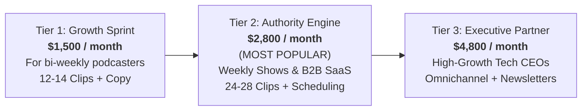

# The Irresistible Offer Architecture & Pricing Matrix
## Productized B2B Content Repurposing Engine

**Target Agency Brand:** Aksharo Studio / Growth Partner  
**Target Revenue Model:** High-Margin Monthly Recurring Retainer (MRR)  
**Positioning:** "The Inbound Content Engine for B2B Founders & Podcasters"  

---

## 1. The Core Philosophy: Alex Hormozi's Value Equation

To escape commodity price resistance, the offer is engineered using the **\$100M Offers Value Equation**:

$$\text{Value} = \frac{\text{Dream Outcome} \times \text{Perceived Likelihood of Achievement}}{\text{Time Delay} \times \text{Effort \& Sacrifice}}$$

```
                       [ Dream Outcome: Omnipresent Authority & Qualified B2B Pipeline ]
                                                     ×
                     [ Perceived Likelihood: Finished Sample Clip Delivered Upfront ]
Value =  ──────────────────────────────────────────────────────────────────────────────────────────
                     [ Time Delay: 48-Hour Turnaround From Episode Upload ]
                                                     ×
                     [ Effort & Sacrifice: 0 Minutes Required (Client Just Pastes A Link) ]
```

### The Pitch in One Sentence:
> *"Drop us a YouTube or Zoom link to your weekly podcast or webinar. Within 48 hours, we turn it into 6 polished, platform-native short-form videos and 3 thought-leadership posts across LinkedIn, X, and YouTube Shorts—fully edited, written, and scheduled. You do nothing."*

---

## 2. The 3-Tier Pricing & Packaging Matrix



### Tier 1: "The Growth Sprint" (Entry / Bi-Weekly Podcasters)
*Ideal for: Podcasters posting 2 episodes per month or founders doing bi-weekly webinars.*
* **Monthly Retainer:** **\$1,500 / month** (Billed upfront)
* **Input Volume:** Up to 2 long-form episodes per month (up to 75 minutes each).
* **Deliverables:**
  * **12 High-Retention Vertical Videos (9:16):** Fully optimized with dynamic word-by-word captions, kinetic typography, punch-in re-framing, and audio mastering.
  * **12 Platform-Native Social Copy Packages:** Custom-written hooks, body copy, and hashtags tailored for LinkedIn, X (Twitter), and YouTube Shorts.
  * **Clean Export Assets:** Includes both burnt-in captioned MP4s and clean video files + `.srt` files.
  * **Turnaround SLA:** 48 hours per episode batch.
  * **Revisions:** Up to 2 revision rounds per batch.
* **Client Work Required:** Send a video link. Review and approve files in Notion/Slack.

---

### Tier 2: "The Authority Engine" (Core Offer / Weekly Podcasters & B2B SaaS)
*Ideal for: Active B2B founders, funded startups, weekly podcast hosts, and webinars.*  
*This is your primary money-maker. 80% of clients should be pushed to this tier.*
* **Monthly Retainer:** **\$2,800 / month**
* **Input Volume:** Up to 4 long-form episodes per month (1 episode per week, up to 90 minutes each).
* **Deliverables:**
  * **24 to 28 High-Retention Vertical Clips (9:16):** 6 to 7 clips per episode.
  * **Multi-Aspect Ratio Exports:** Vertical (9:16) for TikTok/Shorts/Reels + Square (1:1) / Wide (16:9) optimized for LinkedIn Desktop feeds.
  * **24 LinkedIn Thought-Leadership Posts:** Crafted around the core thesis of each clip with compelling story-driven hooks.
  * **8 Twitter/X Breakdowns or Threads:** Extracting the deepest insights and frameworks from each episode.
  * **Full Direct Scheduling & Distribution:** Utilizing Aksharo's native multi-channel publishing engine. We upload and schedule directly to the client's LinkedIn, YouTube Shorts, X, and Instagram.
  * **Turnaround SLA:** Guaranteed 48 hours from episode drop.
  * **Monthly Performance & Hook Review:** Monthly Loom reporting on which hooks and clips drove the highest watch time and engagement.
* **Client Work Required:** Literally zero. They drop the link into a shared Slack channel or Google Drive, and content automatically distributes all month long.

---

### Tier 3: "The Omnichannel Executive Partner" (High-Ticket / Enterprise Founders)
*Ideal for: Series A/B tech CEOs, top-tier business podcasters, and \$1M+ coaching operations.*
* **Monthly Retainer:** **\$4,800 / month**
* **Input Volume:** Unlimited source footage (weekly podcasts, client coaching calls, keynote speeches, demo days, Twitter Spaces).
* **Deliverables:**
  * **40 to 50 Short-Form Videos per month:** Daily posting across all 4 major platforms (YouTube Shorts, LinkedIn Video, TikTok, Instagram Reels).
  * **16 Deep-Dive LinkedIn Articles & Visual Carousels:** High-design carousel PDF slides extracted from video frameworks.
  * **4 Long-Form Newsletter Editions:** Repurposing the week's best long-form conversation into an executive email newsletter for their Substack or Beehiiv.
  * **Bespoke Motion Graphic Package:** Custom motion-designed intro/outro stingers, sound effects, brand color palettes, and bespoke typography.
  * **Dedicated Slack Channel with 4-Hour Response SLA:** Direct access to your lead editor and content strategist.
  * **Comment & Engagement Prompting:** We provide pre-written engagement prompts and conversation starters for the founder to reply to inbound comments.

---

## 3. The Irresistible Risk Reversals (How to Close With 0 Clients)

When you have zero social proof, charging \$2,800 upfront is terrifying for a cold lead. You eliminate this friction entirely with **The Trojan Horse Pilot Guarantee**:

### Guarantee 1: The "Free Finished Sample Clip" (Pre-Call Hook)
> *"Before you spend a single dollar or even get on a sales call with us, send us 1 link to your latest episode. We will cut, edit, caption, and deliver 1 finished, viral-ready clip 100% free within 24 hours. If you love it, you can keep it and post it. If you want 25 more like it every month on autopilot, we talk."*

### Guarantee 2: The "14-Day Pilot Sprint" (Contract Close)
> *"We don't lock you into 6-month or 12-month agency contracts. We do a 14-day sprint covering your next 2 episodes. If within the first 14 days you aren't completely thrilled with the quality, speed, and saved time, let us know and we will refund 100% of your retainer with zero questions asked, and you keep all the produced videos."*

**Why this works:**
1. It eliminates 100% of the financial risk for the buyer.
2. Because Aksharo automates 80% of the extraction and formatting, delivering a free sample costs you only 15 minutes of compute and 10 minutes of editorial review.
3. Once a founder sees their own face on a professionally edited, captioned, dynamic clip, ownership psychology kicks in—they cannot bear the thought of going back to boring raw videos.

---

## 4. Scope Governance & Anti-Churn Guardrails

To protect your 85%+ gross profit margins and prevent client scope creep:

| Rule | Policy Description |
| :--- | :--- |
| **Source Video Duration Cap** | Raw source footage per episode is capped at 90 minutes. Footage over 90 minutes incurs a \$75 per 30-minute overage fee. |
| **Clip Length** | Repurposed short-form clips are strictly between 30 and 85 seconds (optimized for platform retention algorithms). |
| **Turnaround Time Clock** | The 48-hour SLA begins once the source video file or public link is received and confirmed playable. |
| **Revision Bounds** | Revisions cover subtitle corrections, crop adjustments, and music volume. Completely re-choosing an entirely different topic after delivery is treated as an additional clip credit. |
| **Client Brand Assets** | Client must provide high-res logos, brand color hex codes, and social login permissions during Day 1 onboarding. |
