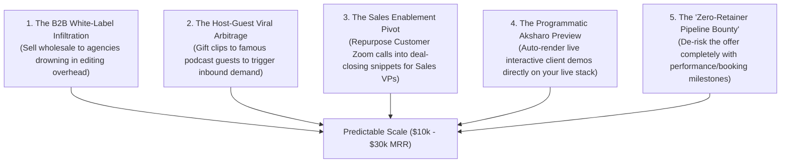

# Out-Of-The-Box Growth Engines: Non-Traditional B2B Playbooks
## Breaking The "Standard Agency" Mold to Win Clients Fast With Aksharo

**Author:** Antigravity Autonomous Strategy Unit  
**Core Thesis:** 99% of video clipping agencies fail because they copy the same tired 2022 playbook (*"Hey bro, want 10 TikTok clips for $100?"*). To win rapidly without an existing portfolio or ad budget, we deploy **5 unconventional, high-leverage growth engines** that exploit structural market inefficiencies and your proprietary technology.

---

## The 5 Non-Conventional Growth Engines



---

## Growth Engine 1: The B2B White-Label Infiltration (B2B2B Wholesale)

### The Insight:
Hunting individual podcasters and founders is hard work: you have to pitch, follow up, handle objections, and onboard them one by one.
Meanwhile, **thousands of full-service marketing, PR, and podcast production agencies** already have 20–50 retainer clients paying \$5,000–\$15,000/month. 
- *Their massive headache:* Their clients are demanding short-form video, but their in-house video editors are slow, expensive, and a logistical nightmare to manage.
- *Your positioning:* You do not compete with these agencies. **You become their invisible, high-margin backend video engine.**

### The Wholesale Mechanics:
- **Their Client Pays Them:** \$3,000 – \$5,000/month for comprehensive brand/podcast management.
- **They Pay You:** **\$800 – \$1,200/month flat per client account** for white-label video repurposing (Aksharo does 80% of the extraction and formatting; your human QC polishes it in 45 minutes).
- **The Magic:** Land **just 2 agency partners** with 5 clients each, and you immediately have **10 paying accounts generating \$8,000 – \$12,000 MRR** with zero individual sales calls, zero client-facing customer support, and zero churn management!

### The Pitch Angle to Agency Owners:
> *"Subject: Invisible video repurposing backend for [Agency Name] clients*  
> *Hi [Name], saw you manage production for top shows like [Client Show].*  
> *Most full-service agencies we speak with are losing margin or bottlenecked by video editors turning around short-form clips. We act as a 100% white-label video engine for agencies: we ingest your raw client footage and deliver 20+ viral-ready 9:16 clips + platform copy in 36 hours under your agency's brand.*  
> *You charge your client $3,000, you pay us $1,000 flat, and you pocket $2,000 net profit per client without touching a timeline. Can I send a 2-minute white-label sample on one of your client episodes?"*

---

## Growth Engine 2: The "Host-Guest Viral Arbitrage" (The Flywheel)

### The Insight:
Every business podcast host interviews **high-net-worth guests** (CEOs of funded startups, bestselling authors, venture capitalists, keynote speakers). 
- *The Problem:* 95% of podcast hosts are lazy. When the interview ends, they email the guest: *"Hey, the episode is live! Here is the YouTube link!"* The busy guest never shares it because a 60-minute YouTube link gets zero engagement on their LinkedIn feed.
- *The Exploit:* You hijack this dynamic to turn the guest into an inbound client.

```
[ Step 1: Monitor 10 Top Niche Podcasts ]
                  │
                  ▼
[ Step 2: Run Guest's Best 45-Sec Answer Through Aksharo ]
                  │
                  ▼
[ Step 3: Polish With Kinetic Captions & Guest's Brand Style ]
                  │
                  ▼
[ Step 4: Gift Clip + Pre-Written LinkedIn Post Directly to The Guest ]
                  │
                  ▼
[ Step 5: Guest Shares It To 50k Followers & Asks: "Who Made This?!" ]
                  │
                  ▼
[ INBOUND CLIENT CLOSED WITH 0 COLD PITCHING ]
```

### The Word-for-Word Gift Script to the Guest:
> *"Hey [Guest Name], heard your breakdown on [Host]'s show yesterday regarding [Specific Topic, e.g. PLG pricing].*  
> *The insight at 24:10 was pure gold, but I know how busy you are, so I had my team turn it into a 9:16 vertical video with dynamic captions + wrote a LinkedIn post draft for you to drop onto your page.*  
> *Zero catch, zero cost—here is the unwatermarked 4K download link and copy: [Link]. Hope it drives some great traffic to your company!"*

**Why This Is Unstoppable:**
1. It is pure unsolicited generosity directed at an executive who has budget.
2. The guest posts it to their LinkedIn or X network, immediately validating your quality in front of all their peer CEOs.
3. Over 30% of recipients reply asking: *"Can your team do this for all my webinars and appearances?"*

---

## Growth Engine 3: The "Sales Enablement" Pivot (B2B Deal-Closing Video)

### The Insight:
When you talk to a Marketing Director about "social media clips," they look at their tiny social media budget and say, *"We don't have budget for TikTok."*  
When you talk to a **VP of Sales or Founder** about **"Short-Form Video Deal Accelerators"**, they have virtually unlimited budget.

### What are "Deal-Closing Snippets"?
B2B SaaS companies record hours of:
1. **Customer Case Study Calls & Testimonials:** 30-minute Zoom interviews with happy enterprise clients that sit uselessly in Google Drive.
2. **Product Demo Webinars:** Deep technical demos explaining difficult ROI calculations.
3. **Founder Objection Handling:** Founders explaining how they beat competitors.

### The Offer:
You repurpose these long recordings into **30-second "Deal Collateral Snippets"**:
- *Clip 1:* The 35-second customer quote explaining how they saved \$150k in Q3.
- *Clip 2:* The 45-second architectural demo showing zero-downtime migration.
- *Clip 3:* The 40-second security breakdown answering SOC-2 compliance questions.

Sales reps embed these short, captioned video snippets directly into their **cold outbound emails and deal-closing proposals**.
- *Value Proposition:* "We don't make dance videos for TikTok. We turn your customer recordings into modular 40-second video assets that your sales team sends to close enterprise deals 30% faster."
- *Willingness to Pay:* **\$3,500 – \$6,000/month** (Charged directly to the Sales/Revenue budget!).

---

## Growth Engine 4: The Programmatic Aksharo Live Preview

### The Insight:
Cold emails with text say: *"Can I show you what we do?"* -> 98% get deleted.  
Cold emails with attachments get caught by spam filters.  
Cold Loom videos take 10 minutes each to record manually.

### The Out-of-the-Box Technological Edge:
You own **Aksharo running on your live production server** (`aksharo.crestmondtechnologies.com`). You can build an automated prospecting workflow:

1. **Autonomous Ingestion:** Run a script that downloads the audio/video from the prospect's latest YouTube episode.
2. **Aksharo Extraction:** Worker-AI transcribes and extracts the #1 highlight; Render worker renders a 9:16 preview.
3. **Deploy Live Share Page:** Generate a private, unindexed Aksharo preview link:  
   `https://aksharo.crestmondtechnologies.com/share/preview/[prospect-slug]`
4. **The Outreach Message:**
   > *"Hi [Name], we took 45 seconds from your episode with [Guest] and rendered a full multi-platform clip on our video engine. You can watch the live interactive preview right here: [Link].*  
   > *If you like it, reply 'YES' and we'll unlock the watermark and send you 5 more for free."*

**The Psychological Impact:**
The prospect clicks the link and lands on **your custom-engineered platform**. They see their own face, their own voice, real-time dynamic captions, and an interactive player. It immediately demonstrates technical superiority over any random freelance editor.

---

## Growth Engine 5: The "Zero-Retainer Pipeline Bounty"

### The Insight:
The single biggest barrier for a startup with 0 clients is **trust**. The prospect thinks: *"What if I pay you $2,500 and your clips get 40 views and zero leads?"*

### The Risk-Reversal Structure:
Target B2B companies selling high-ticket services or SaaS (\$3k–\$25k ACV):

- **Month 1 (The Pilot):**  
  *"We will repurpose your weekly podcast/webinars for 30 days. We don't want a $2,500 retainer upfront. We only get paid if we hit one of two milestones:*  
  *Option A: Our clips generate over 100,000 organic impressions across LinkedIn and Shorts.*  
  *Option B: Our content drives at least 3 qualified inbound discovery calls to your calendar.*  
  *If we hit the milestone, you pay us our standard $2,500 fee, and we roll into a recurring monthly retainer. If we don't hit the milestone, you pay $0."*

### Why This Is Low Risk for You:
1. You only accept clients who already have good underlying content (a good product, insightful discussions).
2. With consistent posting across 4 platforms (YouTube Shorts, LinkedIn, TikTok, X), hitting 100k aggregate impressions or generating 3 calls over 30 days is extremely achievable if the content is properly targeted.
3. It completely dissolves the sales cycle. Prospects say "YES" on the spot because they have zero financial downside.

---

## Strategic Summary: Where to Start Tomorrow

| Strategy | Speed to First Dollar | Effort Required | Client Quality | Recommended Starting Order |
| :--- | :--- | :--- | :--- | :--- |
| **1. Host-Guest Arbitrage** | 7–14 Days | Medium (1 clip per guest) | Ultra-High (Enterprise Executives) | **START DAY 1** |
| **2. B2B Agency White-Label** | 14–21 Days | Low (Pitch agency owners) | High (B2B Retainers) | **START DAY 3** |
| **3. Programmatic Preview** | 10–20 Days | Low (Automated by Aksharo) | High (B2B Podcasters) | **START DAY 7** |
| **4. Sales Enablement Pivot** | 14–30 Days | Medium (Repurpose case studies) | Highest (\$4k–\$6k MRR) | **WEEK 3 ONWARD** |
