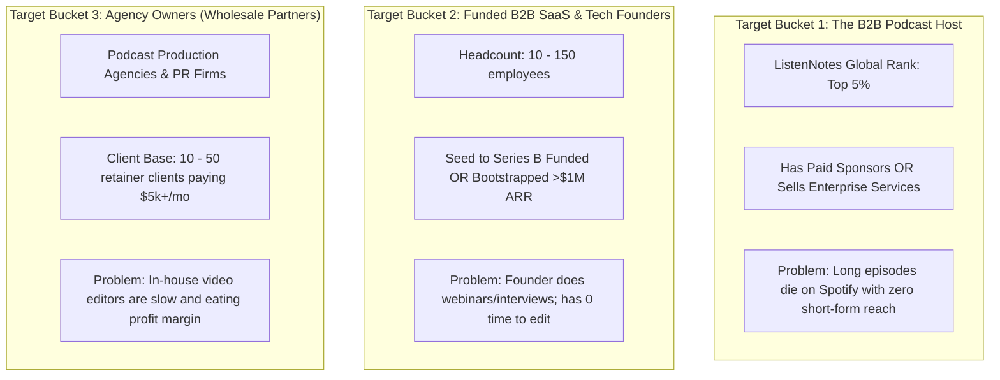
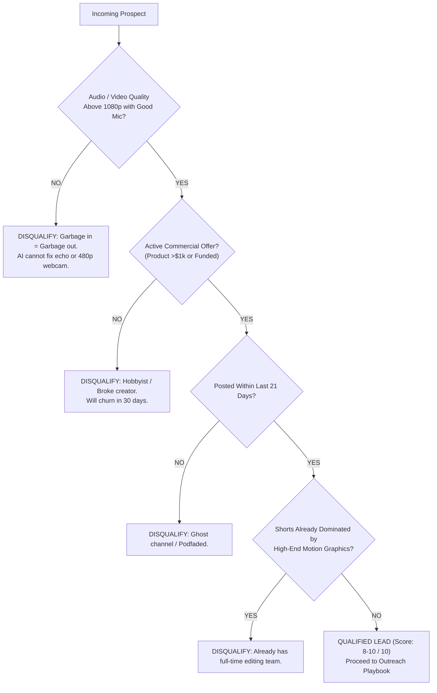

# Targeting ICP & Lead Sourcing Blueprint
## Step-by-Step Data Sourcing, Enrichment, & Qualification Engine

**Objective:** Build a pipeline of 250 to 500 qualified, high-intent B2B prospects every month who have proven budgets and a high willingness to pay.

---

## 1. High-Ticket Target Segments & Ideal Customer Profiles (ICP)



---

## 2. Scraping Workflows: Step-by-Step Execution

### Source Stream A: Finding Active B2B Podcasters (ListenNotes & YouTube)

#### Tool 1: ListenNotes (The "Google for Podcasts")
1. Go to `listennotes.com` (free search or API).
2. Use Boolean Search Strings:
   - `"SaaS" OR "B2B Marketing" OR "Venture Capital" OR "Health Optimization" OR "Real Estate Syndication"`
3. Set Filters:
   - **Listen Score:** $\ge 60$ (Filters out the bottom 85% of amateur hobby podcasts).
   - **Published Within:** Past 14 days (Ensures the show is actively in production).
   - **Has Video:** Yes / YouTube channel linked.
4. Export Show Name, Host Name, Website, and Host Email (found in RSS feed or `listennotes` metadata).

#### Tool 2: YouTube Search Operators & Sourcing
Search YouTube directly with targeted high-intent operators:
```text
"podcast episode" AND ("founder" OR "CEO" OR "investor") AND (duration:long)
"webinar" AND ("B2B" OR "enterprise" OR "scaling")
```
*How to qualify visually in 10 seconds:*
- Does the channel have **long-form videos (30–60 mins)** with high production quality?
- Check their **Shorts tab**: Is it completely empty or has clips with only 50 views and terrible uncaptioned 16:9 letterboxed crops?
- **Green Light:** If they have great long-form content but **zero or terrible Shorts**, they are an immediate Tier 1 target!

---

### Source Stream B: Finding Funded B2B SaaS Founders (Apollo.io & Sales Navigator)

#### Apollo.io Search Parameters:
* **Job Titles:** `Founder`, `Co-Founder`, `Chief Executive Officer`, `Managing Partner`
* **Company Headcount:** `11 - 50` or `51 - 200` (Sweet spot: large enough to have marketing budget, small enough that the CEO still makes the decision).
* **Funding Raised:** `Seed`, `Series A`, `Series B` or `Self-funded / Profitable`
* **Industry / Keywords:** `B2B SaaS`, `Enterprise Software`, `Fintech`, `Healthtech`, `Cloud Infrastructure`
* **Technologies Used:** `HubSpot`, `Marketo`, `ActiveCampaign`, `Wistia`, `Vimeo` (Indicates active video and outbound marketing programs).
* **Location:** United States, Canada, United Kingdom, Australia, Singapore, UAE.

#### LinkedIn Sales Navigator Boolean Search:
```text
(Title: "Founder" OR "Co-Founder" OR "CEO") 
AND (Company Headcount: 11-200) 
AND (Posted on LinkedIn in past 30 days: Yes) 
AND (Industry: "Software Development" OR "Information Technology")
```
*Why "Posted on LinkedIn in past 30 days" is mandatory:*  
If an executive never posts on LinkedIn, they will not understand or value short-form clips. If they post 2–3 text posts a week, they already know LinkedIn works and are desperate for video content to accelerate their reach.

---

### Source Stream C: Finding Marketing & PR Agency Owners (White-Label Targets)

#### Clutch.co & LinkedIn Directory Search:
* **Keywords:** `Podcast Production Agency`, `Executive Branding Agency`, `B2B Content Marketing Agency`, `Founder PR Agency`
* **Locations:** US, UK, Australia, Europe.
* **Firm Size:** 5 to 30 employees.
* **Decision Maker:** `Agency Owner`, `Founder`, `Managing Director`, `Head of Production`.

---

## 3. Disqualification Framework: The "Toxic Client" Filter

Before spending 5 minutes creating a custom clip or sending an email, run every prospect through the **Disqualification Checklist**. If they trigger any red flag, **DISQUALIFY IMMEDIATELY**:



### The 4 Fatal Red Flags:
1. **The "AirPods in an Echoey Bathroom" Podcaster:**  
   Aksharo's Whisper transcription will struggle, audio mastering cannot fix clipped audio, and vertical clips will look amateur. Never accept a client who records on blurry 480p laptops with built-in mic echo.
2. **The "Zero Monetization" Wannabe Creator:**  
   If their channel has no course, no consulting, no sponsors, and no SaaS product, they have no business revenue. They will complain about paying \$500/month.
3. **The "Ghost Channel" (Podfade):**  
   If their last upload was 2 months ago, they are on the verge of quitting. Only target creators who have uploaded within the last 14 days.
4. **The "Already Saturated" Creator:**  
   If a creator already posts 5 clips a day with custom 3D animations, custom sound effects, and 4k motion graphics, they already have an internal editing studio. Do not waste time pitching them.

---

## 4. The 10-Point Lead Qualification Scoring Matrix

Score each prospect from 1 to 10 before initiating outreach:

| Criteria | Points | Description |
| :--- | :---: | :--- |
| **High Audio/Video Production Value** | **+2** | Crisp 1080p/4k video, professional Shure/Rode mic, good studio lighting. |
| **Clear Monetization & High Ticket Offer** | **+2** | Sells B2B SaaS, enterprise consulting, paid mastermind, or has corporate sponsors. |
| **High Frequency of Recording** | **+2** | Records at least 1 episode, webinar, or interview per week (steady stream of raw footage). |
| **Short-Form Content Deficit (The Gap)** | **+2** | YouTube channel has >50 long-form videos but **less than 10 Shorts**, or Shorts are unedited. |
| **Executive Active on LinkedIn / X** | **+1** | Founder/host has an active personal profile with >2,000 followers. |
| **High-Profile Guests Featured** | **+1** | Regularly interviews notable industry figures (unlocks Host-Guest Arbitrage). |

### Scoring Verdict:
- **Score 8 – 10:** **Tier 1 Alpha Target.** Execute the "Finished Free Sample Clip" Trojan Horse or Programmatic Preview immediately.
- **Score 5 – 7:** **Tier 2 Target.** Enroll into automated multi-touch cold email sequence.
- **Score < 5:** **Trash Lead.** Do not contact.
