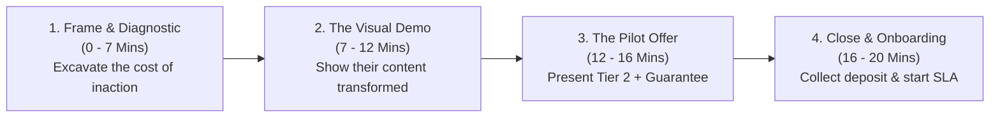

# Discovery Call Closing Script & Objection Handling
## The 20-Minute Consultative Sales Framework & Closing Playbook

**Author:** Antigravity Autonomous Strategy Unit  
**Sales Approach:** Consultative Problem Diagnostic (Never Pitching; Diagnosing Pain & Prescribing the Engine)  
**Target Close Rate:** 35% – 50% on qualified discovery calls  

---

## 1. The 20-Minute Discovery Call Roadmap

---

## 2. Word-for-Word Discovery Call Script

### Phase 1: Set The Frame & Uncover The Real Bottleneck (Minutes 0 – 7)

**You:**  
> *"Hey [Name], thanks for jumping on. The goal for today is really simple: I want to understand how you guys are currently handling your video distribution for [Podcast/Company], see where the bottlenecks are, and show you exactly how our repurposing engine takes that completely off your plate.*  
> *If at the end of 20 minutes it feels like a no-brainer fit, we can talk about doing a 14-day sprint. If not, no pressure at all—you’ll still walk away with a clear blueprint of how to optimize your shorts. Sound fair?"*

**Prospect:** *"Sounds great."*

**Diagnostic Questions (Ask in sequence, take notes, shut up and listen):**
1. **The Production Reality:**  
   *"When you finish recording a 60-minute episode or webinar, what actually happens to the recording right now?"*  
   *(Listen for: 'It just sits on YouTube', 'My assistant tries to edit it', 'We don't do shorts').*
2. **The Time Cost:**  
   *"How many hours a week are you or your team spending trying to scrub timelines, write hooks, and post across LinkedIn and Shorts?"*  
   *(Anchor the value: 'So you're spending at least 4 to 6 hours a week on grunt work').*
3. **The Revenue Connection:**  
   *"What is an average client or deal worth to your business when someone books a call from your content?"*  
   *(Anchor the ACV: e.g. '$10,000' or '$5,000'. Now a $2,800/mo retainer is just 0.3x of one deal!).*

---

### Phase 2: The Visual Demonstration (Minutes 7 – 12)

**You:**  
> *"That makes total sense. Here is the reality most executives face: you are an expert at creating the long-form insight, but the algorithm rewards consistency across 4 platforms every single day. If you don't post daily short-form, 80% of your potential audience never knows your episode exists.*  
> *Let me share my screen and show you what our engine does with your exact content."*

*(Share screen. Pull up the sample clip you generated via Aksharo).*

**Highlight the 3 Core Pillars:**
1. **Editorial Hook Selection:**  
   *"Notice how the clip starts right at the punchline at second 0—no 15-second intro, no 'Hi guys welcome back'. It grabs attention in 1.5 seconds."*
2. **Dynamic Visual Formatting:**  
   *"We re-frame the camera to vertical 9:16 so you fill the phone screen, add kinetic subtitles with keyword highlights, and strip out all dead pauses."*
3. **Omnichannel Copywriting:**  
   *"Along with each clip, you get a native LinkedIn thought-leadership post and X thread ready to deploy."*

---

### Phase 3: The Offer & Risk Reversal (Minutes 12 – 16)

**You:**  
> *"Here is how we work: we operate as your hands-off content growth partner.*  
> *Every week you drop your raw episode or webinar link into our shared Slack channel.*  
> *Within 48 hours, we deliver 6 to 7 polished vertical clips, 6 written LinkedIn posts, and 2 Twitter breakdowns—and if you want, we schedule and publish them directly to your channels.*  
> *Our core retainer is **$2,800 a month**.*  
> *And to make this completely risk-free for your team, we do a **14-day sprint on your next 2 episodes**: if after 2 episodes you aren't completely blown away by the quality and the time you get back, let us know and we’ll refund 100% of your deposit with zero questions asked.*  
> *How does that sound?"*

---

## 3. World-Class Objection Handling Scripts

### Objection 1: "Why shouldn't I just use Opus Clip or Submagic for $20/month?"
**The Response:**
> *"That’s a great question, and to be transparent, automated AI tools are great for hobbyists. But here is the problem businesses run into:*  
> *AI tools are dumb algorithms. They make mid-sentence cuts, miss topic changes, hallucinate technical words in subtitles, and blind-crop speakers out of frame.*  
> *More importantly, Opus Clip doesn't write your LinkedIn thought-leadership posts, format your carousels, or schedule your distribution. You still have to spend 5 hours a week reviewing 30 messy drafts, fixing typos, and downloading files.*  
> *You aren't paying us for video software. You are paying us for a **finished outcome**: you spend 0 minutes, and world-class, brand-safe authority appears on your profile 7 days a week. At your hourly rate, is your time worth spending 5 hours inside an AI editing tool?"*

---

### Objection 2: "Can't I just hire a freelance editor on Upwork for $5 an hour?"
**The Response:**
> *"You definitely can! Many founders start there. But here is what usually happens after 3 weeks:*  
> *Offshore freelancers don't understand B2B SaaS or enterprise finance. They pick boring moments, make typos on technical terms, miss deadlines, and require 3 rounds of revisions for every single clip.*  
> *Suddenly, you become a full-time video project manager.*  
> *With us, you get a dedicated B2B partner with guaranteed 48-hour SLAs, zero management overhead, and senior editorial quality control on every single second of video."*

---

### Objection 3: "$2,800 is a bit steep for our budget right now."
**The Response:**
> *"I totally understand. Let me ask: earlier you mentioned an average client for you is worth \$8,000. If this engine brings in just ONE qualified client every two months through organic reach on LinkedIn and Shorts, it pays for itself nearly 2x over.*  
> *That said, if you want to start lean, we can do our **Growth Sprint package at \$1,500/month** covering 2 episodes and 14 clips. That gets you in the game, proves the workflow, and when the inbound leads start rolling in, we can upgrade to weekly. Would that be easier to get started?"*

---

### Objection 4: "Can you send me a proposal / deck so I can think about it?"
*(Warning: The 'proposal graveyard' kills 80% of deals).*  
**The Response:**
> *"I can definitely send over a 1-page summary! But usually when people ask for a deck, it means there's a specific question or hesitation we haven't addressed yet.*  
> *Between the 48-hour delivery, the editing quality, or the \$2,800 investment—what's the main thing holding you back from testing this out on your next episode?"*  
*(Uncover the real hesitation, solve it live, and take the pilot deposit).*

---

## 4. Closing the Deal: The 1-Page Onboarding Workflow

When they say "Let's do it":
1. **Send Stripe Payment Link:** Immediately drop a Stripe checkout link in the Zoom chat: *"Awesome! I just dropped the secure checkout link in the chat for the 14-day sprint deposit."*
2. **Collect Payment on Call:** Stay on the call while they enter payment: *"Take your time, let me know once it goes through so I can instantly initialize your Slack channel."*
3. **Immediate Slack Initialization:** Send an invite to `#[Client-Name]-Aksharo-Production`.
4. **Drop the Episode Intake Form:** Request their raw footage link and brand colors.
5. **Start the 48-Hour Clock:** Deliver the first batch within 48 hours to create an unforgettable onboarding experience.
