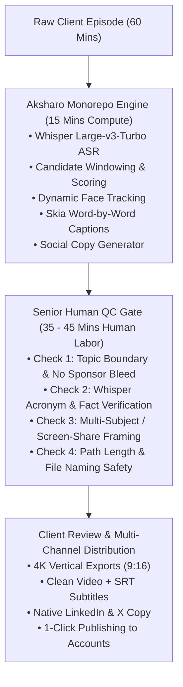

# Operational Delivery SOP: Aksharo Human-in-the-Loop (HITL)
## Flawless Client Fulfillment, 85%+ Gross Margins, & Zero-Defect Delivery

**Author:** Antigravity Autonomous Strategy Unit  
**Core Standard:** Eliminating 100% of the defects identified in the Platform Engineering Audit  
**Target Turnaround Time:** 36 to 48 Hours Guaranteed SLA  

---

## 1. The Human-in-the-Loop (HITL) Architecture

Pure AI fails because it lacks taste and contextual judgment. Pure human editing fails because it is slow and expensive.  
**The winning model is AI speed (80%) + Human taste (20%):**



---

## 2. Solving The 4 Fatal Audit Defects (The Mandatory QC Gate)

Every operator must pass the 4 quality checks derived from the platform audit (`clipping-mistakes-audit/01_EXECUTIVE_AUDIT_SUMMARY.md`) before any file touches a client:

### Defect 1: The Topic Boundary & Sponsor Bleed Check
* **The Failure Mode:** The algorithm cuts a video mid-sentence or mashes two unrelated topics together (e.g. ElevenLabs AI benchmark bleeding into Napoleon's coded letter), or includes a paid sponsor read.
* **The SOP Fix:**
  1. Scrub the first 2 seconds: Does the clip start on a strong, punchy first syllable? (No filler *"um"*, *"so yeah"*, or trailing throat clears).
  2. Scrub the last 3 seconds: Does the speaker reach a complete thought or punchline? (Never cut off mid-thought).
  3. Ensure zero commercial sponsor reads (*"Today's video is sponsored by..."*) are left in organic content.

### Defect 2: The Whisper Hallucination & Fact Check
* **The Failure Mode:** Whisper misinterprets numbers, regional formats, or frontier tech names (e.g. transcribing "GPT-6.1" as "GPT 7.1", or "320 Billion" as "3,20,00,00,00,000 billion / 3.2 trillion").
* **The SOP Fix:**
  1. Read the burnt-in subtitles at 1.5x speed.
  2. Verify all proper nouns (company names, guest names, software tools, model version numbers).
  3. Correct any phonetic spelling mistakes directly in the subtitle track before final render.

### Defect 3: The 9:16 Framing & Screen-Share Check
* **The Failure Mode:** On videos without a single centered face (split-screens, robotics demos, screen shares), the engine defaults to center `0.5`, cutting the active subject completely out of frame.
* **The SOP Fix:**
  1. For single-speaker talking heads: Ensure the speaker's eyes sit on the upper 1/3 gridline.
  2. For 2-person podcast interviews: Ensure the active speaker is framed, or apply the vertical split-screen template (Host on top, Guest on bottom).
  3. For software demos & slide presentations: Re-frame dynamically to track the cursor or presentation focus rather than an empty wall.

### Defect 4: Safe File Packaging & Windows MAX_PATH Prevention
* **The Failure Mode:** Nested folder paths inside client ZIP archives exceed 260 characters, causing Windows Explorer to silently fail and drop 70% of files upon unzipping.
* **The SOP Fix:**
  * Enforce strict, flat naming conventions for all client delivery folders:
  ```text
  [ClientName]_Batch_[Date]/
  ├── Clip_01_HookTitle.mp4
  ├── Clip_02_HookTitle.mp4
  ├── Social_Copy_Ready_To_Post.txt
  └── Captions_SRT/
      ├── Clip_01.srt
      └── Clip_02.srt
  ```
  *(Total path length strictly under 100 characters).*

---

## 3. The 45-Minute Fulfillment Workflow (Per Episode)

| Step | Time Allocated | Responsible Agent | Action Taken |
| :---: | :---: | :---: | :--- |
| **01** | 0 min (Automated) | Aksharo Engine | Ingest client YouTube/Zoom link. Worker runs transcription, candidate clipping, and draft copy. |
| **02** | 15 min | Human QC Operator | Open Aksharo review interface. Select the top 6 strongest clips. Trim start/end timestamps to guarantee clean topic boundaries. |
| **03** | 10 min | Human QC Operator | Proofread subtitle text. Fix technical acronyms, model names, and formatting. |
| **04** | 10 min | Human QC Operator | Verify framing coordinates (9:16). Adjust split-screen or crop coordinates if needed. |
| **05** | 0 min (Automated) | Aksharo Render | Trigger batch render via Skia GPU engine. Generates 4K MP4s in under 3 minutes. |
| **06** | 10 min | Human QC Operator | Upload finished MP4s and copy package to client's dedicated Slack channel or Notion portal. Notify client. |

**Total Human Labor Required per Episode:** **45 Minutes.**  
**Total Labor for 4 Weekly Episodes (Monthly Retainer):** **3 Hours.**  
**Revenue per Client:** **\$2,800/month.**  
**Effective Hourly Rate:** **\$933 / hour!**

---

## 4. Client Communication & Portal Setup

### 1. Dedicated Slack / Discord Channel
Create a shared channel: `#[Company]-Aksharo-Production`.
* Set channel topic: *"Drop episode links here. Turnaround: 48 hours."*

### 2. Client Notion Dashboard
Provide each client with a simple, branded 1-page Notion board with 4 columns:
1. `Incoming Recordings` (Client drops links here)
2. `In Production (Aksharo Engine)`
3. `Ready for Review / Download` (Completed MP4s, hooks, and copy)
4. `Scheduled & Published`

### 3. The Delivery Notification Message (Copy-Paste)
> *"Hey {{Client_Name}}! Your latest episode with {{Guest_Name}} is completely repurposed!  
> We pulled the 6 highest-retention moments and formatted them into 9:16 vertical video + wrote your LinkedIn and X copy.  
> 📁 **Download Files & Copy:** [{{Folder_Link}}]  
> 🚀 **Top Recommended Clip to Post First:** Clip #02 ({{Hook_Title}}) at 8:30 AM tomorrow.  
> Let us know if you need any adjustments, otherwise we'll queue up the next batch!"*

---

## 5. Client Retention & Anti-Churn Protocol (Keeping Retainers for 12+ Months)

To ensure clients stay subscribed month after month:

1. **Monthly Performance Recap:** On Day 25 of every billing cycle, send a quick 2-minute Loom breaking down their top-performing clip, total view count gained, and hook analysis for next month.
2. **Proactive Topic Ideation:** Don't just wait for them to record. Send them 3 trending topic ideas or questions to ask their upcoming podcast guest: *"Hey, this topic is trending in B2B SaaS right now—if you ask your guest about this on Thursday, it will make an incredible viral clip."*
3. **Frictionless Handoff:** Never make them fill out complicated forms. Accept links via Slack voice note, text, or email. The easier it is for them, the impossible it is for them to cancel.
