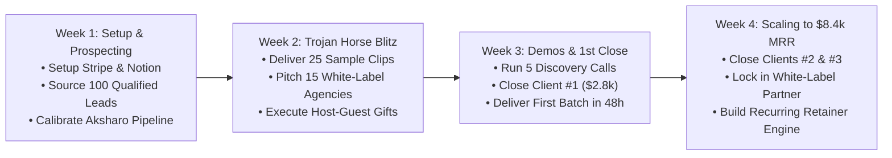

# The 30-Day Sprint to First 3 Paying Clients
## Day-by-Day Tactical Execution Plan from \$0 to \$8,400 MRR

**Target Milestone:** 3 Paying Retainer Clients in 30 Days  
**Required Budget:** \$0 in Paid Ads (100% Organic & High-Value Cold Outreach)  
**Required Tech:** Aksharo Platform, Loom (Free), Google Drive, Notion, Stripe  

---

## 1. 30-Day Milestone Overview

---

## 2. Week-by-Week Tactical Playbook

### Week 1: Foundation, Tooling, & Lead Enrichment (Days 1 – 7)

* **Day 1 (Offer & Financial Setup):**
  - Create a Stripe account. Generate two recurring billing links:
    - `Tier 1: Growth Sprint` (\$1,500/month)
    - `Tier 2: Authority Engine` (\$2,800/month)
  - Create a clean client Notion template (`Client Onboarding Hub`).
* **Day 2 (Aksharo Pipeline Calibration):**
  - Run a 30-minute YouTube video through your local Aksharo stack (`montaj` / `apps/web`).
  - Verify that transcription, candidate clipping, dynamic caption styling, and 9:16 Skia frame rendering work smoothly.
  - Familiarize yourself with the 45-minute Human-in-the-Loop QC process.
* **Day 3 (Lead Sourcing Sprint 1 - Podcasters):**
  - Use `listennotes.com` and YouTube to find 40 active B2B podcasts in SaaS, Tech, or Business.
  - Check their Shorts tab to verify they have a short-form content gap.
  - Add to `lead-tracking-crm-schema.csv`.
* **Day 4 (Lead Sourcing Sprint 2 - Agency Wholesale & SaaS Founders):**
  - Use LinkedIn & Clutch.co to find 25 Podcast Production and B2B Marketing Agencies.
  - Use Apollo.io or LinkedIn to find 25 Seed/Series A B2B SaaS Founders active on LinkedIn.
* **Day 5 (Lead Qualification & Scoring):**
  - Run all 90 leads through the 10-Point Qualification Matrix (`04_TARGETING_ICP_AND_LEAD_SOURCING_BLUEPRINT.md`).
  - Filter down to the **top 40 Tier-1 Alpha Leads** (score 8+).
* **Days 6 – 7 (Outreach Setup & Script Rehearsal):**
  - Setup Loom extension on your browser.
  - Rehearse the 60-Second Loom Teardown script until delivery feels natural, confident, and energetic.

---

### Week 2: The Trojan Horse Outreach Blitz (Days 8 – 14)

* **Day 8 (First 5 Trojan Horse Deliveries):**
  - Ingest 5 podcast episodes through Aksharo.
  - Generate 5 polished 45-second vertical clips.
  - Record 5 personalized 60-second Looms.
  - Send Email 1 + LinkedIn message to the 5 hosts.
* **Day 9 (5 More Trojan Horse Deliveries):**
  - Repeat the process for 5 more podcasters. (Total sent: 10).
* **Day 10 (White-Label Agency Blitz):**
  - Send the Wholesale Agency Sequence (`06_OMNICHANNEL_OUTREACH_SCRIPTS_AND_SEQUENCES.md`) to 15 agency owners.
* **Day 11 (Host-Guest Viral Arbitrage):**
  - Identify 5 high-profile guests featured on top shows.
  - Cut 5 clips highlighting the guest's best quotes.
  - Gift the unwatermarked clips directly to the guests on LinkedIn.
* **Day 12 (Follow-Up Round 1):**
  - Send Email 2 (Distribution Insight Bump) to all Day 8 prospects who opened but haven't replied.
* **Days 13 – 14 (Inbox Management & Call Booking):**
  - Respond to all positive replies within 15 minutes.
  - Goal: Book 4 to 6 discovery calls for Week 3.

---

### Week 3: Discovery Calls, Closing, & First Client Onboarding (Days 15 – 21)

* **Days 15 – 17 (Discovery Call Sprints):**
  - Conduct scheduled 20-minute Consultative Discovery calls using the script in `07_DISCOVERY_CALL_CLOSING_AND_OBJECTION_HANDLING.md`.
  - Share your screen to show the prospect's customized Aksharo sample.
  - Pitch Tier 2 (\$2,800/mo) with the 14-day money-back guarantee.
* **Day 18 (Closing Client #1):**
  - Drop Stripe payment link live on the call.
  - **Milestone Achieved: Client #1 Signed! (\$2,800 MRR).**
* **Day 19 (Client #1 Onboarding):**
  - Initialize dedicated Slack channel `#[ClientName]-Aksharo-Production`.
  - Receive Client #1's raw episode recording link.
* **Days 20 – 21 (First Delivery Flawless Execution):**
  - Execute the 45-Minute HITL SOP.
  - Deliver 6 vertical clips + LinkedIn copy in under 36 hours.
  - Client is blown away by the speed and quality.

---

### Week 4: Scaling to \$8,400 MRR (Days 22 – 30)

* **Days 22 – 24 (The Momentum Multiplier):**
  - Request a 1-sentence quote or screenshot of praise from Client #1.
  - Use Client #1's finished clips as live case studies in your ongoing outreach.
  - Conduct second round of discovery calls with agency owners and podcasters.
* **Days 25 – 27 (Closing Clients #2 & #3):**
  - Close Client #2: B2B SaaS Founder on Tier 2 (\$2,800/mo).
  - Close Client #3: Podcast Production Agency on Wholesale Retainer (2 client accounts @ \$1,000/mo = \$2,000/mo) OR a third podcaster on Tier 2 (\$2,800/mo).
* **Days 28 – 30 (Operational Consolidation):**
  - Establish weekly batch processing schedule:
    - Monday: Ingest episodes & run Aksharo rendering.
    - Tuesday: Human QC & client deliveries.
    - Thursday: Second batch / scheduling.
  - **Total Monthly Retainer Revenue: \$7,600 to \$8,400 MRR.**
  - **Total Monthly Labor Required: ~10 to 12 hours total.**

---

## 3. Daily KPI Tracking Scorecard

Track your numbers daily to guarantee the outcome:

| Metric | Daily Target | Weekly Target (5 Days) | 30-Day Target |
| :--- | :---: | :---: | :---: |
| **New Leads Sourced & Scored** | 10 | 50 | 200 |
| **Trojan Horse Clips & Looms Sent** | 5 | 25 | 100 |
| **Agency Wholesale Pitches Sent** | 3 | 15 | 60 |
| **Positive Replies Received** | 1 – 2 | 8 – 10 | 30 – 35 |
| **Discovery Calls Booked** | 0 – 1 | 3 – 4 | 12 – 15 |
| **Closed Retainers** | — | **1 Client / Week** | **3 Clients Total** |
